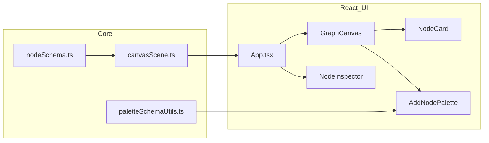

# Auditoria do que já está implementado em node-graphs-lol

Este ficheiro espelha o plano de auditoria aprovado para o repositório.

## Stack real (implementada)

| Área            | Situação                                                                 |
|-----------------|--------------------------------------------------------------------------|
| Build           | Vite + `@vitejs/plugin-react`; alias `@` → `vite.config.ts`            |
| UI              | React 19; **CSS Modules** + `src/styles/global.css` / `src/styles/tokens.css` (**não** Tailwind) |
| Roteamento / API| Aplicação de página única em `src/App.tsx` (sem TanStack Router, Query, Orval, Axios) |
| Testes          | Nenhum `*.test.*` ou `*.spec.*` em `src`                               |

> As regras em `.cursor/Rules.mdc` (nível do workspace) descrevem uma stack alvo maior (router, dados remotos, Tailwind v4, etc.) que **não** está instalada neste projeto.

## Modelo de domínio (core)

- **Tipos e exemplo** em `src/core/nodeSchema.ts`: schemas com `parameters` (vários tipos sintáticos), `entities` (slots que apontam para outro schema), instâncias com `values`.

- **Cena e registro** em `src/core/canvasScene.ts`:
  - `schemaRegistry`: `particle-root`, `emitter-shape`, `world-force`, `falloff-curve`.
  - `createNodeInstance`: instancia valores a partir dos defaults do schema.
  - `staticCanvasScene`: grafo inicial (5 nós + 3 conexões exemplo).
  - **Conexão** apenas `fromNodeId` + `fromEntityId` → `toNodeId` (um fio por saída de entidade substituível; ver `connectNodes` em `src/App.tsx`).

## Funcionalidades de aplicação (App)

Implementado centralmente em `src/App.tsx`:

- Estado da cena com **histórico undo/redo** (`past` / `present` / `future`) e atalhos **Ctrl/Cmd+Z**, **Shift+Ctrl/Cmd+Z**, **Ctrl/Cmd+Y**.
- **Persistência**: `localStorage` (`node-graphs-lol:scene`) com validação básica `isCanvasScene`; fallback para cena estática.
- Operações: mover nós, criar **nó raiz** a partir da paleta, criar **nó filho** a partir de entidade (+ conexão), remover conexões, atualizar parâmetros do nó selecionado, apagar nó selecionado (**Delete/Backspace**; proteção do nó `particle-root-01`), **reset** da cena (limpa storage e volta ao estático).

## Canvas e UI do grafo

`src/components/organisms/GraphCanvas.tsx` (~988 linhas):

- **Pan** e **zoom** (limites 65%–125%, controles na barra da ferramenta).
- Renderização dos nós como `NodeCard` + **SVG** para caminhos de ligação (`createConnectionPath` com segmentos e curvas).
- **Arrastar** nós com gesto por pointer e escala.
- **Ligações por porta de saída**: fluxo `PendingLink`, soltar sobre nó alvo quando `canAcceptLink` (compatibilidade por `schemaId` da entidade); fluxo auxiliar por teclado em saídas.
- **Paleta contextual** (`AddNodePalette`): busca, ordenação A–Z / estrutura / tipo de valor (`paletteSchemaUtils.ts`), navegação por teclado, scroll assistido por hover.
- Barra com **Undo / Redo / Reset** e indicador de zoom.

## Inspector flutuante

`src/components/organisms/NodeInspector.tsx`:

- Lista de parâmetros com inputs; commit em blur; Enter/Escape; **minimizar** e arrastar pelo handle (offset em `App.tsx`).

## Atomic Design (`src/components`)

- **Atoms:** `Button.tsx`, `Port.tsx`, `SyntaxType.tsx`.
- **Molecules:** `EntityItem.tsx`, `NodeHeader.tsx`, `ParameterItem.tsx`, `PaletteAddNodeOption.tsx`.
- **Organisms:** `GraphCanvas`, `NodeCard`, `AddNodePalette`, `NodeInspector`.

Isto está alinhado com a ideia de “fundação de editor” descrita na hero de `App.tsx`, não com um blueprint SaaS completo com bin parser, store global separada ou Storybook.

## Lacunas típicas (observação)

- Sem export/import de grafo como ficheiro, sem execução ou validação semântica do grafo, sem múltiplas entradas/saídas explícitas para além do modelo atual.
- `src/index.css` e `src/App.css` existem; o ponto de entrada `src/main.tsx` importa `@/styles/global.css` — verificar uso dos outros ficheiros CSS se quiser eliminar código morto.

---

## Diagrama da arquitetura

