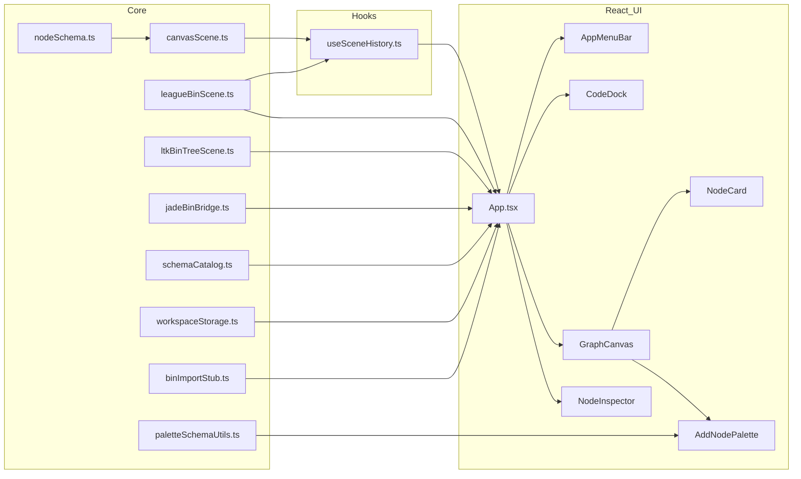

# Auditoria do que já está implementado em node-graphs-lol

Este ficheiro espelha o plano de auditoria aprovado para o repositório e foi **atualizado** após o roadmap (menu, JSON, canvas avançado, parâmetros/entidades dinâmicos, stub `.bin`, documentação de spike Jade).

## Stack real (implementada)

| Área            | Situação                                                                                                                                 |
|-----------------|-------------------------------------------------------------------------------------------------------------------------------------------|
| Build           | Vite + `@vitejs/plugin-react`; alias `@` → `vite.config.ts`; `defineConfig` de `vitest/config` para bloco `test`                          |
| UI              | React 19; **CSS Modules** + `src/styles/global.css` / `src/styles/tokens.css` (**não** Tailwind). `src/index.css` e `src/App.css` foram removidos como órfãos. |
| Roteamento / API| SPA em `src/App.tsx` (sem TanStack Router, Query, Orval, Axios)                                                                         |
| Testes          | **Vitest** (`pnpm run test`): `src/core/leagueBinScene.test.ts`; ambiente jsdom configurado em `vite.config.ts`                             |

> As regras em `.cursor/Rules.mdc` (nível do workspace) descrevem uma stack alvo maior (router, dados remotos, Tailwind v4, etc.) que **não** está instalada neste projeto.

## Modelo de domínio (core)

- **Tipos e exemplo** em `src/core/nodeSchema.ts`: schemas com `parameters` (vários tipos sintáticos), `entities` (slots que apontam para outro schema), instâncias com `values`.

- **Cena e registro** em `src/core/canvasScene.ts`:
  - `schemaRegistry`: `particle-root`, `emitter-shape`, `world-force`, `falloff-curve`.
  - `createNodeInstance`: instancia valores a partir dos defaults do schema.
  - `hydrateScene`: normaliza cena lida de storage/JSON (incl. defaults de `routing` em conexões).
  - `staticCanvasScene` / `staticCanvasSceneRaw`: grafo inicial de exemplo.
  - **Conexão** `fromNodeId` + `fromEntityId` → `toNodeId`, com **`ConnectionRouting`** opcional (`flex` | `rigid`) em `CanvasConnection`.

- **Catálogo para UI dinâmica** em `src/core/schemaCatalog.ts`: listas achatadas de templates de parâmetros e entidades a partir dos schemas registados (adicionar linhas `+ Elemento` com tipos permitidos).

- **Contrato de ficheiro JSON v1** em `src/core/leagueBinScene.ts`:
  - `LeagueBinGraphDocumentV1` (`format: 'node-graphs-lol'`, `version: 1`, `meta`, dimensões, `nodes`, `connections`).
  - `serializeScene` / `parseSceneDocument` para round-trip com `CanvasScene` e schemas embutidos por nó.

- **Stub `.bin`** em `src/core/binImportStub.ts`: `stubBinStructureDocument()` gera documento vazio válido até haver parser real.

- **Download / meta** em `src/core/workspaceStorage.ts`: `triggerJsonDownload`, chave `STORAGE_LAST_STRUCTURE_META` em `sessionStorage` para “última estrutura” após fluxos de export/stub.

- **Spike documentado** em `docs/JADE_SPIKE.md` (Jade-League-Bin-Editor upstream, limitações, próximos passos).

## Estado da aplicação (`App.tsx` + `useSceneHistory`)

A lógica da cena saiu de um monólito exclusivo em `App.tsx` para o hook **`src/hooks/useSceneHistory.ts`**:

- **Histórico** undo/redo e atalhos **Ctrl/Cmd+Z**, **Shift+Ctrl/Cmd+Z**, **Ctrl/Cmd+Y**.
- **Persistência** `localStorage` (`node-graphs-lol:scene`) com `isCanvasScene` + `hydrateScene`; fallback para cena estática.
- **Multi-seleção** (`selectedNodeIds`, `primarySelectedId`), **seleção em caixa** (marquee) via commit a partir do canvas, **A** = todos os nós.
- Operações: mover nós, criar nó raiz / filho, remover conexões, atualizar parâmetros do primário, apagar nós selecionados (proteção do `particle-root-01`), reset, substituir cena **`replaceScene`** (import JSON com meta opcional).
- **Dinâmico:** `addDynamicParameter` / `addDynamicEntitySlot` sobre o nó primário, dentro do catálogo de tipos conhecidos.
- **Fios:** ciclo de encaminhamento flex/rígido integrado com o canvas.

`App.tsx` orquestra **AppMenuBar**, **CodeDock** (painel **Monaco** com highlight/checker ritual do Jade, alias `@jade`), **GraphCanvas**, **NodeInspector**, fetch de **`/tooltips.json`** para dicionário de dicas passado ao canvas.

### Menu (`AppMenuBar.tsx`)

- **File:** Open **`.json`** → import / parse para o grafo (`parseSceneDocument`, `hydrateScene`, BinTree). Open **`.bin`** → conversão **ritobin** (`POST` ponte exe opcional, depois Jade `/convert`), texto no painel **Código** apenas; canvas inalterado. **Stub .bin → JSON** — download stub + meta.
- **Json:** exportar grafo atual como JSON (`serializeScene` + download com nome com timestamp quando aplicável).
- **Código:** alternar painel inferior.
- **Nodes:** abrir paleta de adicionar; remover selecionados.

## Canvas e UI do grafo

`src/components/organisms/GraphCanvas.tsx` (~1500 linhas):

- **Pan** (incl. botão do meio / gesto de arrasto no fundo), **zoom** com limites, **zoom com roda** no viewport.
- **Arrasto** com **Shift** (travamento por eixo), **snap** com **Ctrl/Cmd** durante movimento; modo **G** (“cola” / arrasto global documentado na UI do dock).
- **Marquee** (Shift + arrastar no canvas) para acumular seleção; **foco** `.` nos selecionados (ajuste de viewport); **Escape** onde aplicável no dock/zonas auxiliares.
- Renderização `NodeCard` + **SVG** com caminhos **flexíveis ou rígidos** segundo `routing`; clique para alternar tipo de traço onde implementado.
- **Ligações** por porta de saída, paleta contextual `AddNodePalette`, parâmetro **`hints`** (tooltips por nome de parâmetro).
- **`forwardRef` / comandos imperativos** para focar viewport e abrir paleta quando o shell pede.

## Inspector flutuante

`src/components/organisms/NodeInspector.tsx`:

- Parâmetros com commit em blur; Enter/Escape; minimizar e arrastar pelo handle (`App.tsx` mantém offsets).

## Tooltips externos

- Ficheiro estático **`public/tooltips.json`**: carregado no mount de `App` e propagado ao grafo/listas de parâmetros conforme nome/chave definida na UI.

## Atomic Design (`src/components`)

- **Atoms:** `Button.tsx`, `Port.tsx`, `SyntaxType.tsx`.
- **Molecules:** `EntityItem.tsx`, `NodeHeader.tsx`, `ParameterItem.tsx`, `PaletteAddNodeOption.tsx`.
- **Organisms:** `GraphCanvas`, `NodeCard`, `AddNodePalette`, `NodeInspector`, **`AppMenuBar`**, **`CodeDock`**.

A **conversão `.bin` para o canvas** pelo bridge (`POST /convert-tree` → **`binTreeJsonToCanvasScene`**) está disponível no core / import JSON BinTree — **Open .bin** na UI já **não** usa `/convert-tree`, só texto ritual em **CodeDock**. **`POST /convert`** (texto ritual) via Jade ou ponte Ritobin conforme env. Stub `stubBinStructureDocument` continua a ser usado em **Stub .bin → JSON** no menu File. Ponte real: **`jade-http-bridge`** (Rust) ou mock Node + `JADE_CONVERT_TREE_BINARY` — ver `docs/JADE_SPIKE.md`.

## Lacunas típicas (observação)

- O grafo **`node-graphs-lol` v1** continua distincto do formato canónico legado textual completo — mapeamento ritobin → nós nativos (fora BinTree) ainda em aberto.
- Sem motor de simulação nem validação semântica rica do grafo.
- Sugestões de testes futuros: `paletteSchemaUtils`, componentes RTL (menu), mais fixtures round-trip para `parseSceneDocument`.

---

## Diagrama da arquitetura

