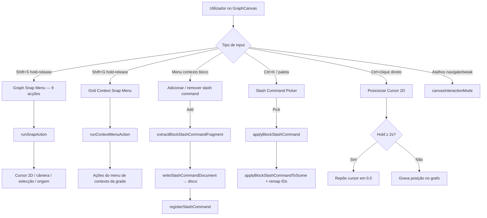
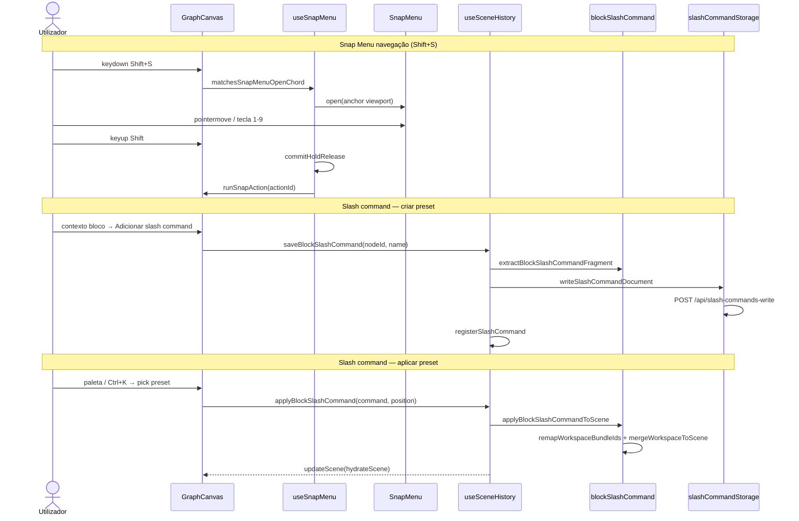

# Documentação de Implementação — Snap Menu, Cursor 2D e Block Slash Commands

Arquivo salvo em: `feature_md/feature/feature-canvas-snap-menu-slash-commands.md`

## 1. Cabeçalho

| Campo | Valor |
| --- | --- |
| Nome da Branch | `feature/canvas-snap-menu-slash-commands` |
| Nome das Features | Snap Menu radial (navegação Shift+S e contexto de grade Shift+G); Cursor 2D do canvas; modos de interacção (tweak / selectBox / navigate); Block Slash Commands (presets de subgrafo); grid temático avançado; slots de cabeçalho `in[]`/`out[]`; pipeline RitualBin/CodeDock e launcher dev |
| Versão atual | `1.5.0` |
| Hash do Commit | `0669e47` |

Documentação relacionada: `feature_md/prompet/prompet_sistema_blocos.md`, `feature_md/feature/feature-block-link-palette.md`, `feature_md/feature/feature-block-slot-improvements.md`.

---

## 2. Definição e Resumo de Tags

| Tag | Definição |
| --- | --- |
| `[NOVO]` | Novo módulo, componente, hook, endpoint dev ou fluxo criado nesta entrega. |
| `[ATUALIZADO]` | Componente ou função existente alterada para suportar snap menu, cursor 2D, slash commands ou grid temático. |
| `[REMOVIDO]` | Comportamento ou API removida. |

Tags presentes nesta implementação:

- `[NOVO]`
- `[ATUALIZADO]`

Não houve itens classificados como `[REMOVIDO]`.

---

## 3. Fluxograma de Funcionamento

---

## 4. Fluxograma de Acionamento de Funções

---

## 5. Tabela de Funções e Componentes

| Status | Nome | Feature | Descrição Técnica | Parâmetros / Retorno |
| --- | --- | --- | --- | --- |
| `[NOVO]` | `SnapMenu.tsx` / `useSnapMenu.ts` | Snap Menu | Menu radial orbital (portal, slices, hub); acorde hold-release e submenus. | `open`, `commitHoldRelease`, `onSelect`. |
| `[NOVO]` | `snapMenu.ts` | Geometria snap | `buildSnapMenuLayout`, hit-test por ponteiro e atalho numérico. | Delta ponteiro → item; tecla → item. |
| `[NOVO]` | `snapMenuChord.ts` | Acordes | `matchesSnapMenuOpenChord`, `isSnapMenuHoldReleaseKey` para Shift+S/G. | Evento teclado → boolean. |
| `[NOVO]` | `contextMenuSnapMenu.ts` | Contexto grade | Converte `ContextMenuItem[]` em acções snap; navega submenus por `path`. | `resolveSnapMenuFrame`. |
| `[NOVO]` | `buildGraphSnapMenuActions.ts` | Navegação | 9 acções i18n (cursor↔câmera↔selecção↔origem). | `translate` → `SnapMenuActionDefinition[]`. |
| `[NOVO]` | `graphSnapMenuGeometry.ts` | Câmera/cursor | `graphPointAtViewportCenter`, `resolveSelectionPivotCenter`. | Scene + viewport → ponto grafo. |
| `[NOVO]` | `Canvas2DCursor.tsx` | Cursor 2D | Crosshair SVG no espaço do grafo. | `position`, `visible`. |
| `[NOVO]` | `canvas2DCursor.ts` | Utilitários cursor | `computePanCenteredOnGraphPoint`, `CANVAS_2D_CURSOR_RESET_HOLD_MS`. | Ponto grafo → pan. |
| `[NOVO]` | `useCanvas2DCursorPlacement.ts` | Posicionar cursor | Ctrl+clique direito; hold ≥2s repõe origem. | Handlers pointer no canvas. |
| `[NOVO]` | `canvasInteractionMode.ts` | Modos canvas | `tweak` \| `selectBox` \| `navigate`; helpers de pan cursor. | `CanvasInteractionMode`. |
| `[NOVO]` | `blockSlashCommand.ts` | Slash commands | Extrai/aplica subgrafo de blocos com remap de IDs. | `collectBlockSlashCommandNodeIds`, `applyBlockSlashCommandToScene`. |
| `[NOVO]` | `slashCommandTypes.ts` | Schema v1 | `SlashCommandDocument`, parse/sanitize de nomes. | JSON ↔ documento tipado. |
| `[NOVO]` | `slashCommandRegistry.ts` | Registo | `registerSlashCommand`, `slashCommandsList`, pesquisa. | Mapa in-memory por chave. |
| `[NOVO]` | `slashCommandStorage.ts` | Persistência dev | CRUD via `/api/slash-commands-*` (Vite plugin). | Fetch/write/delete + refresh. |
| `[NOVO]` | `SlashCommandPicker.tsx` | UI picker | Painel flutuante Ctrl+K para comandos `/nome`. | Lista filtrada + pick. |
| `[NOVO]` | `PaletteSlashCommandOption.tsx` | Paleta | Item na `AddNodePalette` modo slash. | `command`, `onPick`. |
| `[NOVO]` | `canvasGridThemeColors.ts` | Grid temático | Cores checker/linhas via CSS vars do tema. | `resolveCanvasGridThemeColors`. |
| `[NOVO]` | `ritualBin/*` + `codeDock/*` | BIN pipeline | Codec nativo vs sidecar; open/save BIN no CodeDock. | Módulos separados por backend. |
| `[NOVO]` | `scripts/dev.mjs` | Launcher dev | Escolhe backend Nativo (8791) vs Bridge Jade (8788). | Flags `--native`, `--jade`. |
| `[ATUALIZADO]` | `GraphCanvas.tsx` | Integração | Snap menus, cursor 2D, slash commands, modos interacção. | +1100 linhas de wiring. |
| `[ATUALIZADO]` | `useSceneHistory.ts` | Histórico | `saveBlockSlashCommand`, `applyBlockSlashCommand`, `removeBlockSlashCommand`. | Orquestra extract/apply. |
| `[ATUALIZADO]` | `AddNodePalette.tsx` | Paleta | Modo slash commands; filtro por query `/`. | Props `slashCommandsEnabled`. |
| `[ATUALIZADO]` | `canvasContextMenuItems.ts` | Menu contexto | Submenu `node.slashCommands.add/remove` em blocos. | Itens i18n. |
| `[ATUALIZADO]` | `CanvasGridControlPanel.tsx` | Grid UI | Opacidade, cores checker A/B, preview temático. | Settings persistidos. |
| `[ATUALIZADO]` | `blockCardHeaderSlots.ts` | Header slots | Aliases `in[T]`/`out[T]`; multi-tipo num descriptor. | `parseBlockHeaderSlotDescriptor`. |
| `[ATUALIZADO]` | `useGraphCanvasShortcutHandlers.ts` | Atalhos | Fecha snap menu; abre slash picker; modos navigate/tweak. | Registry JSON. |
| `[ATUALIZADO]` | `vite.plugin.blockParametersWrite.ts` | API dev | Endpoints REST slash commands. | GET/POST/DELETE. |

---

## 6. Descrição Detalhada de Funcionamento

### Snap Menu radial

[NOVO] Dois menus snap partilham o componente `SnapMenu` e o hook `useSnapMenu`:

- **Navegação (`Shift+S`):** abre menu orbital com 9 acções (mover câmera para cursor, centrar seleção, pan para origem, etc.). Acções que exigem selecção ficam desactivadas sem nós seleccionados (`isGraphSnapActionDisabled`).
- **Contexto de grade (`Shift+G`):** espelha o menu de contexto da grade em formato radial; submenus navegam por `path` com acção **Voltar** (`SNAP_MENU_BACK_ACTION_ID`).

[NOVO] Seleção por **ponteiro** (ângulo/distância) ou **tecla numérica** (1–9). Commit no **keyup** do acorde (hold-release), evitando activação acidental.

[ATUALIZADO] Menus snap são **mutuamente exclusivos** — abrir um fecha o outro no `GraphCanvas`.

### Cursor 2D

[NOVO] Crosshair virtual (`Canvas2DCursor`) posicionado com **Ctrl+clique direito** na grade. Serve de referência para acções do snap menu (ex.: centrar câmera no cursor).

[NOVO] Segurar Ctrl+clique direito **≥ 2 segundos** cancela e repõe o cursor na origem `(0, 0)` do grafo.

### Modos de interacção

[NOVO] `canvasInteractionMode`: `tweak` (comportamento padrão), `selectBox` (rectângulo de selecção), `navigate` (pan prioritário). Atalhos registados em `shortcuts.registry.json`.

### Block Slash Commands

[NOVO] Presets de subgrafo de blocos: o utilizador selecciona um bloco raiz, escolhe **Adicionar slash command** no menu de contexto, e o sistema:

1. Recolhe nós ligados por slots de bloco + nós ritual alcançáveis (`collectBlockSlashCommandNodeIds`).
2. Serializa fragmento como `SlashCommandDocument` v1.
3. Grava JSON em `src/blockStructures/slashCommands/blocks/` via API dev.
4. Regista em memória (`slashCommandRegistry`).

[NOVO] Aplicar preset (paleta **Slash Commands** ou Ctrl+K): `applyBlockSlashCommandToScene` faz **remap de IDs**, merge no workspace actual e posiciona o root no ponto de spawn.

[ATUALIZADO] Preset de exemplo: `main.json` (subgrafo Main/Zac).

### Grid temático

[NOVO] `canvasGridThemeColors` lê variáveis CSS do tema activo para linhas da grade e padrão checker A/B.

[ATUALIZADO] `CanvasGridControlPanel` expõe opacidade, cores e preview ao vivo.

### Slots de cabeçalho `in[]` / `out[]`

[ATUALIZADO] `blockCardHeaderSlots` aceita descriptors `in[T]`/`out[T]` além de `input[T]`/`output[T]`, com suporte a **múltiplos tipos** num único descriptor.

### Pipeline RitualBin / CodeDock

[NOVO] Módulos `ritualBin/` e `codeDock/` separam codec BIN nativo (Ritobin bridge) vs sidecar Jade.

[NOVO] `npm run dev` (`scripts/dev.mjs`) pergunta backend **Nativo** ou **Bridge Jade** e configura proxies Vite.

### Regras de negócio e erros

- Snap menus: commit só no keyup do acorde; pointer fora do menu cancela sem acção.
- Slash commands: nomes sanitizados (`sanitizeSlashCommandStem`); conflito de nome → erro na API write.
- **Dívida técnica:** remoção de slash command usa `window.confirm` — migrar para Messenger Popup (`showConfirmByCatalogId`) numa entrega futura.
- Ligações forçadas de blocos/add-ons continuam a usar Messenger (não `window.confirm`).

---

## 7. Como utilizar (didático)

### English

1. **Navigation snap menu:** hold **Shift+S**, move the pointer (or press **1–9**), release **Shift** to run the highlighted action (camera, cursor, selection, origin).
2. **Grid context snap menu:** hold **Shift+G** over the canvas for the radial version of the grid context menu; use **0** to go back in submenus.
3. **2D cursor:** **Ctrl+right-click** on empty canvas to place the crosshair; hold **≥ 2 s** to reset to graph origin `(0, 0)`.
4. **Interaction modes:** use shortcuts for **navigate** / **tweak** (see Shortcuts panel).
5. **Create slash command:** right-click a block → **Add slash command** → enter a name → preset saved under `blockStructures/slashCommands/blocks/`.
6. **Apply slash command:** open palette (**Ctrl+K**) → **Slash Commands** tab → pick a command → subgraph spawns at cursor/palette position.
7. **Grid theme:** open grid control panel → adjust line/checker colors and opacity.

### Português

1. **Menu snap de navegação:** segure **Shift+S**, mova o ponteiro (ou tecla **1–9**), solte **Shift** para executar a acção destacada (câmera, cursor, selecção, origem).
2. **Menu snap de contexto da grade:** segure **Shift+G** sobre o canvas para a versão radial do menu de contexto; use **0** para voltar em submenus.
3. **Cursor 2D:** **Ctrl+clique direito** na grade vazia posiciona o crosshair; segurar **≥ 2 s** repõe a origem `(0, 0)` do grafo.
4. **Modos de interacção:** use atalhos **navigate** / **tweak** (painel de atalhos).
5. **Criar slash command:** clique direito num bloco → **Adicionar slash command** → indique o nome → preset gravado em `blockStructures/slashCommands/blocks/`.
6. **Aplicar slash command:** abra a paleta (**Ctrl+K**) → separador **Slash Commands** → escolha o comando → subgrafo aparece na posição do cursor/paleta.
7. **Tema da grade:** painel de controlo da grade → ajuste cores checker/linhas e opacidade.

---

## Acknowledgements

Special thanks to **Bud**, creator of the Jade tool that powers the BIN conversion system used in this project.
GitHub: https://github.com/budlibu500

Key contributions include:

* BIN code conversion
* BIN League syntax analysis
* Particle editing systems
* General-purpose editing tools

Their work and support were essential to the development and functionality of this project.
