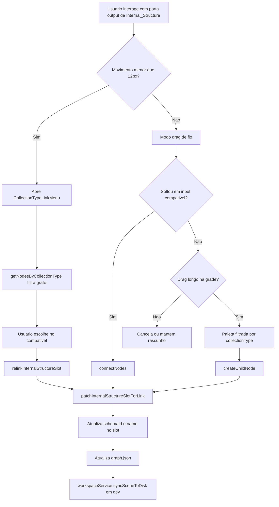
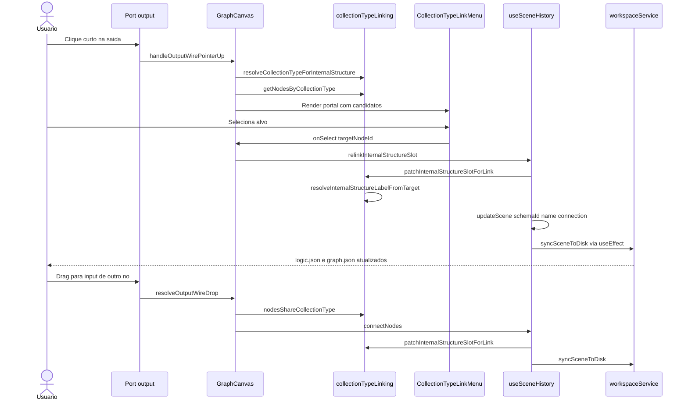

# Documentação de Implementação — Dynamic Collection Type Linking

Arquivo salvo em: `feature_md/feature-dynamic-collection-type-linking.md`

## 1. Cabeçalho

| Campo | Valor |
| --- | --- |
| Nome da Branch | `feature/dynamic-collection-type-linking` |
| Nome das Features | Dynamic Collection Type Linking, Sincronização de rótulo do slot |
| Versão atual | `1.4.0` |
| Hash do Commit | `bb98cc3b3d8e62e1953c56d9e4464c99345bcbc9` |

Histórico relevante na branch: `e550e9f` (linking por `collectionType`), `27795f3` (documentação inicial), `bb98cc3` (sincronização de `name` com `title` do alvo).

## 2. Definição e Resumo de Tags

| Tag | Definição |
| --- | --- |
| `[NOVO]` | Novo componente, arquivo, endpoint, função ou estrutura de dados criado nesta branch. |
| `[ATUALIZADO]` | Componente, função, schema ou fluxo existente alterado para suportar a feature. |
| `[REMOVIDO]` | Código, comportamento ou componente removido da aplicação. |

Tags presentes nesta implementação:

- `[NOVO]`
- `[ATUALIZADO]`

Não houve itens classificados como `[REMOVIDO]` nesta branch.

## 3. Fluxograma de Funcionamento

## 4. Fluxograma de Acionamento de Funções

## 5. Tabela de Funções e Componentes

| Status | Nome | Feature Correspondente | Descrição Técnica | Parâmetros Recebidos / Retorno |
| --- | --- | --- | --- | --- |
| `[NOVO]` | `collectionTypeLinking.ts` | Dynamic Collection Type Linking | Utilitários para resolver `collectionType`, filtrar nós do grafo, validar compatibilidade e sincronizar rótulo do slot. | Funções puras sobre `CanvasNode[]` e `schemaRegistry`. |
| `[NOVO]` | `getNodesByCollectionType` | Dynamic Collection Type Linking | Varre nós activos e devolve instâncias cujo `nomenclature.collectionType` coincide. | `(nodes, collectionType, options?)` → `CanvasNode[]`. |
| `[NOVO]` | `nodesShareCollectionType` | Dynamic Collection Type Linking | Compara tipo semântico; faz fallback para `schema.id` quando nomenclatura falta. | `(sourceSchemaId, targetNode, registry)` → `boolean`. |
| `[NOVO]` | `resolveInternalStructureLabelFromTarget` | Sincronização de rótulo do slot | Obtém o rótulo exibido no card a partir do `title` do nó alvo (fallback: `schema.id`). | `(target: CanvasNode)` → `string`. |
| `[NOVO]` | `patchInternalStructureSlotForLink` | Sincronização de rótulo do slot | Actualiza `schemaId` e `name` do slot com base no nó ligado; usado em todos os caminhos de ligação. | `(slot, target)` → `InternalStructureDefinition`. |
| `[NOVO]` | `CollectionTypeLinkMenu` | Dynamic Collection Type Linking | Menu flutuante na porta de saída com ligação actual e lista «Compatible [Type] Nodes». | Props de âncora, nós compatíveis, callbacks `onSelect` / `onClose`. |
| `[NOVO]` | `relinkInternalStructureSlot` | Dynamic Collection Type Linking | Religa slot a outro nó do mesmo `collectionType` e sincroniza metadados do slot. | `(fromNodeId, structureId, targetNodeId)` → `void`. |
| `[ATUALIZADO]` | `connectNodes` | Sincronização de rótulo do slot | Além da aresta, actualiza `internalStructures` do pai via `patchInternalStructureSlotForLink`. | `(connection: CanvasConnection)` → `void`. |
| `[ATUALIZADO]` | `createChildNode` | Sincronização de rótulo do slot | Ao criar filho, o slot no pai recebe `name` e `schemaId` do título/id da instância criada. | `(fromNodeId, slot, placement?)` → `void`. |
| `[ATUALIZADO]` | `GraphCanvas.tsx` | Dynamic Collection Type Linking | Clique curto abre menu; drag, highlight e paleta usam `collectionType`. | `onRelinkInternalStructure`; estado `collectionTypeLinkMenu`. |
| `[ATUALIZADO]` | `InternalStructureItem.tsx` | Sincronização de rótulo do slot | Exibe `structure.name` no card (valor persistido após ligação). | Prop `structure`; render de rótulo. |
| `[ATUALIZADO]` | `App.tsx` | Dynamic Collection Type Linking | Liga `relinkInternalStructureSlot` ao `GraphCanvas`. | Prop `onRelinkInternalStructure`. |

## 6. Descrição Detalhada de Funcionamento

[NOVO] A feature introduz linking contextual por `nomenclature.collectionType`. Antes, uma `internalStructure` só aceitava alvos cujo `node.schema.id` era igual ao `schemaId` do slot — bloqueando ligar um slot genérico `Emitter` a instâncias importadas `vfx-em-*` com o mesmo tipo semântico.

[NOVO] O módulo `collectionTypeLinking.ts` centraliza as regras: `getNodesByCollectionType` percorre `scene.nodes`; `resolveCollectionTypeForInternalStructure` resolve o tipo do slot; `nodesShareCollectionType` mantém fallback estrito por `id` para schemas legados.

[NOVO] `CollectionTypeLinkMenu` abre ao clicar na porta de saída com deslocamento inferior a 12px. Lista a ligação actual, o cabeçalho **Compatible [Type] Nodes** e candidatos do mesmo `collectionType` no grafo.

[NOVO] `resolveInternalStructureLabelFromTarget` e `patchInternalStructureSlotForLink` garantem que o card do nó pai mostre o título real do alvo (ex.: «Emitter · Additive Flame Wave» em vez de «Emitter» genérico). O rótulo vem de `target.node.schema.title` e é persistido em `logic.json` no campo `internalStructures[].name`, consumido por `InternalStructureItem` no card.

[ATUALIZADO] `relinkInternalStructureSlot`, `connectNodes` e `createChildNode` aplicam `patchInternalStructureSlotForLink` de forma atómica: actualizam `schemaId`, `name` e a conexão em `graph.json`, seguido de `workspaceService.syncSceneToDisk` em modo dev.

[ATUALIZADO] O fluxo de drag mantém-se: soltar num input compatível usa `nodesShareCollectionType`; paleta ao soltar na grade filtra por `schemaMatchesCollectionType`; criar filho alinha slot e rótulo no pai.

Tratamento de erros: sem `collectionType` resolvido, o menu não abre e o drag usa fallback por `schema.id`. Nós ou slots inválidos são ignorados sem alterar a cena. `removeConnection` não repõe o nome genérico anterior. Não houve alterações a `linked_parameter_values` nesta branch.
