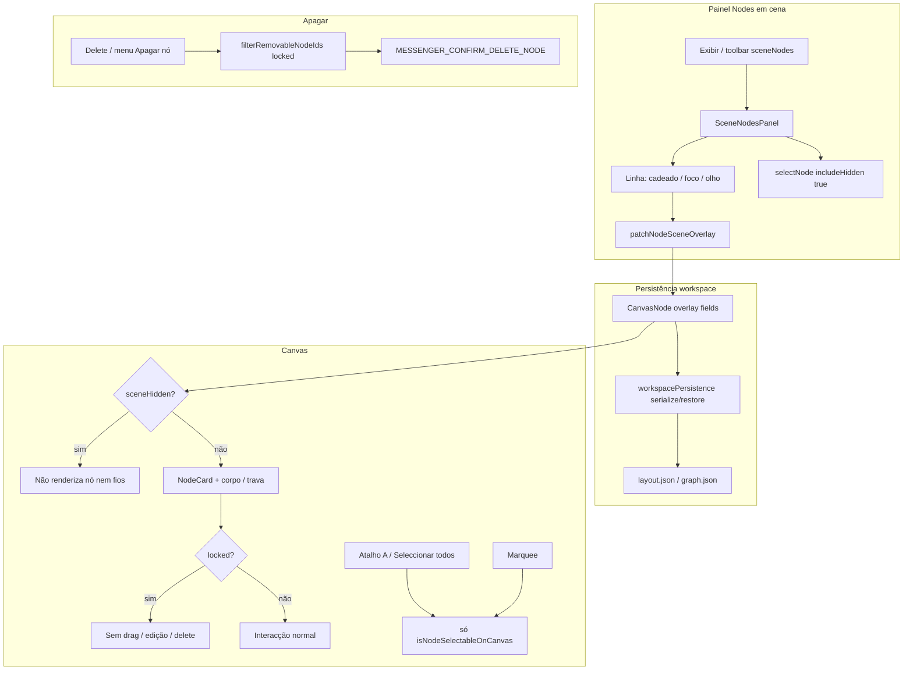
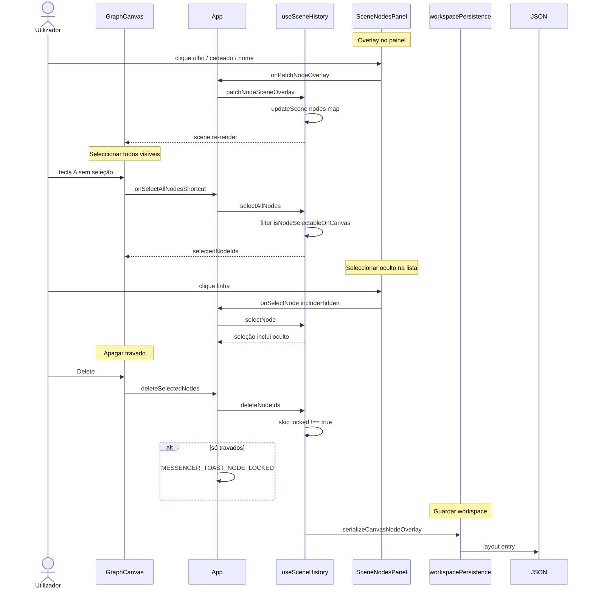

# Documentação de Implementação — Nodes em Cena

Arquivo salvo em: `feature_md/feature/feature-nodes-em-cena.md`

## 1. Cabeçalho

| Campo | Valor |
| --- | --- |
| Nome da Branch | `feature/nodes-em-cena` |
| Nome das Features | **Nodes em cena** (overlay por nó, painel flutuante/acoplável, regras de trava/oculto/seleção/apagar) |
| Versão atual | `1.4.0` |
| Hash do Commit | `6da5fc6` |

## 2. Definição e Resumo de Tags

| Tag | Definição |
| --- | --- |
| `[NOVO]` | Novo componente, arquivo, função ou tipo criado nesta branch. |
| `[ATUALIZADO]` | Componente ou fluxo existente alterado para suportar a feature. |
| `[REMOVIDO]` | Código ou comportamento removido ou descontinuado. |

Tags presentes nesta implementação:

- `[NOVO]`
- `[ATUALIZADO]`

## 3. Fluxograma de Funcionamento



## 4. Fluxograma de Acionamento de Funções



## 5. Tabela de Funções e Componentes

| Status | Nome | Feature | Descrição | Parâmetros / Retorno |
| --- | --- | --- | --- | --- |
| `[NOVO]` | `SceneNodesPanel` | Nodes em cena | Lista pesquisável com ordenação; acoplável à toolbar ou flutuante; acções por linha | `scene`, handlers overlay/seleção/foco |
| `[NOVO]` | `SceneNodesOptionsMenu` | Nodes em cena | Menu global: ocultar/mostrar todos, travar/destravar todos, cor, reset posição | callbacks `onHideAll`, `onLockAll`, etc. |
| `[NOVO]` | `SceneNodesRowIcons` | Nodes em cena | Ícones cadeado, foco, olho por linha | props `active` / `onClick` |
| `[NOVO]` | `canvasNodePresentation.ts` | Overlay / UX | Título, visibilidade, selecção, remoção, CSS `--node-body-fill`, cor do portão | `CanvasNode` → helpers / `CSSProperties` |
| `[NOVO]` | `sceneNodesListSort.ts` | Lista | `sortSceneNodes`, `filterSceneNodesByQuery` | `nodes`, `mode` / `query` → `CanvasNode[]` |
| `[NOVO]` | `canvasToolbarVisibility.ts` | Toolbar | Registo `sceneNodes` e rótulo «Nodes em cena» | `CanvasToolbarToolId` |
| `[NOVO]` | `SceneCameraPanel` | Câmera | Painel pan X/Y com commit on blur/Enter (evita loop de persistência) | `pan`, `onPanChange` |
| `[ATUALIZADO]` | `CanvasNode` (`canvasScene.ts`) | Overlay | Campos `sceneHidden`, `displayLabel`, `bodyColor`, `bodyColorEnabled`, `locked` | tipos opcionais |
| `[ATUALIZADO]` | `workspacePersistence` | Persistência | Round-trip dos campos overlay no layout | `serialize` / `restore` |
| `[ATUALIZADO]` | `useSceneHistory` | Histórico | `patchNodeSceneOverlay`, `setAllNodesSceneHidden`, `setAllNodesLocked`, `resetNodePosition`, `selectAllNodes`, `selectNode`, `commitMarqueeSelection`, `deleteNodeIds` | callbacks |
| `[ATUALIZADO]` | `GraphCanvas` | Canvas | Filtra render/fios/atalho A/marquee por visível; `hasSelectAll`; slot painel; guards `locked` | props + handlers |
| `[ATUALIZADO]` | `App.tsx` | Shell | Estado dock/minimizado do painel; Delete com toast; `sceneNodesPanelProps` | integração |
| `[ATUALIZADO]` | `NodeHeader` | Trava | Badge «travado» no cabeçalho (sem estilos globais de card bloqueado) | `locked` |
| `[ATUALIZADO]` | `NodeCard` / `ParameterItem` / `MapHashStructureBlock` | Cor / trava | `--node-body-fill`; map hash mantém UI com `interactionLocked` + toast | `canvasNode` |
| `[ATUALIZADO]` | `canvasContextMenuItems` | Menus | `node.delete` desactivado se travado; item toolbar `sceneNodes` no Exibir | `CanvasContextMenuBuildContext` |
| `[ATUALIZADO]` | `resolveCanvasNodeBodyCssColor` | Cor | Converte `r,g,b,a` persistido para CSS `rgba(...)` | `CanvasNode` → `string \| undefined` |
| `[ATUALIZADO]` | Mensageiro | UX | `MESSENGER_CONFIRM_DELETE_NODE`, `MESSENGER_TOAST_NODE_LOCKED` | catálogo JSON |

## 6. Descrição Detalhada de Funcionamento

### Modelo de overlay por nó

Cada `CanvasNode` pode carregar metadados de apresentação independentes do schema: **oculto na cena** (`sceneHidden`), **rótulo** (`displayLabel`), **cor do corpo** (`bodyColor` + `bodyColorEnabled`) e **travado** (`locked`). Os valores são serializados em `workspacePersistence` para sobreviver ao reload do workspace. Helpers em `canvasNodePresentation` centralizam regras de UI: título efectivo, visibilidade, elegibilidade para selecção no canvas, remoção e estilos CSS (incluindo variável `--node-body-fill` e tint no portão de entrada).

### Painel «Nodes em cena»

O painel lista todos os nós da cena (incluindo ocultos), com pesquisa e ordenação por nome, tipo ou posição. Por linha: **cadeado** alterna `locked`, **foco** chama `focusSelectionIntoView` no canvas, **olho** alterna `sceneHidden`. O menu de opções aplica acções em massa (ocultar/mostrar, travar/destravar). O painel pode ficar **acoplado** à faixa de controlos da vista (`viewportDocked`) ou **flutuante** com drag, espelhando o padrão do Inspector. No submenu **Exibir**, o item «Nodes em cena — mostrando» activa a visibilidade na toolbar e, ao passar a mostrar, chama `onSceneNodesPanelRequest` para expandir o painel minimizado.

### Comportamento no canvas

Nós com `sceneHidden === true` **não são desenhados** e as ligações que os envolvem são omitidas. Nós **travados** não movem, não editam parâmetros nem criam ligações de saída; interacções bloqueadas disparam toast `MESSENGER_TOAST_NODE_LOCKED`. A cor do corpo, quando activada, aplica-se ao card, blocos de parâmetros e estrutura map hash via `color-mix` com `--node-body-fill`.

### Seleção e atalho A

A tecla **A** alterna entre **limpar seleção** (quando há seleção) e **seleccionar todos os nós visíveis** (quando não há). O menu de contexto da grade segue a mesma regra (`hasSelectAll` só se existir nó visível). A **marquee** e `selectNode` no canvas ignoram ocultos. No painel «Nodes em cena», `selectNode` usa `includeHidden: true` para permitir editar overlay de nós ocultos.

### Apagar nós

`deleteNodeIds` exclui nós com `locked === true` (além de `ROOT`). O menu «Apagar nó», o atalho Delete e o botão «−» do painel respeitam `filterRemovableNodeIds` / `isNodeRemovableFromScene`. Se a seleção contiver apenas nós travados, mostra-se toast em vez de confirmar apagar. Apagar seleção válida usa confirmação `MESSENGER_CONFIRM_DELETE_NODE`.

### Câmera

`SceneCameraPanel` edita pan com commit explícito (blur/Enter), evitando o ciclo «persistir a cada render» que causava *Maximum update depth*. A persistência da câmera no histórico mantém-se em `setSceneCamera` sem efeitos reactivos contínuos no `GraphCanvas`.

### Tratamento de erros e limites

- Overlay inválido no JSON de layout é ignorado ou normalizado em `restore` (ex.: `sceneHidden` só `true`).
- Nó oculto continua na cena lógica e no painel; só deixa de ser interactivo no canvas.
- ROOT nunca é apagável; travado não é apagável.
- Testes Vitest: `canvasNodePresentation.test.ts`, `workspacePersistence.test.ts`.

### Testes recomendados

```bash
npm test -- src/core/canvasNodePresentation.test.ts src/core/workspacePersistence.test.ts
```

Validação manual: ocultar nó → não aparece no canvas nem entra em «selecionar todos»; travar → badge no header, toast ao editar, delete desactivado; painel lista ocultos e permite seleccioná-los; cor do corpo visível em parâmetros e map hash.
