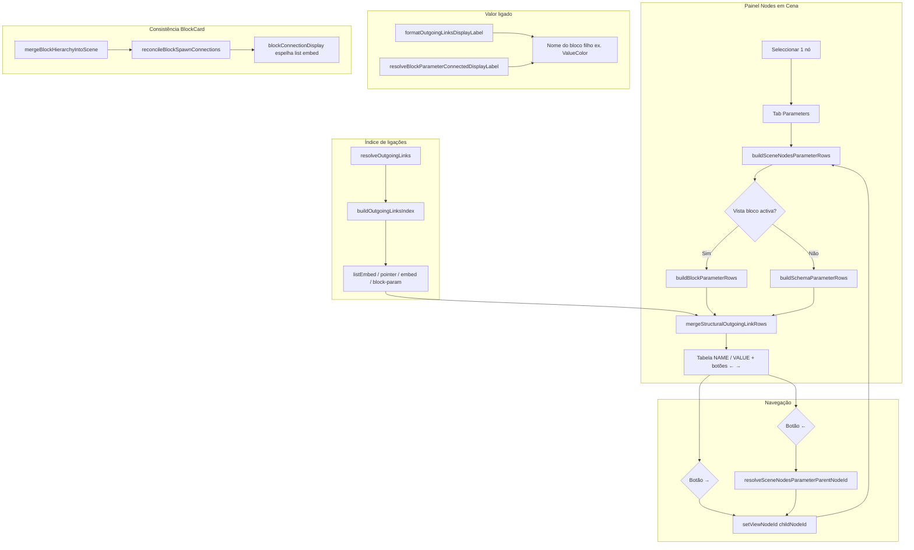

# Documentação de Implementação — Aba Parameters (Nodes em Cena) e navegação no grafo

Arquivo salvo em: `feature_md/feature/feature-scene-nodes-parameters-graph.md`

## 1. Cabeçalho

| Campo | Valor |
| --- | --- |
| Nome da Branch | `feature/scene-nodes-parameters-graph` |
| Nome das Features | Aba **Parameters** no painel Nodes em Cena; navegação hierárquica pai/filho no grafo; valores ligados com rótulo do nó filho; inputs tipados por parâmetro; consistência de ligações `list[embed]` / `pointer` em blocos |
| Versão atual | `1.5.0` |
| Hash do Commit | `ac784d3` |

Documentação relacionada: `feature_md/feature/feature-nodes-em-cena.md`, `feature_md/feature/feature-block-link-palette.md`, `feature_md/prompet/prompet_sistema_blocos.md`.

---

## 2. Definição e Resumo de Tags

| Tag | Definição |
| --- | --- |
| `[NOVO]` | Novo módulo, componente, função ou fluxo criado nesta entrega. |
| `[ATUALIZADO]` | Componente ou função existente alterada para suportar a aba Parameters ou ligações estruturais. |
| `[REMOVIDO]` | Comportamento ou API removida ou descontinuada. |

Tags presentes nesta implementação:

- `[NOVO]`
- `[ATUALIZADO]`

Não houve itens classificados como `[REMOVIDO]`.

---

## 3. Fluxograma de Funcionamento



---

## 4. Fluxograma de Acionamento de Funções

```mermaid
sequenceDiagram
  actor U as Utilizador
  participant SNP as SceneNodesPanel
  participant Sec as SceneNodesParametersSection
  participant View as sceneNodesParametersView
  participant Links as sceneNodesParameterGraphLinks
  participant Ritual as canvasToClassGroupRitual
  participant App as App

  U->>SNP: Selecciona nó + tab Parameters
  SNP->>Sec: scene, primarySelectedId
  Sec->>View: buildSceneNodesParameterRows(scene, viewNode)
  View->>Ritual: resolveOutgoingLinks(parent, scene)
  Ritual-->>View: OutgoingLink[]
  View->>Links: buildOutgoingLinksIndex
  View->>View: mergeStructuralOutgoingLinkRows
  View-->>Sec: SceneNodesParameterRow[]
  Sec-->>U: Tabela com birthColor → ValueColor + →

  U->>Sec: Clica → em birthColor
  Sec->>Sec: setViewNodeId(value-color)
  Sec->>App: onSelectNode(value-color)
  Sec->>View: buildSceneNodesParameterRows(ValueColor)
  View-->>U: constantValue + dynamics → Animated

  U->>Sec: Clica ←
  Sec->>Links: resolveSceneNodesParameterParentNodeId
  Links-->>Sec: parentNodeId emitter
  Sec->>Sec: setViewNodeId(emitter)

  U->>Sec: Edita alphaRef (ParameterValueInput)
  Sec->>App: onCommitParameter(nodeId, id, value, kind)
  App->>App: updateNodeParameter / updateBlockParameter
```

---

## 5. Tabela de Funções e Componentes

| Status | Nome | Feature | Descrição Técnica | Parâmetros / Retorno |
| --- | --- | --- | --- | --- |
| `[NOVO]` | `SceneNodesParametersSection.tsx` | Aba Parameters | UI da tab: cabeçalho com ←, tabela NAME/VALUE, botão → por linha navegável, `ParameterValueInput` para valores editáveis. | Props: `scene`, `primarySelectedId`, `onSelectNode`, `onCommitParameter`. |
| `[NOVO]` | `sceneNodesParametersView.ts` | Linhas de parâmetro | Constrói `SceneNodesParameterRow[]` para schema, bloco e add-on; trunca display; resolve labels de ligação. | `buildSceneNodesParameterRows`, `formatSceneNodesParameterDisplayValue`. |
| `[NOVO]` | `mergeStructuralOutgoingLinkRows` | Grafo estrutural | Acrescenta linhas para campos com ligação de saída (`listEmbed`, `pointer`, etc.) ausentes de `parameters[]`. | `(scene, node, rows, kind) → rows`. |
| `[NOVO]` | `sceneNodesParameterGraphLinks.ts` | Índice de ligações | Normaliza nomes de campo, indexa `OutgoingLink`, formata label do filho, resolve nó pai upstream. | `buildOutgoingLinksIndex`, `resolveSceneNodesParameterParentNodeId`. |
| `[NOVO]` | `blockParameterInputValue.ts` | Inputs tipados | Normaliza valor de token bloco para `ParameterValueInput` (vec4, listas, escalares). | `resolveBlockParameterInputValue`, `blockParameterTypeToNodeDataType`. |
| `[NOVO]` | `reconcileBlockSpawnConnections.ts` | Ligações spawn | Repara metadados e filhos órfãos após spawn hierárquico de blocos. | `reconcileBlockSpawnConnections(scene)`. |
| `[NOVO]` | Testes Vitest | Regressão | Cobertura para rows, graph links, connection display e reconcile. | `*.test.ts` correspondentes. |
| `[ATUALIZADO]` | `SceneNodesPanel.tsx` | Tab Parameters | Integra `SceneNodesParametersSection` e prop `onCommitParameter`. | Tab `parameters` no painel flutuante. |
| `[ATUALIZADO]` | `buildSceneNodesParameterRows` | Routing vista | Vista bloco só quando `blockViewActive && blockStructure`; caso contrário schema + merge estrutural. | `CanvasScene`, `CanvasNode` → rows. |
| `[ATUALIZADO]` | `canvasToClassGroupRitual.ts` | Outgoing links | `resolveOutgoingLinks` / `classifyOutgoingLink` exportados; fallback block-param para `embedChild` / `pointerChild`. | `OutgoingLink[]`. |
| `[ATUALIZADO]` | `blockConnectionDisplay.ts` | UI BlockCard | Espelha ligação `list[embed]` no slot canónico do pai (como `list[pointer]`). | Display de ports conectados. |
| `[ATUALIZADO]` | `blockHierarchySpawn.ts` | Spawn | Chama reconciliação após `mergeBlockHierarchyIntoScene`. | Cena actualizada. |
| `[ATUALIZADO]` | `blockSchema.ts` | Schema bloco | Helpers `isBlockListEmbedParameter`, `isBlockListCollectionParameter`, paths estruturais. | Tipos e guards. |
| `[ATUALIZADO]` | `BlockParameterRow.tsx` | Inputs bloco | Usa `ParameterValueInput` com valor normalizado por tipo. | `onUpdateBlockParameter`. |
| `[ATUALIZADO]` | `App.tsx` | Commit parâmetro | `handleCommitSceneNodesParameter` despacha por `kind`: block / schema / addon. | Callback do painel. |
| `[ATUALIZADO]` | `languageIds` + JSON i18n | Strings UI | Colunas, vazios, navegação pai/filho na aba Parameters. | `SceneNodesParameters*`. |

---

## 6. Descrição Detalhada de Funcionamento

### Aba Parameters no painel Nodes em Cena

[NOVO] Com **exactamente um nó** seleccionado, a tab **Parameters** lista parâmetros do nó activo (`viewNodeId`), não apenas do nó primário da selecção. O cabeçalho mostra o título do nó em foco e um botão **←** quando existe pai upstream (`resolveSceneNodesParameterParentNodeId`) ou quando se navegou para um filho e se quer voltar ao nó seleccionado originalmente.

[NOVO] Cada linha expõe **NAME**, **VALUE** (editável ou só leitura) e, quando aplicável, **→** para saltar para o nó filho ligado (`childNodeId`).

### Construção das linhas

[ATUALIZADO] `buildSceneNodesParameterRows` escolhe o builder conforme a vista:

- **Bloco activo** (`blockViewActive && blockStructure`): `buildBlockParameterRows` — percorre `blockStructure.parameters`, consulta `buildOutgoingLinksIndex`, marca `navigable` quando há filho ou slot estrutural.
- **Grafo de nós** (sem vista bloco): `buildSchemaParameterRows` — percorre `schema.parameters`; parâmetros estruturais com ligação ficam navegáveis.
- **Add-on**: `buildAddonParameterRows` — campos do manifest / `outputValues`.

[NOVO] **`mergeStructuralOutgoingLinkRows`** executa-se sempre após o builder base. Percorre todas as entradas do índice de ligações de saída e adiciona linhas sintéticas para campos como **`birthColor`** (`listEmbed`) ou **`dynamics`** (`pointer`) que **não** constam de `parameters[]` mas têm conexão no grafo. Isto corrige o caso em que o canvas (`NodeCard`) mostra o campo estrutural mas a aba Parameters só listava escalares (`alphaRef`, `emitterName`).

### Labels e valores

[ATUALIZADO] Valores ligados deixam de mostrar **—** quando existe filho: `formatOutgoingLinksDisplayLabel` e `resolveBlockParameterConnectedDisplayLabel` devolvem o nome do bloco ou título do nó (ex.: `ValueColor`).

[NOVO] Valores editáveis usam `ParameterValueInput` com tipo derivado de `blockParameterTypeToNodeDataType` / `resolveBlockParameterInputValue`, alinhado ao node graph (vec4, listas, etc.).

### Índice de ligações

[NOVO] `sceneNodesParameterGraphLinks` encapsula a normalização de nomes de campo (case-insensitive), agregação de múltiplas ligações no mesmo campo e resolução do **pai** via `scene.connections` (slots block, `fromInternalStructureId`, `__block__:`).

[ATUALIZADO] `resolveOutgoingLinks` em `canvasToClassGroupRitual` classifica ligações schema (`listEmbed`, `pointer`, `embed`, …) e, para blocos, complementa com ligações a partir de `fromBlockParameterId` e `sourcePath` (`embedChild`, `pointerChild`).

### Consistência BlockCard ↔ filhos

[ATUALIZADO] `blockConnectionDisplay` espelha ligações `list[embed]` no slot canónico do pai, evitando slot pai “desconectado” com filho ligado.

[NOVO] `reconcileBlockSpawnConnections` normaliza metadados de conexão após spawn hierárquico; `blockHierarchySpawn` invoca-o em `mergeBlockHierarchyIntoScene`.

### Regras de negócio e erros

- A tab Parameters **não** aparece com 0 ou ≥2 nós seleccionados (`shouldShowSceneNodesParametersPanel`).
- Parâmetros estruturais aninhados (blocos `{}`, `mapHashEmbed`, filhos embed/pointer) são **não editáveis** na aba; navegam-se com **→**.
- Nó **locked**: linhas ficam só leitura; navegação ←/→ mantém-se.
- Confirmações de UI continuam a usar **Messenger Popup** (`showConfirmByCatalogId`); esta feature não introduz `window.confirm` para fluxos novos.
- Edição de parâmetro add-on input wired sincroniza DOM do card via `syncAddonSceneParameterToCardDom` após commit.

---

## 7. Como utilizar (didático)

### Português

1. Abra o painel **Nodes em Cena** e seleccione **um único nó** (ex.: `VfxEmitterDefinitionData`).
2. Clique na tab **Parameters**.
3. Veja parâmetros escalares (`alphaRef`, `emitterName`) e campos estruturais ligados (`birthColor` → `ValueColor`).
4. Clique **→** na linha `birthColor` para focar o nó filho `ValueColor` na mesma tabela.
5. No filho, use **→** em `dynamics` para ir a `VfxAnimatedColorVariableData`.
6. Use **←** no cabeçalho para subir na hierarquia (filho → pai) ou voltar ao nó que tinha seleccionado no canvas.
7. Edite valores simples directamente na coluna **VALUE** (ex.: `alphaRef`, `emitterName`); campos ligados a outros nós são só leitura com rótulo do filho.

### English

1. Open the **Nodes in scene** panel and select **exactly one node** (e.g. `VfxEmitterDefinitionData`).
2. Switch to the **Parameters** tab.
3. View scalar parameters (`alphaRef`, `emitterName`) and wired structural fields (`birthColor` → `ValueColor`).
4. Click **→** on `birthColor` to focus the child node `ValueColor` in the same table.
5. On the child, use **→** on `dynamics` to jump to `VfxAnimatedColorVariableData`.
6. Use **←** in the header to walk up the hierarchy (child → parent) or return to the originally selected canvas node.
7. Edit simple values inline in the **VALUE** column (e.g. `alphaRef`, `emitterName`); wired fields show the child label and are read-only.

---

## Acknowledgements

Special thanks to **Bud**, creator of the Jade tool that powers the BIN conversion system used in this project.
GitHub: https://github.com/budlibu500

Key contributions include:

* BIN code conversion
* BIN League syntax analysis
* Particle editing systems
* General-purpose editing tools

Their work and support were essential to the development and functionality of this project.
