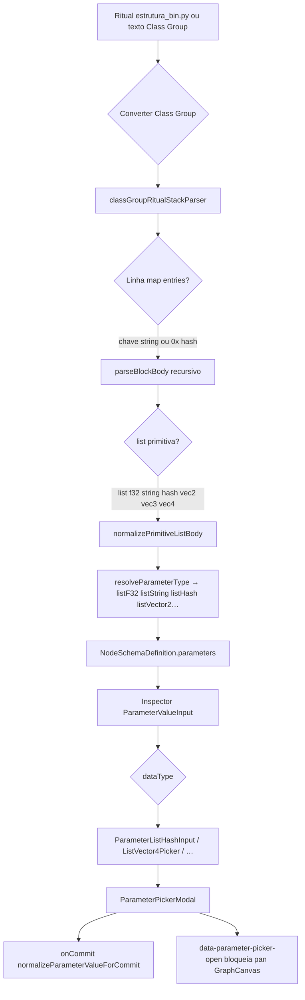
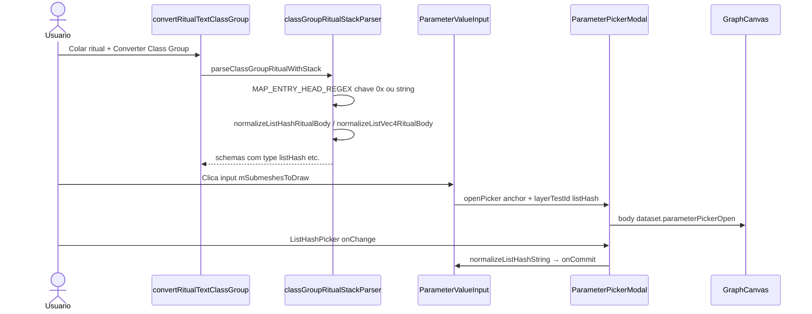

# Documentação de Implementação — Parameter Pickers e Class Group Lists

Arquivo salvo em: `feature_md/feature/feature-parameter-pickers-class-group.md`

## 1. Cabeçalho

| Campo | Valor |
| --- | --- |
| Nome da Branch | `feature/parameter-pickers-class-group` |
| Nome das Features | Parameter Pickers (bool, vec, rgba), List Pickers (f32, string, hash, vec2/3/4), Class Group Converter (listas primitivas + chaves map `0x…`) |
| Versão atual | `1.4.0` |
| Hash do Commit | `8a0f6cbc9b4f6a1e0bc7e8c4c303d7bf31f580e7` |

Base: `feature/element-menu-search` (`8cacd5c`).

## 2. Definição e Resumo de Tags

| Tag | Definição |
| --- | --- |
| `[NOVO]` | Novo componente, arquivo, função ou tipo de parâmetro criado nesta branch. |
| `[ATUALIZADO]` | Componente ou fluxo existente alterado para suportar a feature. |
| `[REMOVIDO]` | Código ou comportamento removido. |

Tags presentes nesta implementação:

- `[NOVO]`
- `[ATUALIZADO]`

## 3. Fluxograma de Funcionamento

## 4. Fluxograma de Acionamento de Funções

## 5. Tabela de Funções e Componentes

| Status | Nome | Feature | Descrição Técnica | Parâmetros / Retorno |
| --- | --- | --- | --- | --- |
| [NOVO] | `listF32Value.ts` / `listStringValue.ts` / `listHashValue.ts` | List pickers | Parse, format e normalize listas primitivas (uma linha por item). | `parseList*String(raw) → string[]` |
| [NOVO] | `listVector2Value.ts` … `listVector4Value.ts` | List vec pickers | Listas ritual `{ x, y }` por linha. | `normalizeListVec*RitualBody` |
| [NOVO] | `ListPrimitivePicker` / `ListVectorPicker` | UI listas | Editor modal: +/− item, `ElementRemovalPicker`, Esc em camadas. | `value`, `onChange` |
| [NOVO] | `ParameterListF32Input`, `ParameterListStringInput`, `ParameterListHashInput`, `ParameterListVector*Input` | Inspector | Input read-only + contagem + modal picker. | `value`, `onCommit` |
| [NOVO] | `ParameterBoolInput`, `ParameterVector*Input`, `ParameterRgbaInput`, `Vec*Picker` | Inspector escalares | Pickers modais para bool, vec2/3/4, rgba. | `ariaLabel`, `onCommit` |
| [NOVO] | `ParameterPickerModal` / `parameterPickerModal.ts` | UX grafo | Modal ancorado; `parameterPickerOpen` no `body`. | `anchor`, `open`, `onClose` |
| [NOVO] | `classGroupRitualStackParser.ts` | Class Group | Pilha de escopo, listas primitivas, dedupe parâmetros. | `parseClassGroupRitualWithStack(source)` |
| [NOVO] | `classGroupFieldClassifier.ts` | Class Group | Classifica linhas ritual (simple / structural / mapEntry). | `classifyRitualLine(line)` |
| [NOVO] | `boolValue.ts`, `vector*Value.ts`, `rgbaColor.ts`, `parameterBoundedTypes.ts` | Validação | Normalização parcial e commit por tipo. | `normalize*String` |
| [ATUALIZADO] | `MAP_ENTRY_HEAD_REGEX` | Class Group | Aceita `"path"` e `0x1c1ea8de` em `entries: map[hash,embed]`. | regex groups mapKey + typeName |
| [ATUALIZADO] | `ParameterValueInput.tsx` | Inspector | Despacha por `NodeDataType` para pickers dedicados. | `dataType`, `value` |
| [ATUALIZADO] | `parameterValueInput.ts` | Core | Hints, validação parcial, `normalizeParameterValueForCommit`. | `type`, `value` |
| [ATUALIZADO] | `nodeSchema.ts` / `nodeStructureJson.ts` | Tipos | Union `listF32`, `listString`, `listHash`, `listVector2`… | `NodeDataType` |
| [ATUALIZADO] | `GraphCanvas.tsx` | Grafo | Ignora pan/zoom com picker aberto. | `isParameterPickerOpen()` |
| [ATUALIZADO] | `convertRitobinTextToNodeStructures.ts` | Conversão | Delega structs ao motor Class Group stack. | `convertRitobinStructureTextToNodeSchemas` |
| [ATUALIZADO] | `SyntaxType.module.css` | UI | Cores por tipo incl. `.listHash`, `.listF32`. | — |
| [NOVO] | `scripts/reconvert-class-pack.ts` | Dev | Reconversão em lote de packs nodeStructures. | CLI `reconvert:class` |

## 6. Descrição Detalhada de Funcionamento

Esta branch estende o editor de parâmetros e o conversor **Class Group** para tipos rituais de lista e escalares com UX de picker modal, alinhada ao ritual LoL (`estrutura_bin.py`).

**Conversão:** `parseClassGroupRitualWithStack` percorre `entries: map[hash,embed]` com pilha de escopo. Listas `list[f32]`, `list[string]`, `list[hash]`, `list[vec2|vec3|vec4]` sem `pointer`/`embed` são parâmetros simples no schema pai; o corpo `{ … }` é normalizado para uma linha por elemento (`\n`). Tipos resolvem para `listF32`, `listString`, `listHash`, `listVector2`, etc., em vez do fallback genérico `string`.

**Correção map hash:** Entradas `0x1c1ea8de = VfxSystemDefinitionData {` passam a ser reconhecidas (antes só chaves `"string"`). Isto permite extrair campos como `mSubmeshesToDraw: list[hash] = { "Base_mat" }` presentes apenas em blocos com chave hash.

**Inspector:** `ParameterValueInput` abre modais (`ParameterPickerModal`) por tipo. Listas usam `ListPrimitivePicker` ou `ListVectorPicker` com submenu `+ tipo` / `− tipo` e remoção via `ElementRemovalPicker`. Enquanto o modal está aberto, `GraphCanvas` não faz pan/zoom (`document.body.dataset.parameterPickerOpen`).

**Persistência:** Valores commitados passam por `normalizeParameterValueForCommit` (ex.: hex hash `0x792ee8b0` com 8 dígitos; strings de hash sem aspas no armazenamento).

**Testes:** Vitest em `classGroupRitualStackParser.test.ts`, `list*Value.test.ts`, `parameterValueInput.test.ts`, entre outros.

**Reconversão:** Após atualizar o parser, packs como `lima` devem ser regenerados com `npm run reconvert:class` (ou Class Group na UI) para popular `mSubmeshesToDraw` e demais listas.
