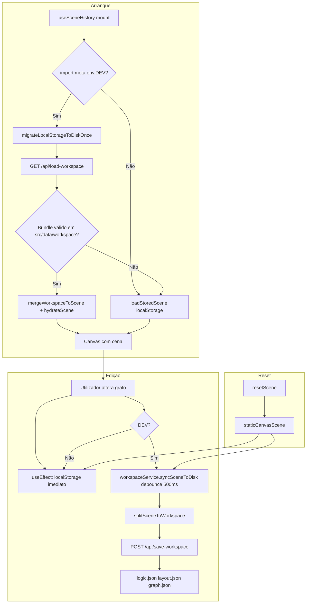
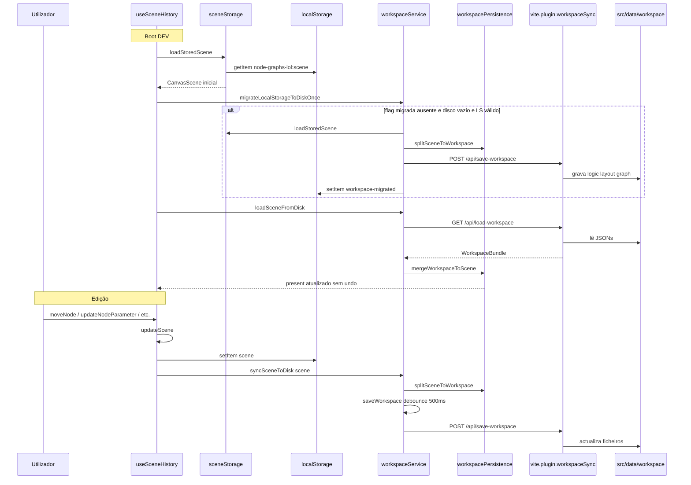

# Documentação de Implementação — Workspace Disk Persistence

Arquivo salvo em: `feature_md/feat/workspace-disk-persistence.md`

## 1. Cabeçalho

| Campo | Valor |
| --- | --- |
| Nome da Branch | `feature/workspace-disk-persistence` |
| Nome das Features | Workspace Disk Persistence (persistência tripartida em disco) |
| Versão atual | `1.4.0` |
| Hash do Commit | `394598e085160d77fdf0a41d9b84bd6f61580200` |

## 2. Definição e Resumo de Tags

| Tag | Definição |
| --- | --- |
| `[NOVO]` | Novo componente, arquivo, endpoint, função ou estrutura de dados criado nesta branch. |
| `[ATUALIZADO]` | Componente, função, schema ou fluxo existente alterado para suportar a feature. |
| `[REMOVIDO]` | Código, comportamento ou componente removido da aplicação. |

Tags presentes nesta implementação:

- `[NOVO]`
- `[ATUALIZADO]`

Não houve itens classificados como `[REMOVIDO]` nesta branch.

## 3. Fluxograma de Funcionamento

## 4. Fluxograma de Acionamento de Funções

## 5. Tabela de Funções e Componentes

| Status | Nome | Feature | Descrição técnica | Parâmetros / Retorno |
| --- | --- | --- | --- | --- |
| `[NOVO]` | `workspacePersistence.ts` | Workspace Disk Persistence | Modelo tripartido `logic` / `layout` / `graph` adaptado a `CanvasScene` (não LiteGraph); validação de versão 1. | `splitSceneToWorkspace(scene)` → `WorkspaceBundle`; `mergeWorkspaceToScene(bundle)` → `CanvasScene \| null`; `isWorkspaceBundleValid`, `isWorkspaceBundleEmpty`. |
| `[NOVO]` | `sceneStorage.ts` | Workspace Disk Persistence | Extrai `SCENE_STORAGE_KEY`, `isCanvasScene` e `loadStoredScene` do hook para evitar dependência circular com o serviço. | `loadStoredScene()` → `CanvasScene`; fallback para `staticCanvasScene` se inválido ou sem nós. |
| `[NOVO]` | `workspaceService.ts` | Workspace Disk Persistence | Cliente singleton com debounce 500 ms, migração one-shot LS→disco e carga em dev; no-op fora de `import.meta.env.DEV`. | `syncSceneToDisk`, `saveWorkspace`, `loadWorkspaceFromDisk`, `loadSceneFromDisk`, `migrateLocalStorageToDiskOnce`; flag `WORKSPACE_MIGRATED_FLAG`. |
| `[NOVO]` | `vite.plugin.workspaceSync.ts` | Workspace Disk Persistence | Plugin Vite com middleware para I/O em `src/data/workspace/`. | `vitePluginWorkspaceSync(projectRoot)`; registo em `configureServer`. |
| `[NOVO]` | `GET /api/load-workspace` | Workspace Disk Persistence | Lê `logic.json`, `layout.json` e `graph.json`; 404 se algum faltar. | Sem body; JSON `{ logic, layout, graph }` ou erro. |
| `[NOVO]` | `POST /api/save-workspace` | Workspace Disk Persistence | Grava os três ficheiros com `mkdir` recursivo e JSON formatado. | Body `{ logic, layout, graph }`; texto `Disk Sync OK` ou JSON de erro. |
| `[NOVO]` | `src/data/workspace/logic.json` | Workspace Disk Persistence | Fonte da verdade para codegen: schemas, valores, `required_parameter`, links e hashString por id de nó. | `version: 1`, `nodes: Record<id, WorkspaceLogicNodePayload>`. |
| `[NOVO]` | `src/data/workspace/layout.json` | Workspace Disk Persistence | Metadados de UI: dimensões do canvas e posições X/Y por nó. | `width`, `height`, `nodes: Record<id, { position }>`. |
| `[NOVO]` | `src/data/workspace/graph.json` | Workspace Disk Persistence | Mapa de conexões entre portas/nós. | `version: 1`, `connections: CanvasConnection[]`. |
| `[NOVO]` | `workspacePersistence.test.ts` | Workspace Disk Persistence | Testes Vitest de round-trip, validação e bundle vazio. | Cobertura de `split` / `merge` / guards. |
| `[ATUALIZADO]` | `useSceneHistory.ts` | Workspace Disk Persistence | Dual sync: `localStorage` imediato + disco debounced em dev; boot async prioriza disco; `resetScene` sincroniza demo no disco. | Reexporta `sceneStorage`; novos `useEffect` para migração, carga e sync. |
| `[ATUALIZADO]` | `vite.config.ts` | Workspace Disk Persistence | Regista `vitePluginWorkspaceSync` junto a `vitePluginNodeStructuresWrite`. | Plugin array do Vite. |

## 6. Descrição Detalhada de Funcionamento

A feature **Workspace Disk Persistence** migra a persistência do grafo do editor de um blob monolítico em `localStorage` (`node-graphs-lol:scene`) para três ficheiros versionáveis em Git sob `src/data/workspace/`, mantendo **dual sync**: o browser continua a gravar em `localStorage` em todas as alterações (produção e dev), e em `npm run dev` o estado é também espelhado no disco após **500 ms** de debounce.

[NOVO] O módulo `workspacePersistence.ts` implementa `splitSceneToWorkspace`, que separa cada `CanvasNode` em payload lógico (`node.node` com schema embutido, valores e metadados) e posição em `layout.json`, e move `connections` para `graph.json`. `mergeWorkspaceToScene` valida o bundle (`isWorkspaceBundleValid`), recompõe a cena e passa por `hydrateScene` para migrações legadas (`fromEntityId`, links em disco, etc.). `logic.json` fica preparado para scripts externos de conversão para código.

[NOVO] O `workspaceService.ts` centraliza chamadas `fetch` aos endpoints dev. `migrateLocalStorageToDiskOnce` corre uma vez por perfil de browser: se a flag `node-graphs-lol:workspace-migrated` não existir, o disco estiver vazio e `localStorage` tiver cena válida com nós, copia o estado para disco e define a flag. `loadSceneFromDisk` devolve `null` em produção, em 404 ou se o bundle for inválido/vazio.

[NOVO] O plugin `vite.plugin.workspaceSync.ts` segue o padrão de `vite.plugin.nodeStructuresWrite.ts`: middleware síncrono no servidor Vite, `fs/promises`, validação mínima do body no POST e respostas HTTP explícitas (200, 404, 400, 500).

[ATUALIZADO] Em `useSceneHistory.ts`, o estado inicial continua síncrono via `loadStoredScene()` para evitar flash vazio; um `useEffect` de mount (apenas dev) corre migração e, se `loadSceneFromDisk` devolver cena válida, substitui `present` **sem** empilhar undo. A prioridade de carga em dev é **disco > localStorage > demo estática** (`staticCanvasScene`). Em cada mudança de `scene`, um `useEffect` chama `workspaceService.syncSceneToDisk`. No `resetScene`, além de limpar `localStorage`, dispara sync da demo para alinhar os JSON no disco.

[NOVO] `sceneStorage.ts` foi extraído para que `workspaceService` e o hook partilhem a mesma chave e leitura sem import circular.

**Tratamento de erros:** falhas de rede ou HTTP no serviço registam `console.error` / `console.log` em dev e **não bloqueiam** a UI; o editor permanece utilizável via `localStorage`. Resposta 404 no load indica workspace ausente e o fluxo mantém o storage do browser. Fora de `import.meta.env.DEV`, todas as funções de disco são no-op; produção depende apenas de `localStorage` e export/import manual existentes.

**Tecnologias:** Vite middleware, `fetch`, TypeScript, Vitest, modelo `CanvasScene` / `LeagueBinGraphDocumentV1` existente.

Não houve [REMOVIDO] nesta branch.
