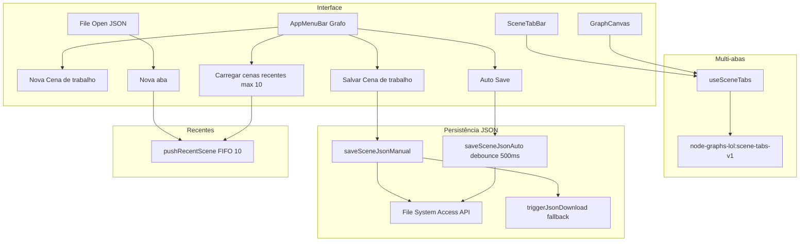
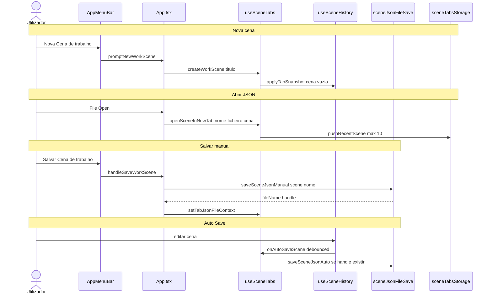

# Documentação de Implementação — Abas de cena, persistência JSON e menu Grafo

Arquivo salvo em: `feature_md/feature/feature-abas-cena-json-menu-grafo.md`

## 1. Cabeçalho

| Campo | Valor |
| --- | --- |
| Nome da Branch | `feature/abas-cena-json-menu-grafo` |
| Nome das Features | Abas de cena gráfica; menu Grafo (Nova Cena, recentes JSON, Salvar Cena de trabalho, Auto Save em ficheiro); bloco visual unificado abas + grade |
| Versão atual | `1.5.0` |
| Hash do Commit | `a869629` |

## 2. Definição e Resumo de Tags

| Tag | Definição |
| --- | --- |
| `[NOVO]` | Novo componente, arquivo, endpoint, função ou estrutura de dados criado nesta branch. |
| `[ATUALIZADO]` | Componente, função, schema ou fluxo existente alterado para suportar a feature. |
| `[REMOVIDO]` | Código, comportamento ou componente removido da aplicação. |

Tags presentes nesta implementação:

- `[NOVO]`
- `[ATUALIZADO]`
- `[REMOVIDO]`

## 3. Fluxograma de Funcionamento

## 4. Fluxograma de Acionamento de Funções

## 5. Tabela de Funções e Componentes

| Status | Nome | Feature Correspondente | Descrição Técnica | Parâmetros Recebidos / Retorno |
| --- | --- | --- | --- | --- |
| `[NOVO]` | `sceneTabsStorage.ts` | Abas + recentes | Persistência `scene-tabs-v1`, `recent-scenes`, migração de `node-graphs-lol:scene`, `stripExtension`, `uniqueTabTitle`, `pushRecentScene` (FIFO 10). | Funções puras; `SceneTabSnapshot`, `RecentSceneEntry` |
| `[NOVO]` | `sceneJsonFileSave.ts` | Salvar JSON | `normalizeSceneJsonFileName`, `saveSceneJsonManual` (prompt + FS API ou download), `saveSceneJsonAuto` (write no handle). | `(scene, suggestedName)` → resultado manual/auto |
| `[NOVO]` | `useSceneTabs.ts` | Multi-abas | Orquestra abas, flush/activate, recentes, handles JSON por `tabId`, delega edição a `useSceneHistory`. | Expõe API de `useSceneHistory` + operações de aba |
| `[NOVO]` | `SceneTabBar.tsx` | UI abas | Barra horizontal com activação, fechar (confirma se undo), prop `attached`. | `tabs`, `onActivate`, `onClose`, `attached?` |
| `[NOVO]` | `graphSurface` (`App.module.css`) | Visual unificado | Contentor único com borda e `border-radius`; abas + grade sem gap. | CSS |
| `[ATUALIZADO]` | `useSceneHistory.ts` | Abas + Auto Save JSON | `getTabSnapshot` / `applyTabSnapshot`, `initialTabSnapshot`; `jsonFileAutoSave` + `onAutoSaveScene` (substitui sync workspace no auto-save). | Opções do hook |
| `[ATUALIZADO]` | `AppMenuBar.tsx` | Menu Grafo | Nova Cena, submenu recentes (nome do ficheiro JSON), Salvar Cena de trabalho, Auto Save; removido Salvar grafo cena. | Props `onSaveWorkScene`, `recentScenes`, etc. |
| `[ATUALIZADO]` | `App.tsx` | Orquestração | `useSceneTabs`, `graphSurface`, import JSON em nova aba, `handleSaveWorkScene`. | — |
| `[ATUALIZADO]` | `GraphCanvas.tsx` | Visual unificado | Prop `attachedViewport` → classe `viewportAttached` (sem borda/cantos no topo). | `attachedViewport?: boolean` |
| `[REMOVIDO]` | Menu «Salvar grafo cena» | Persistência workspace UI | Item e `handleSaveSceneGraph` / `onSaveSceneGraph` removidos; gravação DEV `workspace` deixa de ser acionada pelo menu ou Auto Save. | — |
| `[REMOVIDO]` | «Exportar grafo JSON» (rótulo) | Renomeado | Substituído por «Salvar Cena de trabalho» com prompt de nome de ficheiro. | — |

## 6. Descrição Detalhada de Funcionamento

### Abas de cena gráfica

Cada aba mantém snapshot independente (`past`, `present`, `future`, selecção de nós) em `node-graphs-lol:scene-tabs-v1`. A aba activa continua a sincronizar `node-graphs-lol:scene` para compatibilidade. Ao trocar de aba, `flush` grava o estado actual no array de abas e `applyTabSnapshot` restaura a destino. Fechar aba pede confirmação se existir histórico undo; a última aba não pode ser fechada.

**File → Open…** (JSON) abre sempre numa **nova aba** com título = nome do ficheiro sem extensão. **Nova Cena de trabalho** (menu Grafo) pede nome via `window.prompt` e cria aba com `staticCanvasScene`.

### Recentes (últimos 10 JSON)

`pushRecentScene` guarda snapshot `CanvasScene` + `sourceFileName` opcional; deduplica por ficheiro ou título; máximo 10 entradas (FIFO). O submenu lista o nome do ficheiro; reabrir usa snapshot (limitação do browser — sem caminho de disco).

### Persistência JSON (menu Grafo)

- **Salvar Cena de trabalho:** `window.prompt` para o nome → `serializeScene` v2 → File System Access API (`showSaveFilePicker`) quando disponível, senão `triggerJsonDownload`. O handle fica associado à aba activa para Auto Save.
- **Auto Save:** debounce 500 ms na edição; grava no mesmo ficheiro via `FileSystemFileHandle` se existir na sessão. Sem handle (ex.: após reload), não dispara downloads automáticos — apenas `localStorage` / abas; cápsula informa ao activar Auto Save.

O sync automático para `src/data/workspace/` (**logic/layout/graph**) foi **desligado** do fluxo Auto Save/menu; o load DEV no boot de `useSceneHistory` pode manter-se para migração legada.

### Bloco visual unificado (`graphSurface`)

Abas e grade partilham um contentor com borda exterior arredondada (`border-radius: 12px`). `SceneTabBar` com `attached` não tem borda inferior nem cantos; `GraphCanvas` com `attachedViewport` não tem borda superior. `gap: 0` entre abas e canvas. A barra fica na largura da coluna do grafo (acompanha redimensionamento do painel Código).

### Tratamento de erros

- Prompt de nome vazio: alerta e cancela criação de cena.
- `saveSceneJsonManual` cancelado no picker: sem alteração.
- Auto Save sem permissão de escrita no handle: falha silenciosa (sem spam de downloads).
- JSON inválido no Open: `window.alert` com mensagem existente.

### Tecnologias

TypeScript, React 19, Vite, Vitest, File System Access API (opcional), `localStorage`, Mermaid nos fluxos deste documento.

### Testes automatizados

- `sceneTabsStorage.test.ts` — `stripExtension`, `uniqueTabTitle`, recentes FIFO/dedupe, migração.
- `sceneJsonFileSave.test.ts` — `normalizeSceneJsonFileName`.
