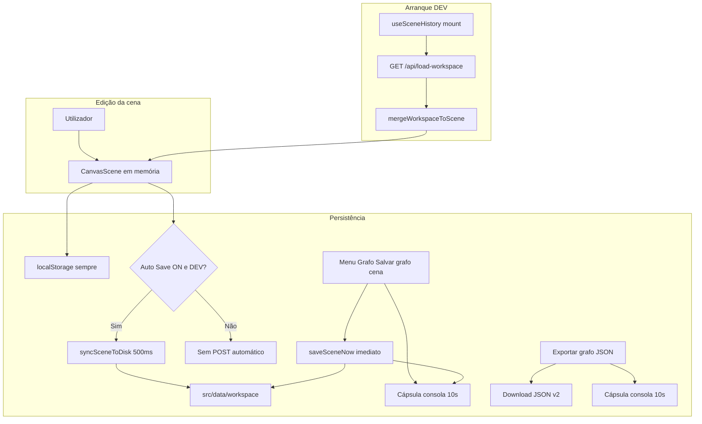
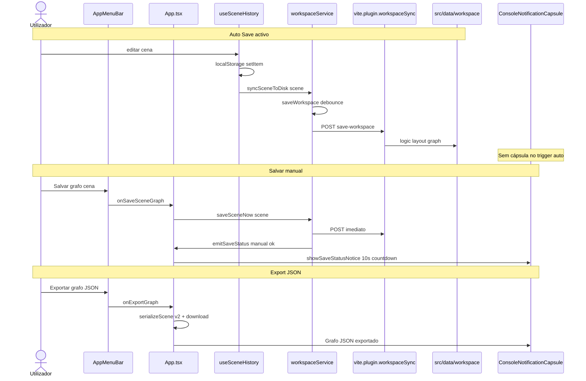

# Documentação de Implementação — Persistência da cena, menu Grafo e notificações

Arquivo salvo em: `feature_md/feature/feature-cena-persistencia-menu-grafo.md`

## 1. Cabeçalho

| Campo | Valor |
| --- | --- |
| Nome da Branch | `feature/cena-persistencia-menu-grafo` |
| Nome das Features | Persistência completa da cena; menu Grafo (Salvar / Auto Save / Export JSON); notificação de gravação na cápsula consola; correcção load-workspace HTML |
| Versão atual | `1.4.0` |
| Hash do Commit | `25c1ef0` |

## 2. Definição e Resumo de Tags

| Tag | Definição |
| --- | --- |
| `[NOVO]` | Novo componente, arquivo, endpoint, função ou estrutura de dados criado nesta branch. |
| `[ATUALIZADO]` | Componente, função, schema ou fluxo existente alterado para suportar a feature. |
| `[REMOVIDO]` | Código, comportamento ou componente removido da aplicação. |

Tags presentes nesta implementação:

- `[NOVO]`
- `[ATUALIZADO]`

Não houve itens classificados como `[REMOVIDO]` nesta branch.

## 3. Fluxograma de Funcionamento

## 4. Fluxograma de Acionamento de Funções

## 5. Tabela de Funções e Componentes

| Status | Nome | Feature Correspondente | Descrição Técnica | Parâmetros Recebidos / Retorno |
| --- | --- | --- | --- | --- |
| `[NOVO]` | `scenePresentation.ts` | Persistência apresentação | Fonte única: overlay por nó, `sceneChrome`, câmera, default freeform no load. | `canvasNodePresentationFromNode`, `parseSceneChrome`, etc. |
| `[NOVO]` | `sceneAutoSavePreference.ts` | Auto Save | Preferência `node-graphs-lol:auto-save` (off por defeito). | `get/setSceneAutoSaveEnabled()` |
| `[NOVO]` | `vite.devApiPath.ts` | API dev | Paths partilhados `/api/load-workspace` e `/api/save-workspace`. | Constantes exportadas |
| `[NOVO]` | `SceneChromeState` / `sceneChrome` | UI cena | `sceneNodes.minimized`, `sortMode`, `toolbarVisibility` em `CanvasScene` e `layout.json`. | Tipos em `canvasScene.ts` |
| `[NOVO]` | `LeagueBinGraphDocumentV2` | Export JSON | `presentation`, `camera`, `sceneChrome`, `elementView`, `compactRoutingBackups`. | `serializeScene` → v2; parse v1 legado |
| `[NOVO]` | `workspaceService.saveSceneNow` | Gravação manual | Flush imediato sem debounce. | `(scene: CanvasScene)` |
| `[NOVO]` | `workspaceService.setSaveStatusListener` | Notificação | Eventos `manual` / `auto` / `migration` após POST. | Callback opcional |
| `[NOVO]` | `patchSceneChrome` | Histórico | Merge em `scene.sceneChrome` sem undo (como câmera). | `useSceneHistory` |
| `[NOVO]` | Menu **Grafo** | AppMenuBar | Substitui Json; Salvar, Auto Save checkbox, Export JSON. | Props `onSaveSceneGraph`, `autoSaveEnabled` |
| `[ATUALIZADO]` | `workspacePersistence.ts` | Workspace | Usa `scenePresentation`; `sceneChrome` em layout; `cardBodyLayout` sempre; `position` no merge. | split / merge |
| `[ATUALIZADO]` | `useSceneHistory.ts` | Sync disco | `workspaceAutoSave` condiciona `syncSceneToDisk`; localStorage sempre. | Opção do hook |
| `[ATUALIZADO]` | `App.tsx` | Orquestração | Estado Auto Save; listener cápsula (sem auto); wiring painel e toolbar na cena. | — |
| `[ATUALIZADO]` | `GraphCanvas.tsx` | Toolbar | `toolbarVisibility` controlado por `scene.sceneChrome`. | Props + callback |
| `[ATUALIZADO]` | `SceneNodesPanel.tsx` | Nodes em cena | `sortMode` e minimizado via cena. | Props controladas |
| `[ATUALIZADO]` | `ConsoleNotificationCapsule.tsx` | UX | Contagem regressiva no badge de segundos. | `lifetimeSeconds` |
| `[ATUALIZADO]` | `vite.plugin.workspaceSync.ts` | Dev API | Pre-hook antes do `htmlFallback` do Vite. | Plugin `enforce: 'pre'` |
| `[ATUALIZADO]` | `workspaceService.ts` | Cliente | `Accept: application/json` no load; rejeita HTML. | fetch load/save |
| `[ATUALIZADO]` | Testes Vitest | Qualidade | `workspacePersistence`, `leagueBinScene`, `sceneAutoSavePreference`, `viteDevApiPath`. | — |

## 6. Descrição Detalhada de Funcionamento

### Persistência unificada da cena

Três canais alinhados ao mesmo modelo de apresentação (`scenePresentation.ts`):

1. **Workspace** (`logic.json`, `layout.json`, `graph.json`) — dual sync com `localStorage`; disco em dev via API Vite.
2. **localStorage** — blob `CanvasScene` completo em cada alteração (inclui `sceneChrome`).
3. **Export/import** — documento `node-graphs-lol` **versão 2**; import v1 mantém só posição e default **freeform** por nó.

Campos de overlay (corpo retraído, secções card, `cardBodyLayout`, oculto, label, cor, lock, câmera, routing, `elementView`) seguem a matriz em `feature-workspace-disk-persistence.md` (secção 7).

### Menu Grafo e Auto Save

O submenu **Json** passou a **Grafo**:

- **Salvar grafo cena** — `saveSceneNow` grava imediatamente no disco (dev); mostra cápsula com contagem regressiva **10 s**.
- **Auto Save** — preferência persistida; **desligado por defeito**. Quando activo, replica o sync debounced anterior; **sem cápsula** no trigger `auto`.
- **Exportar grafo JSON** — download v2; cápsula **10 s**.

Fora de `import.meta.env.DEV`, salvar manual informa que só há `localStorage`.

### Cápsula consola

`ConsoleNotificationCapsule` actualiza o contador a cada 100 ms: durações &lt; 5 s com um decimal (`1.5s`…); ≥ 5 s em segundos inteiros (`10s`…`0s`). Auto Save não dispara cápsula.

### Correcção load-workspace (HTML)

O `GET /api/load-workspace` era interceptado pelo fallback SPA (`Unexpected token '<'`). O plugin regista middleware no **pre-hook** de `configureServer` e o cliente envia `Accept: application/json`, validando `Content-Type` antes do `JSON.parse`.

### Tratamento de erros

- Falhas de POST: `console.error` e cápsula só para gravação **manual** (não auto).
- Load 404 ou HTML: mantém cena do `localStorage` / demo.
- Migração LS→disco one-shot: trigger `migration` sem notificação UI.

### Tecnologias

TypeScript, React, Vite middleware, Vitest, `CanvasScene`, Mermaid nos fluxos deste documento.

Não houve `[REMOVIDO]` nesta branch.
