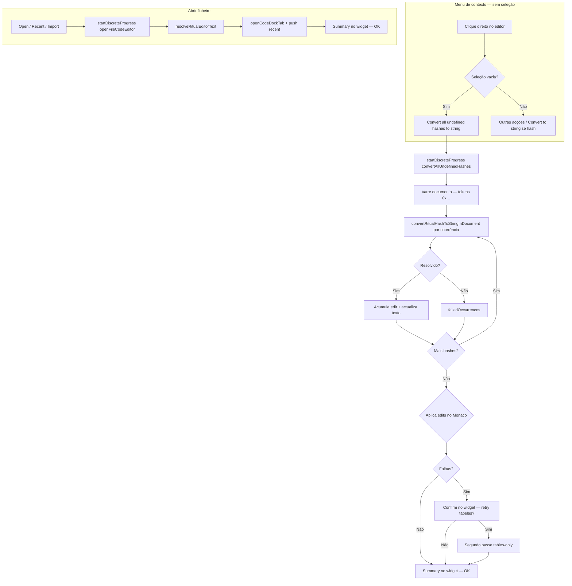
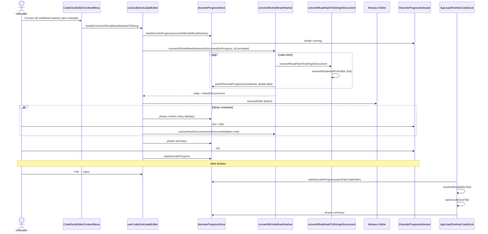

# Documentação de Implementação — Convert all hashes + Progresso discreto (CodeDock)

Arquivo salvo em: `feature_md/feature/feature-convert-all-hashes-discrete-progress.md`

## 1. Cabeçalho

| Campo | Valor |
| --- | --- |
| Nome da Branch | `feature/convert-all-hashes-discrete-progress` |
| Nome das Features | **Convert all undefined hashes to string** (menu de contexto sem seleção); **Convert to string** unificado; **Discrete Progress Indicator** (widget flutuante arrastável, `LockAction: false`); progresso ao **abrir ficheiro** no editor de código |
| Versão atual | `1.5.0` |
| Hash do Commit | `59c339c` |

Documentação relacionada: `feature_md/prompet/prompt_doc.md`, `feature_md/feature/feature-menu-jade-codedock.md`.

---

## 2. Definição e Resumo de Tags

| Tag | Definição |
| --- | --- |
| `[NOVO]` | Novo módulo, componente, store, tarefa de progresso ou fluxo criado nesta entrega. |
| `[ATUALIZADO]` | Componente ou função existente alterada para integrar conversão em massa, progresso discreto ou i18n. |
| `[REMOVIDO]` | Comportamento ou API removida ou descontinuada. |

Tags presentes nesta implementação:

- `[NOVO]`
- `[ATUALIZADO]`

Não houve itens classificados como `[REMOVIDO]`.

---

## 3. Fluxograma de Funcionamento

---

## 4. Fluxograma de Acionamento de Funções

---

## 5. Tabela de Funções e Componentes

| Status | Nome | Feature | Descrição Técnica | Parâmetros / Retorno |
| --- | --- | --- | --- | --- |
| `[NOVO]` | `DiscreteProgressIndicator.tsx` | Progresso discreto | Widget circular (anel de pontos + %), arrastável, fases running / confirm / summary. | Props: `entry`, `stackIndex`. |
| `[NOVO]` | `DiscreteProgressHost.tsx` | Progresso discreto | Monta indicadores por janela (`code-editor`); overlay opcional se `lockAction: true`. | `window`, `containerRef`. |
| `[NOVO]` | `discreteProgressStore.ts` | Progresso discreto | Store global: `startDiscreteProgress`, `patchDiscreteProgress`, `stopDiscreteProgress`; posição em `localStorage`. | `DiscreteProgressEntry`. |
| `[NOVO]` | `discreteProgressTasks.ts` | Progresso discreto | Configuração de tarefas: `convertAllUndefinedHashes`, `openFileCodeEditor` (`window: code-editor`, `lockAction: false`). | `DISCRETE_PROGRESS_TASK`. |
| `[NOVO]` | `discreteProgressHandlers.ts` | Progresso discreto | Handlers por `name` (cancel, confirm, dismiss) sem acoplar UI ao hook. | `setDiscreteProgressHandlers`. |
| `[NOVO]` | `useDiscreteProgressWindow.ts` | Progresso discreto | Hook React subscreve o store por janela. | `window` → `DiscreteProgressEntry[]`. |
| `[NOVO]` | `convertAllUndefinedHashes.ts` | Convert all | Varredura de `0x…`, conversão sequencial, `onProgress` / `isCancelled`. | `BulkHashConvertPassResult`. |
| `[NOVO]` | `convertRitualHashToString.ts` | Convert to string | Pipeline partilhado item a item (mesmo que menu com hash seleccionada). | `convertRitualHashToStringInDocument` → `string \| null`. |
| `[NOVO]` | `resolveRitualHashForEditor.ts` | Hash resolve | Camadas: VFX local → map keys → literais → bridge ritobin → unhash snippet; modo `tables-only`. | `hash`, `contextLine`, `documentText`, `precedingLines`, `{ mode }`. |
| `[ATUALIZADO]` | `useCodeDockJadeEditor.ts` | Convert all | Orquestra job, cancel, retry por tabelas, edits Monaco; usa store em vez de `BlockingProgressDialog`. | Handlers exportados no return do hook. |
| `[ATUALIZADO]` | `CodeDockEditorContextMenu.tsx` | Menu contexto | Item «Convert all undefined hashes» quando `ctxSelectedText.length === 0`. | `showConvertAllUndefinedHashes`. |
| `[ATUALIZADO]` | `CodeDockJadeDialogs.tsx` | CodeDock | Remove `BlockingProgressDialog` da conversão em massa (progresso no widget). | — |
| `[ATUALIZADO]` | `CodeDock.tsx` | CodeDock | `DiscreteProgressHost` sobre `editorHost`; `position: relative` no host. | `editorHostRef`. |
| `[ATUALIZADO]` | `App.tsx` | Abrir ficheiro | `loadTextIntoCodeDock` reporta progresso via `openFileCodeEditor`; sem `showAppAlert` no open. | `LoadTextIntoCodeDock`. |
| `[ATUALIZADO]` | `tokens.css` | Design system | Tokens `--discrete-progress-*` (bg, accent, shadow, stack). | CSS variables. |
| `[ATUALIZADO]` | `languageIds.ts` + JSON i18n | i18n | LangId 922–940 (menu, progresso, open file, confirm/cancel). | `pt-br.json`, `en.json`, `test.json`. |
| `[ATUALIZADO]` | `jadeMenuLabels.ts` | i18n menu | Label `convertAllUndefinedHashes`. | `buildJadeEditorContextMenuLabels`. |

---

## 6. Descrição Detalhada de Funcionamento

### Convert to string (item seleccionado)

[ATUALIZADO] O menu **Convert to string** (hash `0x…` seleccionada) e a conversão em massa partilham `convertRitualHashToStringInDocument`, que delega em `resolveRitualHashForEditor` com até 8 linhas de contexto anterior — alinhado ao algoritmo nativo estilo Quartz (VFX → documento → tabelas categorizadas → unhash de snippet).

### Convert all undefined hashes (sem seleção)

[NOVO] Com seleção vazia, o menu de contexto expõe **Converter todas as hashes indefinidas para string**. O documento é varrido por `findHashOccurrencesInLines`; cada ocorrência é convertida **em sequência**, actualizando o texto intermédio (equivalente a repetir «Convert to string» manualmente).

[NOVO] O progresso usa `DiscreteProgressIndicator` (`name: convertAllUndefinedHashes`, `window: code-editor`, `lockAction: false`) — o utilizador pode continuar a editar enquanto o widget está visível.

[ATUALIZADO] Confirmações (cancelar job, retry só por tabelas FrogTools) e relatório final são mostrados **no próprio widget** (fases `confirm` e `summary`), não via `window.alert` / `window.confirm` / `BlockingProgressDialog`.

### Progresso ao abrir ficheiro

[NOVO] `loadTextIntoCodeDock` inicia `openFileCodeEditor` com passos: preparar → resolver ritual → abrir tab → summary com nome do ficheiro e via de conversão. Substitui o alerta modal ao abrir `.bin` convertido.

### Progresso discreto — arquitectura

[NOVO] Store leve (`discreteProgressStore`) desacopla tarefas longas da UI. Handlers registados por `name` permitem cancel/confirm/dismiss sem props drilling. Posição arrastável persistida por tarefa. Estilo via tokens do design system (`--app-popover-gradient`, `--ctx-menu-hover-bg`, `--color-text-*`).

### Regras de negócio e erros

- Hashes puramente internas ao bin podem falhar mesmo após retry `tables-only` — esperado se não existirem nas tabelas CommunityDragon.
- Cancelamento interrompe o loop (`isCancelled`); edits já aplicados mantêm-se.
- Retry por tabelas só corre sobre `failedOccurrences` do primeiro passe (`mode: tables-only` → só `resolveHashViaBridge`).
- `LockAction: false` — sem overlay bloqueante; editor permanece interactivo.

---

## 7. Como utilizar (didático)

### English

1. Open a ritual/bin file in the **Code** panel (Native/ritobin mode).
2. **Convert one hash:** select a token like `0x3d25b8ce`, right-click → **Convert to string**.
3. **Convert all hashes:** right-click with **no selection** → **Convert all undefined hashes to string**.
4. A **floating progress widget** appears (bottom-right of the editor); drag it by the top grip if needed.
5. When some hashes fail, the widget asks whether to retry using **hash tables only**; choose Yes or No, then read the summary and click **OK**.
6. **Opening a file:** File → Open (or recent file) shows the same widget while the file is resolved and opened; click **OK** on the summary.
7. You can keep editing while progress runs (`LockAction: false`).

### Português

1. Abra um ficheiro ritual/bin no painel **Código** (modo Nativo/ritobin).
2. **Converter uma hash:** seleccione um token como `0x3d25b8ce`, clique direito → **Convert to string**.
3. **Converter todas:** clique direito **sem seleção** → **Converter todas as hashes indefinidas para string**.
4. Aparece um **widget de progresso flutuante** (canto inferior direito do editor); arraste pelo grip superior se quiser reposicionar.
5. Se algumas hashes falharem, o widget pergunta se deseja tentar **só pelas tabelas**; escolha Sim ou Não, leia o relatório e clique **OK**.
6. **Ao abrir ficheiro:** Ficheiro → Abrir (ou recente) mostra o mesmo widget durante resolve + abertura da tab; confirme com **OK** no resumo.
7. Pode continuar a editar enquanto o progresso corre (`LockAction: false`).

---

## Acknowledgements

Special thanks to **Bud**, creator of the Jade tool that powers the BIN conversion system used in this project.
GitHub: https://github.com/budlibu500

Key contributions include:

* BIN code conversion
* BIN League syntax analysis
* Particle editing systems
* General-purpose editing tools

Their work and support were essential to the development and functionality of this project.
