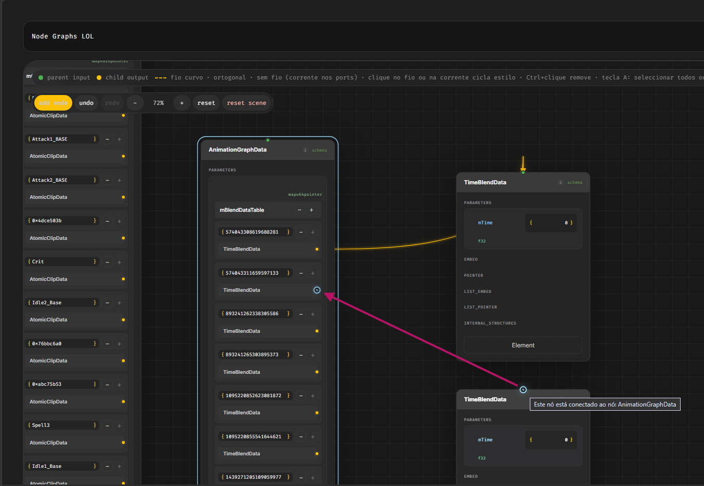
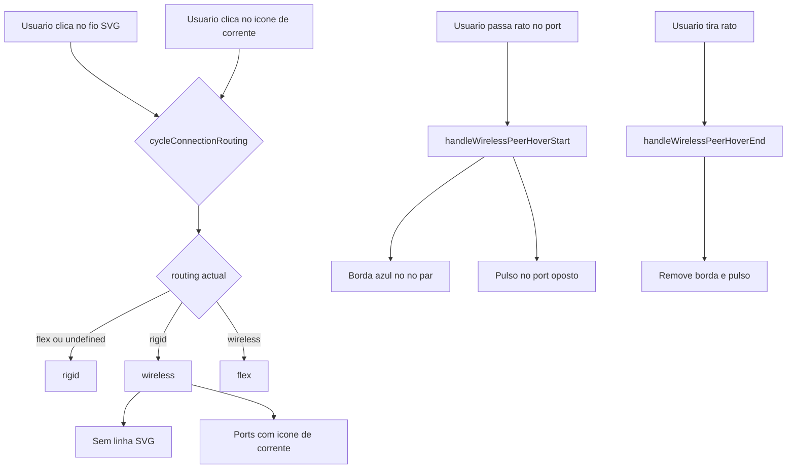
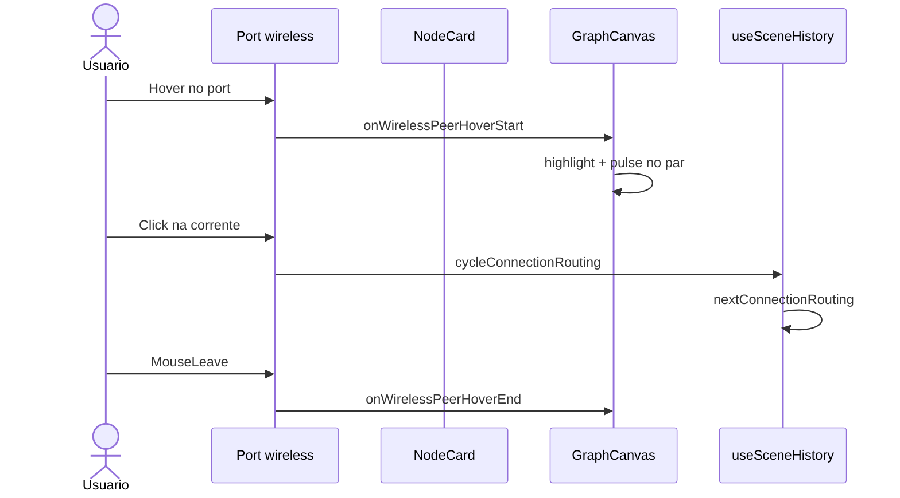

# Documentação de Implementação — Ligação sem fio (wireless)

Arquivo salvo em: `feature_md/feature/feature-wireless-connection.md`

## 1. Cabeçalho

| Campo | Valor |
| --- | --- |
| Nome da Branch | `feature/wireless-connection` |
| Nome das Features | Ligação sem fio (terceiro modo de roteamento); ícone de corrente nos ports; destaque e pulso do nó par no hover |
| Versão atual | `1.4.0` |
| Hash do Commit | `2662ffe` |

## 2. Definição e Resumo de Tags

| Tag | Definição |
| --- | --- |
| `[NOVO]` | Novo componente, arquivo, função ou tipo criado nesta branch. |
| `[ATUALIZADO]` | Componente ou fluxo existente alterado para suportar a feature. |
| `[REMOVIDO]` | Código ou comportamento removido ou descontinuado. |

Tags presentes nesta implementação:

- `[NOVO]`
- `[ATUALIZADO]`

## 3. Fluxograma de Funcionamento

## 4. Fluxograma de Acionamento de Funções

## 5. Tabela de Funções e Componentes

| Status | Nome | Feature | Descrição |
| --- | --- | --- | --- |
| `[NOVO]` | `connectionDisplay.ts` | Wireless | Índice e helpers de UI wireless |
| `[NOVO]` | `wireless` routing | Wireless | Terceiro modo sem linha SVG |
| `[ATUALIZADO]` | `Port`, `GraphCanvas`, `NodeCard` | Wireless | Ícone, hover, ciclo, pulso |

Documentação completa: [`feature_md/feature/feature-wireless-connection.md`](feature_md/feature/feature-wireless-connection.md)

## 6. Descrição Detalhada

Ver o ficheiro completo em `feature_md/feature/feature-wireless-connection.md`.
