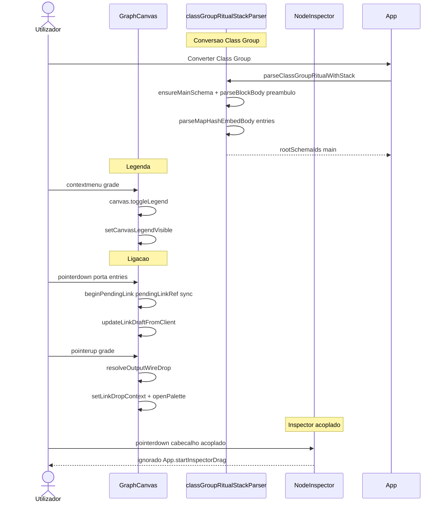

# Documentação de Implementação — Canvas, Inspector e Nó Main

Arquivo salvo em: `feature_md/feature/feature-canvas-inspector-main-ux.md`

## 1. Cabeçalho

| Campo | Valor |
| --- | --- |
| Nome da Branch | `feature/canvas-inspector-main-ux` |
| Nome das Features | Nó **Main** (Class Group); legenda do canvas; controlos da vista; inspector acoplado; rascunho de ligação; grade fixa |
| Versão atual | `1.5.0` |
| Hash do Commit | `b2c5b77` |

## 2. Definição e Resumo de Tags

| Tag | Definição |
| --- | --- |
| `[NOVO]` | Novo componente, arquivo, função ou tipo criado nesta branch. |
| `[ATUALIZADO]` | Componente ou fluxo existente alterado para suportar a feature. |
| `[REMOVIDO]` | Código ou comportamento removido ou descontinuado. |

Tags presentes nesta implementação:

- `[NOVO]`
- `[ATUALIZADO]`

## 3. Fluxograma de Funcionamento

```mermaid
flowchart TD
  subgraph classGroup [Conversor Class Group]
    BIN[estrutura_bin.py / entries map] --> SPLIT[findEntriesMapRegion]
    SPLIT --> MAIN[Schema Main type version linked]
    SPLIT --> MAP[parseMapHashEmbedBody entries]
    MAP --> CHILD[Schemas filhos SkinCharacterDataProperties]
    MAIN --> ROOT[rootSchemaIds apenas main]
  end

  subgraph canvas [Canvas]
    RMB[Botao direito na grade] --> MENU[CanvasContextMenu]
    MENU --> LEG[canvas.toggleLegend]
    LEG --> VIS[legendVisible true/false]
    PORT[Porta saida mapHashEmbed] --> DRAFT[pendingLinkRef + linha rascunho]
    DRAFT --> DROP[Soltar na grade ou no Main]
    DROP --> PAL[AddNodePalette Ligar novo no]
  end

  subgraph inspector [Inspector]
    DOCK[viewportDocked] --> NO_DRAG[sem pointer drag]
    FLOAT[desacoplado] --> ELL[title ellipsis + attr title]
  end

  subgraph layout [Layout canvas]
    BOUNDS[getCanvasBounds scene.width/height fixo]
    TOOLBAR[controls margin-left auto]
  end
```



## 4. Fluxograma de Acionamento de Funções



## 5. Tabela de Funções e Componentes

| Status | Nome | Feature | Descrição | Parâmetros / Retorno |
| --- | --- | --- | --- | --- |
| `[NOVO]` | `findEntriesMapRegion` | Main | Localiza linha e chavetas de `entries: map` | `src` → `{ headerLineStart, openBrace, closeBrace }` \| `null` |
| `[NOVO]` | `ensureMainSchema` | Main | Cria schema `main` / title `Main` | `ParseCtx` → `MutableClassGroupSchema` |
| `[ATUALIZADO]` | `parseClassGroupRitualWithStack` | Main | Preâmbulo + Main + `parseMapHashEmbedBody`; `rootSchemaIds` só `main` | `source` → `ClassGroupStackParseResult` |
| `[ATUALIZADO]` | `METADATA_LINE_REGEX` | Main | Só `type`/`version`; `linked` lista primitiva | — |
| `[ATUALIZADO]` | `buildCanvasItems` / `canvas.toggleLegend` | Legenda | Item «Mostrar/Ocultar legenda» no menu da grade | `canvasLegendVisible` no contexto |
| `[ATUALIZADO]` | `getCanvasBounds` | Grade fixa | Tamanho fixo `scene.width` × `scene.height`; não expande com nós altos | `scene` → `CanvasBounds` |
| `[ATUALIZADO]` | `.toolbar` / `.controls` CSS | Controlos à direita | `margin-left: auto` nos controlos da vista | — |
| `[ATUALIZADO]` | `beginPendingLink` / `updateLinkDraftFromClient` | Ligação | `pendingLinkRef` síncrono; `pointermove` global; paleta ao soltar no próprio nó | handlers pointer |
| `[ATUALIZADO]` | `resolveOutputWireDrop` | Ligação | Não bloqueia paleta quando `nodeWrap` é o nó de origem | `drag`, `clientX/Y` |
| `[ATUALIZADO]` | `startInspectorDrag` / `inspectorDragHandleProps` | Inspector | Drag desactivado com `inspectorViewportDocked` | eventos pointer |
| `[ATUALIZADO]` | `.header` / `.title` / `.chromeStripTitle` CSS | Inspector | Ellipsis no título flutuante; `title` attr = texto completo | — |
| `[ATUALIZADO]` | `panelDragHandleProps` | Inspector | Vazio quando `viewportDocked` (expandido ou minimizado) | props HTML |

## 6. Descrição Detalhada de Funcionamento

### Nó Main (Class Group)

Ficheiros ritual com `entries: map[hash,embed]` (ex.: `estrutura_bin.py`) deixam de ignorar o preâmbulo (`type`, `version`, `linked`). O conversor materializa o schema **Main** como única entidade em `rootSchemaIds`. O corpo do mapa passa por `parseMapHashEmbedBody`, que serializa referências às entidades filhas sem as promover a raiz do pack. A nomenclatura segue `main > entries:{chave} > Tipo`. Testes Vitest cobrem preâmbulo PROP e `rootSchemaIds`.

### Canvas — legenda e controlos

A legenda (parent input, child output, dicas de fios) fica **oculta por defeito**. O menu de contexto da grade inclui «Mostrar legenda» / «Ocultar legenda». Os **Canvas viewport controls** (zoom, undo, inspector na barra) alinham-se sempre à **direita** via `margin-left: auto`, com ou sem legenda visível.

### Canvas — grade e ligações

`getCanvasBounds` deixa de crescer com a altura dos nós; a grade mantém `scene.width` e `scene.height` do layout (ex.: 1120×760). Ao arrastar uma saída `mapHashEmbed` (ex.: entrada `SkinCharacterDataProperties` no nó Main), a linha de rascunho usa `pendingLinkRef` actualizado de imediato; ao soltar na grade ou sobre o próprio nó de origem, abre a paleta «Ligar novo nó» com tipos compatíveis.

### Inspector

Com o inspector **acoplado** à barra da vista (expandido ou **minimizado**), o arrastar o painel está desactivado — só o pin desacopla. No modo **flutuante**, o título do cabeçalho trunca com ellipsis e expõe `title` com o nome completo; o mesmo `title` aplica-se à faixa chrome quando acoplado.

### Tratamento de erros e limites

- Ritual sem `entries: map` mantém `parseStandaloneRoot` (sem Main).
- Entidades do mapa continuam alcançáveis na paleta por BFS a partir do parâmetro `mapHashEmbed` em Main.
- Arrasto de ligação com movimento &lt; 12px no porto abre menu de collection type (comportamento anterior preservado).

### Testes recomendados

```bash
npx vitest run src/core/classGroupRitualStackParser.test.ts src/core/convertRitobinTextToNodeStructures.test.ts
```

Reconversão de pack: `npx vite-node scripts/reconvert-class-pack.ts class` (a partir de `estrutura_bin.py`).
