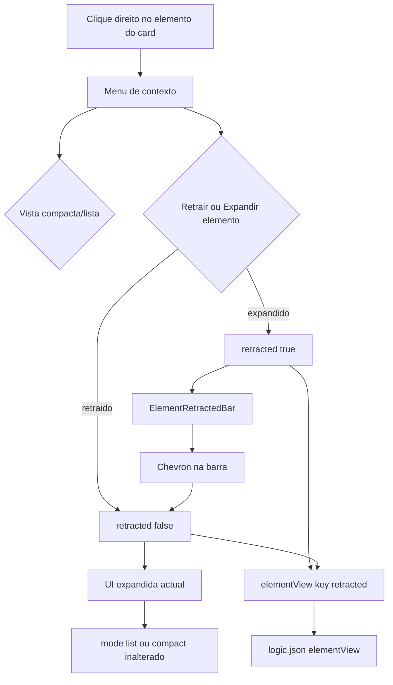
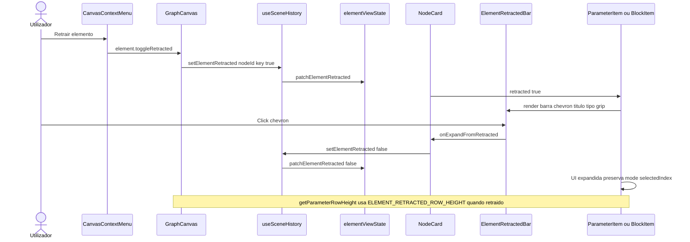

# Documentação de Implementação — Retrair / expandir elemento no card

Arquivo salvo em: `feature_md/feature/feature-retrair-elemento-card.md`

## 1. Cabeçalho

| Campo | Valor |
| --- | --- |
| Nome da Branch | `feature/retrair-elemento-card` |
| Nome das Features | **Retrair / expandir elemento no card** (barra compacta por elemento; menu de contexto; persistência em `elementView`) |
| Versão atual | `1.4.0` |
| Hash do Commit | `4db7e01` |

## 2. Definição e Resumo de Tags

| Tag | Definição |
| --- | --- |
| `[NOVO]` | Novo componente, arquivo, função ou tipo criado nesta branch. |
| `[ATUALIZADO]` | Componente ou fluxo existente alterado para suportar a feature. |
| `[REMOVIDO]` | Código ou comportamento removido ou descontinuado. |

Tags presentes nesta implementação:

- `[NOVO]`
- `[ATUALIZADO]`

Não houve itens classificados como `[REMOVIDO]` nesta branch.

## 3. Fluxograma de Funcionamento

## 4. Fluxograma de Acionamento de Funções

## 5. Tabela de Funções e Componentes

| Status | Nome | Feature Correspondente | Descrição Técnica | Parâmetros Recebidos / Retorno |
| --- | --- | --- | --- | --- |
| `[NOVO]` | `ElementRetractedBar.tsx` | Barra retraída | Chevron, título, `SyntaxType` ou `typeLabel`, grip opcional para reorder de parâmetros. | `title`, `parameterType?`, `typeLabel?`, `onExpand`, `reorderHandlers?` |
| `[NOVO]` | `ElementRetractedBar.module.css` | Estilos da barra | Layout horizontal alinhado ao design system do card. | Classes `.bar`, `.expandButton`, `.chevron`, `.reorderGrip` |
| `[NOVO]` | `patchElementRetracted` | Estado | Grava ou remove `retracted` em `elementView[key]` preservando `mode` e `selectedIndex`. | `(node, key, retracted)` → `NodeInstance` |
| `[NOVO]` | `isElementRetracted` | Consulta | `Boolean(getElementViewState(node, key).retracted)`. | `(node, key)` → `boolean` |
| `[NOVO]` | `setElementRetracted` | Histórico | Actualiza `CanvasNode.node` via `updateScene`. | `(canvasNodeId, elementKey, retracted)` |
| `[NOVO]` | `element.toggleRetracted` | Menu contexto | Item dinâmico «Retrair elemento» / «Expandir elemento». | `ContextMenuItemId` |
| `[NOVO]` | `elementViewKeyForContextElementTarget` | GraphCanvas | Resolve chave `param:` / `embed:` / `listEmbed:` etc. a partir do alvo do menu. | `CanvasContextTarget` → `ElementViewKey \| null` |
| `[NOVO]` | `ELEMENT_RETRACTED_ROW_HEIGHT` | Layout canvas | Altura fixa 44px para parâmetros e blocos retraídos. | Constante exportada |
| `[NOVO]` | Testes | Qualidade | `elementViewState.test`, `canvasContextMenuItems.test`, `workspacePersistence.test` para retracted. | Vitest |
| `[ATUALIZADO]` | `ElementViewState` / `nodeSchema.ts` | Modelo | Campo opcional `retracted?: boolean` independente de `mode`. | Tipo exportado |
| `[ATUALIZADO]` | `patchElementViewMode` | Estado | Preserva `retracted` ao alternar list/compact. | Idem compact feature |
| `[ATUALIZADO]` | `workspacePersistence.ts` | Persistência | `isElementViewState` valida `retracted` boolean. | logic JSON |
| `[ATUALIZADO]` | `canvasContextMenuItems.ts` | Menu | Entrada após vista compacta/lista com separador. | `buildElementItems` |
| `[ATUALIZADO]` | `GraphCanvas.tsx` | Canvas | Handler `element.toggleRetracted`; alturas de secção com bloco retraído. | Props `onSetElementRetracted` |
| `[ATUALIZADO]` | `NodeCard.tsx` | Card | `elementViewKey` em todos os parâmetros; `blockViewProps` com `retracted` e `onExpandFromRetracted`. | Handlers |
| `[ATUALIZADO]` | `ParameterItem.tsx` | Parâmetros | Ramo retraído com `ElementRetractedBar`; expandido inalterado. | Props `retracted`, `onExpandFromRetracted` |
| `[ATUALIZADO]` | `EmbedItem`, `PointerItem`, `ListEmbedItem`, `ListPointerItem`, `List2EmbedItem`, `List2PointerItem` | Blocos | Barra retraída no nível do bloco; oculta slots, toggle compact e botões +/−. | `StructureBlockViewProps` |
| `[ATUALIZADO]` | `structureBlockViewProps.ts` | Tipos | `retracted`, `onExpandFromRetracted`. | Tipos partilhados |
| `[ATUALIZADO]` | `App.tsx` | App | Propaga `setElementRetracted` ao `GraphCanvas`. | Callback |
| `[ATUALIZADO]` | `prompet_elements.md` | Docs elementos | Distinção entre retraído e vista compacta/lista. | Markdown |

## 6. Descrição Detalhada de Funcionamento

Esta branch adiciona um **terceiro modo de apresentação por elemento** no card do nó, independente da visualização **lista / compacta** já existente para mapas e blocos estruturados.

### Conceito

- **Expandido (default):** UI actual do parâmetro ou bloco (editor, slots, toggles, botões `−`/`+`).
- **Retraído:** barra horizontal compacta com chevron (expande ao clicar), título, tipo (`SyntaxType` em parâmetros; rótulo fixo em blocos) e grip de reordenar **apenas** em parâmetros com `parameterNameReorderHandlers`.
- **Vista compacta/lista** (`element.toggleCompact`): continua a alternar `mode: 'list' | 'compact'`; só faz sentido com o elemento **expandido**.

### Modelo de dados

`elementView?: Record<ElementViewKey, ElementViewState>` passa a aceitar `retracted?: boolean` por chave (`param:<id>`, `embed:<id>`, `listEmbed:<id>`, etc.). Ausência de `retracted` equivale a expandido. `patchElementRetracted` remove a chave ao expandir, mantendo `mode` e `selectedIndex`.

Persistência no **logic JSON** do workspace (`workspacePersistence`), com validação em `isElementViewState`.

### Escopo

- **Incluído:** todos os parâmetros; blocos EMBED, POINTER, LIST_EMBED, LIST_POINTER, LIST2_EMBED, LIST2_POINTER no nível do bloco.
- **Excluído:** slots de estruturas internas e `internalStructure` (sem `elementViewKey` no menu).

### Menu e acções

No menu de contexto do elemento (`buildElementItems`), após «Vista compacta» / «Vista em lista»:

1. Separador
2. «Retrair elemento» ou «Expandir elemento» (`element.toggleRetracted`)

`GraphCanvas.runContextMenuAction` resolve a chave com `elementViewKeyForContextElementTarget` e chama `onSetElementRetracted`.

### Layout do canvas

`getParameterRowHeight` e funções de altura de blocos (`getEmbedBlocksHeight`, etc.) devolvem `ELEMENT_RETRACTED_ROW_HEIGHT` (44px) quando `isElementRetracted` é verdadeiro, alinhando portas e altura do card.

### Regras de negócio

- Retrair um parâmetro `map*` não altera `mode`; ao expandir, o modo lista/compacto anterior permanece.
- Blocos retraídos não mostram `StructureViewToggle` nem slots até expandir.
- Chevron na barra e opção do menu são equivalentes para expandir.
- Sem handler `onSetElementRetracted`, a barra retraída não é oferecida (parâmetros sempre recebem chave e handler via `NodeCard`).

### Tratamento de erros

- Chave `elementView` inválida no JSON de workspace: entrada ignorada em `parseElementView` (bundle rejeitado se estado malformado).
- Alvo de menu sem `viewKey` (ex.: `internalStructure`): item «Retrair elemento» não é listado.
