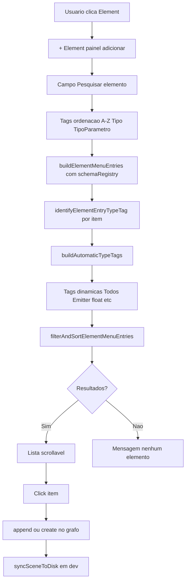
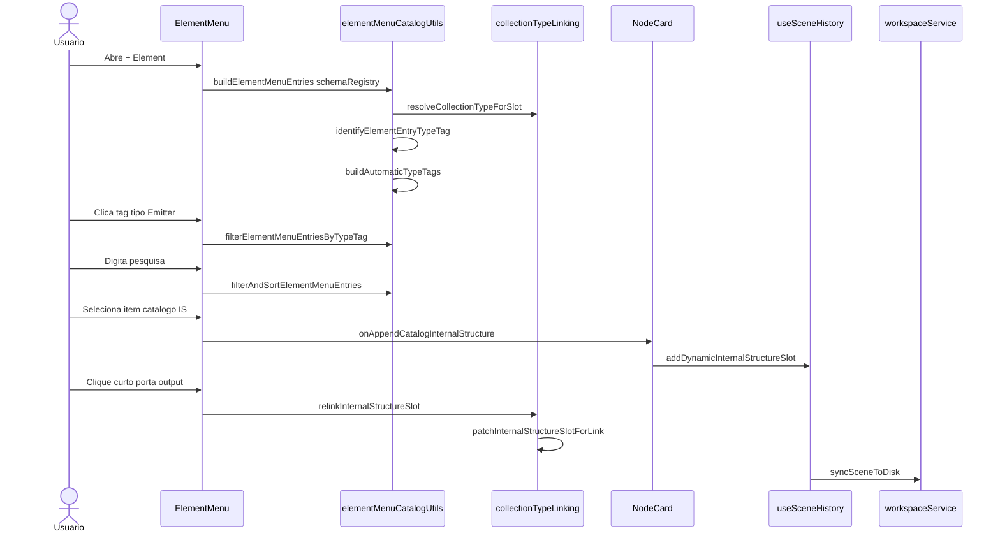

# Documentação de Implementação — Element Menu Search

Arquivo salvo em: `feature_md/feature-element-menu-search.md`

## 1. Cabeçalho

| Campo | Valor |
| --- | --- |
| Nome da Branch | `feature/element-menu-search` |
| Nome das Features | Element Menu Search, Tags Automáticas de Tipo, Dynamic Collection Type Linking (merge) |
| Versão atual | `1.4.0` |
| Hash do Commit | `8cacd5c44cf7ced687a4f694d6c673eb0d1a2e89` |

Histórico na branch: `f867510` (pesquisa + ordenação), `e6ea80f` (merge collection type linking + sync slot), `8cacd5c` (tags automáticas de tipo).

## 2. Definição e Resumo de Tags

| Tag | Definição |
| --- | --- |
| `[NOVO]` | Novo componente, arquivo, endpoint, função ou estrutura de dados criado nesta branch. |
| `[ATUALIZADO]` | Componente, função, schema ou fluxo existente alterado para suportar a feature. |
| `[REMOVIDO]` | Código, comportamento ou componente removido da aplicação. |

Tags presentes nesta implementação:

- `[NOVO]`
- `[ATUALIZADO]`

Não houve itens classificados como `[REMOVIDO]` nesta branch.

## 3. Fluxograma de Funcionamento

## 4. Fluxograma de Acionamento de Funções

## 5. Tabela de Funções e Componentes

| Status | Nome | Feature Correspondente | Descrição Técnica | Parâmetros Recebidos / Retorno |
| --- | --- | --- | --- | --- |
| `[NOVO]` | `elementMenuCatalogUtils.ts` | Element Menu Search | Entradas unificadas, pesquisa, ordenação e filtro por tipo. | Funções puras sobre catálogo do nó. |
| `[NOVO]` | `buildElementMenuEntries` | Element Menu Search | Agrega slots, IS de catálogo e parâmetros; resolve `typeTag` via registry. | `BuildElementMenuEntriesInput` → `ElementMenuEntry[]`. |
| `[NOVO]` | `identifyElementEntryTypeTag` | Tags automáticas de tipo | Identifica `collectionType`, `parameter.type` ou `Slot`. | `(kind, options)` → `string`. |
| `[NOVO]` | `buildAutomaticTypeTags` | Tags automáticas de tipo | Gera tags únicas; inclui «Todos» se houver mais de um tipo. | `entries` → `ElementMenuTypeTag[]`. |
| `[NOVO]` | `filterElementMenuEntriesByTypeTag` | Tags automáticas de tipo | Filtra lista pela tag activa. | `(entries, activeTypeTagId)` → lista. |
| `[NOVO]` | `filterAndSortElementMenuEntries` | Element Menu Search | Pesquisa + filtro por tipo + ordenação A-Z/Tipo/TipoParâmetro. | `(entries, query, org, typeTagId?)` → lista. |
| `[NOVO]` | `collectionTypeLinking.ts` | Merge — Collection Type Linking | Linking por `collectionType`; menu na porta de saída. | Utilitários + `CollectionTypeLinkMenu`. |
| `[NOVO]` | `patchInternalStructureSlotForLink` | Merge — Sync slot | Sincroniza `schemaId` e `name` do slot com o nó alvo. | `(slot, target)` → slot actualizado. |
| `[ATUALIZADO]` | `ElementMenu.tsx` | Element Menu Search | Pesquisa, tags de ordenação, tags automáticas de tipo, lista scrollável. | Props + `schemaRegistry` implícito. |
| `[ATUALIZADO]` | `ElementMenu.module.css` | Element Menu Search | Estilos `.searchInput`, `.tags`, `.typeTags`, `.results`. | Classes CSS. |
| `[ATUALIZADO]` | `useSceneHistory.ts` | Merge — Sync slot | `connectNodes`, `createChildNode`, `relinkInternalStructureSlot` usam `patchInternalStructureSlotForLink`. | Callbacks do hook. |
| `[ATUALIZADO]` | `GraphCanvas.tsx` | Merge — Collection Type Linking | Menu de relink por `collectionType` na porta de saída. | `onRelinkInternalStructure`. |

## 6. Descrição Detalhada de Funcionamento

[ATUALIZADO] O painel **+ Element** inclui pesquisa, três tags de **ordenação** (A-Z, Tipo, Tipo de Parâmetro) e uma segunda linha de **tags automáticas de tipo** geradas a partir do catálogo visível.

[NOVO] `identifyElementEntryTypeTag` classifica cada entrada: parâmetros usam `parameter.type`; slots preset usam `Slot` ou `collectionType` do registry; internal structures de catálogo usam `nomenclature.collectionType` via `resolveCollectionTypeForSlot`.

[NOVO] `buildAutomaticTypeTags` percorre as entradas, recolhe `typeTag` únicos e cria botões de filtro (ex.: «Todos», «Emitter», «float»). Com um único tipo, mostra só essa tag; com vários, prefixa «Todos».

[NOVO] `filterAndSortElementMenuEntries` aplica, por ordem: filtro por tag de tipo → pesquisa textual → ordenação seleccionada.

[ATUALIZADO] A branch integra `feature/element-menu` (ElementMenu com +/− Element) e, via merge, `feature/dynamic-collection-type-linking` (relink por `collectionType`, `CollectionTypeLinkMenu`, sincronização de `name`/`schemaId` no slot em `logic.json` e `graph.json`).

[ATUALIZADO] Ao fechar o menu ou voltar ao painel raiz, pesquisa, organização e tag de tipo activa repõem-se aos valores por defeito.

Tratamento de erros: lista vazia mostra «Nenhum elemento encontrado»; sem `collectionType` no registry, fallback para `schemaId`. Fluxo **- Element** / `ElementRemovalPicker` inalterado.
