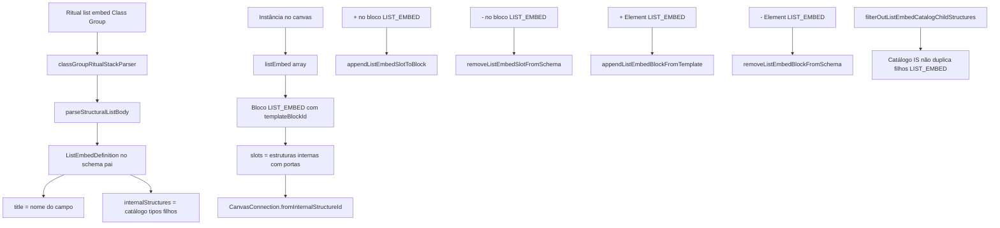
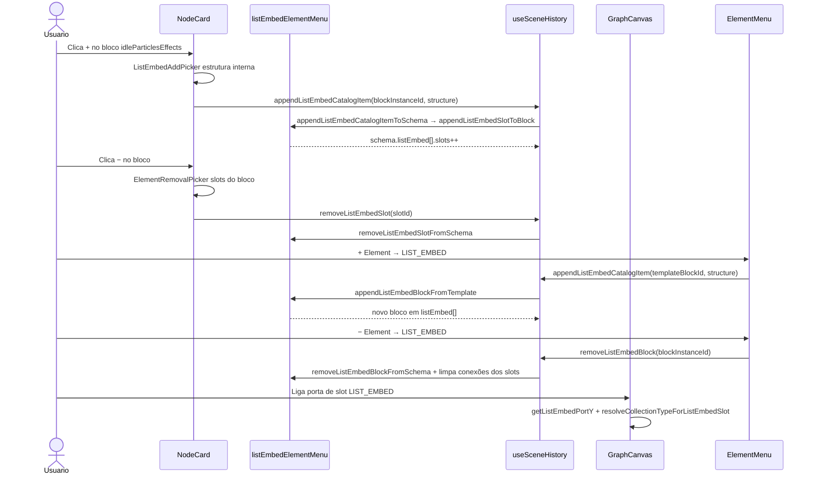

# Documentação de Implementação — LIST_EMBED (Class Group, UI e Menus Element)

Arquivo salvo em: `feature_md/feature/feature-list-embed-class-group.md`

## 1. Cabeçalho

| Campo | Valor |
| --- | --- |
| Nome da Branch | `feature/list-embed-class-group` |
| Nome das Features | LIST_EMBED no schema e conversor Class Group; secção LIST_EMBED no card; slots dinâmicos e ligações no canvas; menus Element (+/−) e pickers por bloco |
| Versão atual | `1.4.0` |
| Hash do Commit | `fde4cb52d0507f8f5c4956260fa842220251380c` |

Base: `feature/parameter-pickers-class-group` (`8a0f6cb`).

## 2. Definição e Resumo de Tags

| Tag | Definição |
| --- | --- |
| `[NOVO]` | Novo componente, arquivo, função ou tipo criado nesta branch. |
| `[ATUALIZADO]` | Componente ou fluxo existente alterado para suportar a feature. |
| `[REMOVIDO]` | Código ou comportamento removido ou descontinuado. |

Tags presentes nesta implementação:

- `[NOVO]`
- `[ATUALIZADO]`

## 3. Fluxograma de Funcionamento

## 4. Fluxograma de Acionamento de Funções

## 5. Tabela de Funções e Componentes

| Status | Nome | Feature | Descrição Técnica | Parâmetros / Retorno |
| --- | --- | --- | --- | --- |
| [NOVO] | `ListEmbedDefinition` / `listEmbed?` | Schema | Bloco entre `parameters` e `internalStructures`; `title`, catálogo e `slots` runtime. | `nodeSchema.ts` |
| [NOVO] | `listEmbedSlots.ts` | Core slots | Ids `blockId__slot__n`, slots populados, migração de conexões legadas, normalização de instâncias. | `listEmbedSlotId`, `populatedSlotsForListEmbed` |
| [NOVO] | `listEmbedElementMenu.ts` | Menus / histórico | Append slot no bloco, append bloco do template, remoção slot/bloco, catálogo Element. | `appendListEmbedCatalogItemToSchema`, `removeListEmbedSlotFromSchema` |
| [NOVO] | `ListEmbedItem.tsx` | UI card | Cabeçalho com título do campo; lista de estruturas internas com portas; +/- do bloco. | `listEmbed`, `slots`, handlers wire |
| [NOVO] | `ListEmbedAddPicker.tsx` | UI picker | Modal em dois passos (campo → tipo filho) ao adicionar estrutura interna no bloco. | `blocks`, `onConfirm` |
| [NOVO] | `extractNodeBaseParameters` (LIST_EMBED) | Node base | Stubs `{collectionType}_listEmbed_{campo}.json` e registo no pack. | `nodeBaseListEmbedId`, `buildNodeBaseListEmbedPayload` |
| [ATUALIZADO] | `classGroupRitualStackParser.ts` | Class Group | `list[embed]` deixa de ir para `internalStructures` do pai; cria `listEmbed[]` com `title` = campo. | `parseStructuralListBody` |
| [ATUALIZADO] | `nodeStructureRegistry.ts` | Registry | Merge stubs LIST_EMBED; `applyListEmbedSlotsToSchema` na hidratação. | `listEmbedDefinitionFromJsonStub` |
| [ATUALIZADO] | `NodeCard.tsx` | UI card | Secção LIST_EMBED renderiza blocos; pickers add/remove por instância. | `templateSchema` |
| [ATUALIZADO] | `GraphCanvas.tsx` | Canvas | Altura da secção, `getListEmbedPortY`, wires em slots; filtro catálogo IS. | `populatedSlotsForListEmbed` |
| [ATUALIZADO] | `useSceneHistory.ts` | Histórico | `appendListEmbedCatalogItem`, `removeListEmbedSlot`, `removeListEmbedBlock`. | `nodeId`, `targetId` |
| [ATUALIZADO] | `elementMenuScopeCatalog.ts` | Element + | Entradas LIST_EMBED; filtra filhos do catálogo das Internal_Structures. | `includeListEmbedCatalog` |
| [ATUALIZADO] | `elementMenuCatalogUtils.ts` | Element + | Label LIST_EMBED = nome do campo; meta com tipo filho. | `catalog-list-embed` |
| [ATUALIZADO] | `listNodeElements.ts` | Element − | Removíveis: blocos LIST_EMBED via `listEmbedBlock`; slots só no picker do bloco. | `listRemovableListEmbedBlocks` |
| [ATUALIZADO] | `ElementRemovalPicker.tsx` | UI | Etiquetas: `LIST_EMBED` vs `Estrutura interna` vs `Internal_Structure`. | `kindLabel` |
| [ATUALIZADO] | `collectionTypeLinking.ts` | Ligações | Resolve collection type e patch em slots LIST_EMBED. | `resolveCollectionTypeForListEmbedSlot` |
| [ATUALIZADO] | `ElementMenu.tsx` | Element + | Pick `append-list-embed-catalog` com `structureForListEmbedAdd`. | `onAppendListEmbedCatalogItem` |
| [ATUALIZADO] | `vite.plugin.nodeStructuresWrite.ts` | API dev | Escrita de stubs LIST_EMBED na extração de node base. | plugin Vite |
| [ATUALIZADO] | `InternalStructureItem.module.css` / `tokens.css` | UI | Largura máxima de rótulos; ellipsis em nomes longos. | `--node-structure-label-max-width` |
| [NOVO] | `papa_SkinCharacterDataProperties/*` | Exemplo pack | `idleParticlesEffects` LIST_EMBED + stub filho CharacterIdleEffect. | JSON nodeStructures |

## 6. Descrição Detalhada de Funcionamento

Esta branch introduz o modelo **LIST_EMBED** no editor de grafos de nós LoL, alinhado ao ritual `list[embed]` do conversor Class Group.

### Modelo de dados

Cada nó pode ter `listEmbed?: ListEmbedDefinition[]` entre parâmetros e internal structures top-level. Um bloco LIST_EMBED representa um campo estrutural repetível do ritual (ex.: `idleParticlesEffects`, `materialOverride`):

- **`title`**: nome do campo no ritual.
- **`internalStructures`**: catálogo de tipos filhos permitidos (vindo do template / stub JSON).
- **`slots`**: instâncias runtime com portas de saída no canvas (`{blockId}__slot__{index}`).
- **`templateBlockId`**: liga instâncias dinâmicas ao campo do schema template.

Itens do catálogo LIST_EMBED **não** são oferecidos como Internal_Structures do nó (`filterOutListEmbedCatalogChildStructures`).

### Conversor Class Group

`parseStructuralListBody` passa a emitir blocos `listEmbed` em vez de empurrar cada entrada da lista para `internalStructures` do pai. O `title` do bloco é o nome do campo; cada item do catálogo usa o **nome do tipo filho** (`SkinCharacterDataProperties_CharacterIdleEffect`), não o nome do campo repetido.

### UI no card

A secção **LIST_EMBED** lista uma ou mais instâncias do mesmo campo (vários cartões `idleParticlesEffects`). Cada cartão mostra:

1. Cabeçalho com título do campo e botões **+** / **−**.
2. Lista de **estruturas internas** (slots) com nome e porta de ligação.

**Regras dos botões no bloco:**

| Ação | Efeito |
| --- | --- |
| **+** | Abre `ListEmbedAddPicker` e adiciona **estrutura interna** (slot) ao bloco (`appendListEmbedSlotToBlock`). |
| **−** | Abre picker para remover **estrutura interna** escolhida (`removeListEmbedSlot`). Texto em destaque = nome da estrutura; etiqueta `Estrutura interna`. |

### Menus Element

| Tipo no menu | **+ Element** | **− Element** |
| --- | --- | --- |
| **LIST_EMBED** | Cria **nova instância** de bloco (`appendListEmbedBlockFromTemplate`). Label = nome do campo. | Remove **bloco inteiro** e ligações dos slots (`removeListEmbedBlock`). |
| **Internal_Structure** | Acrescenta IS top-level do nó. | Remove IS top-level. |
| **Parâmetro** | Acrescenta parâmetro do catálogo. | Remove parâmetro (exceto obrigatórios). |

### Canvas e ligações

`GraphCanvas` calcula altura e posição Y das portas por bloco e por slot. `collectionTypeLinking` resolve `collectionType` a partir do `schemaId` do slot e do catálogo do bloco. Conexões antigas que apontavam para ids de catálogo são migradas para o primeiro slot (`migrateSceneListEmbedConnections`).

### Extração Node Base

Ao extrair parâmetros de node base, campos `list[embed]` geram ficheiros `{collectionType}_listEmbed_{campo}.json` e o corpo do schema base inclui `listEmbed: []` na instância.

### Testes

188 testes Vitest, incluindo `listEmbedElementMenu.test.ts`, `listEmbedSlots.test.ts`, `classGroupRitualStackParser.test.ts`, `extractNodeBaseParameters.test.ts`, `elementMenuCatalogUtils.test.ts`.

### Reconversão

Após merge, reconverter packs Class Group afetados (ex.: `mike`, `papa`) para popular `listEmbed` nos JSONs de schema.
