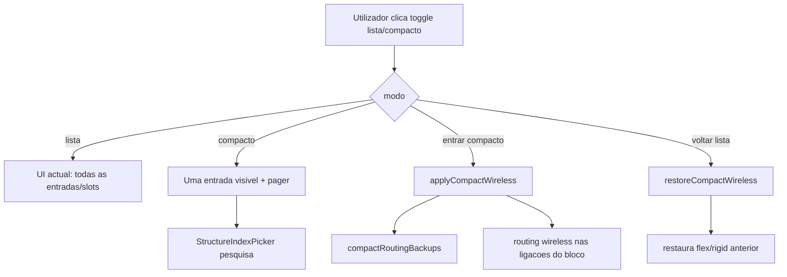
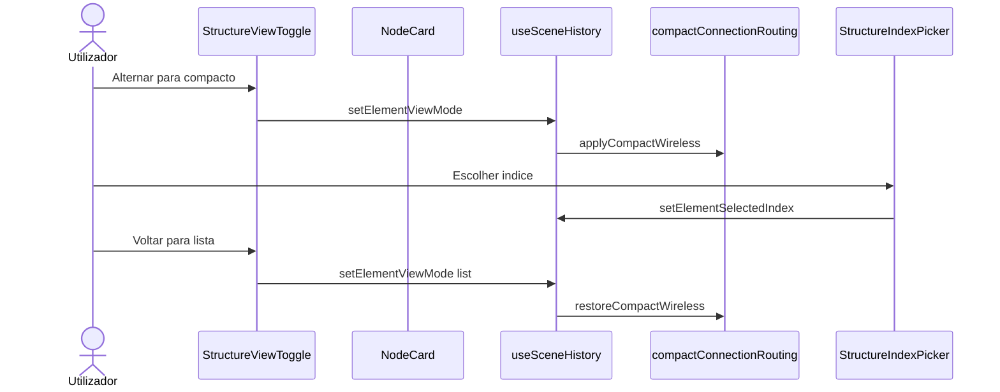

# Documentação de Implementação — Visualização compacta de estruturas internas

Arquivo salvo em: `feature_md/feature/feature-compact-structure-view.md`

## 1. Cabeçalho

| Campo | Valor |
| --- | --- |
| Nome da Branch | `feature/compact-structure-view` |
| Nome das Features | Modo compacto lista/compacto por bloco estrutural; paginação e picker de índice; wireless automático com restauração; isolamento de atalhos do canvas no picker |
| Versão atual | `1.4.0` |
| Hash do Commit | _ver commit desta branch_ |

## 2. Definição e Resumo de Tags

| Tag | Definição |
| --- | --- |
| `[NOVO]` | Novo componente, arquivo, função ou tipo criado nesta branch. |
| `[ATUALIZADO]` | Componente ou fluxo existente alterado para suportar a feature. |
| `[REMOVIDO]` | Código ou comportamento removido ou descontinuado. |

Tags presentes nesta implementação:

- `[NOVO]`
- `[ATUALIZADO]`

## 3. Fluxograma de Funcionamento

## 4. Fluxograma de Acionamento de Funções

## 5. Tabela de Funções e Componentes

| Status | Nome | Feature | Descrição |
| --- | --- | --- | --- |
| `[NOVO]` | `elementViewState.ts` | Compacto | Chaves, slots, patches de modo/índice |
| `[NOVO]` | `compactConnectionRouting.ts` | Compacto | Wireless automático com backup |
| `[NOVO]` | `StructureViewToggle`, `StructureIndexPager`, `StructureIndexPicker` | UI | Toggle, paginação, picker com pesquisa |
| `[NOVO]` | `canvasKeyboardGuard.ts` | UX | Bloqueia atalhos do canvas no modal |
| `[ATUALIZADO]` | `MapHashStructureBlock`, blocos EMBED/LIST_* | UI | Vista compacta integrada |
| `[ATUALIZADO]` | `NodeCard`, `GraphCanvas`, `useSceneHistory` | Orquestração | Estado, alturas, histórico |

Documentação completa: [`feature_md/feature/feature-compact-structure-view.md`](feature_md/feature/feature-compact-structure-view.md)

## 6. Descrição Detalhada

Ver o ficheiro completo em `feature_md/feature/feature-compact-structure-view.md`.
