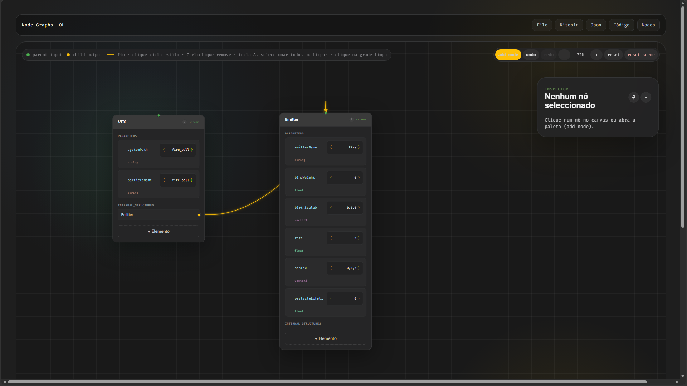
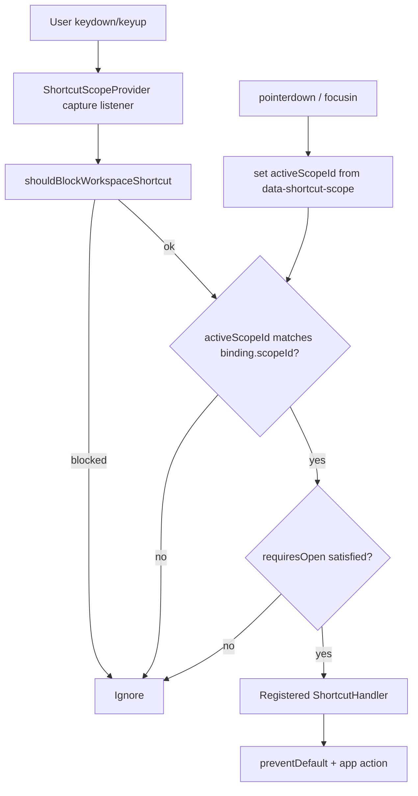
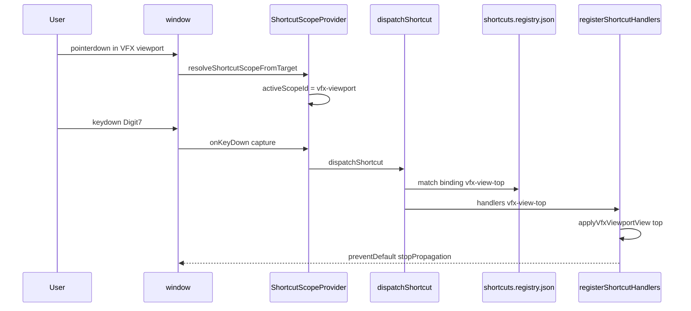

# League BIN Node Editor

**Version:** 1.5.0 · **Status:** Work in progress · **Branch:** `feature-vfx-character-gltf-engine`



## About the project

An interactive web editor for League of Legends `.bin` / **Class Group** ritual files. You can turn structured text (ritual) into a **visual node graph**, edit properties and links on a canvas, and export back to ritual text—similar in spirit to [Jade-League-Bin-Editor](https://github.com/RitoShark/Jade-League-Bin-Editor), which powers parsing and Jade integration in this app.

Built with **Vite** + **React** + **Monaco** (CodeDock).

---

## Quick start

### Prerequisites

- [Node.js](https://nodejs.org/) 18+
- [pnpm](https://pnpm.io/) (recommended; see `packageManager` in `package.json`)

### Install and run

```bash
git clone https://github.com/JunioCesar96/Node-Graphs-League-of-Legends.git
cd Node-Graphs-League-of-Legends
pnpm install
pnpm dev
```

Open the URL shown in the terminal (usually `http://localhost:5173`).

### Optional (development)

| Script | Purpose |
| --- | --- |
| `pnpm jade-bridge:dev` | Mock Jade bridge for opening `.bin` in dev |
| `pnpm jade:http-bridge` | HTTP bridge from Jade-League-Bin-Editor (Rust) |
| `pnpm jade:http-bridge:build` | Compile `jade-http-bridge` (release) for real `.bin` + hash resolution |
| `pnpm test` | Run Vitest unit tests |

---

## Step-by-step guide (index)

| # | Topic | Summary |
| --- | --- | --- |
| 1 | [Workspace layout](#1-first-look-at-the-workspace) | Canvas, Code dock, VFX dock, panels |
| 1b | [VFX 3D preview](#1b-vfx-3d-preview-web) | Rebuild, play, assets folder |
| 1c | [VFX ground decals](#1c-vfx-ground-decals--transform-debug) | `isGroundLayer`, debug transform |
| 1d | [VFX emitter classifications](#1d-vfx-emitter-classifications-semantic-debug) | Semantic traits in viewport |
| 2 | [Scenes](#2-scenes-work-files) | New / load / save JSON scenes |
| 3 | [Import ritual → graph](#3-import-ritual-text--node-graph) | Code To Node Graph |
| 4 | [Edit graph](#4-edit-the-graph) | Links, routing, context menu |
| 5 | [Export graph → ritual](#5-export-node-graph--ritual-text) | Node Graphs to Code |
| 6 | [Nodes Configure](#6-nodes--configure-schemas--packs) | Class Group pack folder |
| 7 | [Scene states](#7-scene-states-presets) | Named presets + camera |
| 8 | [Nodes in scene](#8-nodes-in-scene) | List panel, lock/hide |
| 9 | [Jade](#9-jade-integration) | Bridge, hash resolution |
| 10 | [Keyboard shortcuts](#implementation--shortcut-scope-system-branch-featureshortcut-scope-system) | Scope-based shortcuts (this branch) |

### 1. First look at the workspace

- **Center:** graph canvas (nodes, connections, pan/zoom).
- **Right:** CodeDock (Monaco editor) — toggle with the **Code** menu button.
- **Right (optional):** VFX Preview (Three.js viewport) — toggle with the **VFX** menu button.
- **Left / panels:** scene tabs, nodes list, inspector, scene states (depending on layout).

### 1b. VFX 3D preview (web)

| Step | Action |
| --- | --- |
| 1 | Open ritual with `VfxSystemDefinitionData` in CodeDock or select a VfxSystem node on the canvas |
| 2 | Menu **VFX** → 3D viewport dock |
| 3 | **Rebuild** → **Play** / timeline |
| 4 | Optional: **Pasta assets…** for local textures |

Doc: [`feature-vfx-world-fidelity.md`](feature_md/feature/feature-vfx-world-fidelity.md), [`feature-clip-compositor-vfx.md`](feature_md/feature/feature-clip-compositor-vfx.md).

### 1c. VFX ground decals & transform debug

Doc: [`feature-vfx-ground-quad-transform.md`](feature_md/feature/feature-vfx-ground-quad-transform.md).

### 1d. VFX emitter classifications (semantic debug)

Doc: [`feature-vfx-emitter-classifications.md`](feature_md/feature/feature-vfx-emitter-classifications.md).

### 2. Scenes (work files)

Menu **Graph**: **New work scene**, **Load recent scenes**, **Save work scene** (JSON on disk).

### 3. Import ritual text → node graph

CodeDock → **Converter [Class Group]** → **Code To Node Graph**. Doc: [`feature-code-to-node-graph.md`](feature_md/feature/feature-code-to-node-graph.md).

### 4. Edit the graph

Add nodes, drag output slots, flex/rigid/wireless routing, context menu. Doc: [`feature-canvas-context-menu.md`](feature_md/feature/feature-canvas-context-menu.md), [`feature-wireless-connection.md`](feature_md/feature/feature-wireless-connection.md).

### 5. Export node graph → ritual text

**Graph → Node Graphs to Code** (single Main root). Doc: [`feature-node-graphs-to-code.md`](feature_md/feature/feature-node-graphs-to-code.md).

### 6. Nodes → Configure (schemas & packs)

**Nodes → Configure**, Class Group folder, **Extrair Node Base**. Doc: [`feature-nodes-configurar-pack-default.md`](feature_md/feature/feature-nodes-configurar-pack-default.md).

### 7. Scene states (presets)

Named presets with camera pan/zoom. Doc: [`feature-cena-estados-routing-persistencia.md`](feature_md/feature/feature-cena-estados-routing-persistencia.md).

### 8. Nodes in scene

List panel: select, focus, hide, lock. Doc: [`feature-nodes-em-cena.md`](feature_md/feature/feature-nodes-em-cena.md).

### 9. Jade integration

`pnpm jade-bridge:dev` or Rust HTTP bridge. Doc: [`feature-jade-hashes-vfx-timeline-reset.md`](feature_md/feature/feature-jade-hashes-vfx-timeline-reset.md).

---

## Technical documentation index

Implementation notes (Mermaid, commits, API tables) in [`feature_md/feature/`](feature_md/feature/):

| Topic | Document |
| --- | --- |
| **Shortcut scope system (this branch)** | [feature-shortcut-scope-system.md](feature_md/feature/feature-shortcut-scope-system.md) · [full doc below](#implementation--shortcut-scope-system-branch-featureshortcut-scope-system) |
| Node Graphs to Code | [feature-node-graphs-to-code.md](feature_md/feature/feature-node-graphs-to-code.md) |
| Code To Node Graph | [feature-code-to-node-graph.md](feature_md/feature/feature-code-to-node-graph.md) |
| Scene tabs & Graph menu | [feature-abas-cena-json-menu-grafo.md](feature_md/feature/feature-abas-cena-json-menu-grafo.md) |
| Scene save / Graph menu | [feature-cena-persistencia-menu-grafo.md](feature_md/feature/feature-cena-persistencia-menu-grafo.md) |
| States, routing, persistence | [feature-cena-estados-routing-persistencia.md](feature_md/feature/feature-cena-estados-routing-persistencia.md) |
| Nodes Configure & default pack | [feature-nodes-configurar-pack-default.md](feature_md/feature/feature-nodes-configurar-pack-default.md) |
| Nodes in scene | [feature-nodes-em-cena.md](feature_md/feature/feature-nodes-em-cena.md) |
| Jade CodeDock menu | [feature-menu-jade-codedock.md](feature_md/feature/feature-menu-jade-codedock.md) |
| Jade auto bridge (dev) | [feature-jade-bridge-auto-dev.md](feature_md/feature/feature-jade-bridge-auto-dev.md) |
| Wireless links | [feature-wireless-connection.md](feature_md/feature/feature-wireless-connection.md) |
| Compact structures | [feature-compact-structure-view.md](feature_md/feature/feature-compact-structure-view.md) |
| Retract element | [feature-retrair-elemento-card.md](feature_md/feature/feature-retrair-elemento-card.md) |
| Canvas context menu | [feature-canvas-context-menu.md](feature_md/feature/feature-canvas-context-menu.md) |
| View / sync node code | [feature-node-ritual-sync-view-code.md](feature_md/feature/feature-node-ritual-sync-view-code.md) |
| VFX orbital velocity | [feature-vfx-orbital-velocity.md](feature_md/feature/feature-vfx-orbital-velocity.md) |
| VFX emitter classifications | [feature-vfx-emitter-classifications.md](feature_md/feature/feature-vfx-emitter-classifications.md) |
| VFX ground quad transform | [feature-vfx-ground-quad-transform.md](feature_md/feature/feature-vfx-ground-quad-transform.md) |
| VFX semantic / shader / compositor | [feature-vfx-semantic-classifier.md](feature_md/feature/feature-vfx-semantic-classifier.md), [feature-vfx-shader-execution.md](feature_md/feature/feature-vfx-shader-execution.md), [feature-clip-compositor-vfx.md](feature_md/feature/feature-clip-compositor-vfx.md) |
| VFX Color (`ValueColor` × texture) | [feature-vfx-color-system.md](feature_md/feature/feature-vfx-color-system.md) |
| **VFX Character GLTF + Engine VFX** | [feature-vfx-character-gltf-engine.md](feature_md/feature/feature-vfx-character-gltf-engine.md) |
| Class Group (embed, list, pointer, map hash) | [feature-main-class-group.md](feature_md/feature/feature-main-class-group.md), [feature-embed-class-group.md](feature_md/feature/feature-embed-class-group.md), [feature-list-embed-class-group.md](feature_md/feature/feature-list-embed-class-group.md), [feature-pointer-class-group.md](feature_md/feature/feature-pointer-class-group.md), [feature-list2-embed-pointer-class-group.md](feature_md/feature/feature-list2-embed-pointer-class-group.md), [feature-class-group-map-hash-u64-primitives.md](feature_md/feature/feature-class-group-map-hash-u64-primitives.md) |
| Neeko node | [feature-neeko-ditto-node.md](feature_md/feature/feature-neeko-ditto-node.md) |

---

## Implementation — Shortcut scope system (branch `feature/shortcut-scope-system`)

Full copy also in [`feature_md/feature/feature-shortcut-scope-system.md`](feature_md/feature/feature-shortcut-scope-system.md).

### 1. Header / Cabeçalho

| Field | Value |
| --- | --- |
| Branch name | `feature/shortcut-scope-system` |
| Feature name | Centralized keyboard shortcuts by UI scope (zone) |
| Version | `1.5.0` |
| Commit | `790e264` |

### 2. Tag definitions / Definição de tags

| Tag (EN) | Tag (PT) | Meaning |
| --- | --- | --- |
| `[NEW]` | `[NOVO]` | New module or binding |
| `[UPDATED]` | `[ATUALIZADO]` | Existing flow migrated to central dispatcher |
| `[REMOVED]` | `[REMOVIDO]` | Local `keydown` workspace listeners removed |

### 3. Operation flowchart



### 4. Function activation sequence



### 5. Functions and components (summary)

| Status | Name |
| --- | --- |
| `[NEW]` | `shortcuts.registry.json`, `shortcutDispatcher.ts`, `ShortcutScopeProvider.tsx`, `use*ShortcutHandlers.ts` |
| `[UPDATED]` | `App.tsx`, `GraphCanvas.tsx`, `CodeDock.tsx`, `VfxViewport.tsx`, `AddNodePalette.tsx`, `VfxViewportNavigation.tsx` |
| `[REMOVED]` | Scattered `window.addEventListener('keydown')` in App / GraphCanvas / CodeDock / palette / ritual drag |

See [`feature-shortcut-scope-system.md`](feature_md/feature/feature-shortcut-scope-system.md) for the full table with parameters.

### 6–7. Behavior & how to use

**EN:** Shortcuts run only in the UI zone that has focus (`graph-canvas`, `code-dock`, `vfx-viewport`, `node-palette`). Click the target area first — e.g. VFX **3D viewport** before `7`; Code dock before `Ctrl+Z`. Registry: `src/core/shortcuts/shortcuts.registry.json`; handlers: `src/shortcuts/`.

**PT:** Os atalhos só correm na zona em foco. Com o Monaco focado, `7` **não** muda a câmara VFX. Clicar no viewport 3D antes das teclas Blender (`7`/`3`/`1`/`5`).

| Goal / Objectivo | Action |
| --- | --- |
| VFX views / Vistas VFX | VFX dock open → click 3D viewport → `7` Top, `3` Right, `1` Front, `5` Persp/Ortho; Ctrl for opposite |
| Graph / Grafo | Click graph background → `Ctrl+K`, `A`, `G`, `.`, `Delete` |
| Code / Código | Focus Code dock → `Ctrl+Z/Y`, `Ctrl+F/H`, `Ctrl+O`, `Ctrl+P` |
| Palette / Paleta | `M` expand, `N` compact (hover row or Ctrl while searching) |
| New shortcut / Novo atalho | JSON entry + `registerShortcutHandlers` + `data-shortcut-scope` on DOM root |

**Main files:** `src/core/shortcuts/*`, `src/shortcuts/*`, `main.tsx`, `App.tsx`, `GraphCanvas.tsx`, `CodeDock.tsx`, `VfxViewport.tsx`, `AddNodePalette.tsx`.

---

## Implementation — VFX Color system (branch `feature/vfx-color-system`)

Full copy in [`feature_md/feature/feature-vfx-color-system.md`](feature_md/feature/feature-vfx-color-system.md).

### 1. Header / Cabeçalho

| Field | Value |
| --- | --- |
| Branch name | `feature/vfx-color-system` |
| Feature name | VFX Color — `ValueColor` `vec4` tint in shader + inspector |
| Version | `1.5.0` |
| Commit | `412a33f` |

### 2. Tags

| Tag (EN) | Tag (PT) | Meaning |
| --- | --- | --- |
| `[NEW]` | `[NOVO]` | `vfxColor.ts`, `VfxColorSwatchRow`, texture color sample helpers |
| `[UPDATED]` | `[ATUALIZADO]` | Shader tint, embed vec4 sampling, VFX inspector **Cor** section |

### 3–4. Flow (summary)

Ritual `Color` / `birthColor` → `resolveEmitterEmbedRgba` → `uTintRgba` → `applyValueColorTint` on GPU (linear multiply). Inspector shows **only** `Color`: swatch + **vec4** + **RGB**.

### 5–7. How to use / Como usar

| EN | PT |
| --- | --- |
| Same emitter: yellow texture × cyan `Color` → green in viewport | Mesmo emitter: textura amarela × `Color` ciano → verde no viewport |
| VFX dock → inspector **Color** → `vec4` + RGB at timeline `t` | Dock VFX → inspector **Cor** → `vec4` + RGB no tempo `t` |

**Main files:** `src/core/vfx/vfxColor.ts`, `vfxImageShader.ts`, `vfxEmbedSample.ts`, `VfxDockInspector.tsx`, `VfxTexturedEmitter.tsx`.

---

## Implementation — VFX Character GLTF Engine (branch `feature-vfx-character-gltf-engine`)

Full copy in [`feature_md/feature/feature-vfx-character-gltf-engine.md`](feature_md/feature/feature-vfx-character-gltf-engine.md).

### 1. Header / Cabeçalho

| Field | Value |
| --- | --- |
| Branch name | `feature-vfx-character-gltf-engine` |
| Feature name | Character GLTF (lol2gltf) · Engine VFX ReSize/Rotation · Panel UX |
| Version | `1.5.0` |
| Commit | `1b6bc63` |

### 2. Tags

| Tag (EN) | Tag (PT) | Meaning |
| --- | --- | --- |
| `[NEW]` | `[NOVO]` | lol2gltf runner, GLTF API, character scene/panel, Engine VFX |
| `[UPDATED]` | `[ATUALIZADO]` | VfxDock/Viewport, ground 11×11, FlexShape bound from GLTF |

### 3–4. Flow (summary)

Assets → convert só `.anm` em `{skin}/animations/` → `character-gltf/*.glb` → preview Geometria → instanciar → **Engine VFX** (ReSize = vfxScale, Rotation = 90° X) → `boundObjectSizeLol` para FlexShape.

### 5–7. How to use / Como usar

| EN | PT |
| --- | --- |
| Put `lol2gltf.exe` in `tools/lol2gltf/`, run `pnpm dev` | Coloque `lol2gltf.exe` em `tools/lol2gltf/`, execute `pnpm dev` |
| Character tool → assets path → pick champion → Use existing / Reconvert GLTF | Character → assets path → campeão → Usar existente / Reconverter |
| Render → Engine VFX: toggle ReSize & Rotation (no numeric fields) | Render → Engine VFX: checkboxes ReSize e Rotation |

**Main files:** `vite.plugin.characterGltf.ts`, `characterGltfConvert.ts`, `VfxCharacterGltfScene.tsx`, `useVfxCharacterScene.ts`, `characterEngineVfx.ts`, `VfxCharacterPanel.tsx`.

---

# Português — Guia rápido

## O que é

Editor visual de grafos para ritual Class Group / `.bin` do League of Legends: importar texto → editar na cena → exportar de novo.

```bash
pnpm install && pnpm dev
```

## Uso diário (resumo)

1. **Cenas:** menu Grafo — nova / recentes / salvar JSON.
2. **Importar:** CodeDock → Converter Class Group → Code To Node Graph.
3. **Editar:** arrastar slots de saída; clique curto alterna flex/rigid/wireless; botão direito para menu de contexto.
4. **Exportar:** um nó Main → Grafo → Node Graphs to Code.
5. **VFX:** menu VFX → Rebuild → Play; ver docs em [`feature_md/feature/`](feature_md/feature/).
6. **Personagem VFX:** ferramenta Character → lol2gltf → GLB; ver [feature-vfx-character-gltf-engine](feature_md/feature/feature-vfx-character-gltf-engine.md).
7. **Cor VFX:** inspector **Cor** mostra só `Color` (`vec4` + RGB); ver [feature-vfx-color-system](feature_md/feature/feature-vfx-color-system.md).
8. **Atalhos:** clique na zona correcta antes da tecla — ver [shortcut scope](#implementation--shortcut-scope-system-branch-featureshortcut-scope-system).

Documentação técnica completa: [`feature_md/feature/`](feature_md/feature/).

---

## Acknowledgements

Special thanks to **Bud**, creator of the Jade tool that powers the BIN conversion system used in this project.  
GitHub: https://github.com/budlibu500

Key contributions include:

* BIN code conversion
* BIN League syntax analysis
* Particle editing systems
* General-purpose editing tools

Their work and support were essential to the development and functionality of this project.

---

*League BIN Node Editor — community tool, not affiliated with Riot Games.*
