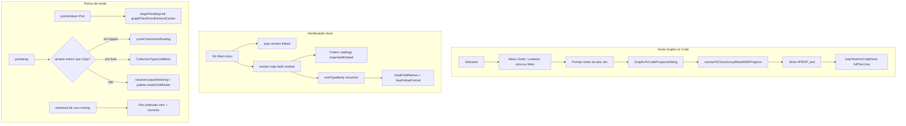
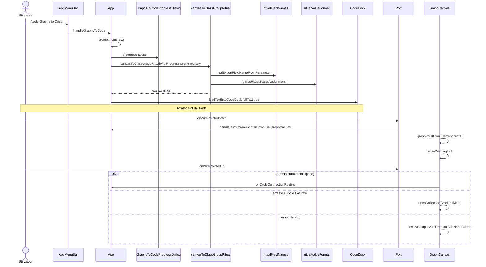

# Documentação de Implementação — Node Graphs to Code

Arquivo salvo em: `feature_md/feature/feature-node-graphs-to-code.md`

## 1. Cabeçalho

| Campo | Valor |
| --- | --- |
| Nome da Branch | `feature/node-graphs-to-code` |
| Nome das Features | **Node Graphs to Code** (exportação cena → ritual Class Group); **Correcções de export ritual** (PascalCase, ordem `entries`, texto completo no CodeDock); **Correcção de portos de saída** (arrasto + routing com ícone de ligação) |
| Versão atual | `1.0.0` |
| Hash do Commit | `2a47586` |

Complemento: inversa de [feature-code-to-node-graph.md](./feature_md/feature/feature-code-to-node-graph.md).

## 2. Definição e Resumo de Tags

| Tag | Definição |
| --- | --- |
| `[NOVO]` | Novo componente, arquivo, função ou tipo criado nesta branch. |
| `[ATUALIZADO]` | Componente ou fluxo existente alterado para suportar a feature. |
| `[REMOVIDO]` | Código ou comportamento removido ou descontinuado. |

Tags presentes nesta implementação:

- `[NOVO]`
- `[ATUALIZADO]`

## 3. Fluxograma de Funcionamento



## 4. Fluxograma de Acionamento de Funções



## 5. Tabela de Funções e Componentes

| Status | Nome | Feature Correspondente | Descrição Técnica | Parâmetros / Retorno |
| --- | --- | --- | --- | --- |
| `[NOVO]` | `canvasToClassGroupRitual` | Node Graphs to Code | Serializa nó Main e subárvore ligada para ritual `#PROP_text`. | `(scene, registry)` → `{ ok, text, warnings }` \| `{ ok: false, error }` |
| `[NOVO]` | `canvasToClassGroupRitualWithProgress` | Node Graphs to Code | Variante async com callback de progresso por lotes de nós. | `(scene, registry, onProgress)` → mesmo resultado |
| `[NOVO]` | `ritualFieldNames.ts` | Export ritual | PascalCase ritual (`ParticleName`); preserva prefixo `m` (`mResourceResolver`). | `ritualExportFieldNameFromParameter(parameter)` → `string` |
| `[NOVO]` | `ritualValueFormat.ts` | Export ritual | Formata escalares, listas, maps, vec/mtx para linhas ritual; cabeçalho Main em minúsculas via `fieldName` override. | `formatRitualScalarAssignment(parameter, raw, indent, options?)` → linha ritual |
| `[NOVO]` | `nodeDataTypeToRitType.ts` | Export ritual | Mapeia `NodeDataType` do editor para tipo ritual; `bool` e `flag` distintos. | `(type, fieldName?)` → tipo ritual |
| `[NOVO]` | `GraphsToCodeProgressDialog` | Node Graphs to Code | Modal com rótulo e barra de progresso durante export. | Props: `open`, `label`, `ratio` |
| `[ATUALIZADO]` | `App.tsx` | Node Graphs to Code | `handleGraphsToCode`; `loadTextIntoCodeDock(..., { fullText: true })` sem limite 500k. | — |
| `[ATUALIZADO]` | `AppMenuBar.tsx` | Node Graphs to Code | Item «Node Graphs to Code» no menu Grafo. | `onGraphsToCode` |
| `[ATUALIZADO]` | `GraphCanvas.tsx` | Export + portos | Handlers `graphsToCode`; `graphPointFromElementCenter` importado; `beginPendingLink` com âncora DOM. | — |
| `[ATUALIZADO]` | `canvasContextMenuItems.ts` | Node Graphs to Code | Itens `canvas.graphsToCode` e `node.graphsToCode`. | — |
| `[ATUALIZADO]` | `Port.tsx` | Portos de saída | Port unificado: `wireMode` + `wirelessLink` (corrente em flex/rigid/wireless); arrasto não bloqueado. | `wirelessLink.routing` distingue estilo `.linked` / `.wireless` |
| `[ATUALIZADO]` | `connectionDisplay.ts` | Portos de saída | `WirelessPortLink.routing`; `buildWirelessDisplayByNode` inclui routing por ligação. | `(connections, nodes)` → `Map` |
| `[ATUALIZADO]` | `NodeHeader.tsx` | Portos de entrada | `onInputPortClick` activo excepto quando `routing === 'wireless'`. | — |
| `[ATUALIZADO]` | `graphPortAnchors.ts` | Portos / SVG | Export de `graphPointFromElementCenter` para rascunho de fio. | `(canvasEl, scale, innerEl)` → `{ x, y }` |
| `[ATUALIZADO]` | `listVector3Value.ts` | Export ritual | Formato vec3 ritual `{ a, b, c }` sem espaços extra. | — |

## 6. Descrição Detalhada de Funcionamento

### Node Graphs to Code

A feature exporta a **cena visual activa** que contém exactamente **um** nó com `schema.id === 'main'` e todos os descendentes alcançáveis por ligações de saída. O motor `canvasToClassGroupRitual` percorre a árvore, emite o cabeçalho ritual (`#PROP_text`, `type`, `version`, `linked`, `entries`) e, para cada entrada de `mapHashEmbed`, o corpo do tipo filho com indentação de 4 espaços.

**Regras de serialização (alinhamento com `estrutura_bin.py`):**

- Cabeçalho Main: nomes `type`, `version`, `linked`, `entries` em **minúsculas**.
- Campos aninhados: **PascalCase** via `parameter.id` (`*_parameter_FieldName`).
- `bool` / `flag`: tipo ritual conforme schema, sem heurística `disable*` → `flag`.
- Ordem de `entries`: catálogo `mapHashEmbed` do Main (`buildOrderedEntryLinks`), não ordenação alfabética.
- Blocos embed/pointer/list: títulos em PascalCase (`ritualExportBlockTitle`).

O utilizador escolhe o nome da aba (ex. `Zac.bin`). O texto é carregado no CodeDock com **`fullText: true`**, evitando truncagem aos 500k caracteres que cortavam exportações grandes.

### Correcção dos portos de saída

`buildWirelessDisplayByNode` passou a expor ligações em **todas** as routings (flex, rigid, wireless) com ícone de corrente. A implementação anterior em `Port.tsx` substituía o botão de arrasto por um botão só de corrente, quebrando:

- clique curto para ciclar routing ou abrir menu de religar;
- arrasto para fio temporário, ligar a outro nó ou abrir paleta (`createChildNode`).

A correcção unifica um único `<button>` interactivo: handlers `onWirePointer*` quando `wireMode`; ícone de corrente quando há ligação; classe `.wireless` só se `routing === 'wireless'`; classe `.linked` para flex/rigid.

`graphPointFromElementCenter` foi **exportado** de `graphPortAnchors.ts` e importado em `GraphCanvas` para `beginPendingLink` calcular a âncora do fio a partir do centro do port DOM.

### Tratamento de erros

- Sem nó Main ou mais de um Main: export falha com mensagem clara.
- Avisos de serialização (slots sem catálogo, filhos em falta): agregados; até 30 mostrados em `alert` após sucesso.
- Cena sem aba activa / sem cena: `handleGraphsToCode` aborta com feedback.
- Nó travado: `handleOutputWirePointerDown` ignora início de ligação na origem.
- Importações em falta (`formatVector3String`, `graphPointFromElementCenter`): corrigidas com exports/imports explícitos.

### Testes

```bash
npx vitest run src/core/canvasToClassGroupRitual.test.ts src/core/ritualFieldNames.test.ts src/core/nodeDataTypeToRitType.test.ts src/core/connectionDisplay.test.ts
```

### Uso manual

1. Abrir cena com Main e filhos (ex. após **Code To Node Graph** com pack `default`).
2. **Grafo → Node Graphs to Code** (ou contexto da grade / nó Main).
3. Indicar nome da aba; aguardar progresso; rever ritual no CodeDock.
4. Validar opcionalmente com **Code To Node Graph** na mesma cena.
