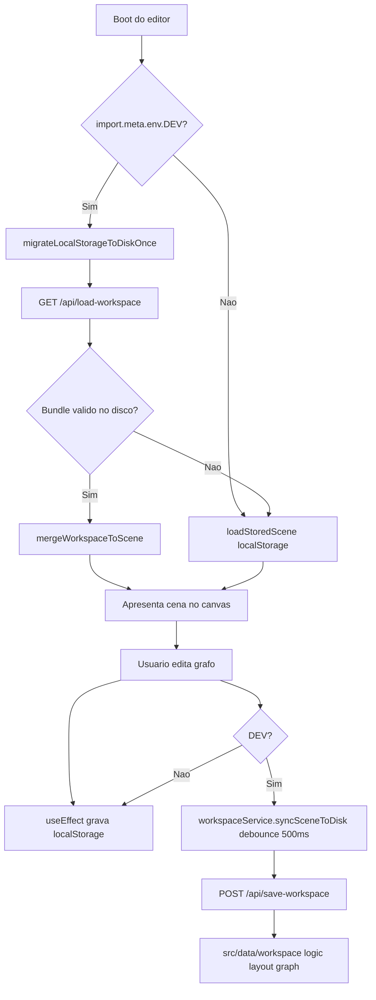
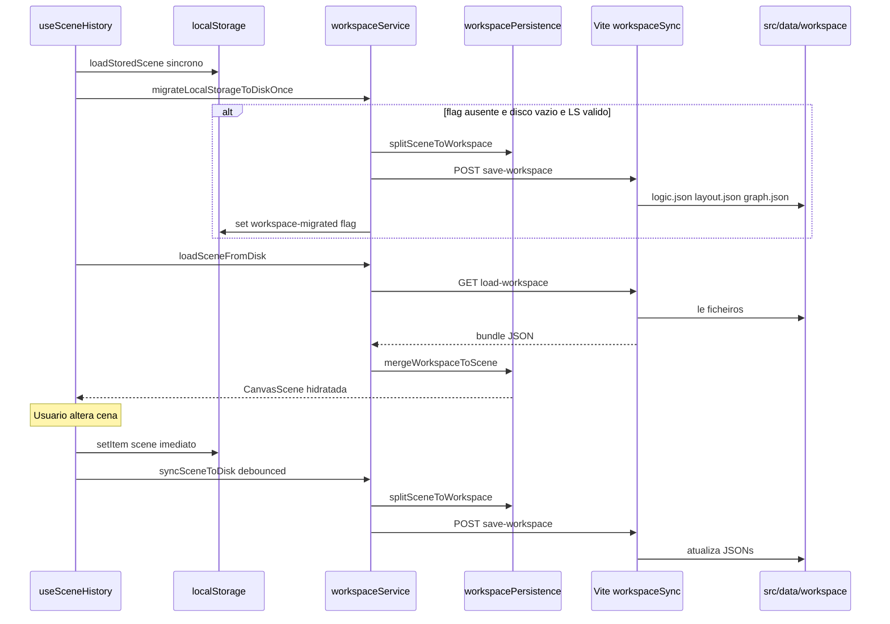

# Documentacao de Implementacao - feat-workspace-disk-persistence

Arquivo salvo em: `feature_md/feat-workspace-disk-persistence.md`

## 1. Cabecalho

| Campo | Valor |
| --- | --- |
| Nome da Branch | `feat/workspace-disk-persistence` |
| Nome das Features | Workspace Disk Persistence |
| Versao atual | `1.4.0` |
| Hash do Commit | `394598e085160d77fdf0a41d9b84bd6f61580200` |

## 2. Definicao e Resumo de Tags

| Tag | Definicao |
| --- | --- |
| `[NOVO]` | Novo componente, arquivo, endpoint, funcao ou estrutura de dados criado nesta branch. |
| `[ATUALIZADO]` | Componente, funcao, schema ou fluxo existente alterado para suportar a feature. |
| `[REMOVIDO]` | Codigo, comportamento ou componente removido da aplicacao. |

Tags presentes nesta implementacao:

- `[NOVO]`
- `[ATUALIZADO]`

Nao houve itens classificados como `[REMOVIDO]` nesta branch.

## 3. Fluxograma de Funcionamento

## 4. Fluxograma de Acionamento de Funcoes

## 5. Tabela de Funcoes e Componentes

| Status | Nome | Feature Correspondente | Descricao Tecnica | Parametros Recebidos / Retorno |
| --- | --- | --- | --- | --- |
| `[NOVO]` | `workspacePersistence.ts` | Workspace Disk Persistence | Separa e recompoe `CanvasScene` em `logic`, `layout` e `graph` com validacao de versao. | `splitSceneToWorkspace(scene)` retorna `WorkspaceBundle`; `mergeWorkspaceToScene(bundle)` retorna `CanvasScene \| null`. |
| `[NOVO]` | `sceneStorage.ts` | Workspace Disk Persistence | Centraliza chave e leitura de `localStorage` para evitar dependencia circular. | `loadStoredScene()` retorna `CanvasScene`; `isCanvasScene(value)` type guard. |
| `[NOVO]` | `workspaceService.ts` | Workspace Disk Persistence | Cliente com debounce 500ms, migracao one-shot e carga do disco em dev. | `syncSceneToDisk`, `loadSceneFromDisk`, `migrateLocalStorageToDiskOnce`; sem efeito fora de DEV. |
| `[NOVO]` | `vite.plugin.workspaceSync.ts` | Workspace Disk Persistence | Middleware Vite para GET load e POST save dos tres JSONs. | HTTP request; resposta 200, 404 ou 500. |
| `[NOVO]` | `/api/save-workspace` | Workspace Disk Persistence | Grava `logic.json`, `layout.json` e `graph.json` em `src/data/workspace/`. | Body `{ logic, layout, graph }`; retorna texto `Disk Sync OK`. |
| `[NOVO]` | `/api/load-workspace` | Workspace Disk Persistence | Le o bundle tripartido do disco em dev. | Sem body; retorna JSON do bundle ou 404. |
| `[NOVO]` | `src/data/workspace/*.json` | Workspace Disk Persistence | Seeds versionaveis da demo estatica para Git e codegen. | Ficheiros JSON no repositorio. |
| `[ATUALIZADO]` | `useSceneHistory.ts` | Workspace Disk Persistence | Dual sync localStorage + disco; boot async prioriza disco em dev; reset sincroniza demo. | Reexporta helpers de `sceneStorage`; novos `useEffect` para disco. |
| `[ATUALIZADO]` | `vite.config.ts` | Workspace Disk Persistence | Regista `vitePluginWorkspaceSync` junto ao plugin de node structures. | Config Vite; sem retorno. |

## 6. Descricao Detalhada de Funcionamento

[NOVO] A feature introduz persistencia tripartida do workspace do editor em ficheiros fisicos sob `src/data/workspace/`, separando logica (`logic.json`), layout (`layout.json`) e conexoes (`graph.json`). O modulo `workspacePersistence.ts` adapta o modelo real `CanvasScene` (nao LiteGraph) e mantem schemas embutidos por no para round-trip fiel e futuro codegen a partir de `logic.json`.

[NOVO] Em `npm run dev`, o plugin `vite.plugin.workspaceSync.ts` expoe `/api/save-workspace` e `/api/load-workspace`, seguindo o mesmo padrao do plugin de `nodeStructures`. O `workspaceService.ts` aplica debounce de 500ms nas escritas para proteger I/O durante arrastos rapidos de nos.

[ATUALIZADO] O hook `useSceneHistory.ts` mantem a sincronizacao imediata com `localStorage` (producao e dev) e acrescenta sync debounced para disco apenas em dev (dual sync conforme decisao de produto). No boot em dev, executa migracao one-shot de `localStorage` para disco quando o disco esta vazio e a flag `node-graphs-lol:workspace-migrated` ainda nao foi definida; depois carrega do disco se o bundle for valido, com prioridade disco > localStorage > demo estatica.

[NOVO] `sceneStorage.ts` extrai `SCENE_STORAGE_KEY`, `isCanvasScene` e `loadStoredScene` do hook para evitar dependencia circular entre hook e servico.

Tratamento de erros: falhas de rede ou HTTP no servico registam `console.error` em dev sem bloquear a UI; o editor continua funcional via `localStorage`. Respostas 404 no load indicam workspace ausente e o fluxo cai no storage do browser. O `resetScene` grava a demo estatica no disco em dev para alinhar ficheiros apos reset.

Nao houve [REMOVIDO] nesta branch.
