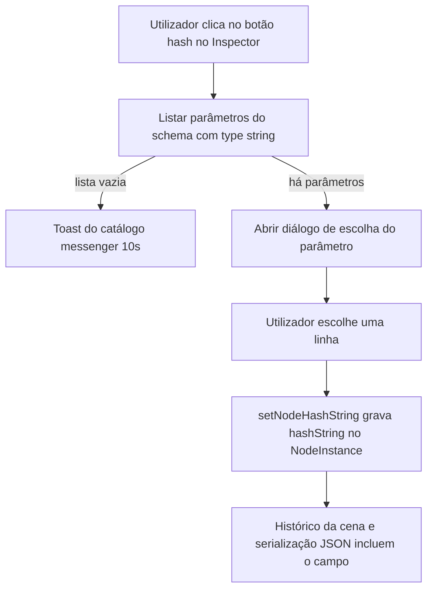
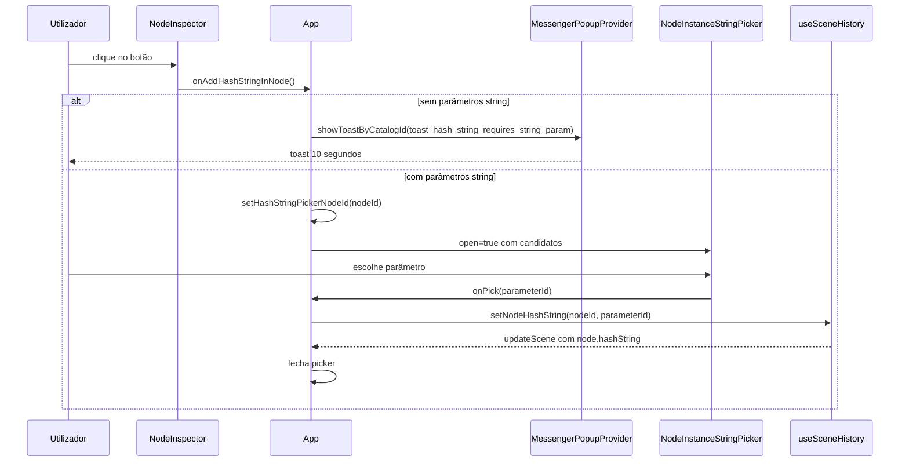

# Documentação de implementação — `feat/inspector-hash-string`

Arquivo salvo em: `feature_md/feat/inspector-hash-string.md`

## 1. Cabeçalho

| Campo | Valor |
| --- | --- |
| Nome da Branch | `feat/inspector-hash-string` |
| Nome das Features | hashString no Inspector |
| Versão atual | `1.4.0` |
| Hash do Commit | `d5a4f32908975c1bf2f950c1ab8f0f78b98d010a` |

## 2. Definição e resumo de tags

| Tag | Definição |
| --- | --- |
| `[NOVO]` | Novo componente, ficheiro, função ou estrutura de dados criado nesta branch. |
| `[ATUALIZADO]` | Componente, função, schema ou fluxo existente alterado para suportar a feature. |
| `[REMOVIDO]` | Código, comportamento ou componente removido da aplicação. |

Tags presentes nesta implementação:

- `[NOVO]`
- `[ATUALIZADO]`

Não houve itens classificados como `[REMOVIDO]` nesta branch.

## 3. Fluxograma de funcionamento

## 4. Fluxograma de acionamento de funções (sequência)

## 5. Tabela de funções e componentes

| Status | Nome | Feature correspondente | Descrição técnica | Parâmetros / retorno |
| --- | --- | --- | --- | --- |
| `[NOVO]` | `hashString` em `NodeInstance` | hashString | Campo opcional na instância: id do parâmetro `string` escolhido. | Persistido no JSON da cena e no export de instância. |
| `[NOVO]` | `toast_hash_string_requires_string_param` | hashString | Entrada no `messenger_popup_catalog.json` com `durationMs: 10000`. | Mensagem fixa do requisito. |
| `[NOVO]` | `MESSENGER_TOAST_HASH_STRING_REQUIRES_STRING_PARAM` | hashString | Constante de id no `messengerCatalog.ts`. | — |
| `[NOVO]` | `resolveHashStringFromPayload` | hashString | Valida `hashString` ao importar cena: só aceita id existente e `type === 'string'`. | `(schema, raw) => string \| undefined` |
| `[NOVO]` | `setNodeHashString` | hashString | Atualiza a cena com validação do parâmetro. | `(nodeId, parameterId) => void` |
| `[NOVO]` | `InspectorHashStringButton` | hashString | Botão `#` com estados muted/active no Inspector. | Props `active`, `onClick`. |
| `[NOVO]` | `addHashStringInNode` | hashString | Fluxo principal em `App.tsx`: toast ou abertura do picker. | `() => void` |
| `[NOVO]` | `hashStringPickerNodeId` / `hashStringPickerCandidates` | hashString | Estado e memo para o diálogo independente da selecção durante o pick. | — |
| `[ATUALIZADO]` | `serializeScene` / `parseSceneDocument` | hashString | Round-trip do campo `hashString` em `leagueBinScene.ts`. | — |
| `[ATUALIZADO]` | `hydrateScene` | hashString | Reidrata `hashString` só se válido face ao schema clonado. | — |
| `[ATUALIZADO]` | `buildNodeInstanceJsonDocument` | hashString | Inclui `hashString` no documento exportado quando aplicável. | — |
| `[ATUALIZADO]` | `NodeInspector` | hashString | Nova prop opcional `onAddHashStringInNode`; título com fila `#` + título. | — |
| `[ATUALIZADO]` | `NodeInstanceStringPicker` | hashString | Props opcionais `dialogTitle`, `dialogSubtitle`, `ariaTitleId` para reutilização. | — |
| `[ATUALIZADO]` | `pathHierarchy.ts` | Build | Import relativo `./nodeSchema` para `tsc -b` resolver correctamente. | — |

## 6. Descrição detalhada de funcionamento

A feature **hashString** liga o editor ao requisito de poder assinalar, por instância de nó, qual parâmetro do tipo `string` do schema serve de base para uma hash lógica (`hashString` guarda o **id** desse parâmetro, alinhado a `required_parameter` e `parameter_value_links`).

O **Inspector** mostra um botão `#` à esquerda do título do nó nas vistas expandidas (painel lateral e faixa acoplada à viewport). O botão aparece esbatido quando não há vínculo válido e ganha destaque quando já existe `hashString` referenciando um parâmetro `string` ainda presente no schema. O estado minimizado do Inspector não mostra este botão, para não comprimir a faixa minimizada.

Ao clicar, `addHashStringInNode` corre no `App.tsx`. Se não existir nenhum parâmetro `string` no schema do nó seleccionado, chama-se `showToastByCatalogId` com a mensagem exacta pedida no spec, com fecho automático aos **10 segundos**, via infraestrutura existente de messenger (toast). Caso existam parâmetros `string`, fecha-se o picker de Node Instance se estiver aberto, abre-se o `NodeInstanceStringPicker` com textos específicos para hashString, e ao confirmar chama-se `setNodeHashString` no `useSceneHistory`, que valida o tipo antes de gravar.

A **persistência** segue o mesmo padrão dos outros campos opcionais da instância: `StoredCanvasNodePayload` em `leagueBinScene.ts`, cópia segura em `hydrateScene` (descarta valores inválidos após clonar o schema), e inclusão no JSON gerado por `buildNodeInstanceJsonDocument` para ficheiros de instância. O parse da cena ignora `hashString` inválidos em vez de falhar o documento inteiro.

**Excepções e robustez:** parâmetros removidos ou alterados de tipo podem tornar `hashString` obsoleta; nesse caso deixa de ser serializada e é omitida na hidratação até o utilizador voltar a definir um vínculo válido.

**Teste:** `leagueBinScene.test.ts` cobre round-trip com `hashString` num nó da demo (`emitter-01`, parâmetro `shape`).
