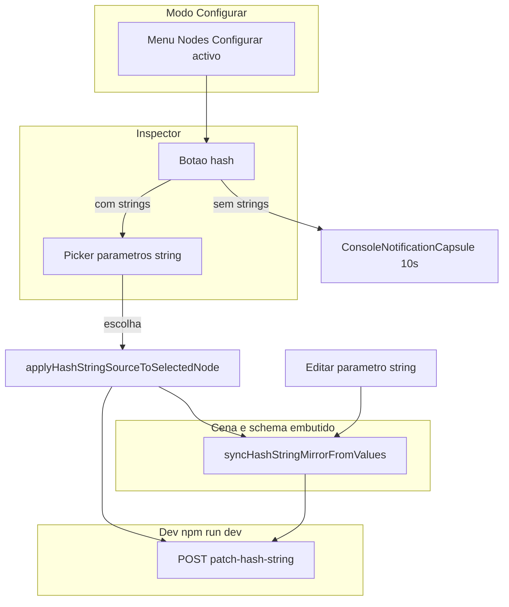
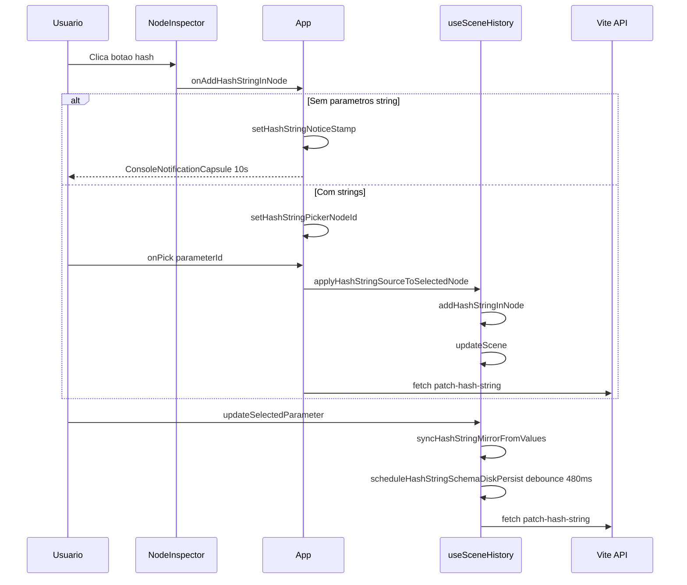

# Documentação de Implementação — hashString (Inspector)

Arquivo salvo em: `feature_md/feat/inspector-hash-string.md`

## 1. Cabeçalho

| Campo | Valor |
| --- | --- |
| Nome da Branch | `feature/inspector-hash-string` |
| Nome das Features | hashString (Inspector, modo Configurar) |
| Versão atual | `1.4.0` |
| Hash do Commit | `16a4edeb7566ac2669f0aafb5891141d122f9980` |

## 2. Definição e Resumo de Tags

| Tag | Definição |
| --- | --- |
| `[NOVO]` | Novo componente, arquivo, endpoint, função ou estrutura de dados criado nesta branch. |
| `[ATUALIZADO]` | Componente, função, schema ou fluxo existente alterado para suportar a feature. |
| `[REMOVIDO]` | Código, comportamento ou componente removido da aplicação. |

Tags presentes nesta implementação:

- `[NOVO]`
- `[ATUALIZADO]`

Não houve itens classificados como `[REMOVIDO]` nesta branch.

## 3. Fluxograma de Funcionamento

## 4. Fluxograma de Acionamento de Funções (sequência)

## 5. Tabela de Funções e Componentes

| Status | Nome | Feature | Descrição técnica | Parâmetros / Retorno |
| --- | --- | --- | --- | --- |
| `[NOVO]` | `hashString.ts` | hashString | `addHashStringInNode`, `syncHashStringMirrorFromValues`, `parameterMatchesHashStringSource`, `hydrateInstanceHashStringFields`, `resolveHashStringCanvasParameterId`. | Recebe `NodeInstance` e catálogo; devolve instância actualizada ou booleano de match. |
| `[NOVO]` | `POST /api/node-structures-patch-hash-string` | hashString | Endpoint Vite dev que grava `hashString` e `hashStringParameterId` no JSON do schema; valida id em parâmetros inline + stubs e tipo `string`. | Body JSON `relativePath`, `hashStringParameterId`, `hashString`; resposta `{ ok, ... }`. |
| `[ATUALIZADO]` | `NodeInspector.tsx` / `.module.css` | hashString | Botão `#` à esquerda do título (painel, chrome strip, minimizado); destaque do parâmetro fonte na lista. | Props `onAddHashStringInNode?`; callback sem argumentos. |
| `[ATUALIZADO]` | `NodeInstanceStringPicker.tsx` | hashString | Props opcionais `dialogTitle`, `dialogSubtitle`, `titleDomId` para reutilizar o diálogo no fluxo hashString. | Mesmas props de instância + opcionais. |
| `[ATUALIZADO]` | `App.tsx` | hashString | `addHashStringInNode`, pickers mutuamente exclusivos, notificação 10s, `saveHashStringFromPicker` com fetch ao endpoint. | Estado local e callbacks. |
| `[ATUALIZADO]` | `useSceneHistory.ts` | hashString | `applyHashStringSourceToSelectedNode`; `updateSelectedParameter` e `updateNodeParameter` chamam `syncHashStringMirrorFromValues`; debounce de persistência em disco. | Export do novo callback. |
| `[ATUALIZADO]` | `nodeSchema.ts` | hashString | Campos opcionais `hashString`, `hashStringParameterId` em `NodeSchemaDefinition` e `NodeInstance`. | Tipos apenas. |
| `[ATUALIZADO]` | `nodeStructureRegistry.ts` | hashString | `mergeHashStringFromStructureJson`; inclusão de stubs para id de hash; `hydrateInstanceHashStringFields` ao criar instância. | Merge no build do registry. |
| `[ATUALIZADO]` | `canvasScene.ts` / `leagueBinScene.ts` | hashString | Hidratação e serialização do grafo com os novos campos no `NodeInstance`. | Round-trip localStorage / export. |
| `[ATUALIZADO]` | `convertToNodeInstance.ts` | hashString | `NodeInstanceJsonDocument` inclui `hashString` / `hashStringParameterId` quando existirem. | Documento JSON de instância. |
| `[ATUALIZADO]` | `vite.plugin.nodeStructuresWrite.ts` | hashString | Registo do novo endpoint no middleware do servidor de desenvolvimento. | Plugin Vite. |
| `[ATUALIZADO]` | `pathHierarchy.ts` | Build | Import relativo `./nodeSchema` para resolução consistente no `tsc -b`. | Import apenas. |

## 6. Descrição Detalhada de Funcionamento

A feature **hashString** liga um valor espelhado (`hashString`) a um parâmetro do tipo `string` identificado por `hashStringParameterId`. O id persistido segue a mesma convenção de **lista** que `required_parameter` (incluindo stubs na pasta do pack), o que mantém o JSON em `src/nodeStructures` alinhado ao disco.

No **Inspector**, com o modo **Configurar** activo (`AppMenuBar` → Nodes → Configurar), o utilizador vê o botão `#` à esquerda do título do nó. O botão aparece esbatido até hover ou até existir vínculo activo; o parâmetro fonte ganha realce na lista de parâmetros (`parameterMatchesHashStringSource`).

Se não existir nenhum parâmetro `string`, dispara-se a **`ConsoleNotificationCapsule`** com a mensagem definida no PRD e duração de **10 segundos**. Caso contrário, abre-se o **`NodeInstanceStringPicker`** reutilizado com título/subtítulo específicos para a hashString.

Ao escolher o parâmetro, **`applyHashStringSourceToSelectedNode`** aplica **`addHashStringInNode`** na cena (histórico undo/redo) e, em desenvolvimento com caminho JSON resolvido, **`App.tsx`** envia um PATCH imediato ao endpoint. Quando o valor do parâmetro fonte muda (incluindo vínculos de valor entre parâmetros), **`syncHashStringMirrorFromValues`** mantém `hashString` coerente na instância e no `schema` embutido; a gravação no disco é **debounced** (~480 ms) por nó/schema em **`useSceneHistory`** para evitar escritas excessivas.

**Excepções:** gravação em disco só em `import.meta.env.DEV` com servidor Vite; falhas de rede são registadas em `console.warn` sem bloquear a UI. Campos inválidos no JSON de pack são ignorados no merge com aviso (`mergeHashStringFromStructureJson`).
