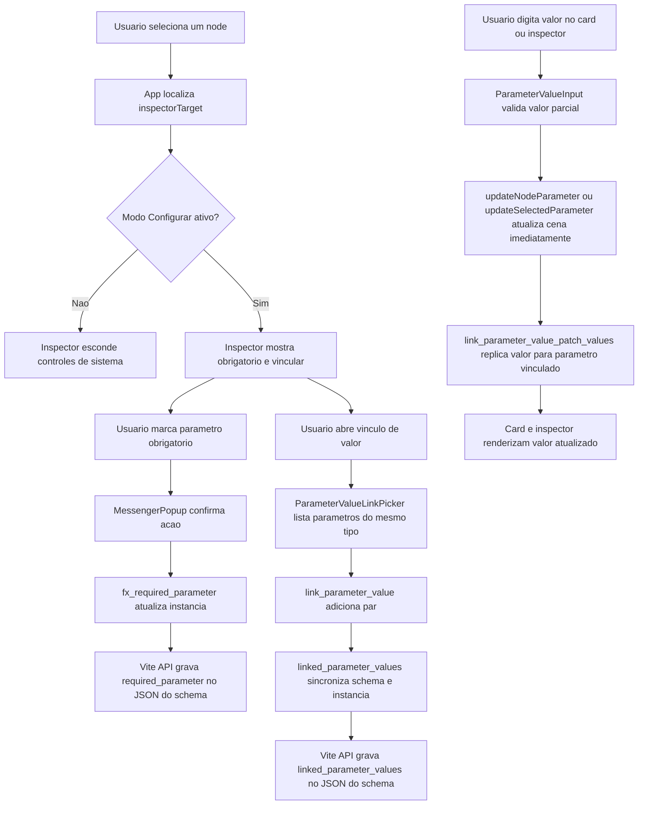
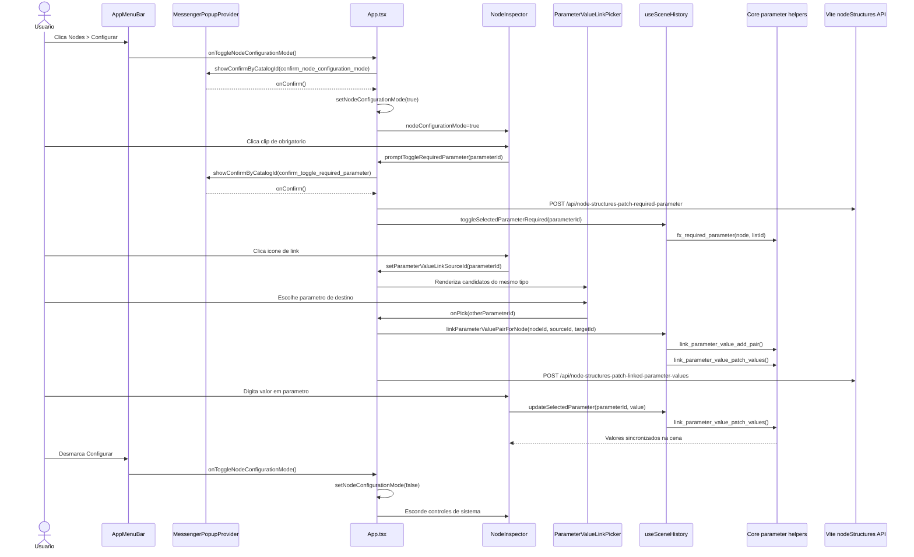

# Documentacao de Implementacao - feat/parametros-v0.0.2-obrigatorios

Arquivo salvo em: `feature_md/feat/parametros-v0.0.2-obrigatorios.md`

## 1. Cabecalho

| Campo | Valor |
| --- | --- |
| Nome da Branch | `feat/parametros-v0.0.2-obrigatorios` |
| Nome das Features | Parametros obrigatorios, valores vinculados, modo de configuracao de nodes e edicao dinamica |
| Versao atual | `1.4.0` |
| Hash do Commit | `507bfdbe85fd9bd1ae2626d5ca60721e84f34c6e` |

## 2. Definicao e Resumo de Tags

| Tag | Definicao |
| --- | --- |
| `[NOVO]` | Novo componente, arquivo, endpoint, funcao ou estrutura de dados criado nesta branch. |
| `[ATUALIZADO]` | Componente, funcao, schema ou fluxo existente alterado para suportar a feature. |
| `[REMOVIDO]` | Codigo, comportamento ou componente removido da aplicacao. |

Tags presentes nesta implementacao:

- `[NOVO]`
- `[ATUALIZADO]`

Nao houve itens classificados como `[REMOVIDO]` nesta branch.

## 3. Fluxograma de Funcionamento

## 4. Fluxograma de Acionamento de Funcoes

## 5. Tabela de Funcoes e Componentes

| Status | Nome | Feature Correspondente | Descricao Tecnica | Parametros Recebidos / Retorno |
| --- | --- | --- | --- | --- |
| `[NOVO]` | `fx_required_parameter.ts` | Parametro obrigatorio | Centraliza a alternancia de `required_parameter` e resolve ids de stubs/dinamicos. | Recebe `NodeInstance`, `parameterId` e catalogo opcional; retorna `NodeInstance` atualizado ou ids canonicos. |
| `[NOVO]` | `link_parameter_value.ts` | Valores vinculados | Mantem pares normalizados de parametros e aplica atualizacao espelhada de valores. | Recebe instancia/lista de valores, ids de parametros e valor; retorna pares ou lista de valores atualizada. |
| `[NOVO]` | `linked_parameter_values.ts` | Persistencia de vinculos no schema | Traduz pares canvas <-> disco, resolve ids de stubs e aplica `linked_parameter_values` na instancia. | Recebe `NodeInstance`, pares e catalogo; retorna `NodeInstance`, pares normalizados ou ids para salvar. |
| `[NOVO]` | `ParameterValueLinkPicker` | Valores vinculados | Dialogo para listar apenas parametros do mesmo tipo, exceto o parametro origem, com opcao de desvincular. | Recebe `sourceParameter`, `candidates`, `linkedPartner`, callbacks `onPick`, `onUnlink`, `onClose`; retorna JSX via portal. |
| `[NOVO]` | `MessengerPopupProvider` | Confirmacoes do sistema | Provider global para confirmacoes e toasts por catalogo, usado em parametro obrigatorio e modo configurar. | Recebe `children`; expõe `showConfirmByCatalogId` e `showToastByCatalogId` via contexto. |
| `[NOVO]` | `confirm_node_configuration_mode` | Modo de configuracao de nodes | Entrada de catalogo com duracao de 10 segundos para confirmar ativacao do modo configurar. | Id de catalogo sem parametros; retorna confirmacao ou cancelamento. |
| `[NOVO]` | `/api/node-structures-patch-linked-parameter-values` | Persistencia de vinculos no JSON | Endpoint Vite dev que atualiza `linked_parameter_values` no JSON do node, validando parametros inline e stubs irmaos. | Recebe `{ relativePath, unlink, parameterIdA, parameterIdB }`; retorna `{ ok, linked_parameter_values }`. |
| `[NOVO]` | `linked_parameter_values` | Persistencia de vinculos no JSON | Nova estrutura salva no JSON do schema para carregar vinculos ao criar ou selecionar nodes. | Array de pares `[parameterIdA, parameterIdB]`; sem retorno, e consumido pelo registry/hydrate. |
| `[ATUALIZADO]` | `NodeSchemaDefinition` e `NodeInstance` | Parametro obrigatorio e vinculos | Adiciona `required_parameter` no schema e `parameter_value_links`/`linked_parameter_values` para persistencia e runtime. | Tipos opcionais de arrays de ids e pares; sem retorno. |
| `[ATUALIZADO]` | `nodeStructureRegistry.ts` | Carregamento de schema | Faz merge de `required_parameter` e `linked_parameter_values` vindos do JSON, incluindo stubs na mesma pasta. | Recebe JSON bruto e catalogos; retorna `NodeSchemaDefinition` enriquecido. |
| `[ATUALIZADO]` | `createNodeInstanceFromRegistry` | Novo node com configuracoes carregadas | Injeta stubs necessarios, copia obrigatorios e aplica vinculos ao criar instancia. | Recebe registry, `schemaId`, `instanceId`; retorna `NodeInstance | null`. |
| `[ATUALIZADO]` | `nodeStructureJson.ts` | Parse de JSON de node | Passa a validar `required_parameter` e `linked_parameter_values` no carregamento do schema. | Recebe JSON bruto; retorna `NodeSchemaDefinition | null`. |
| `[ATUALIZADO]` | `canvasScene.ts` | Hydrate de cena | Reaplica configuracoes embutidas ao carregar cena do storage/importacao. | Recebe `CanvasScene`; retorna `CanvasScene` hidratada. |
| `[ATUALIZADO]` | `leagueBinScene.ts` | Export/import de grafo | Serializa e interpreta `required_parameter` e `parameter_value_links` no documento do grafo. | Recebe/retorna `LeagueBinGraphDocumentV1` e `CanvasScene`. |
| `[ATUALIZADO]` | `useSceneHistory.ts` | Estado e historico do grafo | Atualiza parametros dinamicamente, sincroniza pares vinculados, remove links ao apagar parametro e reaplica config ao selecionar node. | Recebe ids de node/parametro/valor; retorna funcoes do hook e cena atualizada. |
| `[ATUALIZADO]` | `NodeInspector.tsx` | Controles de configuracao | Mostra/esconde clip obrigatorio e link conforme `nodeConfigurationMode`; abre picker e edita valores dinamicamente. | Recebe `nodeConfigurationMode`, callbacks de update/link/required; retorna painel do inspector. |
| `[ATUALIZADO]` | `AppMenuBar.tsx` | Modo de configuracao de nodes | Adiciona opcao amarela `Configurar` com checkbox visual no menu `Nodes`. | Recebe `nodeConfigurationMode` e `onToggleNodeConfigurationMode`; retorna barra de menu. |
| `[ATUALIZADO]` | `App.tsx` | Orquestracao da feature | Coordena modo configurar, popup, persistencia via API, picker e callbacks do inspector/canvas. | Usa estados React e callbacks; retorna layout principal da aplicacao. |
| `[ATUALIZADO]` | `ParameterValueInput.tsx` | Edicao dinamica | Envia alteracoes durante `onChange`/composicao, mantendo validacao de valor parcial. | Recebe `value`, `type`, `onCommit`; chama callback em tempo real. |
| `[ATUALIZADO]` | `AppMenuBar.module.css` e `NodeInspector.module.css` | Interface visual | Adiciona estilo do item `Configurar`, checkbox visual, botao de link e estados ligado/desligado. | Classes CSS; sem parametros ou retorno. |
| `[ATUALIZADO]` | `vite.plugin.nodeStructuresWrite.ts` | Persistencia em dev | Acrescenta endpoints para patch de `required_parameter` e `linked_parameter_values` no disco. | Recebe payloads JSON HTTP; retorna sucesso/erro padronizado. |

## 6. Descricao Detalhada de Funcionamento

A implementacao adiciona uma camada de configuracoes tecnicas para nodes, separando o uso comum do editor das operacoes de sistema. [ATUALIZADO] O `AppMenuBar` recebeu a opcao `Configurar` no menu `Nodes`; essa opcao aciona [NOVO] uma confirmacao do `MessengerPopupProvider` com timeout de 10 segundos. Somente apos confirmar, `App.tsx` ativa `nodeConfigurationMode`, que [ATUALIZADO] passa ao `NodeInspector`. Com o modo desligado, os controles de sistema ficam ocultos; com o modo ligado, aparecem o botao de parametro obrigatorio e o botao de vincular valor.

Para parametros obrigatorios, [NOVO] `fx_required_parameter.ts` concentra a regra de alternancia e resolucao de ids. A UI chama `promptToggleRequiredParameter`, que confirma a acao, grava em dev pelo endpoint `/api/node-structures-patch-required-parameter` e atualiza a instancia selecionada pelo hook `useSceneHistory`. A persistencia usa o campo `required_parameter` no JSON do schema e considera tanto parametros inline quanto stubs JSON na mesma pasta, evitando erros quando o parametro vem do catalogo base.

Para vinculos de valor, [NOVO] `link_parameter_value.ts` cria e remove pares normalizados e [NOVO] `linked_parameter_values.ts` traduz ids entre canvas e disco. A UI [NOVO] `ParameterValueLinkPicker` lista apenas parametros do mesmo tipo e exclui o parametro clicado. Ao escolher um destino, `linkParameterValuePairForNode` registra o par, copia o valor do parametro origem para o parceiro e passa a manter ambos sincronizados. A persistencia em disco usa [NOVO] `linked_parameter_values`, enquanto o runtime da instancia usa `parameter_value_links`. Essa separacao permite salvar ids canonicos de stubs no JSON e usar ids dinamicos no canvas quando necessario.

[ATUALIZADO] O carregamento de nodes foi reforcado em `nodeStructureRegistry.ts`, `nodeStructureJson.ts` e `canvasScene.ts`. Ao criar um novo node, o registry injeta stubs ausentes exigidos por `required_parameter` ou `linked_parameter_values`, copia a configuracao para a instancia e sincroniza os valores iniciais. Ao selecionar um card de node, `useSceneHistory` compara o schema canonico com a instancia atual e reaplica a configuracao de vinculos quando necessario, garantindo que nodes carregados do JSON exibam seus parametros linkados corretamente.

[ATUALIZADO] A edicao de valores agora e dinamica. `ParameterValueInput` continua validando valores parciais por tipo, mas chama o callback de update no momento da digitacao, tanto no card quanto no inspector. Como `updateNodeParameter` e `updateSelectedParameter` usam `link_parameter_value_patch_values`, qualquer alteracao em um parametro linkado atualiza imediatamente o parceiro. O tratamento de erro preserva a rejeicao visual existente para entradas invalidas e evita gravar valores que nao passam pela validacao parcial.

Nao houve [REMOVIDO] nesta branch. As principais salvaguardas sao: validacao de ids antes de gravar no JSON, rejeicao de pares com o mesmo parametro, limpeza de vinculos ao remover parametro, uso de confirmacao para configuracoes sensiveis e manutencao de listas vazias (`[]`) para representar configuracao explicitamente limpa no schema.
