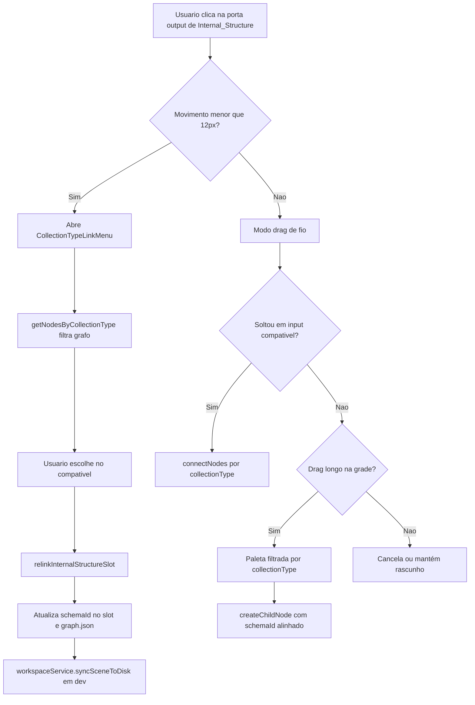
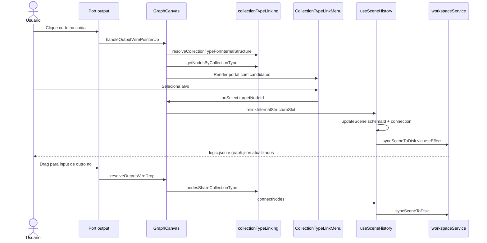

# Documentação de Implementação — Dynamic Collection Type Linking

Arquivo salvo em: `feature_md/feature-dynamic-collection-type-linking.md`

## 1. Cabeçalho

| Campo | Valor |
| --- | --- |
| Nome da Branch | `feature/dynamic-collection-type-linking` |
| Nome das Features | Dynamic Collection Type Linking |
| Versão atual | `1.4.0` |
| Hash do Commit | `e550e9fe2748f64031dff70986c4333af5f29302` |

## 2. Definição e Resumo de Tags

| Tag | Definição |
| --- | --- |
| `[NOVO]` | Novo componente, arquivo, endpoint, função ou estrutura de dados criado nesta branch. |
| `[ATUALIZADO]` | Componente, função, schema ou fluxo existente alterado para suportar a feature. |
| `[REMOVIDO]` | Código, comportamento ou componente removido da aplicação. |

Tags presentes nesta implementação:

- `[NOVO]`
- `[ATUALIZADO]`

Não houve itens classificados como `[REMOVIDO]` nesta branch.

## 3. Fluxograma de Funcionamento

## 4. Fluxograma de Acionamento de Funções

## 5. Tabela de Funções e Componentes

| Status | Nome | Feature Correspondente | Descrição Técnica | Parâmetros Recebidos / Retorno |
| --- | --- | --- | --- | --- |
| `[NOVO]` | `collectionTypeLinking.ts` | Dynamic Collection Type Linking | Utilitários para resolver `collectionType`, filtrar nós do grafo e validar compatibilidade entre slot e alvo. | Funções puras sobre `CanvasNode[]` e `schemaRegistry`; retornam tipos ou listas filtradas. |
| `[NOVO]` | `getNodesByCollectionType` | Dynamic Collection Type Linking | Varre nós activos e devolve instâncias cujo `nomenclature.collectionType` coincide. | `(nodes, collectionType, options?)` → `CanvasNode[]`. |
| `[NOVO]` | `nodesShareCollectionType` | Dynamic Collection Type Linking | Compara tipo semântico; faz fallback para `schema.id` quando nomenclatura falta. | `(sourceSchemaId, targetNode, registry)` → `boolean`. |
| `[NOVO]` | `CollectionTypeLinkMenu` | Dynamic Collection Type Linking | Menu flutuante na porta de saída com ligação actual e lista «Compatible [Type] Nodes». | Props de âncora, nós compatíveis, callbacks `onSelect` / `onClose`. |
| `[NOVO]` | `relinkInternalStructureSlot` | Dynamic Collection Type Linking | Actualiza `internalStructures[].schemaId` e substitui a conexão do slot no grafo. | `(fromNodeId, structureId, targetNodeId)` → `void`. |
| `[ATUALIZADO]` | `GraphCanvas.tsx` | Dynamic Collection Type Linking | Clique curto abre menu; drag, highlight e paleta usam `collectionType` em vez de só `schema.id`. | Novas props `onRelinkInternalStructure`; estado `collectionTypeLinkMenu`. |
| `[ATUALIZADO]` | `useSceneHistory.ts` | Dynamic Collection Type Linking | Expõe `relinkInternalStructureSlot`; `createChildNode` alinha `schemaId` do slot ao filho criado. | Callbacks no retorno do hook. |
| `[ATUALIZADO]` | `App.tsx` | Dynamic Collection Type Linking | Liga `relinkInternalStructureSlot` ao `GraphCanvas`. | Prop `onRelinkInternalStructure`. |

## 6. Descrição Detalhada de Funcionamento

[NOVO] A feature introduz linking contextual por `nomenclature.collectionType`. Antes, uma `internalStructure` só aceitava alvos cujo `node.schema.id` era igual ao `schemaId` do slot — bloqueando, por exemplo, ligar um slot genérico `Emitter` a instâncias importadas `vfx-em-*` que partilham o mesmo tipo semântico.

[NOVO] O módulo `collectionTypeLinking.ts` centraliza a regra: `getNodesByCollectionType` percorre `scene.nodes`; `resolveCollectionTypeForInternalStructure` obtém o tipo a partir do registry do `schemaId` do slot ou, em fallback, do nó já ligado; `nodesShareCollectionType` mantém compatibilidade com schemas legados sem nomenclatura (comparação estrita por `id`).

[NOVO] `CollectionTypeLinkMenu` abre em portal fixo ao clicar na porta de saída com deslocamento inferior a 12px (`DROP_TO_OPEN_LINK_PALETTE_PX`). Mostra a ligação actual (ou «Sem ligação»), o rótulo **Compatible [Type] Nodes** e os demais nós do mesmo tipo no grafo (excluindo o nó pai).

[ATUALIZADO] Ao seleccionar um alvo, `relinkInternalStructureSlot` actualiza atomicamente o `schemaId` do slot em `logic.json` e a aresta correspondente em `graph.json` via `splitSceneToWorkspace` / `syncSceneToDisk` já existente em modo dev.

[ATUALIZADO] O fluxo de drag mantém-se: soltar num input compatível chama `connectNodes`; soltar na grade vazia com drag longo abre a paleta filtrada por `schemaMatchesCollectionType`; criar filho actualiza o `schemaId` do slot no pai.

Tratamento de erros: se não for possível resolver `collectionType`, o menu não abre e o comportamento de drag recai no fallback por `schema.id`. Nós inexistentes ou slots inválidos são ignorados em `relinkInternalStructureSlot` sem alterar a cena. Não houve alterações a `linked_parameter_values` nesta branch.
