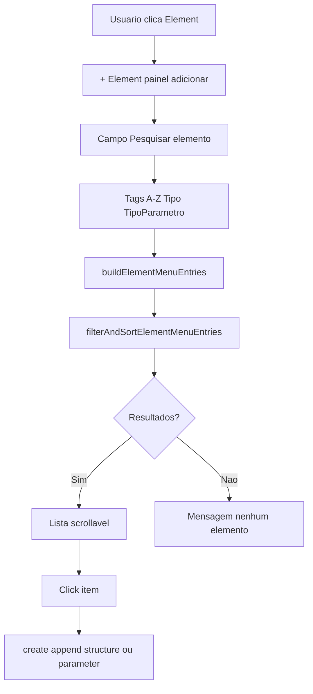
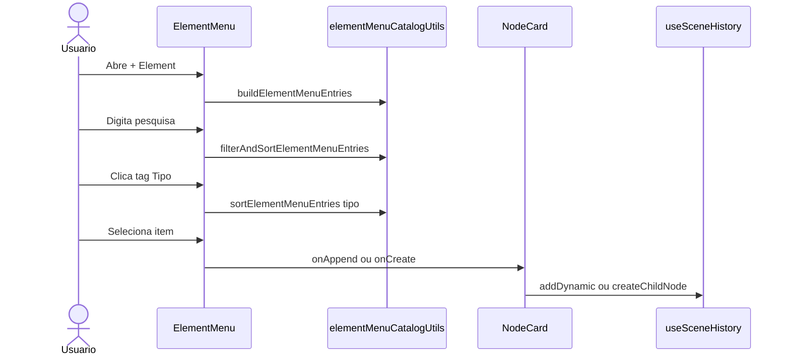

# Documentação de Implementação — Element Menu Search

Arquivo salvo em: `feature_md/feature-element-menu-search.md`

## 1. Cabeçalho

| Campo | Valor |
| --- | --- |
| Nome da Branch | `feature/element-menu-search` |
| Nome das Features | Element Menu Search e Tags de Organização |
| Versão atual | `1.4.0` |
| Hash do Commit | `f8675101af5fe855f7bba42576408153e3436866` |

## 2. Definição e Resumo de Tags

| Tag | Definição |
| --- | --- |
| `[NOVO]` | Novo componente, arquivo, endpoint, função ou estrutura de dados criado nesta branch. |
| `[ATUALIZADO]` | Componente, função, schema ou fluxo existente alterado para suportar a feature. |
| `[REMOVIDO]` | Código, comportamento ou componente removido da aplicação. |

Tags presentes nesta implementação:

- `[NOVO]`
- `[ATUALIZADO]`

Não houve itens classificados como `[REMOVIDO]` nesta branch.

## 3. Fluxograma de Funcionamento

## 4. Fluxograma de Acionamento de Funções

## 5. Tabela de Funções e Componentes

| Status | Nome | Feature Correspondente | Descrição Técnica | Parâmetros Recebidos / Retorno |
| --- | --- | --- | --- | --- |
| `[NOVO]` | `elementMenuCatalogUtils.ts` | Element Menu Search | Modelo unificado de entradas do catálogo + pesquisa e ordenação. | Funções puras; retornam `ElementMenuEntry[]`. |
| `[NOVO]` | `buildElementMenuEntries` | Element Menu Search | Agrega slots preset, internal structures e parâmetros de catálogo. | `BuildElementMenuEntriesInput` → entradas. |
| `[NOVO]` | `filterAndSortElementMenuEntries` | Element Menu Search | Filtra por query e aplica modo A-Z, Tipo ou Tipo de Parâmetro. | `(entries, query, organization)` → lista filtrada. |
| `[ATUALIZADO]` | `ElementMenu.tsx` | Element Menu Search | Painel add com input search, tags e lista scrollável; reset ao fechar. | Props existentes do ElementMenu. |
| `[ATUALIZADO]` | `ElementMenu.module.css` | Element Menu Search | Estilos para search, tags e área de resultados. | Classes CSS. |

## 6. Descrição Detalhada de Funcionamento

[ATUALIZADO] O painel **+ Element** do `ElementMenu` passa a incluir um campo de pesquisa e três tags de organização abaixo dele, seguindo o padrão visual da `AddNodePalette`.

[NOVO] `elementMenuCatalogUtils.ts` normaliza todos os itens adicionáveis (slots preset, internal structures de catálogo e parâmetros stub) em `ElementMenuEntry`, com metadados para pesquisa (`searchText`) e ordenação (`sortTipo`, `parameterType`).

[NOVO] A tag **A-Z** ordena por `label`. A tag **Tipo** agrupa por `Slot`, `Internal_Structure` e `Parâmetro`. A tag **Tipo de Parâmetro** lista primeiro os parâmetros ordenados por `parameter.type`, depois os demais itens por nome.

[ATUALIZADO] Ao fechar o menu, voltar ao painel raiz ou pressionar Escape, `elementQuery` e a organização activa são repostos ao valor por defeito (`A-Z`).

A branch integra a base de `feature/element-menu` (componente `ElementMenu` extraído do card) via merge, sobre `main` actualizado.

Tratamento de lista vazia: mensagem «Nenhum elemento encontrado». Não houve alterações ao fluxo **- Element** / `ElementRemovalPicker`.
