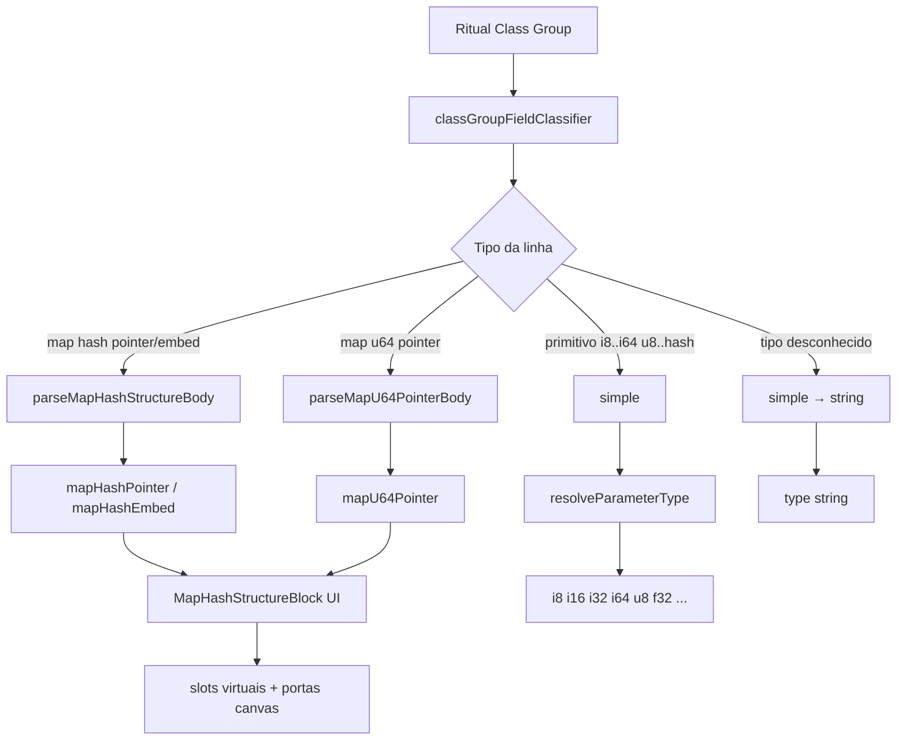
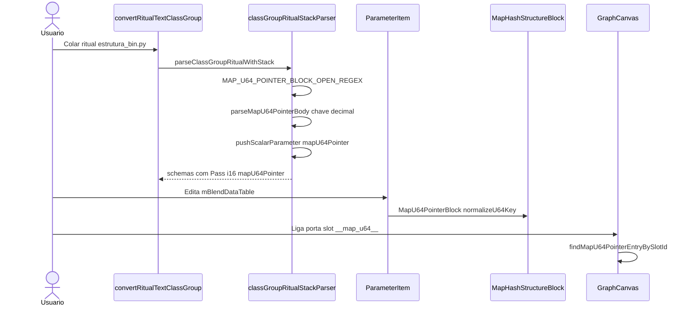

# Documentação de Implementação — Map hash/u64, inteiros com sinal e tipos ritual desconhecidos

Arquivo salvo em: `feature_md/feature/feature-class-group-map-hash-u64-primitives.md`

## 1. Cabeçalho

| Campo | Valor |
| --- | --- |
| Nome da Branch | `feature/class-group-map-hash-u64-primitives` |
| Nome das Features | `map[hash,pointer]` / `map[hash,embed]` (UI estruturada partilhada); `map[u64,pointer]`; inteiros `i8`–`i64` no ritual; tipos ritual não identificados → `string` |
| Versão atual | `1.4.0` |
| Hash do Commit | `9bafd66` |

Base: `feature/list2-embed-pointer-class-group` (LIST2_EMBED / LIST2_POINTER).

## 2. Definição e Resumo de Tags

| Tag | Definição |
| --- | --- |
| `[NOVO]` | Novo componente, arquivo, função ou tipo criado nesta branch. |
| `[ATUALIZADO]` | Componente ou fluxo existente alterado para suportar a feature. |
| `[REMOVIDO]` | Código ou comportamento removido ou descontinuado. |

Tags presentes nesta implementação:

- `[NOVO]`
- `[ATUALIZADO]`

## 3. Fluxograma de Funcionamento

## 4. Fluxograma de Acionamento de Funções

## 5. Tabela de Funções e Componentes

| Status | Nome | Feature | Descrição Técnica | Parâmetros / Retorno |
| --- | --- | --- | --- | --- |
| [NOVO] | `mapHashStructureValue.ts` | Map hash estruturado | Valor serializado `chave\tschemaId\ttypeName` por linha; catálogo de tipos das entradas. | `parseMapHashStructureString` → `MapHashStructureEntry[]` |
| [NOVO] | `mapHashPointerValue.ts` / `mapHashEmbedValue.ts` | Map hash | Wrappers finos sobre `mapHashStructureValue` com rit types distintos. | `resolveMapHashPointerParameterType` → `mapHashPointer` |
| [NOVO] | `mapU64PointerValue.ts` | Map u64 | Chaves decimais u64; mesmo formato de valor que hash structure. | `normalizeU64Key`, `resolveMapU64PointerParameterType` |
| [NOVO] | `mapHashPointerSlots.ts` / `mapU64PointerSlots.ts` | Canvas | Slots `__map__` e `__map_u64__`; altura de linha e offset de porta. | `mapHashPointerSlotId`, `getMapU64PointerStructurePortYOffset` |
| [NOVO] | `MapHashStructureBlock.tsx` | UI mapa | Bloco `−`/`+` mapa e por entrada; picker de estrutura; `normalizeKey` configurável. | `parameterKind`, `normalizeKey`, `slotIdForKey` |
| [NOVO] | `MapHashPointerBlock` / `MapHashEmbedBlock` / `MapU64PointerBlock` | UI | Wrappers do bloco partilhado por tipo de parâmetro. | props do bloco + parser/format |
| [NOVO] | `ParameterMapHashPointerInput` / `ParameterMapU64PointerInput` | Inspector | Input dedicado com commit normalizado. | `value`, `onCommit` |
| [ATUALIZADO] | `classGroupFieldClassifier.ts` | Primitivos | `PRIMITIVE_TYPE_REGEX` inclui `i8` `i16` `i32` `i64`; tipos desconhecidos → `simple`. | `classifyRitualLine` → `ParsedRitualField` |
| [ATUALIZADO] | `classGroupRitualStackParser.ts` | Parser | Blocos `map[u64,pointer]`; `parseMapHashStructureBody` genérico; `resolveParameterType` + `mapU64Pointer`. | `parseClassGroupRitualWithStack` |
| [ATUALIZADO] | `nodeSchema.ts` | Tipo | `NodeDataType` + `mapU64Pointer`. | union type |
| [ATUALIZADO] | `GraphCanvas.tsx` | Ligações | Altura de parâmetro, portas e `collectionType` para slots u64. | `getMapHashStructurePortY` estendido |
| [ATUALIZADO] | `collectionTypeLinking.ts` / `listEmbedSlots.ts` | Ligações | Resolução de slot map u64 no grafo. | `findMapU64PointerEntryBySlotId` |
| [ATUALIZADO] | `parameterValueInput.ts` | Inspector | Hints e normalização para `mapU64Pointer`. | `normalizeParameterValueForCommit` |
| [ATUALIZADO] | `ParameterItem.tsx` | UI card | Layout expandido para `mapU64Pointer`. | `parameter.type` |
| [ATUALIZADO] | `prompet_elements.md` | Docs | Tabela de Parameters actualizada. | — |

## 6. Descrição Detalhada de Funcionamento

### Mapas estruturados (`map[hash,pointer]` e `map[hash,embed]`)

Os dois tipos partilham **`MapHashStructureBlock`**: cada entrada tem chave (hash `0x…` ou string), tipo interno escolhido do catálogo derivado das entradas do ritual, e porta de saída no canvas (`__map__` ou `__map_embed__`). O parser percorre o corpo do mapa com `MAP_HASH_STRUCTURE_ENTRY_HEAD_REGEX`, cria schemas filhos e serializa o valor do parâmetro em linhas `chave\tschemaId\ttypeName`.

### `map[u64,pointer]`

Usado em `estrutura_bin.py` (ex.: `mBlendDataTable`) com chaves numéricas grandes (`574043308619688281`). O parser usa `MAP_U64_STRUCTURE_ENTRY_HEAD_REGEX` (`\d+ = Tipo {`). O tipo de parâmetro é **`mapU64Pointer`**; chaves são normalizadas só com dígitos (`normalizeU64Key`). A UI reutiliza o bloco estruturado com rótulo «u64» e infixo de slot `__map_u64__`.

### Inteiros com sinal (`i8`, `i16`, `i32`, `i64`)

Incluídos em `PRIMITIVE_TYPE_REGEX` para o classificador ritual reconhecer linhas como `Pass: i16 = 5`. `resolveParameterType` / `mapPrimitiveType` mapeiam para os tipos limitados já suportados no inspector (`parameterBoundedTypes`).

### Tipos ritual não identificados

Se o tipo do campo não for primitivo nem estrutural (`embed`/`pointer`/`link`/`map`), o classificador devolve **`simple`** e `resolveParameterType` atribui **`string`**, evitando descartar campos no parser.

### Tratamento de erros

Entradas de mapa não fechadas geram `warnings` no parser. Chaves u64 inválidas no commit UI são sanitizadas para dígitos (vazio → `0`). Tipos desconhecidos não bloqueiam a conversão Class Group.

### Testes

`classGroupFieldClassifier.test.ts`, `classGroupRitualStackParser.test.ts` (`i16`, `map[u64,pointer]`), `mapU64PointerValue.test.ts`, `mapHashPointerValue.test.ts` — suite Vitest (268+ testes).
