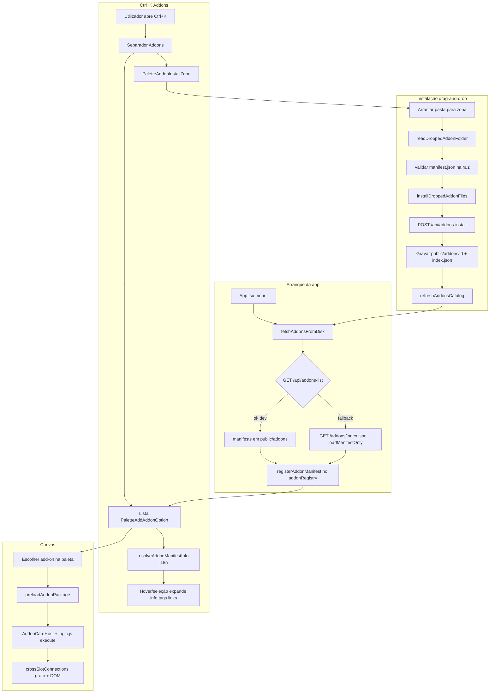
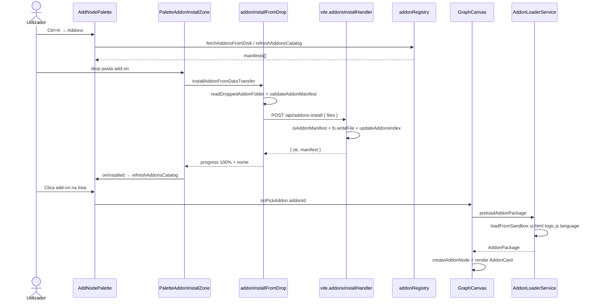

# Documentação de Implementação — Catálogo de Add-ons (Ctrl+K), metadados `info` e instalação por arrastar

Arquivo salvo em: `feature_md/feature/feature-addon-palette-install.md`

## 1. Cabeçalho

| Campo | Valor |
| --- | --- |
| Nome da Branch | `feature/addon-palette-install` |
| Nome das Features | Catálogo Add-ons no Ctrl+K; cartões expandidos com `manifest.info`; instalação por drag-and-drop; add-ons de referência `addon-galeria` e `addon-string-prefix`; APIs dev de listagem/instalação e pasta nativa da galeria |
| Versão atual | `1.5.0` |
| Hash do Commit | `d037948` |

Documentação relacionada: `feature_md/prompet/prompet_addon.md`.

---

## 2. Definição e Resumo de Tags

| Tag | Definição |
| --- | --- |
| `[NOVO]` | Módulo, componente, API dev, add-on sandbox ou fluxo criado nesta entrega. |
| `[ATUALIZADO]` | Componente ou serviço existente alterado para suportar add-ons ou o catálogo Ctrl+K. |
| `[REMOVIDO]` | Comportamento ou API removida. |

Tags presentes nesta implementação:

- `[NOVO]`
- `[ATUALIZADO]`

Não houve itens classificados como `[REMOVIDO]`.

---

## 3. Fluxograma de Funcionamento

---

## 4. Fluxograma de Acionamento de Funções

---

## 5. Tabela de Funções e Componentes

| Status | Nome | Feature | Descrição Técnica | Parâmetros / Retorno |
| --- | --- | --- | --- | --- |
| `[NOVO]` | `addonLoader.service.ts` | Runtime add-on | Valida/normaliza manifest; carrega `ui.html`, `logic.js`, i18n e menus de contexto. | `loadFromSandbox(id, locale)` → `AddonPackage`. |
| `[NOVO]` | `addonRegistry.ts` | Catálogo | Cache de manifests/packages; `fetchAddonsFromDisk`; pesquisa inclui `info`. | `registerAddonManifest`, `matchesAddonQuery`. |
| `[NOVO]` | `addonManifestInfo.ts` | Metadados Ctrl+K | Resolve `description`/`tags` i18n; texto de pesquisa. | `resolveAddonManifestInfo`, `addonManifestInfoSearchText`. |
| `[NOVO]` | `PaletteAddAddonOption.tsx` | UI catálogo | Cartão estilo blocos; expande com autor, versão, licença, tags, Repo/Docs. | `manifest`, `expanded`, `onPick`. |
| `[NOVO]` | `PaletteAddonInstallZone.tsx` | Instalação | Zona drag-and-drop; barra de progresso; nome e estado sucesso/erro. | `onInstalled` callback. |
| `[NOVO]` | `addonInstallFromDrop.ts` | Client install | Lê pasta via `webkitGetAsEntry`; envia ficheiros JSON ao servidor dev. | `installAddonFromDataTransfer` → `AddonInstallResult`. |
| `[NOVO]` | `vite.addonsInstallHandler.ts` | API dev | `POST /api/addons-install`; valida manifest; grava disco; actualiza `index.json`. | `handleAddonsInstallRequest`. |
| `[NOVO]` | `vite.addonsListHandler.ts` | API dev | `GET /api/addons-list`; enumera `public/addons/*/manifest.json`. | `handleAddonsListRequest`, `isAddonManifest`. |
| `[NOVO]` | `vite.plugin.addonsList.ts` | Plugin Vite | Middleware dev para list + install + available. | `apply: serve`. |
| `[NOVO]` | `AddonCardHost.tsx` / `AddonCardView.tsx` | Canvas | Renderiza UI sandbox; slots IN/OUT; drive reactivo. | Props de cena + `AddonPackage`. |
| `[NOVO]` | `addonSlotConnections.ts` / `crossSlotConnections.ts` | Ligações | Conexões entre slots de add-on e nós/blocos. | `applyAddonSlotConnectionToScene`, etc. |
| `[NOVO]` | `useAddonCanvasLinks.ts` | Interacção | Drag de slots add-on; abre paleta Addons filtrada. | Hook no `GraphCanvas`. |
| `[NOVO]` | `addon-galeria` | Add-on Media | Galeria LoL: Root Folder, personagem, origem Particles/Base/Path; `.tex`/`.dds`; menu contexto. | `public/addons/addon-galeria/`. |
| `[NOVO]` | `vite.galleryFolderHandler.ts` | API galeria dev | Pick folder, scan directory, read file (Windows dev). | Endpoints `/api/gallery-*`. |
| `[ATUALIZADO]` | `AddNodePalette.tsx` | Ctrl+K | Separador Addons; zona instalação; pesquisa; oculta filtros A-Z/pastas em modo Addons. | `onPickAddon`, `refreshAddonsCatalog`. |
| `[ATUALIZADO]` | `GraphCanvas.tsx` | Paleta add-on | `addonDropLinkContext`; spawn ao escolher na paleta. | `handlePaletteAddonPick`. |
| `[ATUALIZADO]` | `App.tsx` | Boot | `fetchAddonsFromDisk()` no mount. | — |
| `[ATUALIZADO]` | `addon-string-prefix` | Metadados | Bloco `info` + chaves i18n 20–23 alinhadas à galeria. | `manifest.json`, `language/*.json`. |
| `[ATUALIZADO]` | `languageIds.ts` + `language/*.json` | i18n | Strings catálogo Addons e zona de instalação (556–564). | `LangId.NodePaletteCatalogAddons`, etc. |

---

## 6. Descrição Detalhada de Funcionamento

### Catálogo Add-ons (Ctrl+K)

[NOVO] O `AddNodePalette` ganhou o modo **Addons**, activo quando `addonsCatalogEnabled` (por defeito quando não há contexto de ligação de nó/bloco exclusivo). A lista vem de `fetchAddonsFromDisk`, que preferencialmente usa `GET /api/addons-list` em dev e, em fallback, lê `public/addons/index.json` e carrega cada manifest.

[ATUALIZADO] Em modo Addons, filtros de pasta e organização A-Z ficam ocultos — apenas pesquisa por título, id, categoria e campos de `manifest.info`.

[NOVO] `PaletteAddAddonOption` replica o layout compacto/expandido dos blocos: ao hover ou seleção por teclado, expande e mostra descrição (i18n), autor · versão · licença, tags traduzidas e links **Repo** / **Docs** quando presentes em `manifest.info`.

[NOVO] `addonManifestInfo.ts` interpreta chaves `[{n}]` / `{n}` usando o pack `language/{locale}.json` de cada add-on.

### Instalação por arrastar pasta

[NOVO] `PaletteAddonInstallZone` aparece acima da lista no modo Addons. O utilizador arrasta **uma pasta** contendo `manifest.json` na raiz.

[NOVO] O cliente (`addonInstallFromDrop.ts`) percorre a árvore via `DataTransferItem.webkitGetAsEntry`, valida o manifest com `validateAddonManifest`, resolve o nome para exibição (i18n local) e envia todos os ficheiros em JSON para `POST /api/addons-install`.

[NOVO] O servidor (`vite.addonsInstallHandler.ts`) revalida com `isAddonManifest`, impede path traversal, grava em `public/addons/{id}/`, actualiza `public/addons/index.json` e responde com o manifest instalado.

[ATUALIZADO] Após sucesso, `refreshAddonsCatalog` repovoa a lista sem reiniciar a app.

**Limitação:** instalação disponível apenas com `npm run dev` (`GET /api/addons-install-available`). Em build estático, a zona mostra mensagem de indisponibilidade.

### Add-on Galeria (referência)

[NOVO] Fluxo `{Raiz}` → personagem (`characters.json`) → origem Particles / Base / Path; barra de progresso `#D8EBF2` durante scan; suporte `.tex`/`.dds`; menu contexto (guardar imagem, copiar caminho absoluto em dev, copiar nome).

[NOVO] APIs dev em `vite.galleryFolderHandler.ts` para pick de pasta Windows, scan recursivo e leitura de ficheiro.

### Runtime no canvas

[NOVO] `AddonLoaderService.loadFromSandbox` importa `logic.js` como módulo ESM, injecta `ui.html` no cartão, aplica drive (`inputChange`, `always`, etc.) e propaga outputs via `addonOutputPropagation`.

[NOVO] Ligações cruzadas add-on ↔ nó/bloco via `crossSlotConnections` e hook `useAddonCanvasLinks` (arrastar slot OUT abre paleta Addons).

### Tratamento de erros

- Pasta sem `manifest.json` na raiz → mensagem na zona de instalação (sem Messenger; fluxo inline).
- Manifest inválido → erro antes do upload ou resposta 400 da API.
- Múltiplas pastas no drop → rejeição no cliente.
- API indisponível (produção) → zona desactivada com hint i18n.
- Add-ons ignorados em listagem dev aparecem em `skipped` no JSON de `/api/addons-list` (log servidor).

**Confirmações de UI:** esta feature **não** introduz diálogos de confirmação; feedback é inline na zona de instalação e na barra de progresso. Não usa `window.confirm` / `window.alert`.

---

## 7. Como utilizar (didático)

### Português

1. Execute **`npm run dev`** (instalação de add-ons requer o servidor Vite).
2. Abra **Ctrl+K** e seleccione o separador **Addons**.
3. Para **instalar**: arraste a pasta do add-on (com `manifest.json` na raiz) para a caixa **Instalar Addon**.
4. Aguarde a barra de progresso, o nome do add-on e a mensagem **Instalado com sucesso.**
5. O add-on passa a aparecer na lista abaixo; use a pesquisa por nome ou id.
6. Passe o rato sobre um add-on para ver descrição, autor, tags e links Repo/Docs.
7. Clique num add-on para o colocar no canvas; ligue slots como nos blocos.
8. **Galeria:** defina **Root Folder**, escolha personagem e origem (Particles / Base / Path); use o menu de contexto nas imagens.

### English

1. Run **`npm run dev`** (add-on install requires the Vite dev server).
2. Open **Ctrl+K** and select the **Addons** tab.
3. To **install**: drag the add-on folder (with root `manifest.json`) onto **Install Addon**.
4. Wait for the progress bar, add-on name, and **Installed successfully.**
5. The add-on appears in the list below; search by name or id.
6. Hover an entry to see description, author, tags, and Repo/Docs links.
7. Click an add-on to spawn it on the canvas; wire slots like blocks.
8. **Gallery:** set **Root Folder**, pick character and source (Particles / Base / Path); use the image context menu.
