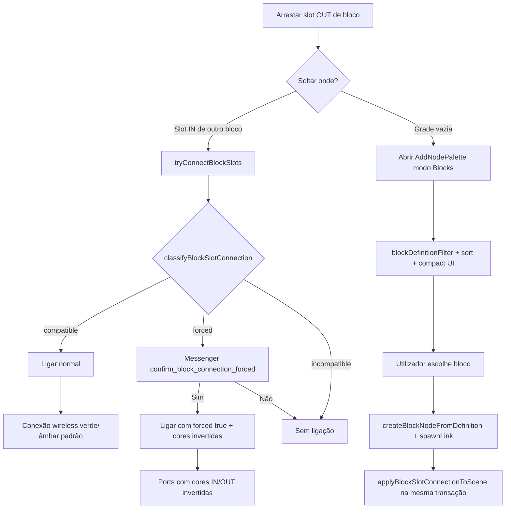
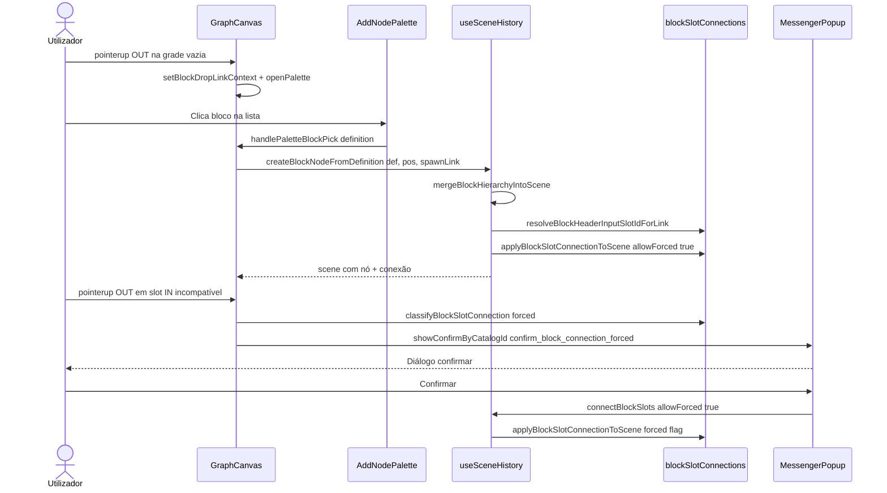

# Documentação de Implementação — Paleta LINK NEW NODE (blocos) e ligações forçadas

Arquivo salvo em: `feature_md/feature/feature-block-link-palette.md`

## 1. Cabeçalho

| Campo | Valor |
| --- | --- |
| Nome da Branch | `feature/block-link-palette` |
| Nome das Features | Paleta de ligação de blocos (LINK NEW NODE), filtro/ordenação por tipo de saída, ligação forçada com confirmação Messenger, spawn com conexão atómica |
| Versão atual | `1.5.0` |
| Hash do Commit | _(preencher com `git rev-parse HEAD` na branch de entrega)_ |

Documentação relacionada: `feature_md/prompet/prompet_sistema_blocos.md` (secção 5).

---

## 2. Definição e Resumo de Tags

| Tag | Definição |
| --- | --- |
| `[NOVO]` | Novo módulo, componente, entrada de catálogo Messenger ou fluxo criado nesta entrega. |
| `[ATUALIZADO]` | Componente ou função existente alterada para suportar ligação por paleta ou conexões forçadas. |
| `[REMOVIDO]` | Comportamento ou API removida. |

Tags presentes nesta implementação:

- `[NOVO]`
- `[ATUALIZADO]`

Não houve itens classificados como `[REMOVIDO]`.

---

## 3. Fluxograma de Funcionamento

---

## 4. Fluxograma de Acionamento de Funções

---

## 5. Tabela de Funções e Componentes

| Status | Nome | Feature | Descrição Técnica | Parâmetros / Retorno |
| --- | --- | --- | --- | --- |
| `[NOVO]` | `blockDefinitionLinkPalette.ts` | Paleta LINK | Filtro, rank e match exacto de blocos para contexto de saída. | `blockDefinitionMatchesLinkDrop`, `sortBlockDefinitionsForLinkDrop`, `blockDefinitionMatchesExactOutputType`. |
| `[NOVO]` | `blockDefinitionPaletteParameters.ts` | Tema parâmetros | Resolve tipos Syntax dos nomes de parâmetro no catálogo JSON. | `resolveBlockPaletteParameters(definition)`. |
| `[NOVO]` | `applyBlockSlotConnectionToScene` | Ligação atómica | Aplica conexão numa `CanvasScene` já com nós destino. | `BlockSlotLinkRequest` → `CanvasScene \| null`. |
| `[NOVO]` | `classifyBlockSlotConnection` | Ligação forçada | `compatible` \| `forced` \| `incompatible` (IN aceita campo pai, OUT não corresponde ao tipo filho). | Endpoints + structures → class. |
| `[NOVO]` | `BlockDefinitionSpawnLinkContext` | Spawn + link | Contexto de origem ao criar bloco pela paleta. | Campos `fromNodeId`, `fromBlockSlotId`, `outTypes`, etc. |
| `[NOVO]` | `MESSENGER_CONFIRM_BLOCK_CONNECTION_FORCED` | Confirmação | Entrada `confirm_block_connection_forced` no catálogo Messenger. | `showConfirmByCatalogId`. |
| `[ATUALIZADO]` | `GraphCanvas.tsx` | Paleta / drag | `blockDropLinkContext`, `tryConnectBlockSlots`, paleta Blocks ao soltar no vazio. | Props + callbacks. |
| `[ATUALIZADO]` | `AddNodePalette.tsx` | UI blocos | Filtro, ordenação, item expandido só no match exacto, parâmetros com `SyntaxType`. | `blockDropLinkContext`, `paletteBlockOptionExpanded`. |
| `[ATUALIZADO]` | `PaletteAddBlockOption.tsx` | Card bloco | `data-expanded`, lista de parâmetros coloridos. | `expanded`, `highlighted`. |
| `[ATUALIZADO]` | `createBlockNodeFromDefinition` | Spawn | Terceiro arg `spawnLink`; liga na mesma `updateScene`. | `spawnLink?: BlockDefinitionSpawnLinkContext`. |
| `[ATUALIZADO]` | `connectBlockSlots` | Histórico | Delega em `applyBlockSlotConnectionToScene`; `allowForced`. | 7º parâmetro booleano. |
| `[ATUALIZADO]` | `CanvasConnection.forced` | Persistência | Flag `forced` em conexões de bloco. | `workspacePersistence`, `leagueBinScene`, `migrateConnection`. |
| `[ATUALIZADO]` | `BlockSlot` / `blockConnectionDisplay` | Visual | Cores invertidas IN/OUT quando `forced`; fios SVG verdes se visíveis. | `data-forced`, `connectionBlockForced`. |

---

## 6. Descrição Detalhada de Funcionamento

### Paleta ao soltar na grade

[ATUALIZADO] Ao arrastar um slot de **saída** de um `BlockCard` e soltar no fundo do canvas (sem acertar num slot IN), o `GraphCanvas` grava `blockDropLinkContext` (`fromNodeId`, `fromBlockSlotId`, `outTypes`, `fromParameterName`, posição) e abre o `AddNodePalette` com título **LINK NEW NODE**, separador **Blocks** activo e lista filtrada.

[NOVO] `blockDefinitionMatchesLinkDrop` mantém blocos cujo cabeçalho `in[...]` aceita o tipo de saída ou o nome do parâmetro de origem (ex.: `dynamics`). `sortBlockDefinitionsForLinkDrop` coloca no topo o bloco cujo `blockName`/`name` coincide com o tipo de saída.

[ATUALIZADO] Na lista, só o bloco de correspondência exacta fica **expandido** (metadados `pointer · dynamics` e parâmetros); os restantes ficam **compactos** (uma linha de título). Os nomes dos parâmetros usam classes `SyntaxType` conforme o JSON em `blockStructures/parameters/`.

### Ligação automática ao escolher da lista

[NOVO] `createBlockNodeFromDefinition(definition, position, spawnLink)` cria a hierarquia do bloco e, na **mesma** actualização de cena, chama `applyBlockSlotConnectionToScene` com `allowForced: true`. Isto evita falha por `scene` React desactualizada (o padrão anterior chamava `connectBlockSlots` no render seguinte).

### Ligação forçada (drag directo para slot)

[NOVO] Quando o slot IN do filho aceita o campo pai (`in[dynamics]`) mas o OUT de origem não corresponde ao `blockType` do filho (ex.: OUT `VfxAnimatedVector3fVariableData` → filho `VfxAnimatedColorVariableData`), `classifyBlockSlotConnection` devolve `forced`.

[ATUALIZADO] `tryConnectBlockSlots` abre `showConfirmByCatalogId(MESSENGER_CONFIRM_BLOCK_CONNECTION_FORCED)` — **não** usa `window.confirm`. Ao confirmar, `connectBlockSlots(..., allowForced: true)` grava `connection.forced: true`.

[ATUALIZADO] Indicador visual: ports wireless com cores **invertidas** (OUT verde, IN âmbar); traços SVG `connectionBlockForced` quando o routing não é wireless.

### Regras de negócio

- Paleta após drop no vazio: ligação **automática** sem Messenger (utilizador já escolheu o bloco na lista filtrada).
- Drag para slot IN incompatível: Messenger **obrigatório** antes de `forced`.
- `blockHierarchySpawn` interno continua a usar `canConnectBlockSlots` estrito (sem forçar no spawn hierárquico automático).

---

## 7. Como utilizar (didático)

### Português

1. Active a vista de **bloco** no nó pai (ex.: `IntegratedValueVector3`).
2. Clique e **arraste** o slot de saída do parâmetro (ex.: `dynamics`).
3. **Solte no espaço vazio** da grade → abre **LINK NEW NODE** em **Blocks**.
4. O bloco com o **mesmo tipo** da saída aparece no topo, expandido; os outros ficam numa linha compacta.
5. **Clique** no bloco desejado → o cartão é criado e **ligado automaticamente**.
6. Se arrastar directamente para o IN de um bloco de **outro tipo** (mas mesmo campo `dynamics`), aparece o **Messenger** a perguntar se deseja forçar; confirme para ligar (ícone de corrente com cores invertidas).

### English

1. Enable **block view** on the parent node (e.g. `IntegratedValueVector3`).
2. **Drag** the parameter output slot (e.g. `dynamics`).
3. **Drop on empty canvas** → **LINK NEW NODE** opens on the **Blocks** tab.
4. The block matching the output type is listed first and expanded; others stay compact.
5. **Click** a block → it spawns and **connects automatically**.
6. If you drop directly onto another block’s IN with a **mismatched child type** but the same parent field (`dynamics`), the **Messenger** asks to force the link; confirm to connect (inverted port colors).
