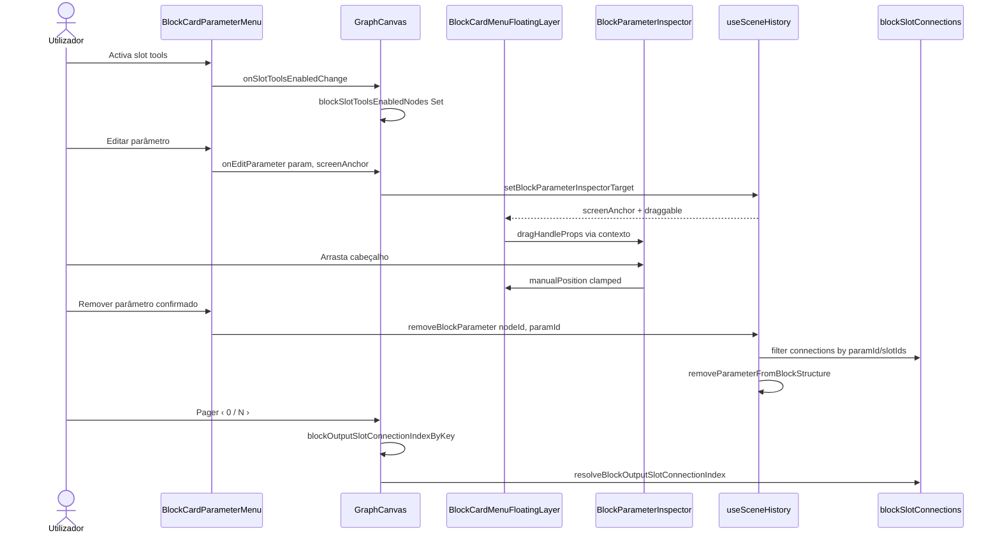

# Documentação de Implementação — Melhorias de slots do BlockCard

Arquivo salvo em: `feature_md/feature/feature-block-slot-improvements.md`

## 1. Cabeçalho

| Campo | Valor |
| --- | --- |
| Nome da Branch | `feature/block-slot-improvements` |
| Nome das Features | Slot tools no BlockCard; pager de fan-out; preview ritual com listas; editor flutuante de parâmetro; remoção de parâmetro com desligação de conexões; campos mapHash no card |
| Versão atual | `1.5.0` |
| Hash do Commit | `380bf1d` |

Documentação relacionada: `feature_md/prompet/prompet_sistema_blocos.md`, `feature_md/feature/feature-block-link-palette.md`.

---

## 2. Definição e Resumo de Tags

| Tag | Definição |
| --- | --- |
| `[NOVO]` | Novo módulo, componente, hook ou fluxo criado nesta entrega. |
| `[ATUALIZADO]` | Componente ou função existente alterada para suportar slot tools, pager, preview ou editor. |
| `[REMOVIDO]` | Comportamento ou API removida. |

Tags presentes nesta implementação:

- `[NOVO]`
- `[ATUALIZADO]`

Não houve itens classificados como `[REMOVIDO]`.

---

## 3. Fluxograma de Funcionamento

```mermaid
graph TD
  subgraph card [BlockCard]
    A[Rodapé BlockCardParameterMenu] --> B{Slot tools activas?}
    B -->|Sim| C[Mostrar BlockSlotPeerToolbar nos slots ligados]
    B -->|Não| D[Só slots sem barra de ferramentas]
    C --> E{Fan-out > 1 ligação?}
    E -->|Sim| F[BlockSlotConnectionPager abaixo da linha]
    E -->|Não| G[Slot + toolbar inline]
  end

  subgraph edit [Editar parâmetro]
    H[Botão Editar / menu contexto] --> I[StructureListPanel ou directo]
    I --> J[onEditBlockParameter + screenAnchor]
    J --> K[BlockCardMenuFloatingLayer draggable]
    K --> L[BlockParameterInspector]
  end

  subgraph preview [Block Code Preview]
    M[canvasToClassGroupRitual] --> N{classifica ligação list vs simples}
    N --> O[Emite list embed/pointer no ritual]
  end

  subgraph remove [Remover parâmetro]
    P[removeBlockParameter] --> Q[Filtra conexões do paramId e slots]
    Q --> R[removeParameterFromBlockStructure]
  end
```

---

## 4. Fluxograma de Acionamento de Funções

---

## 5. Tabela de Funções e Componentes

| Status | Nome | Feature | Descrição Técnica | Parâmetros / Retorno |
| --- | --- | --- | --- | --- |
| `[NOVO]` | `BlockSlotPeerToolbar.tsx` | Slot tools | Barra lock/focus/eye/unlink no slot ligado. | Props `peer`, callbacks de acção. |
| `[NOVO]` | `BlockSlotConnectionPager.tsx` | Fan-out | Pager compacto `‹ i / n ›` para várias ligações na mesma saída. | `selectedIndex`, `total`, `layout: inline \| below`. |
| `[NOVO]` | `blockSlotPeerState.ts` / `blockSlotPeerActions.ts` | Slot tools | Estado e acções sobre o nó peer ligado ao slot. | `getPeerState`, `onToggleLock`, etc. |
| `[NOVO]` | `BlockCardMenuFloatingLayer.tsx` | Editor flutuante | Portal fixo com quadrante de ecrã, drag pelo cabeçalho. | `draggable`, `screenAnchor`, `useBlockCardMenuFloatingLayerDragHandle`. |
| `[NOVO]` | `screenAnchoredPanelPlacement.ts` | Posicionamento | `buildFrozenScreenAnchoredStyle` com quadrante e maxHeight corrigido. | `anchor`, `size` → `CSSProperties`. |
| `[NOVO]` | `StructureListPanel.tsx` | Menus card | Lista flutuante Editar/Remover/Adicionar parâmetro. | `screenAnchor`, `onPickItem`. |
| `[NOVO]` | `BlockMapHash*Field.tsx` | mapHash | Campos embed/pointer/u64 no corpo do BlockCard. | Props de slot, lista, commit. |
| `[ATUALIZADO]` | `BlockCard.tsx` | Slot tools / pager | Header e linhas com toolbar; pager abaixo quando tools activas. | `slotToolsEnabled`, `blockSlotPeerActions`. |
| `[ATUALIZADO]` | `BlockParameterRow.tsx` | Layout | `data-slot-tools`, pager below, truncamento de label. | Props fan-out + slot tools. |
| `[ATUALIZADO]` | `GroupBlockParameterRow.module.css` | CSS | Grid compacto, ellipsis, segunda linha para pager. | Regras `data-slot-pager-below`. |
| `[ATUALIZADO]` | `BlockCardParameterMenu.tsx` | CRUD param | Toggle slot tools; lista editar; fix âncora Mouse/Pointer. | `onEditParameter`, `externalPanelRequest`. |
| `[ATUALIZADO]` | `BlockParameterInspector.tsx` | Editor | Inspetor flutuante com drag handle do layer. | `target`, `onApply`. |
| `[ATUALIZADO]` | `InspectorFloatingPanelShell.tsx` | Drag | Arrasto só na zona do título (não no botão ×). | `dragHandleProps` em `dockedHeaderMain`. |
| `[ATUALIZADO]` | `canvasToClassGroupRitual.ts` | Preview | Merge embed→listEmbed; emite `list[pointer]`/`list[embed]`. | Testes `complexEmitterDefinitionData`, `erosionDriveCurve`. |
| `[ATUALIZADO]` | `blockSlotConnections.ts` | Fan-out | `findConnectionsForBlockOutputSlot`, índice seleccionado, menu contexto. | `connectionIndex` opcional. |
| `[ATUALIZADO]` | `useSceneHistory.removeBlockParameter` | Remoção | Remove todas as conexões do parâmetro antes de actualizar estrutura. | `nodeId`, `paramId`. |
| `[ATUALIZADO]` | `GraphCanvas.tsx` | Estado global | `blockSlotToolsEnabledNodes`, índices de fan-out, `buildBlockSlotPeerActions`. | Props para BlockCard. |
| `[ATUALIZADO]` | `tokens.css` | Grid | Coluna nome `minmax(0, 2fr)` para permitir ellipsis. | `--group-block-body-columns-compact`. |

---

## 6. Descrição Detalhada de Funcionamento

### Slot tools

[NOVO] Toggle no rodapé do `BlockCard` (ícone `slot tools.svg`) activa ferramentas junto a slots **ligados**: travar posição do peer, focar no canvas, ocultar/mostrar na cena e remover ligação. Estado por nó em `blockSlotToolsEnabledNodes`.

[ATUALIZADO] O menu de contexto e a toolbar respeitam o **índice** do pager quando há fan-out na mesma saída (`list[pointer]`).

### Pager de fan-out

[NOVO] `BlockSlotConnectionPager` mostra `‹ índice / total ›` quando `total > 1`. Com slot tools activas, o pager passa para uma **segunda linha centrada** abaixo da linha do parâmetro ou do header do bloco (`data-slot-pager-below`).

[ATUALIZADO] `blockOutputSlotConnectionIndexByKey` no `GraphCanvas` persiste o índice seleccionado por slot.

### Layout e truncamento de nomes

[ATUALIZADO] Com slot tools, nomes longos (ex.: `complexEmitterDefinitionData`) usam `text-overflow: ellipsis` e grid com `minmax(0, 2fr)` na coluna do nome para não sobrepor a toolbar.

### Preview ritual (Block Code)

[ATUALIZADO] `canvasToClassGroupRitual` classifica ligações via schema + `listParameter`, faz merge de stubs `embed` → `listEmbed` em modo block card e emite `list[pointer]` / `list[embed]` / `list2[...]` correctamente no preview.

### Editor flutuante de parâmetro

[NOVO] Ao editar, `BlockCardMenuFloatingLayer` posiciona o inspetor com regra de **quadrante** (`computeContextMenuPlacement`). Correcção de `maxHeight` na metade inferior do ecrã usa `anchor.top` em vez do topo já deslocado do painel.

[NOVO] Arrastar pelo **cabeçalho** (título + eyebrow) move o painel; botão fechar não inicia drag. Posição manual é reposta ao abrir outro parâmetro ou nova âncora.

### Remoção de parâmetro

[ATUALIZADO] `removeBlockParameter` remove conexões onde `fromBlockParameterId` / `toBlockParameterId` ou `fromBlockSlotId` / `toBlockSlotId` correspondem aos slots `input`/`output` do parâmetro, evitando ligações órfãs.

### Campos mapHash

[NOVO] Componentes `BlockMapHashEmbedField`, `BlockMapHashPointerField`, `BlockMapU64PointerField` e `BlockMapHashStructureField` integram listas e slots no layout de 5 colunas do card.

### Regras de negócio e erros

- Confirmação de remoção de parâmetro usa diálogo do menu (`confirmRemove`); erros de catálogo em adicionar podem usar `window.alert` legado.
- `createPortal` importa de **`react-dom`** (não de `react`).
- Slot tools só mostram toolbar quando existe ligação activa no slot (`outputPeerState` / `inputPeerState`).

---

## 7. Como utilizar (didático)

### Português

1. Abra um **BlockCard** no canvas (vista bloco activa).
2. No rodapé, clique no ícone **slot tools** para activar as ferramentas nos slots ligados.
3. Em saídas com **várias ligações**, use `‹ 0 / N ›` para escolher qual ligação editar no menu ou nas tools; com tools activas o índice aparece **centrado abaixo** da linha.
4. Use **lock / focus / eye / unlink** à direita (ou esquerda) do slot conforme a direcção.
5. Para **editar** um parâmetro: botão lápis → escolha na lista → painel flutuante; **arraste pelo título** para reposicionar.
6. Para **remover** parâmetro: botão remover → confirme; todas as **ligações desse parâmetro são desfeitas** automaticamente.
7. No **Block Code Preview**, campos `list[pointer]` e `list[embed]` reflectem ligações do card.

### English

1. Open a **BlockCard** on the canvas (block view enabled).
2. In the footer, click **slot tools** to show peer actions on connected slots.
3. For **multiple connections** on one output, use `‹ 0 / N ›`; with tools enabled the pager sits **centered below** the row.
4. Use **lock / focus / eye / unlink** next to the slot.
5. To **edit** a parameter: pencil button → pick from list → floating panel; **drag the header** to move it.
6. To **remove** a parameter: remove button → confirm; all **connections for that parameter are removed** automatically.
7. **Block Code Preview** shows `list[pointer]` / `list[embed]` fields according to card links.
