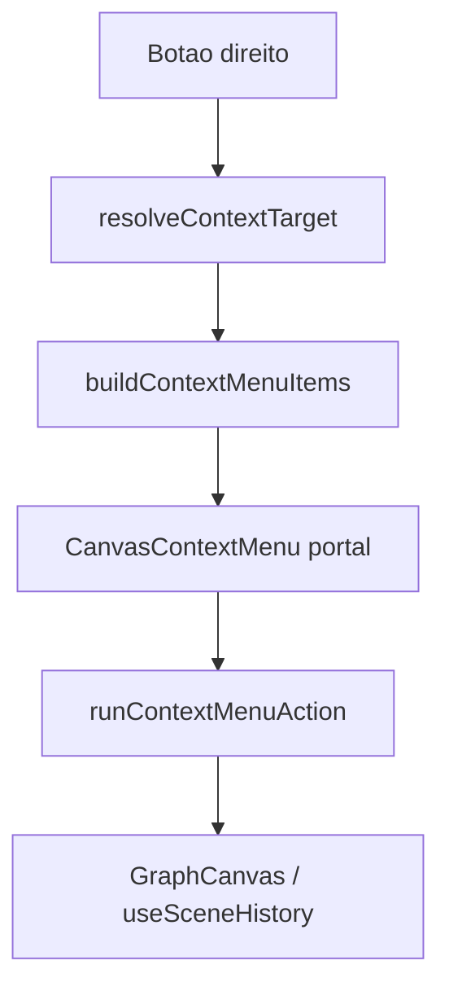
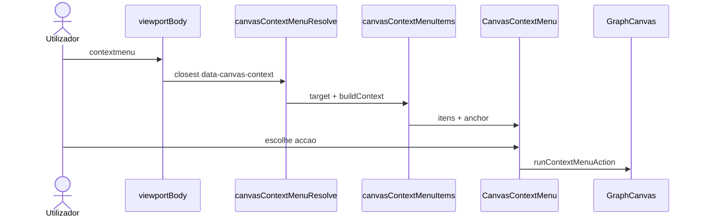

# Documentação de Implementação — Menu de contexto no canvas

Arquivo salvo em: `feature_md/feature/feature-canvas-context-menu.md`

## 1. Cabeçalho

| Campo | Valor |
| --- | --- |
| Nome da Branch | `feature/canvas-context-menu` |
| Nome das Features | Menu de contexto unificado (grade, nó, ligação, elementos internos); modo «Mover na grade» |
| Versão actual | `1.4.0` |

## 2. Definição e Resumo de Tags

| Tag | Definição |
| --- | --- |
| `[NOVO]` | Novo componente, arquivo, função ou tipo criado nesta branch. |
| `[ATUALIZADO]` | Componente ou fluxo existente alterado para suportar a feature. |

Tags presentes nesta implementação:

- `[NOVO]`
- `[ATUALIZADO]`

## 3. Fluxograma de Funcionamento

## 4. Fluxograma de Acionamento

## 5. Tabela de Funções e Componentes

| Status | Nome | Descrição |
| --- | --- | --- |
| `[NOVO]` | `canvasContextMenuTypes.ts` | `CanvasContextTarget`, `ContextMenuItem`, ids de acção |
| `[NOVO]` | `canvasContextMenuAttributes.ts` | `data-canvas-context-*`, `canvasContextElementProps` |
| `[NOVO]` | `canvasContextMenuResolve.ts` | Resolve alvo a partir do DOM (elemento > fio > nó > grade) |
| `[NOVO]` | `canvasContextMenuItems.ts` | Lista de itens por alvo |
| `[NOVO]` | `CanvasContextMenu.tsx` | Portal fixo, fechar fora / Escape |
| `[ATUALIZADO]` | `GraphCanvas.tsx` | Estado do menu, modo navegar, handlers, ligação SVG |
| `[ATUALIZADO]` | `App.tsx` | `onDeleteNodeIds` |
| `[ATUALIZADO]` | `useSceneHistory.ts` | `createRootNode(schema, position?)` |
| `[ATUALIZADO]` | `ParameterItem`, `InternalStructureItem`, blocos EMBED/POINTER/LIST_* | Atributos de contexto |
| `[ATUALIZADO]` | `ElementMenu.tsx` | `data-element-menu-trigger` para «Gerir elementos…» |

## 6. Menus por alvo

### Grade

Adicionar nó (com posição no clique), zoom +/−, repor vista, desfazer/refazer, focar seleção, seleccionar todos / limpar, alternar **Mover na grade**.

### Modo «Mover na grade»

- Activado pelo menu da grade.
- Arrastar com botão esquerdo no fundo **só faz pan** (não limpa seleção, não inicia marquee).
- Sair: `Escape`, ou clique no vazio sem arrastar (&lt; 4px).
- Indicador na toolbar do canvas.

### Nó

Focar na vista, seleccionar, glue, apagar, adicionar nó raiz, **retrair/expandir corpo** (`bodyCollapsed` no `CanvasNode`; corpo com `display: none`; persistido em `layout.json`). Ao **retrair**, todas as ligações que tocam o nó (entrada e saída) passam a `routing: wireless` com backup em `compactRoutingBackups`; ao **expandir**, restaura o estilo anterior (excepto se o outro nó ainda estiver retraído ou um bloco interno ainda em modo compacto).

### Ligação (fio SVG)

Alternar estilo do fio, remover ligação (`data-canvas-connection-id` no hit path).

### Elementos internos

Atributos `data-canvas-context` nos cards. Itens típicos: vista compacta/lista, religar IS, remover ligações do slot, remover elemento (via `listRemovableNodeElements`), remover instância LIST2, **Gerir elementos…** (abre `ElementMenu`).

## 7. Regras e guardas

- Ignorado quando `isParameterPickerOpen()` ou alvo é `data-canvas-control` (toolbar).
- `preventDefault` no `contextmenu` para não mostrar menu nativo do SO.
- Menu fecha ao iniciar pan, marquee ou drag de nó.
- Acções de grafo passam por callbacks existentes (`useSceneHistory`); undo automático via `updateScene`.

## 8. Ficheiros principais

- `src/core/canvasContextMenu*.ts`
- `src/components/molecules/CanvasContextMenu.tsx`
- `src/components/organisms/GraphCanvas.tsx`
