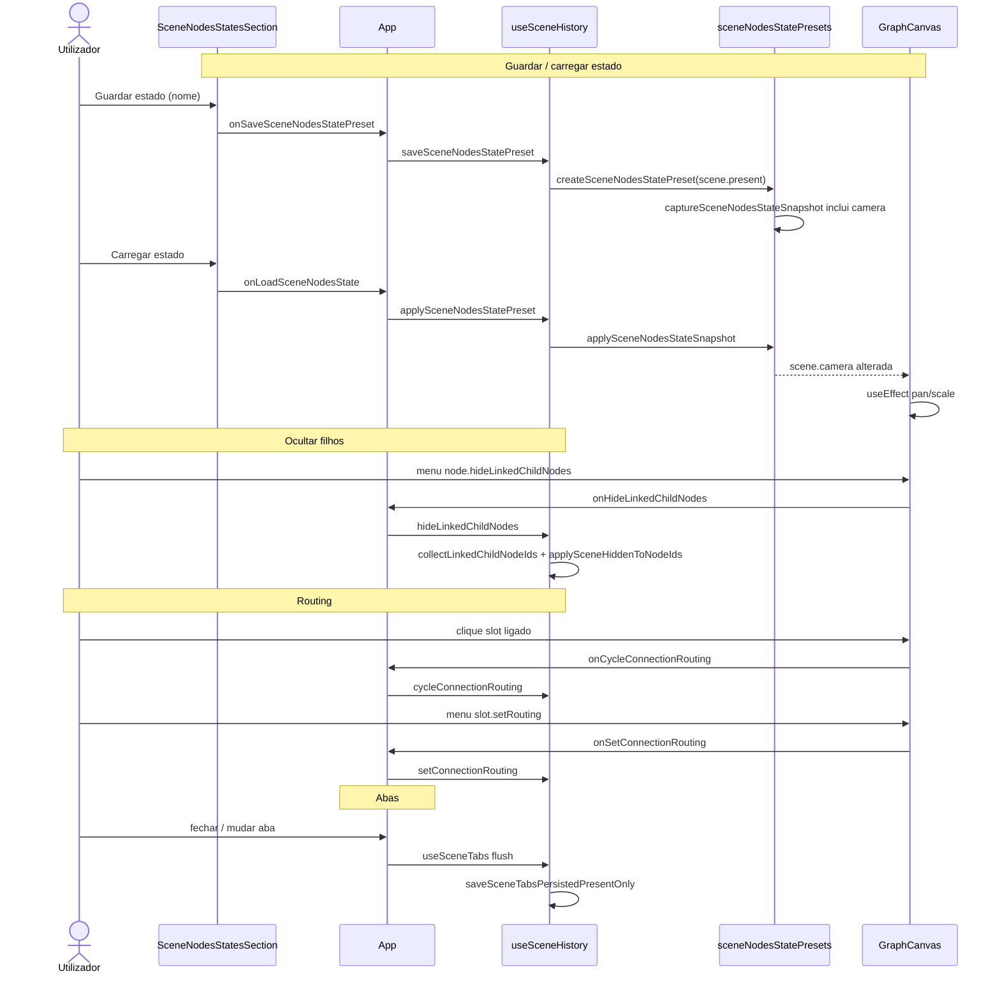

# Documentação de Implementação — Estados de cena, routing e persistência

Arquivo salvo em: `feature_md/feature/feature-cena-estados-routing-persistencia.md`

## 1. Cabeçalho

| Campo | Valor |
| --- | --- |
| Nome da Branch | `feature/cena-estados-routing-persistencia` |
| Nome das Features | **Estados de nós em cena** (presets com câmera), **Ocultar nós filhos ligados**, **Routing de ligações nos portos**, **Persistência leve de abas** (sem Auto Save JSON) |
| Versão atual | `1.0.0` |
| Hash do Commit | `c5337af` |

## 2. Definição e Resumo de Tags

| Tag | Definição |
| --- | --- |
| `[NOVO]` | Novo componente, arquivo, função ou tipo criado nesta branch. |
| `[ATUALIZADO]` | Componente ou fluxo existente alterado para suportar a feature. |
| `[REMOVIDO]` | Código ou comportamento removido ou descontinuado. |

Tags presentes nesta implementação:

- `[NOVO]`
- `[ATUALIZADO]`
- `[REMOVIDO]`

## 3. Fluxograma de Funcionamento

```mermaid
flowchart TD
  subgraph estados [Estados de nós]
    U1[Utilizador guarda estado] --> CAP[captureSceneNodesStateSnapshot]
    CAP --> SNAP[Snapshot: nós + filtro ligação + camera]
    SNAP --> CHR[sceneNodes chrome presets]
    U2[Carregar estado] --> APP[applySceneNodesStateSnapshot]
    APP --> SC[CanvasScene actualizada]
    SC --> GC[GraphCanvas sync scene.camera]
  end

  subgraph filhos [Ocultar filhos]
    M1[Menu contexto nó] --> HID[hideLinkedChildNodes]
    HID --> COL[collectLinkedChildNodeIds]
    COL --> ASH[applySceneHiddenToNodeIds true]
  end

  subgraph routing [Forma de ligação]
    CLK[Clique curto slot com ligação] --> CYC[cycleConnectionRouting]
    MENU[Submenu porto / fio] --> SET[setConnectionRouting]
    CYC --> ROUT[nextConnectionRouting flex rigid wireless]
    SET --> ROUT
    ROUT --> DISP[buildWirelessDisplayByNode + sync wireless]
  end

  subgraph persist [Abas localStorage]
    LIFE[mudar/fechar aba / criar cena] --> SAVE[saveSceneTabsPersistedPresentOnly]
    SAVE --> LIM{nodes ou bytes ok?}
    LIM -->|sim| LS[localStorage present-only]
    LIM -->|não| WARN[aviso único quota / ignorar]
    AS1[Auto Save JSON] -. removido .-> X1[sem debounce contínuo]
  end
```

## 4. Fluxograma de Acionamento de Funções

## 5. Tabela de Funções e Componentes

| Status | Nome | Feature Correspondente | Descrição Técnica | Parâmetros / Retorno |
| --- | --- | --- | --- | --- |
| `[NOVO]` | `SceneNodesStatesSection` | Estados de nós | UI na aba **Estados**: lista presets, guardar, carregar, renomear, apagar. | Props: callbacks `onSave`, `onLoad`, `onRename`, etc. |
| `[NOVO]` | `sceneNodesStatePresets.ts` | Estados de nós | Snapshot versionado, presets em `sceneNodes` chrome, import/export JSON. | `captureSceneNodesStateSnapshot(scene)` → `SceneNodesStateSnapshot`; `applySceneNodesStateSnapshot(scene, snapshot)` → `CanvasScene` |
| `[NOVO]` | `SceneNodesStateSnapshot.camera` | Estados + câmera | Campo opcional `camera` (`pan`, `scale`) no snapshot. | `parseSceneCamera(raw)` na importação |
| `[ATUALIZADO]` | `captureSceneNodesStateSnapshot` | Estados + câmera | Inclui `structuredClone(scene.camera)` quando definida. | `scene: CanvasScene` → snapshot |
| `[ATUALIZADO]` | `applySceneNodesStateSnapshot` | Estados + câmera | Restaura `camera` só se o preset a tiver; presets antigos não movem a vista. | `scene`, `snapshot` → cena finalizada com `reapplyLinkVisibilityFilter` |
| `[ATUALIZADO]` | `saveSceneNodesStatePreset` / `applySceneNodesStatePreset` | Estados de nós | Hooks em `useSceneHistory` ligados ao painel e menu Grafo. | `(name)` / `(presetId)` → void |
| `[ATUALIZADO]` | `setSceneCamera` | Estados + câmera | Persiste pan/zoom em `scene.present.camera` (evita histórico se igual). | `camera: SceneCamera` |
| `[ATUALIZADO]` | `GraphCanvas` (`useEffect` `scene.camera`) | Estados + câmera | Sincroniza estado local `pan`/`scale` quando a cena muda por preset. | `scene.camera` |
| `[NOVO]` | `collectLinkedChildNodeIds` | Ocultar filhos | BFS por ligações `from → to` a partir do nó pai. | `(scene, parentNodeId)` → `Set<string>` (sem o pai) |
| `[NOVO]` | `applySceneHiddenToNodeIds` | Ocultar filhos | Aplica ou remove `sceneHidden` em lote. | `(scene, ids, hidden)` → `CanvasScene` |
| `[ATUALIZADO]` | `hideLinkedChildNodes` | Ocultar filhos | Acção de histórico no menu do nó seleccionado. | `(nodeId: string)` |
| `[ATUALIZADO]` | `node.hideLinkedChildNodes` | Ocultar filhos | Item de menu de contexto no cabeçalho/card do nó. | `ContextMenuItemId` |
| `[NOVO]` | `connectionRoutingMenu.ts` | Routing nos portos | IDs de menu `slot.setRouting:{connectionId}:{routing}` e labels. | `parseSetConnectionRoutingMenuId(id)` → `{ connectionId, routing }` \| `null` |
| `[ATUALIZADO]` | `buildWirelessDisplayByNode` | Routing nos portos | Mapa de ligações por nó/slot para ícone de cadeia em **todas** as routings. | `scene` → `Map<nodeId, Map<slotId, ConnectionDisplay[]>>` |
| `[ATUALIZADO]` | `cycleConnectionRouting` / `setConnectionRouting` | Routing nos portos | Ciclo flex → rigid → wireless; submenu nos portos estruturais e fio no canvas. | `(connectionId)` / `(connectionId, routing)` |
| `[ATUALIZADO]` | Clique curto em slot ligado | Routing nos portos | Em `GraphCanvas`, clique sem arrastar chama `onCycleConnectionRouting` em vez de religar. | `connectionId` |
| `[ATUALIZADO]` | `saveSceneTabsPersistedPresentOnly` | Persistência abas | Grava só `present` por aba; limites ~80 nós e ~1,5 MB; aviso único. | `SceneTabsPersisted` → `boolean` |
| `[ATUALIZADO]` | `useSceneTabs` | Persistência abas | Flush em lifecycle (mudar/fechar aba, criar/abrir cena), sem persistir a cada edição. | — |
| `[REMOVIDO]` | `sceneAutoSavePreference` | Auto Save JSON | Preferência e debounce de gravação automática do JSON da cena removidos. | — |
| `[REMOVIDO]` | Checkbox Auto Save (`AppMenuBar`) | Auto Save JSON | Opção de menu retirada; utilizador usa **Salvar Cena de trabalho**. | — |
| `[ATUALIZADO]` | `OutputSlotPeerToolbar` | Layout slots | Toolbar de peers à direita do slot; `max-width: 336px`. | Props de slot / peers |
| `[ATUALIZADO]` | `StructureOutputSlotRow` | Layout slots | CSS alinhado ao layout da toolbar de peers. | — |

## 6. Descrição Detalhada de Funcionamento

### Estados de nós e câmera

Os **Estados** guardam um instantâneo da apresentação dos nós em cena (oculto, trava, rótulo, cores do card, secções, `elementView`, etc.) e do **filtro global de visibilidade de ligações** (`linkVisibilityFilter`). A partir desta branch, o snapshot inclui também **`scene.camera`** (pan e scale) quando a vista foi persistida no canvas (pan, zoom ou reset).

Ao **guardar**, `createSceneNodesStatePreset` chama `captureSceneNodesStateSnapshot` sobre `sceneHistory.present`. Ao **carregar**, `applySceneNodesStatePreset` aplica o snapshot com `updateScene`; o `GraphCanvas` reage via `useEffect` dependente de `scene.camera`. Presets exportados/importados sem campo `camera` mantêm a vista actual — retrocompatibilidade explícita.

Após aplicar nós e filtro, `finalizeSceneNodesStateScene` executa `syncSceneElementWireless` e `reapplyLinkVisibilityFilter` para manter ligações sem fio e filtros consistentes.

### Ocultar nós filhos ligados

No menu de contexto do nó (cabeçalho ou card seleccionado), **Ocultar todos os nodes filhos** marca `sceneHidden: true` em todos os descendentes alcançáveis por ligações de saída do nó, sem activar o modo «mostrar apenas ligados». A lógica reutiliza `collectLinkedChildNodeIds` e `applySceneHiddenToNodeIds` em `sceneNodeLinkVisibility.ts`, integrada em `useSceneHistory.hideLinkedChildNodes`.

### Routing de ligações

O routing (`flex`, `rigid`, `wireless`) pode ser alterado por:

1. **Clique curto** num slot de saída que já tem ligação — ciclo via `nextConnectionRouting`.
2. **Submenu «Forma de ligação»** no contexto de portos estruturais, entrada e fio no canvas — IDs gerados por `setConnectionRoutingMenuId`.

`buildWirelessDisplayByNode` passou a considerar todas as ligações do slot para mostrar o controlo de cadeia/routing, não apenas ligações wireless.

### Persistência de abas e remoção do Auto Save

O **Auto Save** do JSON da cena e a persistência contínua de abas em cada edição foram removidos para evitar lentidão e erros de quota no `localStorage`. A persistência de abas ocorre apenas em eventos de lifecycle, através de `saveSceneTabsPersistedPresentOnly`, que serializa um payload **lean** (só `present` por aba). Cenas grandes (>80 nós ou >~1,5 MB) não são gravadas; um aviso é mostrado uma vez por sessão. Cenas de trabalho completas devem ser guardadas com **Salvar Cena de trabalho** (`sceneJsonFileSave`).

### Layout da toolbar de peers nos slots

Ajuste visual: toolbar de peers alinhada à direita do slot de saída, com largura máxima de 336px, em `OutputSlotPeerToolbar`, `StructureOutputSlotRow` e blocos de estrutura map/hash.

### Tratamento de erros e limites

- **localStorage**: falhas de quota não bloqueiam a UI; `saveSceneTabsPersistedPresentOnly` devolve `false` e pode limpar a chave de abas se o payload for inválido.
- **Estados**: importação valida versão, kind e `parseSceneCamera`; entradas inválidas são ignoradas na deserialização.
- **Routing**: `parseSetConnectionRoutingMenuId` rejeita IDs malformados; routing desconhecido cai em `flex` via `effectiveConnectionRouting`.

### Testes

Cobertura em `sceneNodesStatePresets.test.ts` (câmera e retrocompatibilidade), `sceneNodeLinkVisibility.test.ts`, `connectionRoutingMenu.test.ts`, `canvasContextMenuItems.test.ts`, `sceneTabsStorage.test.ts`.
