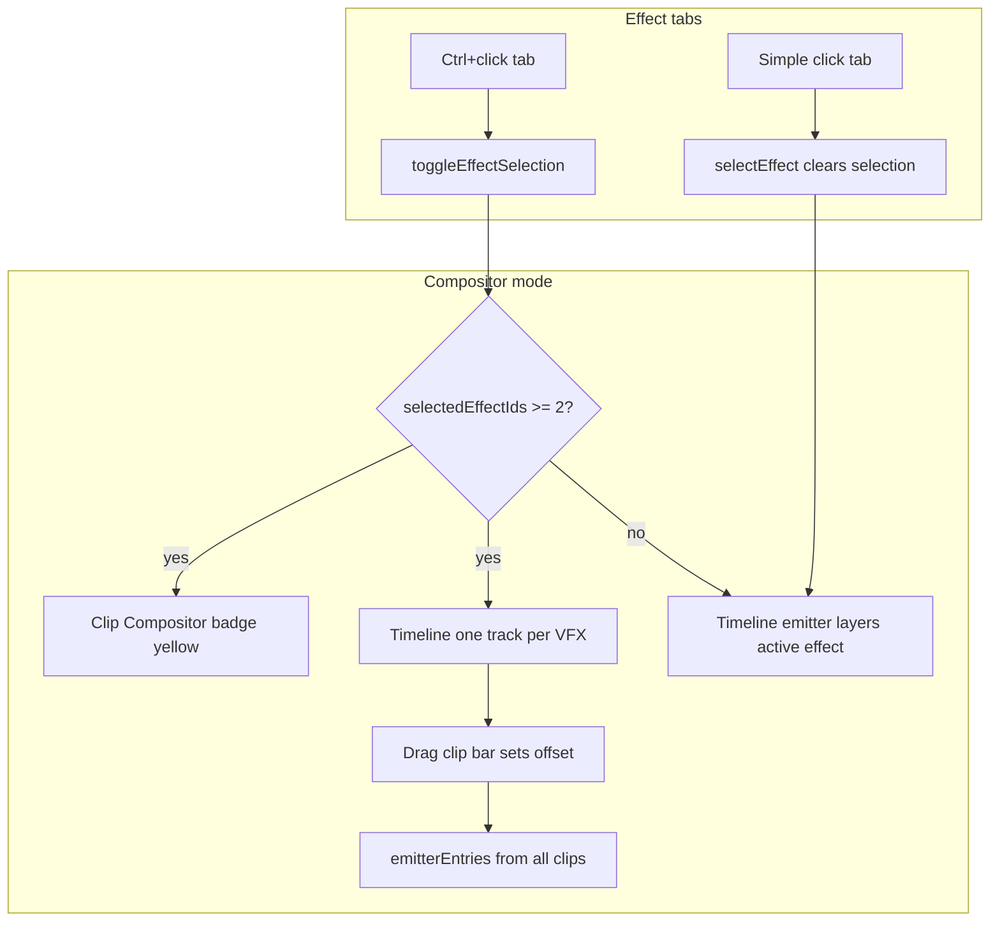
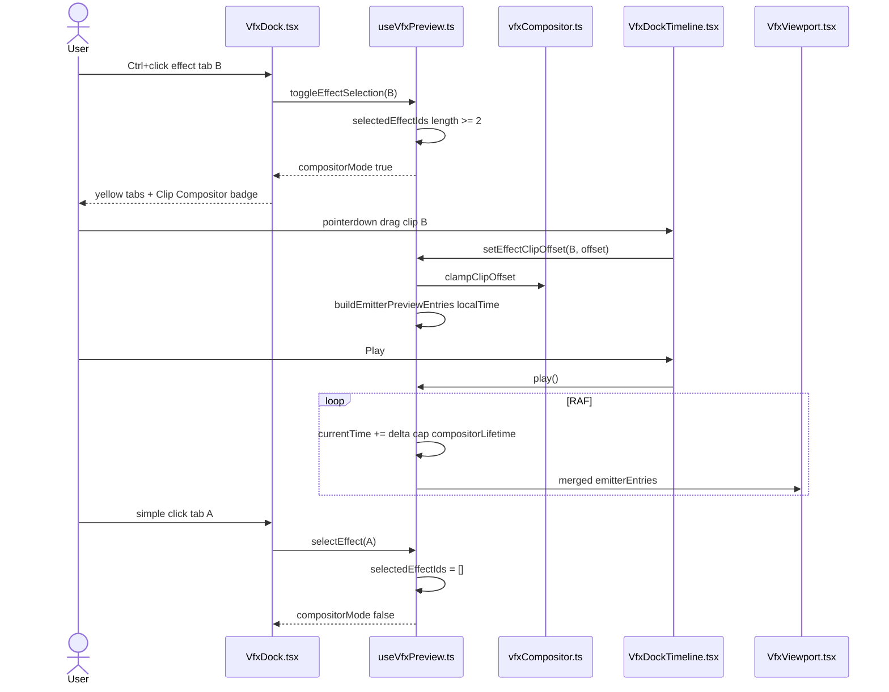

# Implementation Documentation — Clip Compositor (VFX Editor)

File location: `feature_md/feature/feature-clip-compositor-vfx.md`

## 1. Header

| Field | Value |
| --- | --- |
| Branch Name | `feature-clip-compositor-vfx` |
| Feature Name(s) | Clip Compositor (VFX Editor) |
| Current Version | `1.5.0` |
| Commit Hash | `3dd18ef` |

---

## 2. Tag Definition and Summary

| Tag | Definition |
| --- | --- |
| `[NOVO]` | New module, component, endpoint, or behaviour that did not exist before. |
| `[ATUALIZADO]` | Existing file or API extended without removing the previous contract. |
| `[REMOVIDO]` | Removed code path, export, or UI entry. |

Tags present in this implementation:

- `[NOVO]`
- `[ATUALIZADO]`

---

## 3. Operation Flowchart

---

## 4. Function Activation Sequence Diagram

---

## 5. Functions and Components Table

| Status | Name | Feature | Technical Description | Parameters / Return |
| --- | --- | --- | --- | --- |
| `[NOVO]` | `vfxCompositor.ts` | Clip Compositor | Pure helpers: `localTimeForClip`, `computeCompositorLifetime`, `buildCompositorTimelineLayers`, `clampClipOffset`, `compositorEmitterKey`. | clips, offsets → layers / lifetime |
| `[NOVO]` | `vfxPreviewEmitterEntries.ts` | Clip Compositor | Shared particle preview builder for single and compositor scenes. | `BuildEmitterPreviewEntriesOptions` → `VfxEmitterPreviewEntry[]` |
| `[NOVO]` | `vfxCompositor.test.ts` | Clip Compositor | Unit tests for lifetime, local time, timeline layers, clamp. | vitest |
| `[ATUALIZADO]` | `useVfxPreview.ts` | Clip Compositor | State: `selectedEffectIds`, `effectClipOffsets`, `compositorMode`, merged playback and preview lifetime. | hook API |
| `[ATUALIZADO]` | `VfxDock.tsx` | Clip Compositor | Ctrl+click tabs, compositor badge, timeline mode wiring. | props from hook |
| `[ATUALIZADO]` | `VfxDockTimeline.tsx` | Clip Compositor | `mode: emitters \| compositor`, draggable clip bars, `onClipOffsetChange`. | layer drag |
| `[ATUALIZADO]` | `VfxDock.module.css` | Clip Compositor | `.compositorBadge`, `.effectTabCompositor` yellow styles. | — |
| `[ATUALIZADO]` | `VfxDockTimeline.module.css` | Clip Compositor | `.trackBarDraggable` cursor for compositor clips. | — |

---

## 6. Detailed Operation Description

### Architecture

The Clip Compositor reuses the existing VFX preview pipeline (`buildEmitterPreviewEntries` → `VfxViewport`) but drives **multiple catalog entries** from one global timeline clock. Each selected VFX tab becomes a **clip** with a start offset on the global ruler; local simulation time is `max(0, currentTime - offset)`.

Emitter visibility keys are namespaced as `{effectId}/{emitterId}` in compositor mode to avoid ID collisions between effects that share emitter names.

### Business rules

- **Ctrl+click** toggles compositor selection without changing `activeEffectId` (inspector stays on the last simple-clicked tab).
- **Simple click** sets the active effect, clears compositor selection, resets time, and returns the timeline to per-emitter layers.
- Compositor activates when **two or more** effects are selected.
- Timeline lifetime in compositor mode is `max(offset + effectLifetime)` across clips.
- Clip offsets are clamped so each effect remains inside the compositor timeline span.

### Errors / edge cases

- Rebuild ritual clears compositor selection and offsets.
- If local time exceeds an effect’s lifetime, that effect contributes no particles until the global clock loops.
- Duplicate `catalogEntryId` for multiple ritual blocks (same `mapKey`) is a pre-existing catalog limitation.

---

## How to use (EN)

1. Open the **VFX Editor** with a ritual that defines **multiple** `VfxSystemDefinitionData` blocks (multiple effect tabs).
2. **Ctrl+click** two or more effect tabs — they highlight in **yellow** and the **Clip Compositor** badge appears.
3. The timeline shows **one row per selected effect**. **Drag** a row’s bar horizontally to delay or advance when that VFX starts.
4. Press **Play** — all selected effects run together in the viewport on the same clock.
5. **Click** a tab without Ctrl to exit compositor mode and edit a single effect (inspector + emitter layers).

---

## Como usar (PT)

1. Abra o **VFX Editor** com um ritual que tenha **vários** blocos VFX (várias abas de efeito).
2. Use **Ctrl+clique** em duas ou mais abas — ficam **amarelas** e aparece a etiqueta **Clip Compositor**.
3. Na linha do tempo, cada VFX seleccionado tem a sua **faixa**. **Arraste** a barra para mudar o instante em que esse efeito começa.
4. Carregue **Play** — todos os VFX seleccionados reproduzem em paralelo no viewport.
5. **Clique simples** numa aba para sair do compositor e voltar à edição de um único efeito (inspector + camadas por emitter).

---

## Acknowledgements

Special thanks to **Bud**, creator of the Jade tool that powers the BIN conversion system used in this project.
GitHub: https://github.com/budlibu500

Key contributions include:

* BIN code conversion
* BIN League syntax analysis
* Particle editing systems
* General-purpose editing tools

Their work and support were essential to the development and functionality of this project.
