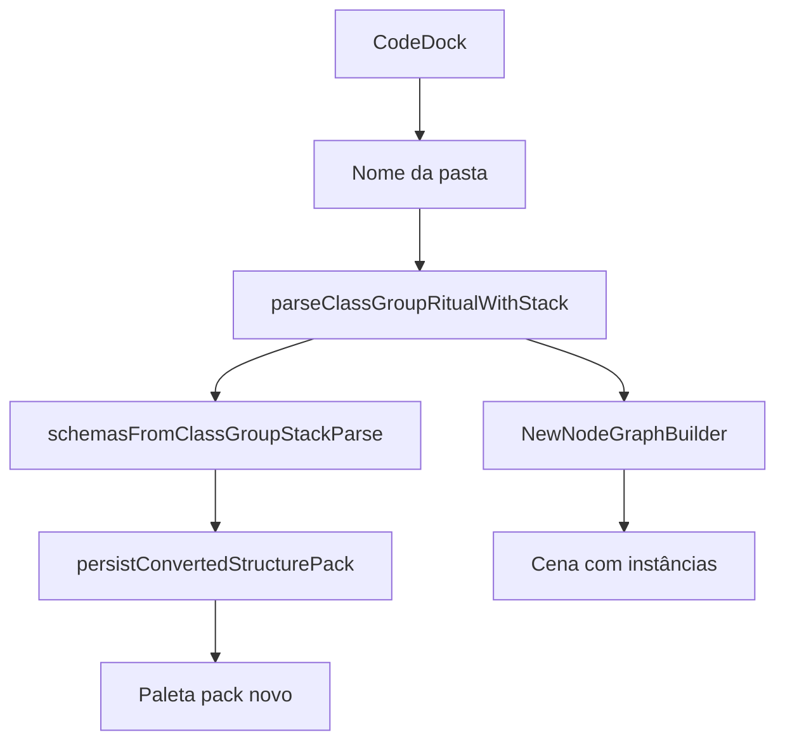

# Documentação de Implementação — Code to new node graph

Arquivo salvo em: `feature_md/feature/feature-code-to-new-node-graph.md`

## 1. Cabeçalho

| Campo | Valor |
| --- | --- |
| Nome da Branch | `feature/code-to-new-node-graph` |
| Nome das Features | Code to new node graph |
| Versão actual | `1.2.0` |
| Hash do Commit | _(preencher após commit)_ |

## 2. Definição e Resumo de Tags

| Tag | Definição |
| --- | --- |
| `[NOVO]` | Módulo ou fluxo criado nesta feature. |
| `[ATUALIZADO]` | Componente existente alterado. |

## 3. Diferença face ao Code To Node Graph

| | Code To Node Graph | Code to new node graph |
| --- | --- | --- |
| Pack | Selecciona pasta **existente** | **Cria** pasta nova (input no diálogo) |
| Schema do nó | Template JSON do pack + ritual-only | Schema e valores **só** do ritual |
| Ordem de build | `createNode` → `attachLink` | Por nó: **elementos** → **valores** → **estruturas internas** → ligações |

Relacionado: [feature-code-to-node-graph.md](feature-code-to-node-graph.md).

## 4. Fluxograma

## 5. Tabela de componentes

| Status | Nome | Descrição |
| --- | --- | --- |
| `[NOVO]` | `codeToNewNodeGraph.ts` | Materialização por fase + `NewNodeGraphBuilder` |
| `[NOVO]` | `codeToNewNodeGraphSteps.ts` | Plano de passos + build incremental |
| `[NOVO]` | `useCodeToNewNodeGraphWizard` | Wizard passo a passo com revisão |
| `[ATUALIZADO]` | `CodeDock` | Secção Tools + diálogo pasta |
| `[ATUALIZADO]` | `App.tsx` | Handlers + persist pack + painel wizard |

## 6. Materialização por fase

### 6.1 Nó raiz (wizard / one-shot)

O nó **raiz** (`main`) passa pelas fases shell → elements → values → internals antes das ligações.

### 6.2 Uma ligação = uma instância canvas

Regra estrutural (v1.2.0): **cada ligação** (embed, pointer, list[pointer], internal, map, etc.) cria **um** nó canvas novo, mesmo quando o `childParsedId` / tipo de schema se repete (ex.: três `rate: embed = ValueFloat` → três nós `value-float-*`; três slots `list[pointer]` → três emitters).

- `NewNodeGraphBuilder.createChildCanvasNodeForLink` materializa o filho em fase **full** e **não** deduplica por `parsedId` no walk.
- `parsedToCanvas` regista a última instância por template (resolução de pai no wizard incremental); filhos estruturais **não** reutilizam o mesmo canvas.
- Paridade em `codeToCanvasScene.ts` (`SceneBuilder`) para Code To Node Graph.
- No parser, embed/pointer/link inline usam `ensureSchemaInstance` + `schemaInstanceKey` (corpo distinto por ocorrência no registry).

Passos do wizard incremental: fases só no **raiz**; cada `attachLink` cria o filho completo (sem passos shell/elements/values/internals duplicados no mesmo `parsedId`).

### 6.3 Ordem global

1. **shell** — id, título, nomenclatura (raiz)
2. **elements** — blocos embed, pointer, list[list2] (raiz)
3. **values** — parâmetros e `values` da instância (raiz)
4. **internals** — estruturas internas + slots do parse (raiz)
5. **attachLink** — por ligação: nova instância canvas + wireless (filhos em `full`)
6. **syncStructuralSlotsOnNodes** — após todas as ligações, repõe slots no schema do pai a partir dos nós filhos (embed/pointer/list)

Campos ritual `campo: embed = ValueFloat { … }` exigem a linha de abertura só com `{` (corpo nas linhas seguintes). A fase `elements` deixa `slots` vazios de propósito; `internals` + `attachLink` + sync preenchem o bloco no card — não basta criar só o nó filho no canvas.

## 7. UI

Tools → **Code to new node graph** → diálogo com nome da pasta → **Gerar** ou **Passo a passo**.

Preferência de pasta: `getCodeToNewNodeGraphPackFolder` / `setCodeToNewNodeGraphPackFolder` em `nodeConfigurationPreference.ts`.

## 8. Testes

Vitest: [`codeToNewNodeGraph.test.ts`](../../src/core/codeToNewNodeGraph.test.ts).
