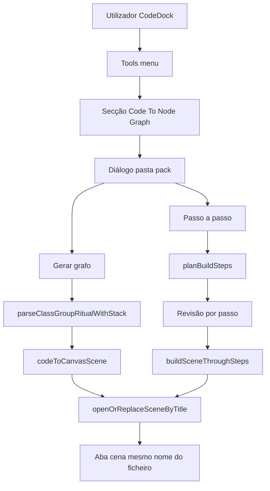
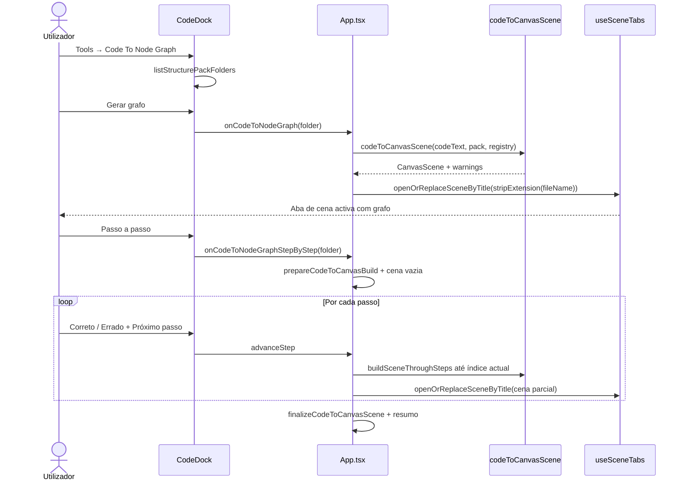

# Documentação de Implementação — Code To Node Graph

Arquivo salvo em: `feature_md/feature/feature-code-to-node-graph.md`

## 1. Cabeçalho

| Campo | Valor |
| --- | --- |
| Nome da Branch | `feature/code-to-node-graph` |
| Nome das Features | Code To Node Graph |
| Versão atual | `1.8.0` |
| Hash do Commit | _(preencher após commit)_ |

## 2. Definição e Resumo de Tags

| Tag | Definição |
| --- | --- |
| `[NOVO]` | Módulo, diálogo ou endpoint criado nesta branch. |
| `[ATUALIZADO]` | Fluxo ou componente existente alterado. |
| `[REMOVIDO]` | Comportamento ou ficheiros deixados de ser obrigatórios. |

Tags presentes nesta implementação:

- `[NOVO]`
- `[ATUALIZADO]`

## 3. Fluxograma de Funcionamento

## 4. Fluxograma de Acionamento de Funções

## 5. Tabela de Funções e Componentes

| Status | Nome | Feature | Descrição | Parâmetros |
| --- | --- | --- | --- | --- |
| `[NOVO]` | `codeToCanvasScene` | Code To Node Graph | Parse Class Group + instancia árvore wireless | `source`, `packFolder`, `registry`, `packFolderBySchemaId` → `CodeToCanvasSceneResult` |
| `[NOVO]` | `buildPackTypeIndex` / `resolvePackSchemaId` | Code To Node Graph | Mapeia tipos ritual → schemaId do pack | schemas / parsed schema |
| `[NOVO]` | `canvasNodeIds.createUniqueNodeId` | Code To Node Graph | IDs únicos de instâncias na cena | `schemaId`, `nodes[]` → `string` |
| `[NOVO]` | `getCodeToNodeGraphPackFolder` | Code To Node Graph | Preferência de pasta (default `default`) | → `string` |
| `[NOVO]` | `createRitualCanvasNodeInstance` | Code To Node Graph | Instancia nó com parâmetros só do ritual | registry, packSchemaId, parsed |
| `[NOVO]` | `codeToCanvasSteps` | Code To Node Graph | Plano de passos + build incremental | `planBuildSteps`, `buildSceneThroughSteps`, `prepareCodeToCanvasBuild` |
| `[NOVO]` | `useCodeToCanvasWizard` | Code To Node Graph | Estado do wizard (passos, vereditos, cena parcial) | `startWizard`, `controller` |
| `[NOVO]` | `CodeToCanvasWizardPanel` | Code To Node Graph | UI revisão Correto/Errado + Próximo passo | `CodeToCanvasWizardController` |
| `[ATUALIZADO]` | `CodeDock` + `CodeDockNodeActions` | Code To Node Graph | Duas secções Tools: Node Graph + Code To Node Graph | `onCodeToNodeGraph`, `onCodeToNodeGraphStepByStep`, `getDefaultStructurePackFolder` |
| `[ATUALIZADO]` | `collectChildLinks` | Code To Node Graph | Slots list/list2; sem duplicar embed/pointer | parse registry |
| `[ATUALIZADO]` | `useSceneTabs.openOrReplaceSceneByTitle` | Code To Node Graph | Substitui aba existente com mesmo título | `title`, `CanvasScene` |
| `[ATUALIZADO]` | `App.handleCodeToNodeGraphPack` | Code To Node Graph | Orquestra conversão e abre cena | `packFolder` → `boolean` |

## 6. Descrição Detalhada

### Menu Tools (duas secções)

1. **Node Graph** — conversores de ritual para pack JSON (Jade fx_editor, Class Group, Extrair, Nomenclatura, Deletar pack).
2. **Code To Node Graph** (separador visual) — ferramenta que gera a cena gráfica a partir do código Class Group activo.

### Comportamento da geração

A ferramenta lê o ritual **Class Group** da aba activa, usa os schemas JSON do pack escolhido (pré-selecção `default` ou última pasta em `localStorage`) e gera uma **cena gráfica**:

- Raiz `main` e árvore completa (map hash, embed, pointer, list/list2, internal structures).
- **Um nó canvas por instância ritual** (`ensureSchemaInstance` no parser); cada saída liga a um filho distinto.
- Todas as ligações em modo **sem fio** (`routing: 'wireless'`).
- Layout em árvore (Δx 520, Δy 110).

### Parâmetros «ritual only»

Por nó, `createRitualCanvasNodeInstance` em [`codeToCanvasScene.ts`](../../src/core/codeToCanvasScene.ts):

1. Instancia o schema do pack (blocos estruturais LIST/EMBED/POINTER mantêm-se).
2. Remove parâmetros e valores do pack (`required_parameter` / `linked_parameter_values` omitidos).
3. Adiciona **um a um** apenas os campos presentes no ritual, com valores do código.

O card não mostra dezenas de defaults do JSON do pack (ex. `VfxEmitterDefinitionData.json`).

### Ligações 1:1

`collectChildLinks` usa `slots` quando existem (list[pointer], list[embed]); embed/pointer preferem slots populados em vez de duplicar catálogo + slot.

**Match ritual ↔ pack:** nomes de campo no ritual (`ComplexEmitterDefinitionData`) são resolvidos para títulos camelCase do pack (`complexEmitterDefinitionData`) via comparação case-insensitive e PascalCase→camelCase.

**Slots LIST_* na instância:** `mergeParsedListStructuralSlots` copia `slots` do parse para o schema do pack (ids normalizados com `listPointerSlotId` / `listEmbedSlotId`) e define `templateBlockId` para evitar que `hydrateScene` → `normalizeListPointerInstances` divida blocos com vários itens em instâncias separadas. `attachLink` chama `appendListPointerSlotIfNeeded` / `appendListEmbedSlotIfNeeded` antes do patch; `buildScene` sincroniza slots a partir das ligações.

Se já existir aba de cena com o mesmo nome que o ficheiro de código (`stripExtension(fileName)`), o grafo é **substituído**; caso contrário abre nova aba. Avisos aparecem em `window.alert` após sucesso parcial.

Fora de âmbito: ritual VFX (Jade fx_editor).

### Relacionado

[Code to new node graph](feature-code-to-new-node-graph.md) — cria pack novo a partir do ritual e instâncias na cena (sem seleccionar pack existente); ordem elementos → valores → estruturas internas.

### Modo passo a passo com revisão

No mesmo diálogo de pack, **Passo a passo** mantém **Gerar grafo** intacto.

1. `prepareCodeToCanvasBuild` valida ritual/pack e gera `planBuildSteps` (cada `createNode` e cada `attachLink`, na ordem de `walkParsedNode`).
2. Abre aba de cena **vazia** com o nome do ficheiro de código.
3. Painel modal (`CodeToCanvasWizardPanel`): descrição do passo, **Correto** / **Errado** (radiogroup), textarea obrigatória se Errado, **Próximo passo** / **Concluir**.
4. Cada avanço aplica o passo actual via `buildSceneThroughSteps` (sem `hydrate` intermédio); no fim `finalizeCodeToCanvasScene`.
5. Resumo final lista passos errados com notas; avisos de build em `alert` ao fechar (se existirem).

Vereditos **não** são persistidos em `workspace/logic.json` (sessão actual apenas).

### Struct-only vazio (`Type {}`) — EN

In ritual Class Group text, a line like `VfxProbabilityTableData {}` means **an empty structural slot**: the list or embed/pointer keeps a position in the parent node, but **no child canvas node** is created and **no wireless connection** is drawn.

| Direction | Ritual | Canvas |
| --- | --- | --- |
| **Code → graph** | `Type {}` in `list[pointer]`, `list[embed]`, `embed`, or `pointer` | Slot appears on the parent (e.g. `probabilityTables`); index shows as unlinked until you connect a node |
| **Graph → code** | `Type {}` one line | Slot exists on parent but **no connection** from that slot |
| **Graph → code** | Full block with fields | Slot has a **connection** to a child node |

**How to use**

1. Import ritual with `Tools → Code To Node Graph`: empty `{}` entries become **slots only** (no ghost nodes).
2. To fill an empty slot: drag from the slot port to a `VfxProbabilityTableData` node, or use **Element** on the list.
3. **View code** / **Sync to code**: unlinked slot → `{}`; linked slot → exported body (`keyTimes`, `keyValues`, …).

Implementation: parse sets `structOnlyEmpty: true` on the slot; `collectChildLinks` skips those refs; export iterates all list slots and emits `{}` when there is no connection ([`structOnlyEmpty.test.ts`](../../src/core/structOnlyEmpty.test.ts)).

### Struct-only vazio (`Type {}`) — PT

No ritual, `VfxProbabilityTableData {}` (ou outro `Tipo {}` sem corpo) significa **slot estrutural vazio**: a lista ou o `embed`/`pointer` mantém o lugar no nó pai, mas **não se cria nó filho** no canvas nem ligação wireless.

| Direcção | Ritual | Grafo |
| --- | --- | --- |
| **Código → grafo** | `Type {}` em `list[pointer]`, `list[embed]`, `embed` ou `pointer` | O slot aparece no pai (ex.: `probabilityTables`); fica sem ligação até ligares um nó |
| **Grafo → código** | `Type {}` numa linha | Slot no pai **sem connection** |
| **Grafo → código** | Bloco com campos | Slot **com ligação** ao nó filho |

**Como usar**

1. **Code To Node Graph**: entradas `{}` viram só slot (sem nós fantasma).
2. Para preencher: arrasta do porto do slot até ao nó (ex. `VfxProbabilityTableData`) ou usa **Element** na lista.
3. **Ver código** / **Sincronizar valores**: slot vazio → `{}`; slot ligado → bloco completo no export.

### Testes

Vitest em [`codeToCanvasScene.test.ts`](../../src/core/codeToCanvasScene.test.ts): ritual-only, map hash duplicado, list[embed], list[pointer].

Vitest em [`codeToCanvasSteps.test.ts`](../../src/core/codeToCanvasSteps.test.ts): ordem de passos, paridade incremental vs `codeToCanvasScene`.

Vitest em [`structOnlyEmpty.test.ts`](../../src/core/structOnlyEmpty.test.ts): import `{}` + slot cheio; export `{}` vs bloco; `pointer` vazio numa linha.
