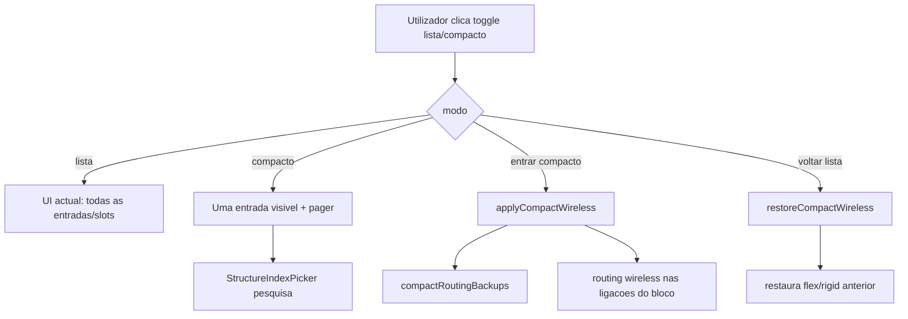
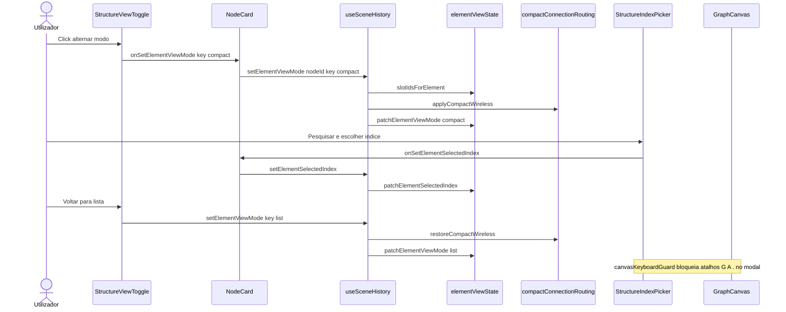

# Documentação de Implementação — Visualização compacta de estruturas internas

Arquivo salvo em: `feature_md/feature/feature-compact-structure-view.md`

## 1. Cabeçalho

| Campo | Valor |
| --- | --- |
| Nome da Branch | `feature/compact-structure-view` |
| Nome das Features | Modo compacto lista/compacto por bloco estrutural; paginação e picker de índice; wireless automático com restauração; isolamento de atalhos do canvas no picker |
| Versão atual | `1.4.0` |
| Hash do Commit | `c0e80d5` |

## 2. Definição e Resumo de Tags

| Tag | Definição |
| --- | --- |
| `[NOVO]` | Novo componente, arquivo, função ou tipo criado nesta branch. |
| `[ATUALIZADO]` | Componente ou fluxo existente alterado para suportar a feature. |
| `[REMOVIDO]` | Código ou comportamento removido ou descontinuado. |

Tags presentes nesta implementação:

- `[NOVO]`
- `[ATUALIZADO]`

Não houve itens classificados como `[REMOVIDO]` nesta branch.

## 3. Fluxograma de Funcionamento

## 4. Fluxograma de Acionamento de Funções

## 5. Tabela de Funções e Componentes

| Status | Nome | Feature Correspondente | Descrição Técnica | Parâmetros Recebidos / Retorno |
| --- | --- | --- | --- | --- |
| `[NOVO]` | `elementViewState.ts` | Estado compacto | Chaves `param:`, `embed:`, `listEmbed:`, etc.; `getElementViewState`, `slotIdsForElement`, `isSlotInCompactElementView`, patches de modo/índice. | `(node, key)` → `ElementViewState`; `slotIdsForElement` → `string[]` |
| `[NOVO]` | `compactConnectionRouting.ts` | Wireless automático | `applyCompactWireless` / `restoreCompactWireless` com backup em `CanvasScene.compactRoutingBackups`. | `(scene, nodeId, slotIds)` → `CanvasScene` |
| `[NOVO]` | `elementViewLayout.ts` | Altura canvas | Alturas lista vs compacta para map e blocos LIST/EMBED. | Helpers de altura compacta |
| `[NOVO]` | `canvasKeyboardGuard.ts` | Isolamento teclado | Bloqueia atalhos da grelha/canvas com picker de índice aberto. | `shouldIgnoreCanvasKeyboardShortcut(event)` |
| `[NOVO]` | `StructureViewToggle` | UI toggle | Botão lista ↔ compacto no cabeçalho do bloco. | `mode`, `onModeChange` |
| `[NOVO]` | `StructureIndexPager` | Paginação | `<` · `índice / total` · `>`; clique abre picker. | `selectedIndex`, `total`, callbacks |
| `[NOVO]` | `StructureIndexPicker` | Picker índice | Modal com pesquisa; lista hash/nome + índice. | `items`, `onSelect`, `onClose` |
| `[NOVO]` | `structureBlockViewProps.ts` | Tipos partilhados | Props de modo/índice para blocos estruturais. | `StructureBlockViewProps` |
| `[ATUALIZADO]` | `nodeSchema.ts` | Modelo | `ElementViewMode`, `ElementViewState`, `elementView` em `NodeInstance`. | Tipos exportados |
| `[ATUALIZADO]` | `canvasScene.ts` | Cena | `compactRoutingBackups` em `CanvasScene`; hydrate `elementView`. | Campo opcional na cena |
| `[ATUALIZADO]` | `workspacePersistence.ts` | Persistência | Serializa `elementView` e `compactRoutingBackups`. | Logic + graph JSON |
| `[ATUALIZADO]` | `MapHashStructureBlock.tsx` | Parâmetros map* | Toggle, vista compacta, pager, picker por entrada. | Props `viewMode`, `selectedIndex` |
| `[ATUALIZADO]` | `EmbedItem`, `PointerItem` | EMBED/POINTER | Toggle; 1 slot visível em compacto. | `StructureBlockViewProps` |
| `[ATUALIZADO]` | `ListEmbedItem`, `ListPointerItem` | LIST_* | Toggle; 1 slot + pager + picker. | Idem |
| `[ATUALIZADO]` | `List2EmbedItem`, `List2PointerItem` | LIST2_* | Toggle; 1 instância visível + pager. | Wireless em todos os slots do bloco |
| `[ATUALIZADO]` | `ParameterItem` + inputs map | Parameters | Propaga estado de visualização aos blocos map. | Handlers do NodeCard |
| `[ATUALIZADO]` | `NodeCard.tsx` | Card | `blockViewProps` por bloco; handlers `onSetElementViewMode`. | Por `elementViewKey` |
| `[ATUALIZADO]` | `useSceneHistory.ts` | Histórico | `setElementViewMode`, `setElementSelectedIndex`; ligações novas em bloco compacto → wireless. | `connectNodes`, `createChildNode` |
| `[ATUALIZADO]` | `GraphCanvas.tsx` | Canvas | Alturas compactas; `shouldIgnoreCanvasKeyboardShortcut`. | `getParameterRowHeight`, atalhos |
| `[ATUALIZADO]` | `App.tsx` | App | Passa handlers ao `GraphCanvas`; ignora atalhos com modal aberto. | Props de cena |
| `[ATUALIZADO]` | `prompet_elements.md` | Docs elementos | Secções e parâmetros map* com modo compacto. | Markdown |

## 6. Descrição Detalhada de Funcionamento

Esta branch introduz **visualização compacta** para blocos com estruturas internas ligáveis no editor de grafos LoL, alinhada ao ritual de parâmetros `map[hash,pointer]`, `map[hash,embed]`, `map[u64,pointer]` e às secções **EMBED**, **POINTER**, **LIST_EMBED**, **LIST_POINTER**, **LIST2_EMBED** e **LIST2_POINTER**.

### Modelo de dados

Cada instância de nó pode guardar `elementView?: Record<ElementViewKey, ElementViewState>`, onde a chave identifica o bloco (`param:mBlendDataTable-id`, `listEmbed:block-id`, etc.) e o valor contém `mode: 'list' | 'compact'` e opcionalmente `selectedIndex` (0-based).

Ao alternar para **compacto**, o histórico chama `applyCompactWireless`: para cada ligação de saída cujo `fromInternalStructureId` pertence ao bloco, guarda-se o `routing` anterior em `CanvasScene.compactRoutingBackups` e define-se `routing: 'wireless'`. Ao voltar à **lista**, `restoreCompactWireless` repõe o routing guardado.

### UI

- **Lista:** comportamento anterior (todas as entradas ou slots visíveis).
- **Compacto:** uma entrada/slot/instância por vez, com `StructureIndexPager` (`0 / N`) e `StructureIndexPicker` (pesquisa por hash, nome ou índice).
- **Toggle** (`StructureViewToggle`) no cabeçalho do bloco, antes dos botões `−`/`+`.

### Canvas e teclado

`elementViewLayout` reduz a altura estimada do card em modo compacto para alinhar portas SVG/wireless. `canvasKeyboardGuard` impede que atalhos do canvas (por exemplo **G** = glue na grelha, **A**, **.**) actuem enquanto o picker de índice está aberto ou o foco está dentro de um modal `aria-modal`.

### Fora de escopo

A secção top-level **Internal_Structures** (`link = Tipo`) não recebe toggle compacto.

### Testes

Vitest em `elementViewState.test.ts`, `compactConnectionRouting.test.ts` e `elementViewLayout.test.ts`.
