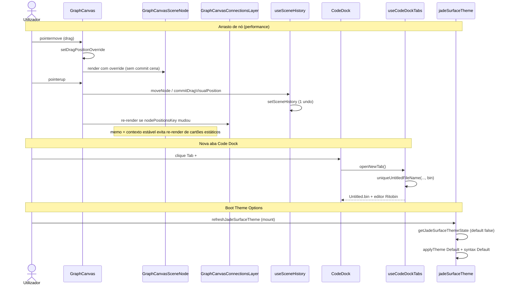

# Documentação de Implementação — Chrome de Editores, Blocos Compactos e Performance do Canvas

Arquivo salvo em: `feature_md/feature/feature-editor-chrome-compact-canvas-perf.md`

## 1. Cabeçalho

| Campo | Valor |
| --- | --- |
| Nome da Branch | `feature/editor-chrome-compact-canvas-perf` |
| Nome das Features | Chrome unificado dos editores (Node / Code / VFX); modo compacto de elementos em blocos (modo leve); performance de arrasto no canvas; coluna redimensionável na timeline VFX; Code Dock — aba `+` cria `.bin`; Theme Options desactivados por defeito; Monaco lazy-load; botões de contexto compactos (`ctxAppButtons`) |
| Versão atual | `1.5.0` |
| Hash do Commit | _(preenchido após commit de entrega)_ |

Documentação relacionada: `feature_md/feature/feature-jade-surface-theme.md`, `feature_md/feature/feature-compact-structure-view.md`, `feature_md/feature/feature-canvas-snap-menu-slash-commands.md`.

---

## 2. Definição e Resumo de Tags

| Tag | Definição |
| --- | --- |
| `[NOVO]` | Novo módulo, hook, componente, worker ou fluxo criado nesta entrega. |
| `[ATUALIZADO]` | Componente ou função existente alterada para suportar chrome, compact view, performance ou defaults. |
| `[REMOVIDO]` | Comportamento, layout ou default substituído por nova convenção. |

Tags presentes nesta implementação:

- `[NOVO]`
- `[ATUALIZADO]`
- `[REMOVIDO]`

---

## 3. Fluxograma de Funcionamento

```mermaid
graph TD
  subgraph chrome [Chrome dos editores]
    A[App / CodeDock / VfxDock] --> B[EditorDockFavicon]
    A --> C[EditorWindowHeaderChrome]
    C --> D[Toggle tools retráctil]
    C --> E[Acções File / Save / etc.]
  end

  subgraph blocks [Blocos — modo leve]
    F[sceneLightModeEnabled] --> G[blockElementViewState no nó]
    G --> H{mode compact?}
    H -->|Sim| I[StructureIndexPager + índice persistido]
    H -->|Não| J[Lista completa de elementos]
    I --> K[isNodeVisibleOnCanvas filtra ramos]
  end

  subgraph canvas [Canvas — arrasto]
    L[pointermove] --> M[dragPositionOverride local]
    M --> N[GraphCanvasSceneNode posição visual]
    L --> O[pointerup]
    O --> P[moveNode + updateScene]
    P --> Q[GraphCanvasConnectionsLayer só se paths mudam]
  end

  subgraph codedock [Code Dock]
    R[Tab +] --> S[uniqueUntitledFileName bin]
    T[Theme Options sem prefs] --> U[toggles OFF → Default]
  end

  subgraph vfx [VFX Editor]
    V[Resize handle coluna layers] --> W[vfx-timeline-layer-column-width]
    X[Viewport] --> Y[border-radius 0 + padding 0]
  end
```

---

## 4. Fluxograma de Acionamento de Funções

---

## 5. Tabela de Funções e Componentes

| Status | Nome | Feature | Descrição Técnica | Parâmetros / Retorno |
| --- | --- | --- | --- | --- |
| `[NOVO]` | `EditorWindowHeaderChrome.tsx` | Chrome editores | Faixa segmentada full-height para botões de acção nos docks. | `children` → strip React. |
| `[NOVO]` | `EditorDockFavicon.tsx` | Favicon por editor | Ícone `node` / `code` / `vfx` (SVG azul/vermelho/verde). | `kind: 'node' \| 'code' \| 'vfx'`. |
| `[NOVO]` | `blockElementViewState.ts` | Compact view blocos | Estado `list` \| `compact` + `selectedIndex` por parâmetro/slot; chaves persistidas no nó. | `getBlockElementViewState`, `patchBlockElementSelectedIndex`. |
| `[NOVO]` | `blockCompactBranchVisibility.ts` | Visibilidade compacta | Oculta ramos de lista/map não seleccionados no canvas em modo leve. | `createCompactElementCanvasVisibility`. |
| `[NOVO]` | `GraphCanvasConnectionsLayer.tsx` | Performance canvas | Camada SVG memoizada; paths só recalculam quando topologia/posições mudam. | `nodePositionsKey`, `connections`, `portAnchors`. |
| `[NOVO]` | `GraphCanvasSceneNode.tsx` | Performance canvas | Cartão de nó isolado com `memo` e contexto enxuto. | Props de nó + handlers delegados. |
| `[NOVO]` | `GraphCanvasNodeHostContext.tsx` | Performance canvas | Contexto React sem `scene` completa para evitar invalidação global. | Provider + hooks. |
| `[NOVO]` | `graphCanvasDragPosition.ts` | Arrasto fluido | Override visual de posição durante drag sem mutar cena. | `resolveGraphCanvasNodeRenderPosition`. |
| `[NOVO]` | `graphCanvasSceneMemoKeys.ts` | Performance canvas | Chaves estáveis para wireless maps e slot indices. | Funções `*Key` derivadas da topologia. |
| `[NOVO]` | `useGraphCanvasWirelessDisplayMaps.ts` | Performance canvas | Mapas wireless estáveis quando só posição muda. | Hook → maps memoizados. |
| `[NOVO]` | `useGraphCanvasBlockSlotIndexMap.ts` | Performance canvas | Índices de slot de bloco estáveis entre frames de drag. | Hook → `Map` read-only. |
| `[NOVO]` | `useCompactElementVisibility.ts` | Modo leve | Visibilidade de elementos compactos desacoplada de mutações de posição. | `scene` filtrado + light mode flag. |
| `[NOVO]` | `blockOrganizationLayout.ts` | Organização blocos | Alinhar/distribuir blocos seleccionados via menu de contexto. | `applyBlockOrganizationToScene`. |
| `[NOVO]` | `useVfxTimelineLayerColumnResize.ts` | Timeline VFX | Drag horizontal 96–360px; persiste `vfx-timeline-layer-column-width`. | `onLayerColumnResizePointerDown`, `tracksShellStyle`. |
| `[NOVO]` | `configureMonacoLoader.ts` | Code Dock perf | Import lazy de `monaco-editor` só quando Code Dock monta. | `configureMonacoLoader()` → `Promise<void>`. |
| `[NOVO]` | `ctxAppButtons.css` | Design system | Tokens `--ctx-menu-*`, hover `#007acc`, toggles compactos nos menus. | CSS global importado em `main.tsx`. |
| `[NOVO]` | `vfxTimelineSyntaxAccent.ts` | Timeline VFX | Realce sintáctico de nomes de emitter nas faixas. | Funções de cor por classificação. |
| `[NOVO]` | `sceneComputeWorkerClient.ts` | Worker (prep.) | Cliente para offload de computação pesada da cena (Vite worker). | API async para worker. |
| `[ATUALIZADO]` | `App.tsx` / `App.module.css` | Layout grade | Grade `[favicon] → [toolbar] → [abas] → [status]`; favicon node. | Props de chrome nos docks. |
| `[ATUALIZADO]` | `CodeDock.tsx` | Code Dock | Header chrome + favicon vermelho; Monaco lazy; menu Options Theme. | Integração `EditorWindowHeaderChrome`. |
| `[ATUALIZADO]` | `VfxDock.tsx` / `VfxDockTimeline.tsx` | VFX Editor | Faixa ritual acima de LAYERS; coluna redimensionável; chrome verde. | CSS `--vfx-timeline-layer-col-width`. |
| `[ATUALIZADO]` | `VfxViewport.module.css` | Viewport VFX | `border-radius: 0`; coluna sem padding lateral. | Layout flush com timeline. |
| `[ATUALIZADO]` | `GraphCanvas.tsx` | Canvas | Drag override, connections layer, delegação de eventos, culling viewport. | Refactors multi-ficheiro. |
| `[ATUALIZADO]` | `useSceneHistory.ts` | Histórico | `setBlockElementSelectedIndex`, `setBlockElementViewMode`; drag transient flags. | API undo/redo estendida. |
| `[ATUALIZADO]` | `sceneLightMode.ts` | Modo leve | `applyLightModeCompactToBlockNode`, `initBlockIndices` após merge code→block. | `applyLightModeToScene` options. |
| `[ATUALIZADO]` | `useCodeDockTabs.ts` | Code Dock tabs | Botão `+` cria `Untitled.bin` (extensão `bin`). | `openNewTab()` default ext. |
| `[ATUALIZADO]` | `jadeSurfaceTheme.ts` / `useJadeSurfaceTheme.ts` | Theme Options | Defaults OFF (Tema, Syntax, Background, Fonts) → stack Default nativa. | `readSplitPref` fallback `false`. |
| `[ATUALIZADO]` | `BlockCard.tsx` / `BlockParameterRow.tsx` | UI blocos | Pager compacto, menus ctx, campos map-hash com índice persistido. | Modo leve + view state. |
| `[ATUALIZADO]` | `canvasContextMenuItems.ts` | Menus | Organização de blocos, toggles Theme Options, visibilidade compacta. | `ContextMenuItemId` estendido. |
| `[ATUALIZADO]` | `workspacePersistence.ts` / `scenePresentation.ts` | Persistência | Serializa `blockElementView` e preferências de split VFX. | JSON de cena + localStorage. |
| `[ATUALIZADO]` | `languageIds.ts` + `pt-br.json` / `en.json` | i18n | `GraphDockTitle`, `CodeDockTitle`, `VfxTimelineLayerColumnResizeAria`, menus bloco. | LangId 653–655+. |
| `[REMOVIDO]` | Posição commitada a cada `pointermove` | Performance | Substituído por override local + commit único no `pointerup`. | — |
| `[REMOVIDO]` | Default `.txt` na aba `+` | Code Dock | Substituído por `.bin` / Ritobin. | — |
| `[REMOVIDO]` | Theme Options ON por defeito | Jade surface | Substituído por toggles OFF → Default design system. | — |
| `[REMOVIDO]` | `tracksShellExpanded` fixo 220px | Timeline VFX | Substituído por coluna redimensionável persistente. | — |

---

## 6. Descrição Detalhada de Funcionamento

### Arquitectura (English)

This delivery unifies editor chrome across the node grid, Code Dock, and VFX Editor using shared `EditorWindowHeaderChrome` and `EditorDockFavicon` components aligned with the Monaco/Jade compact shell (`--ctx-menu-*`, zero outer radius on editor shells). The tools strip collapses by default to maximize tab and action space.

Block **compact element view** integrates with **light mode**: each list/map field can store `blockElementView` on the canvas node (`mode: compact`, `selectedIndex`). Visibility helpers hide non-selected branches on the canvas while inspectors keep full editing via pagers. State survives workspace persistence and participates in undo/redo through `useSceneHistory`.

**Canvas drag performance** decouples visual movement from scene commits. During drag, only `dragPositionOverride` updates inside `GraphCanvas`; connection paths and wireless maps use topology-stable memo keys so unrelated nodes do not re-render. On `pointerup`, a single `moveNode` commits to history. `GraphCanvasConnectionsLayer` isolates SVG path work.

**VFX timeline** adds a resizable layer-name column (localStorage `vfx-timeline-layer-column-width`) and flattens the 3D viewport against the timeline (no outer padding/radius). Ritual name (`particleName`) moves to a banner above the LAYERS column.

**Code Dock**: the tab bar `+` button creates `Untitled.bin` with Ritobin language. **Theme Options** default to disabled; when no preference exists, `getJadeSurfaceThemeState` returns all flags `false`, applying native Default theme and syntax via `refreshJadeSurfaceTheme`.

**Monaco** loads lazily through `configureMonacoLoader` to avoid hundreds of ESM requests at app boot. Context menus across the app migrate to `ctxAppButtons.css` for consistent compact toggles and hover `#007acc`.

Error handling: theme refresh wraps apply in try/catch with Default fallback; resize preferences clamp to min/max; block organization requires ≥2 selected block nodes.

### Arquitectura (Português)

Esta entrega unifica o chrome dos três editores (grade de nós, Code Dock, VFX) com componentes partilhados e favicons por tipo. A faixa de ferramentas inicia **retraída**; botões usam o design compacto Jade/Monaco.

O **modo compacto de elementos em blocos** (modo leve) guarda por parâmetro/slot o modo `list` ou `compact` e o índice seleccionado no nó. Ramificações não activas deixam de ser desenhadas no canvas, reduzindo custo visual; inspetores e pagers mantêm edição completa. O estado persiste no workspace e entra no undo/redo.

A **performance do arrasto** separa movimento visual do commit da cena: durante o drag só muda estado local; no `pointerup` grava-se uma vez no histórico. Ligações SVG ficam numa camada memoizada; cartões de nó usam contexto enxuto para não re-renderizar quando só a posição de outro nó muda.

Na **timeline VFX**, a coluna de nomes das layers é redimensionável e persistida; a viewport 3D fica colada à timeline, com cantos rectos. O nome do ritual aparece numa faixa dedicada acima de LAYERS.

No **Code Dock**, o `+` das abas cria ficheiros `.bin` por defeito. **Theme Options** começa com todos os toggles desligados, aplicando o tema e syntax **Default** do design system até o utilizador activar Jade.

**Monaco** carrega sob demanda. Menus de contexto adoptam `ctxAppButtons.css` para toggles e hover consistentes.

### Tratamento de erros

- Falha ao aplicar tema Jade → revert para Default + log `console.warn`.
- Largura da coluna layers → clamp 96–360 px.
- Organização de blocos → no-op se selecção insuficiente.
- Confirmações de UI continuam via **Messenger Popup** (`showConfirmByCatalogId`), não `window.confirm`.

---

## 7. Como utilizar

### Português

1. **Chrome dos editores:** em cada dock (grade, código, VFX), o ícone à esquerda identifica o editor; o botão **tools** expande/retrai acções (gravar, abrir, etc.).
2. **Modo leve + compacto:** active o modo leve no canvas; em blocos com listas/mapas, use o pager ou menu de contexto para alternar **lista** vs **compacto**; o índice seleccionado persiste ao guardar a cena.
3. **Arrasto fluido:** arraste nós normalmente — o movimento é imediato; ao soltar, a posição grava-se no histórico (undo disponível).
4. **Timeline VFX:** arraste a barra vertical entre a coluna LAYERS e as faixas para ajustar a largura; o valor guarda-se automaticamente.
5. **Code Dock:** clique **`+`** na barra de abas para criar `Untitled.bin`; em **Options → Theme Options**, active manualmente Tema/Syntax/Background/Fonts se quiser o stack Jade (por defeito tudo desligado = Default).
6. **Organizar blocos:** seleccione ≥2 blocos → menu de contexto → **Organização** → alinhar ou distribuir.

### English

1. **Editor chrome:** each dock shows a type favicon (node/code/vfx); the **tools** button toggles the action strip (save, open, etc.).
2. **Light mode + compact view:** enable light mode on the canvas; on block list/map fields, use the pager or context menu to switch **list** vs **compact**; selected index persists with the scene.
3. **Smooth dragging:** drag nodes as usual — motion is immediate; on release, position commits to history (undo available).
4. **VFX timeline:** drag the vertical handle between the LAYERS column and tracks to resize; width is saved automatically.
5. **Code Dock:** click **`+`** on the tab bar to create `Untitled.bin`; under **Options → Theme Options**, manually enable Theme/Syntax/Background/Fonts for the Jade stack (default off = native Default).
6. **Block layout:** select ≥2 blocks → context menu → **Organization** → align or distribute.

---

## Acknowledgements

Special thanks to **Bud**, creator of the Jade tool that powers the BIN conversion system used in this project.
GitHub: https://github.com/budlibu500

Key contributions include:

* BIN code conversion
* BIN League syntax analysis
* Particle editing systems
* General-purpose editing tools

Their work and support were essential to the development and functionality of this project.
