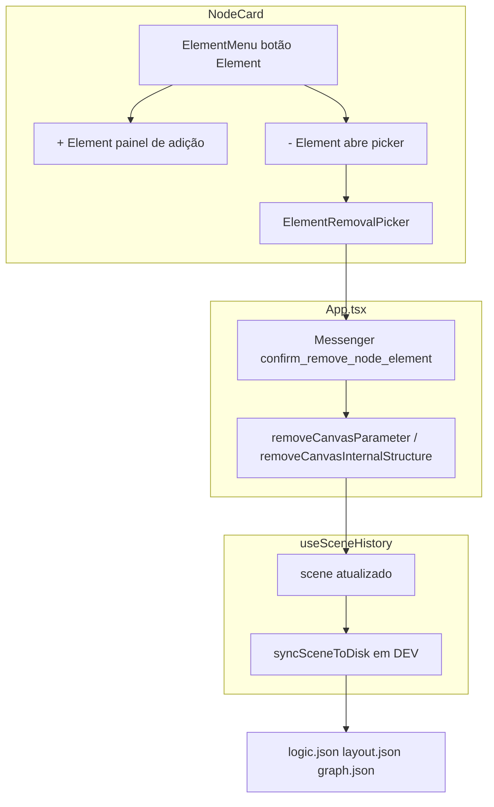
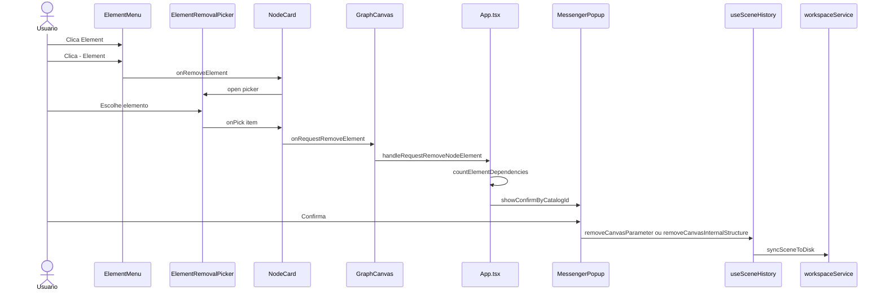

# Documentação de Implementação — Element Menu

Arquivo salvo em: `feature_md/feature/feature-element-menu.md`

## 1. Cabeçalho

| Campo | Valor |
| --- | --- |
| Nome da Branch | `feature/element-menu` |
| Nome das Features | Element Menu, Remoção Dinâmica de Elementos |
| Versão atual | `1.4.0` |
| Hash do Commit | `969223d` |

## 2. Definição e Resumo de Tags

| Tag | Definição |
| --- | --- |
| `[NOVO]` | Novo componente, arquivo, endpoint, função ou estrutura de dados criado nesta branch. |
| `[ATUALIZADO]` | Componente, função, schema ou fluxo existente alterado para suportar a feature. |
| `[REMOVIDO]` | Código, comportamento ou componente removido da aplicação. |

Tags presentes nesta implementação:

- `[NOVO]`
- `[ATUALIZADO]`
- `[REMOVIDO]`

## 3. Fluxograma de Funcionamento

## 4. Fluxograma de Acionamento de Funções

## 5. Tabela de Funções e Componentes

| Status | Nome | Feature | Descrição técnica | Parâmetros / Retorno |
| --- | --- | --- | --- | --- |
| `[NOVO]` | `listNodeElements.ts` | Element Menu | `listNodeElements` combina `parameters` e `internalStructures`; `countElementDependencies` e `formatElementDependencyWarning` para aviso na confirmação. | `(node) => NodeElementListItem[]`; `(scene, nodeId, id, kind) => number` |
| `[NOVO]` | `ElementMenu.tsx` | Element Menu | Dropdown raiz **Element** com **+ Element** (painel de adição) e **- Element** (dispara remoção). | Props de catálogo, `onRemoveElement`, `showPicker`, `disabled` |
| `[NOVO]` | `ElementRemovalPicker.tsx` | Remoção | Modal portal listando elementos removíveis do nó. | `elements`, `onPick`, `onClose`, `open` |
| `[NOVO]` | `confirm_remove_node_element` | Remoção | Entrada no catálogo Messenger para confirmação com `{elementName}` e `{connectionWarning}`. | JSON + `MESSENGER_CONFIRM_REMOVE_NODE_ELEMENT` |
| `[ATUALIZADO]` | `NodeCard.tsx` | Element Menu | Substitui `
 + Elemento` por `ElementMenu` + `ElementRemovalPicker`. | `onRequestRemoveElement?: (item) => void` |
| `[ATUALIZADO]` | `GraphCanvas.tsx` | Element Menu | Prop `onRequestRemoveElement(canvasNodeId, item)` repassada ao card. | Callback opcional |
| `[ATUALIZADO]` | `App.tsx` | Remoção | `handleRequestRemoveNodeElement` com confirmação e chamada a `removeCanvasParameter` / `removeCanvasInternalStructure`. | Wiring do hook exportado |
| `[ATUALIZADO]` | `useSceneHistory.ts` | Remoção | Export de `removeCanvasParameter` e `removeCanvasInternalStructure` (lógica já existente). | `(nodeId, elementId) => void` |
| `[REMOVIDO]` | Label `+ Elemento` | Element Menu | Botão e menu flat substituídos pelo menu em dois níveis **Element**. | — |

## 6. Descrição Detalhada de Funcionamento

A gestão de elementos internos do nó passou de um único botão **+ Elemento** (lista flat só de adição) para o componente **ElementMenu**, com menu em dois níveis: **+ Element** reutiliza o fluxo anterior (criar filho a partir de IS existente, acrescentar IS ou parâmetro do catálogo) e **- Element** abre o **ElementRemovalPicker** com todos os parâmetros e internal structures listados via `listNodeElements`.

Ao escolher um item para remover, o **App** calcula dependências com `countElementDependencies`: para internal structures conta ligações em `scene.connections` cuja origem é o slot; para parâmetros conta pares em `parameter_value_links`. O texto extra entra na confirmação Messenger (`formatElementDependencyWarning`). Após confirmar, `removeCanvasInternalStructure` remove o slot do schema e filtra conexões órfãs no grafo; `removeCanvasParameter` remove parâmetro, valores e vínculos via `link_parameter_value_remove_involving`. Em desenvolvimento, qualquer alteração de `scene` dispara `workspaceService.syncSceneToDisk`, persistindo `logic.json`, `layout.json` e `graph.json` sem chamada manual a `processAndSave`.

Nós do tipo `module` mantêm o botão **Element** desabilitado. Se não houver itens removíveis, **- Element** fica desabilitado com tooltip explicativo. A renderização do card permanece estável porque apenas o schema e valores do nó são alterados; não há referências a elementos removidos nos componentes filhos após o update da cena.

**Regras de negócio:** confirmação obrigatória antes de excluir; aviso quando existem conexões ou vínculos; limpeza automática de conexões de grafo ao remover internal structure; undo/redo via histórico de cena existente.

**Tecnologias:** React, TypeScript, Vitest, Messenger Popup catalog, `useSceneHistory`, persistência workspace em DEV.
