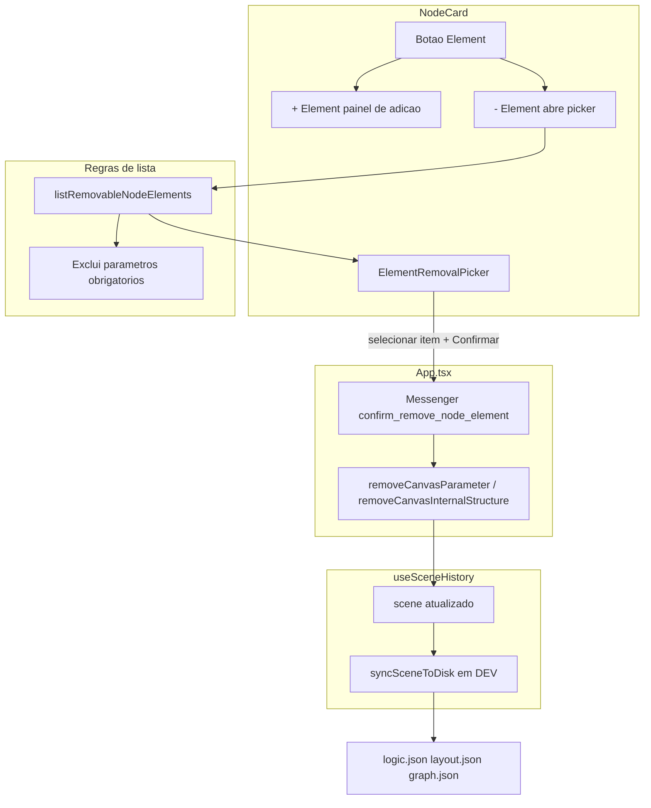
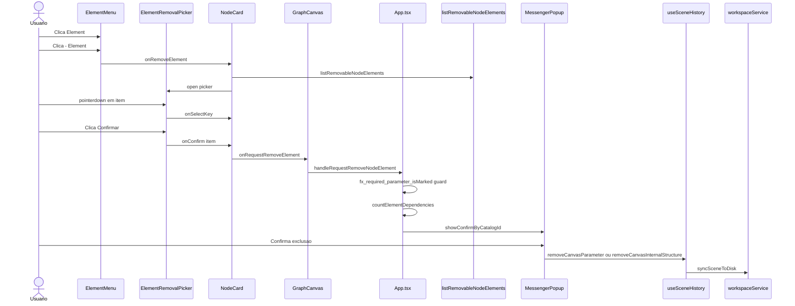

# Documentação de Implementação — Element Menu

Arquivo salvo em: `feature_md/feature-element-menu.md`

## 1. Cabeçalho

| Campo | Valor |
| --- | --- |
| Nome da Branch | `feature/element-menu` |
| Nome das Features | Element Menu, Remoção Dinâmica de Elementos |
| Versão atual | `1.4.0` |
| Hash do Commit | `7a7ecb60d8c23660128290c3c85f47086a22f638` |

## 2. Definição e Resumo de Tags

| Tag | Definição |
| --- | --- |
| `[NOVO]` | Novo componente, arquivo, endpoint, função ou estrutura de dados criado nesta branch. |
| `[ATUALIZADO]` | Componente, função, schema ou fluxo existente alterado para suportar a feature. |
| `[REMOVIDO]` | Código, comportamento ou componente removido da aplicação. |

Tags presentes nesta implementação:

- `[NOVO]`
- `[ATUALIZADO]`
- `[REMOVIDO]`

## 3. Fluxograma de Funcionamento

## 4. Fluxograma de Acionamento de Funções

## 5. Tabela de Funções e Componentes

| Status | Nome | Feature | Descrição Técnica | Parâmetros / Retorno |
| --- | --- | --- | --- | --- |
| `[NOVO]` | `listNodeElements.ts` | Element Menu | `listNodeElements` lista parâmetros e internal structures; `listRemovableNodeElements` exclui obrigatórios; `countElementDependencies` e `formatElementDependencyWarning` para aviso na confirmação. | `(node, stubCatalog?) => NodeElementListItem[]` |
| `[NOVO]` | `ElementMenu.tsx` | Element Menu | Dropdown **Element** com **+ Element** (adição) e **- Element** (remoção). Ignora cliques no picker via `data-element-removal-picker`. | Props de catálogo, `onRemoveElement`, `parameterStubCatalog` |
| `[NOVO]` | `ElementRemovalPicker.tsx` | Remoção | Modal com seleção em dois passos: clique seleciona item, **Confirmar** dispara `onConfirm`. Estado `selectedKey` controlado pelo `NodeCard`. | `elements`, `selectedKey`, `onSelectKey`, `onConfirm`, `onClose` |
| `[NOVO]` | `ElementRemovalPicker.module.css` | Remoção | Estilos de item selecionado, botão Confirmar e z-index do backdrop. | — |
| `[NOVO]` | `confirm_remove_node_element` | Remoção | Entrada Messenger com `{elementName}` e `{connectionWarning}`. | Catálogo JSON + constante `MESSENGER_CONFIRM_REMOVE_NODE_ELEMENT` |
| `[ATUALIZADO]` | `NodeCard.tsx` | Element Menu | Substitui `+ Elemento` por `ElementMenu` + `ElementRemovalPicker`; estado `removalSelectedKey`. | `parameterStubCatalog`, `onRequestRemoveElement` |
| `[ATUALIZADO]` | `GraphCanvas.tsx` | Element Menu | Repassa `onRequestRemoveElement` e `parameterStubCatalog` do schema base. | `(canvasNodeId, item) => void` |
| `[ATUALIZADO]` | `App.tsx` | Remoção | `handleRequestRemoveNodeElement` com guard de parâmetro obrigatório, confirmação Messenger e remoção via hook. | Usa `removeCanvasParameter` e remoção de blocos/slots compostos |
| `[ATUALIZADO]` | `useSceneHistory.ts` | Remoção | Export de `removeCanvasParameter` e remoções EMBED/POINTER/LIST_*; `removeCanvasInternalStructure` permanece no hook sem UI Element. | `(nodeId, elementId) => void` |
| `[REMOVIDO]` | Botão `+ Elemento` | Element Menu | Label e menu flat único substituídos pelo menu em dois níveis **Element**. | — |

## 6. Descrição Detalhada de Funcionamento

A gestão de elementos internos do nó deixou de usar o botão estático **+ Elemento** (lista única de adição) e passou ao componente **ElementMenu**, com menu em dois níveis: **+ Element** acrescenta parâmetros do catálogo e itens EMBED/POINTER/LIST_*; **- Element** abre o **ElementRemovalPicker**.

**Internal_Structures top-level** (`link = Tipo` em `schema.internalStructures[]`) **não** entram no menu Element: não há `preset-slot`, `catalog-structure` nem remoção global de slots IS. A secção permanece no card com portas; criar/ligar filhos é por drag da porta. Slots dentro de EMBED/POINTER/LIST_* mantêm `+`/`−` nos respetivos blocos.

O picker lista apenas elementos removíveis via `listRemovableNodeElements`, que omite parâmetros obrigatórios e **exclui** internal structures top-level. O utilizador seleciona um item, confirma, e o **App** valida obrigatoriedade, calcula dependências e mostra **Messenger**. Remoção: `removeCanvasParameter` ou blocos/slots compostos.

**Regras de negócio:** **Element** desactivado quando não há catálogo removível/acrescentável (parâmetros, EMBED, POINTER, LIST_*); **- Element** desabilitado se não houver itens removíveis; parâmetros obrigatórios nunca listáveis; confirmação Messenger obrigatória; aviso de dependências activas.

**Tratamento de erros:** tentativa de remover parâmetro obrigatório no `App` é ignorada (defesa em profundidade); picker com `z-index` elevado e `stopPropagation` em `pointerdown` para não conflitar com o `mousedown` do `ElementMenu`.

**Tecnologias:** React 19, TypeScript, Vitest, Messenger Popup, `useSceneHistory`, persistência workspace em DEV.
