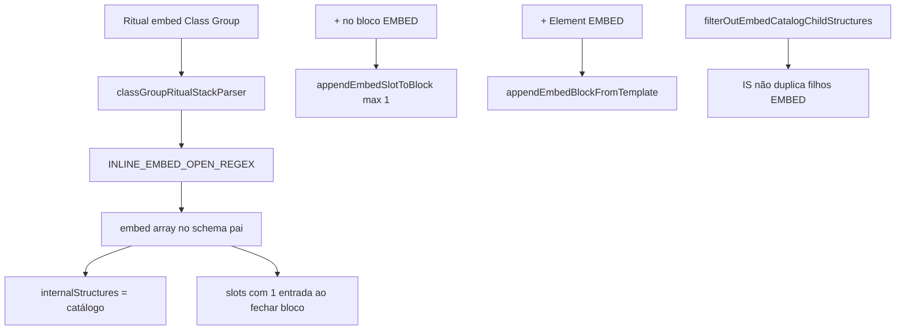

# Documentação de Implementação — EMBED (Class Group, UI e Menus Element)

Arquivo salvo em: `feature_md/feature/feature-embed-class-group.md`

## 1. Cabeçalho

| Campo | Valor |
| --- | --- |
| Nome da Branch | `feature/embed-class-group` |
| Nome das Features | EMBED no schema e conversor Class Group; secção EMBED no card (antes de LIST_EMBED); slot único por bloco; menus Element e extração Node Base |
| Versão atual | `1.4.0` |
| Hash do Commit | _(após commit desta feature)_ |

Base sugerida: `feature/list-embed-class-group`.

## 2. Definição e Resumo de Tags

| Tag | Definição |
| --- | --- |
| `[NOVO]` | Novo componente, arquivo, função ou tipo criado nesta branch. |
| `[ATUALIZADO]` | Componente ou fluxo existente alterado para suportar a feature. |

## 3. Diferença EMBED vs LIST_EMBED

| Aspeto | LIST_EMBED | EMBED |
| --- | --- | --- |
| Ritual | `Campo: list[embed] = { … }` | `Campo: embed = Tipo { … }` |
| Cardinalidade | Vários slots por bloco | **Máximo 1** slot |
| Secção no card | LIST_EMBED | **EMBED** (entre Parameters e LIST_EMBED) |
| `pointer` / `link` | N/A | Permanecem em Internal_Structures |

## 4. Fluxograma de Funcionamento

## 5. Arquivos principais

| Arquivo | Papel |
| --- | --- |
| `src/core/nodeSchema.ts` | `EmbedDefinition`, `embed?: EmbedDefinition[]` |
| `src/core/nodeStructureJson.ts` | `parseEmbed`, `embedDefinitionFromJsonStub` |
| `src/core/classGroupFieldClassifier.ts` | `INLINE_EMBED_OPEN_REGEX` vs `INLINE_POINTER_LINK_OPEN_REGEX` |
| `src/core/classGroupRitualStackParser.ts` | `ensureEmbedBlock`, slot inicial no parse |
| `src/core/embedSlots.ts` | IDs `__slot__0`, ligações, `applyEmbedSlotsToSchema` |
| `src/core/embedElementMenu.ts` | append/remove bloco e slot (max 1) |
| `src/components/molecules/EmbedItem.tsx` | UI do bloco no card |
| `src/components/molecules/EmbedAddPicker.tsx` | Picker simplificado (+ no bloco) |
| `src/core/extractNodeBaseParameters.ts` | `{collectionType}_embed_{title}` stubs |
| `vite.plugin.nodeStructuresWrite.ts` | Gravação de stubs EMBED na extração |

## 6. Semântica UI

| Controlo | Ação |
| --- | --- |
| **+** no bloco EMBED | Adiciona a única estrutura interna (desactivado se já existe slot) |
| **−** no bloco EMBED | Remove a estrutura interna (picker) |
| **+ Element** (EMBED) | Novo bloco instância + slot |
| **− Element** (EMBED) | Remove bloco EMBED inteiro |

Ordem no card: **Parameters → EMBED → LIST_EMBED → Internal_Structures**.

## 7. Testes

Suite Vitest: **196** testes (inclui `embedSlots.test.ts`, `embedElementMenu.test.ts`, parser `embed simples`, `catalog-embed` no menu, `nodeBaseEmbedId`).

Reconversão de exemplo: `npx vite-node scripts/reconvert-class-pack.ts papa` (a partir de `estrutura_bin.py`).
