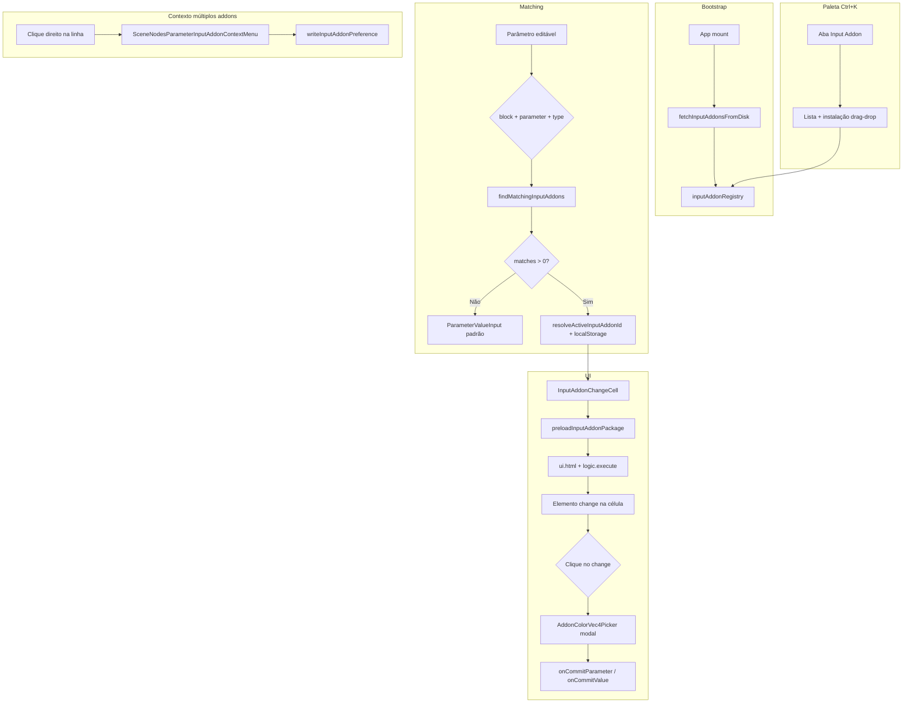
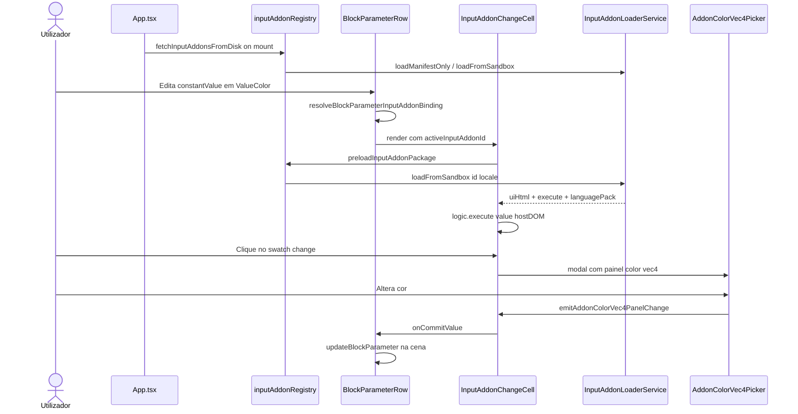

# Documentação de Implementação — Input Addons (editores personalizados de parâmetros)

Arquivo salvo em: `feature_md/feature/feature-input-addons.md`

## 1. Cabeçalho

| Campo | Valor |
| --- | --- |
| Nome da Branch | `feature/input-addons` |
| Nome das Features | **inputAddons** — pacotes de entrada personalizada para parâmetros de bloco/nó; paleta Ctrl+K (aba Input Addon); coluna Input Addon no painel Parameters; substituição do input no `BlockParameterRow`; menu de contexto para escolha entre múltiplos addons; primeiro pacote `input-addon-color-vec4` (ValueColor.constantValue vec4) |
| Versão atual | `1.5.0` |
| Hash do Commit | _(preencher com `git rev-parse HEAD` na branch de entrega)_ |

Documentação relacionada: `feature_md/feature/feature-addon-palette-install.md`, `feature_md/feature/feature-scene-nodes-parameters-graph.md`, `feature_md/prompet/prompt_doc.md`.

---

## 2. Definição e Resumo de Tags

| Tag | Definição |
| --- | --- |
| `[NOVO]` | Novo módulo, pacote em `public/inputAddons/`, componente ou fluxo criado nesta entrega. |
| `[ATUALIZADO]` | Componente ou função existente alterada para integrar input addons. |
| `[REMOVIDO]` | Comportamento ou API removida ou descontinuada. |

Tags presentes nesta implementação:

- `[NOVO]`
- `[ATUALIZADO]`

Não houve itens classificados como `[REMOVIDO]`.

---

## 3. Fluxograma de Funcionamento



---

## 4. Fluxograma de Acionamento de Funções



---

## 5. Tabela de Funções e Componentes

| Status | Nome | Feature | Descrição Técnica | Parâmetros / Retorno |
| --- | --- | --- | --- | --- |
| `[NOVO]` | `public/inputAddons/` | Pacotes | Estrutura igual aos addons: `manifest.json`, `ui.html`, `logic.js`, `language/`. Manifest com `type: "input"` e `input.{block,parameter,type,change}`. | `index.json` fallback estático. |
| `[NOVO]` | `input-addon-color-vec4` | Pacote inicial | Editor de cor vec4 (0–1) para `ValueColor.constantValue`; `change: inputaddon` (swatch). | Reutiliza `addons/shared/colorVec4Input.js`. |
| `[NOVO]` | `inputAddonLoader.service.ts` | Loader | Validação e `loadFromSandbox` em `/inputAddons/{id}/`. | `InputAddonManifest`, `InputAddonPackage`. |
| `[NOVO]` | `inputAddonRegistry.ts` | Registry | Cache, `preloadInputAddonPackage`, `fetchInputAddonsFromDisk`. | API espelhada de `addonRegistry`. |
| `[NOVO]` | `inputAddonMatcher.ts` | Matching | Cruza `block`, `parameter`, `type` ritual; enriquece linhas do painel Parameters. | `resolveBlockParameterInputAddonBinding`. |
| `[NOVO]` | `inputAddonPreferences.ts` | Preferência | `localStorage` chave `inputAddonPref:{block}:{parameter}:{type}`. | `resolveActiveInputAddonId`. |
| `[NOVO]` | `inputAddonChangeElement.ts` | UI DOM | Resolve id `change` (fallback `inputaddon`); clona elemento para célula. | `findChangeElement`, `cloneChangeElementForDisplay`. |
| `[NOVO]` | `inputAddonInstallFromDrop.ts` | Instalação dev | `POST /api/input-addons-install` via drag-and-drop na paleta. | `installInputAddonFromDataTransfer`. |
| `[NOVO]` | `vite.inputAddonsListHandler.ts` | Dev API | `GET /api/input-addons-list` enumera `public/inputAddons/*/manifest.json`. | Handler Vite. |
| `[NOVO]` | `InputAddonChangeCell.tsx` | UI parâmetro | Host DOM oculto, elemento `change` clicável, modal `AddonColorVec4Picker`. | `layout: compact \| field`. |
| `[NOVO]` | `PaletteAddInputAddonOption.tsx` | Paleta | Item de catálogo na aba Input Addon (somente listagem/instalação). | — |
| `[NOVO]` | `PaletteInputAddonInstallZone.tsx` | Paleta | Zona drag-and-drop para instalar pacotes. | — |
| `[NOVO]` | `SceneNodesParameterInputAddonContextMenu.tsx` | Contexto | Lista input addons quando há múltiplos matches. | `onSelect(inputAddonId)`. |
| `[ATUALIZADO]` | `AddNodePalette.tsx` | Paleta | Nova aba **Input Addon** ao lado de Addons; busca, reload, lista. | `PaletteCatalogMode` + `inputAddons`. |
| `[ATUALIZADO]` | `SceneNodesParametersSection.tsx` | Painel Parameters | Coluna **Input Addon**; menu de contexto na linha. | Grid 4 colunas. |
| `[ATUALIZADO]` | `BlockParameterRow.tsx` | Card bloco | Substitui `ParameterValueInput` pelo input addon quando há match; menu de contexto na linha. | Prop `blockType`. |
| `[ATUALIZADO]` | `sceneNodesParametersView.ts` | Dados linhas | Campos `inputAddonMatches`, `activeInputAddonId`, `inputAddonPreferenceKey`. | `enrichSceneNodesParameterRowsWithInputAddons`. |
| `[ATUALIZADO]` | `App.tsx` | Bootstrap | `fetchInputAddonsFromDisk()` no mount. | — |
| `[ATUALIZADO]` | `canvasContextMenuResolve.ts` | Menu bloco | Menu de contexto do **card de bloco** só no cabeçalho ou rodapé (`data-block-card-context-zone`). | `shouldAllowBlockNodeContextMenu`. |
| `[ATUALIZADO]` | `BlockCard.tsx` | Zonas menu | `data-block-card-context-zone` em `<header>` e `<footer>`. | — |
| `[ATUALIZADO]` | `GraphCanvas.tsx` | Canvas | Filtra abertura do menu de nó em cards de bloco. | — |
| `[ATUALIZADO]` | `vite.plugin.addonsList.ts` | Dev server | Rotas `/api/input-addons-list` e `/api/input-addons-install`. | — |

---

## 6. Descrição Detalhada de Funcionamento

### Pacotes inputAddons

[NOVO] Cada pacote vive em `public/inputAddons/{id}/` com a mesma estrutura dos addons (`manifest`, `ui`, `logic`, `language`). O manifest declara `type: "input"` e um objeto `input`:

```json
{
  "input": {
    "block": "ValueColor",
    "parameter": "constantValue",
    "type": "vec4",
    "change": "inputaddon"
  }
}
```

[NOVO] O campo `change` define o id do elemento em `ui.html` exibido na célula (swatch, botão, etc.). Valores vazios (`""`, `false`, `null`, `"none"`) usam o id padrão `inputaddon`. Se o id não existir no HTML, mostra-se um botão fallback que ainda abre o modal.

[NOVO] `logic.js` exporta `logic.execute(inputs, hostDOM)` com contrato `{ value: string }` in/out — mais simples que os cards de addon no canvas.

### Matching e preferência

[NOVO] `inputAddonMatcher` compara `input.block` com `blockStructure.blockType` (vista bloco) ou `schema.title` (vista schema), `input.parameter` com o nome do parâmetro, e `input.type` com o tipo ritual (`vec4`, `f32`, etc.).

[NOVO] Quando vários pacotes correspondem ao mesmo parâmetro, `resolveActiveInputAddonId` lê `localStorage`; o utilizador pode alterar via menu de contexto na linha do parâmetro (painel Parameters ou `BlockParameterRow`).

### Onde o input addon aparece

[ATUALIZADO] **Painel Nodes em Cena → Parameters:** coluna **Input Addon** ao lado de Name/Value; o elemento `change` é clicável e abre o editor (modal para vec4 cor).

[ATUALIZADO] **BlockCard:** quando há match e o parâmetro é editável (sem slot IN ligado), o `ParameterValueInput` é **substituído** pelo `InputAddonChangeCell` com layout `field` (swatch em largura total dentro de `{ }` ritual quando aplicável).

### Paleta Ctrl+K

[ATUALIZADO] Nova aba **Input Addon** com pesquisa, reload e instalação por drag-and-drop (dev server). Não cria nós no canvas — apenas catálogo e instalação.

### Menu de contexto do card de bloco

[ATUALIZADO] O menu de contexto do **nó bloco** (focar, parâmetros do card, código, etc.) abre **apenas** com clique direito no **cabeçalho** ou **rodapé** do `BlockCard`. Cliques no corpo (linhas de parâmetros) não abrem esse menu — evita conflito com o menu de escolha de input addon.

### Primeiro pacote: input-addon-color-vec4

[NOVO] Binding `ValueColor` + `constantValue` + `vec4`. UI com swatch `#inputaddon` e painel completo para o modal. Reutiliza `AddonColorVec4Picker` e `ensureAddonColorVec4InputWired` do ecossistema `addon-color-vec4`.

### Tratamento de erros

- Manifest inválido: pacote ignorado na listagem (`skipped` na API dev).
- Falha de preload: célula permanece vazia ou com fallback desabilitado até o pacote carregar.
- Instalação: validação no handler Vite; erros devolvidos em JSON (sem `window.alert` em fluxos novos de instalação).

---

## 7. Como utilizar (didático)

### Português

1. Com `npm run dev`, os pacotes em `public/inputAddons/` são listados automaticamente.
2. Abra **Ctrl+K** → aba **Input Addon** para ver o catálogo ou instalar uma pasta (drag-and-drop).
3. Selecione um nó **ValueColor** no canvas (vista de bloco).
4. No card, o parâmetro `constantValue` mostra um **swatch de cor** em vez do picker vec4 padrão.
5. **Clique no swatch** → abre o seletor de cor (modal vec4 0–1); ao alterar, o valor persiste no bloco.
6. No painel **Nodes em Cena → Parameters**, a coluna **Input Addon** mostra o mesmo swatch para o parâmetro.
7. Se existirem **vários** input addons para o mesmo parâmetro, **clique direito na linha** do parâmetro → **Input Addon** → escolha qual usar.
8. Para o menu do **bloco** (adicionar/editar parâmetros, focar nó), use **clique direito no cabeçalho ou rodapé** do card — não no corpo dos parâmetros.

### English

1. With `npm run dev`, packages under `public/inputAddons/` are discovered automatically.
2. Open **Ctrl+K** → **Input Addon** tab to browse or install a folder (drag-and-drop).
3. Select a **ValueColor** block node on the canvas.
4. On the card, `constantValue` shows a **color swatch** instead of the default vec4 picker.
5. **Click the swatch** → color picker modal (vec4 0–1); changes persist on the block.
6. In **Nodes in scene → Parameters**, the **Input Addon** column shows the same swatch.
7. If **multiple** input addons match the same parameter, **right-click the parameter row** → **Input Addon** → pick which one to use.
8. For the **block** context menu (add/edit parameters, focus node), **right-click the card header or footer** — not the parameter body.
