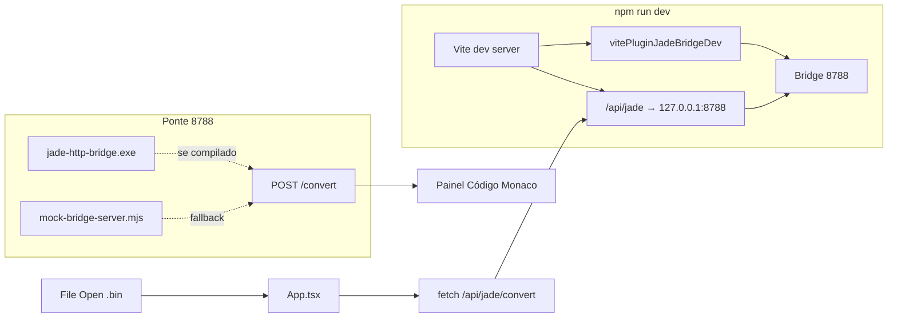
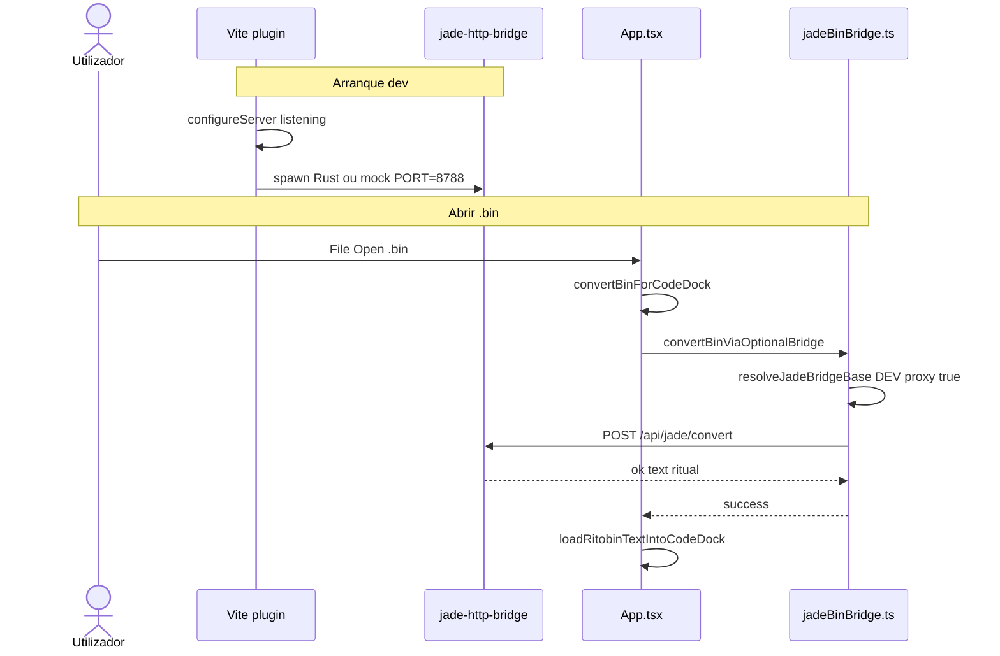

# Documentação de Implementação — Ponte Jade automática para abrir `.bin`

Arquivo salvo em: `feature_md/feature/feature-jade-bridge-auto-dev.md`

## 1. Cabeçalho

| Campo | Valor |
| --- | --- |
| Nome da Branch | `feature/jade-bridge-auto-dev` |
| Nome das Features | Ponte Jade automática em dev; proxy Jade activo por defeito; abertura de `.bin` no painel Código |
| Versão atual | `1.5.0` |
| Hash do Commit | _(preencher após commit)_ |

## 2. Definição e Resumo de Tags

| Tag | Definição |
| --- | --- |
| `[NOVO]` | Novo plugin Vite, ficheiro `.env.development` ou lógica que não existia. |
| `[ATUALIZADO]` | Configuração Vite, mensagens de erro, README. |
| `[REMOVIDO]` | Necessidade manual de `VITE_JADE_USE_PROXY` só para abrir `.bin` em dev. |

Tags presentes nesta implementação:

- `[NOVO]`
- `[ATUALIZADO]`

## 3. Fluxograma de Funcionamento



## 4. Fluxograma de Acionamento de Funções



## 5. Tabela de Funções e Componentes

| Status | Nome | Feature Correspondente | Descrição Técnica | Parâmetros Recebidos / Retorno |
| --- | --- | --- | --- | --- |
| `[NOVO]` | `vite.plugin.jadeBridgeDev.ts` | Ponte auto dev | No `vite serve`, arranca `jade-http-bridge` (release) ou mock em `127.0.0.1:8788`; cleanup no shutdown. | `projectRoot` → `Plugin` |
| `[NOVO]` | `resolveRustBridgeExe` | Detecção Rust | Procura `Jade-League-Bin-Editor/src-tauri/target/release/jade-http-bridge(.exe)`. | `projectRoot` → `string \| null` |
| `[NOVO]` | `.env.development` | Config dev | `VITE_JADE_USE_PROXY=true`, `JADE_BRIDGE_TARGET=http://127.0.0.1:8788`. | — |
| `[ATUALIZADO]` | `vite.config.ts` | Proxy default | `define` injecta `VITE_JADE_USE_PROXY=true` em `development`; plugin só em `mode === 'development'`. | — |
| `[ATUALIZADO]` | `App.tsx` `convertBinForCodeDock` | Erros UX | Mensagens distintas: não configurado vs rede vs erro HTTP; indica reiniciar `npm run dev`. | `File` → `boolean` |
| `[ATUALIZADO]` | `README.md` | Documentação | Arranque automático da ponte e fluxo File → Open `.bin`. | — |

## 6. Descrição Detalhada de Funcionamento

### Problema

Ao abrir `.bin` no editor, o utilizador via o alerta «Jade bridge não configurado» porque `VITE_JADE_USE_PROXY` não estava definido e nenhum processo escutava na porta `8788`.

### Solução

1. **Proxy activo por defeito em desenvolvimento** — `vite.config.ts` define `import.meta.env.VITE_JADE_USE_PROXY` como `'true'` quando `mode === 'development'`, alinhado com `.env.development`.
2. **Arranque automático da ponte** — `vitePluginJadeBridgeDev` regista-se apenas em `serve`. Após `httpServer` `listening`, faz spawn do binário Rust (conversão real de `.bin` → texto ritual) se existir em `target/release`; caso contrário, o mock Node (`jade-bridge:dev`) responde em `/convert` com texto placeholder.
3. **Pedidos do browser** — `jadeBinBridge.ts` usa base `/api/jade`; o proxy Vite reencaminha para `JADE_BRIDGE_TARGET` (default `http://127.0.0.1:8788`).

### Ordem de conversão (inalterada em `convertBinForCodeDock`)

Preferência `ConverterEngine` (`jade` vs `ltk`): tenta Jade bridge, depois Ritobin exe se configurado.

### Tratamento de erros

| Caso | Comportamento |
| --- | --- |
| `not_configured` | Alerta: reiniciar `npm run dev` ou configurar `.env` |
| `network_error` | Alerta: ponte não responde; sugerir `jade:http-bridge` / `jade-bridge:dev` |
| `bridge_error` | Alerta com status HTTP e mensagem do servidor |

### Build Rust (conversão real)

```bash
npm run jade:http-bridge
```

Gera `Jade-League-Bin-Editor/src-tauri/target/release/jade-http-bridge.exe`. Após compilar, reiniciar `npm run dev` para o plugin preferir Rust em vez do mock.

### Produção

Fora de `vite dev`, continua a ser necessário `VITE_JADE_BIN_BRIDGE` ou reverse-proxy; o plugin não corre em `build`.
