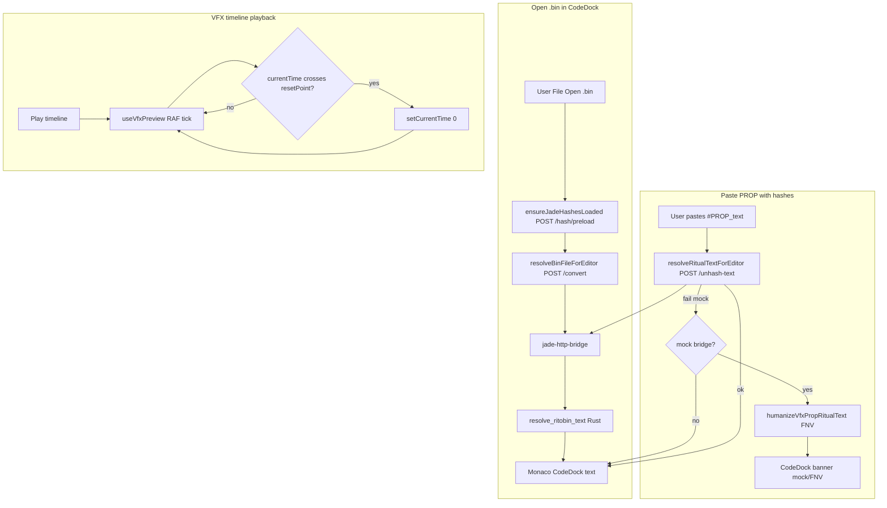
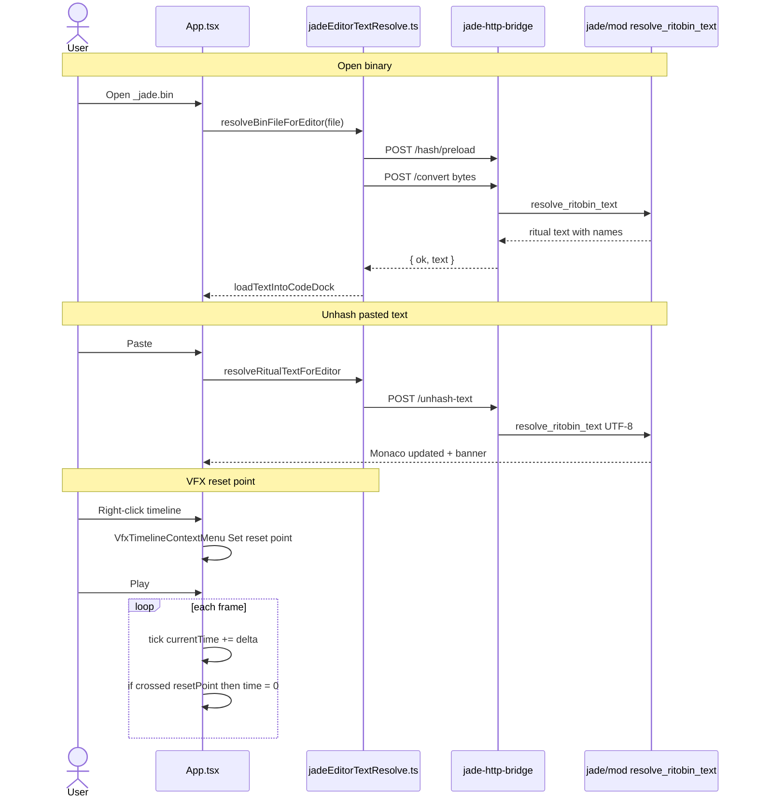

# Implementation Documentation — Jade Native Hashes & VFX Timeline Reset Point

File location: `feature_md/feature/feature-jade-hashes-vfx-timeline-reset.md`

## 1. Header

| Field | Value |
| --- | --- |
| Branch Name | `feature/jade-hashes-vfx-timeline-reset` |
| Feature Name(s) | Jade native hash resolution (CodeDock); VFX timeline reset point |
| Current Version | `1.5.0` |
| Commit Hash | `TBD` (filled after commit) |

---

## 2. Tag Definition and Summary

| Tag | Definition |
| --- | --- |
| `[NOVO]` | New module, component, endpoint, or behaviour that did not exist before. |
| `[ATUALIZADO]` | Existing file or API extended without removing the previous contract. |
| `[REMOVIDO]` | Removed code path, export, or UI entry. |

Tags present in this implementation:

- `[NOVO]`
- `[ATUALIZADO]`

---

## 3. Operation Flowchart

---

## 4. Function Activation Sequence Diagram

---

## 5. Functions and Components Table

| Status | Name | Feature | Technical Description | Parameters / Return |
| --- | --- | --- | --- | --- |
| `[NOVO]` | `resolve_ritobin_text` | Jade hashes | Unified Rust pipeline: UTF-8 ritual → `text_reader` → `unhash` → `text_writer`; else binary `reader` → `unhash` → `text_writer`. No raw `#PROP` pass-through. | `&[u8]` → `Result<String, String>` |
| `[NOVO]` | `export_slice_to_resolved_ritobin_text` | Jade HTTP | Jade-engine export for `/convert` and `/unhash-text`. | `&[u8]` → `Result<String, String>` |
| `[NOVO]` | `preload_bridge_hash_cache` | Jade HTTP | Loads FrogTools hash tables before `axum::serve`. | `()` → `usize` count |
| `[ATUALIZADO]` | `jade-http-bridge` main | Jade HTTP | Preload hashes on startup; log entry count. | — |
| `[ATUALIZADO]` | `POST /convert` | Jade HTTP | Uses `export_slice_to_resolved_ritobin_text` instead of pass-through path. | octet-stream → JSON `{ text }` |
| `[NOVO]` | `jadeEditorTextResolve.ts` | CodeDock hashes | Single TS API: `resolveBinFileForEditor`, `resolveRitualTextForEditor`, `ensureJadeHashesLoaded`, `getJadeEditorResolveStatus`. | async functions |
| `[ATUALIZADO]` | `App.tsx` `loadTextIntoCodeDock` | CodeDock hashes | Uses `resolveRitualTextForEditor`; banner for mock/FNV. | `text, fileName, via` |
| `[ATUALIZADO]` | `App.tsx` `convertBinForCodeDock` | CodeDock hashes | Uses `resolveBinFileForEditor` with preload. | `File` → `boolean` |
| `[ATUALIZADO]` | `CodeDock.tsx` | CodeDock hashes | Banner: Jade engine / mock / FNV partial. | `jadeEditorBanner` prop |
| `[ATUALIZADO]` | `jadeBridgeApi.ts` | Capabilities | `features.unhashText` flag. | — |
| `[ATUALIZADO]` | `useJadeBridgeCapabilities.ts` | Capabilities | `unhashTextEnabled`, `isMockBridge`. | hook return |
| `[ATUALIZADO]` | `unhashRitualTextViaJade.ts` | Compatibility | Re-exports `resolveRitualTextForEditor`. | deprecated wrapper |
| `[NOVO]` | `npm run jade:http-bridge:build` | Dev | `cargo build --release --bin jade-http-bridge`. | script |
| `[ATUALIZADO]` | `mock-bridge-server.mjs` | Dev | `GET /capabilities` with `mock-bridge`; `/unhash-text` 404. | — |
| `[NOVO]` | `VfxTimelineContextMenu` | VFX timeline | Context menu: Reset point @ time; Remove reset point. | anchor, callbacks |
| `[NOVO]` | `timelineResetPoint` state | VFX timeline | Stored time or null; cleared when scene changes. | `number \| null` |
| `[ATUALIZADO]` | `useVfxPreview` tick | VFX timeline | On forward cross of reset point, jump to `0`. | RAF loop |
| `[ATUALIZADO]` | `VfxDockTimeline` | VFX timeline | Right-click on scrub + track area; amber marker. | props |

---

## 6. Detailed Operation Description

### Architecture (Jade hashes)

The browser cannot run Jade’s `HashManager` natively. Resolution reuses the same Rust library as Jade desktop via **`jade-http-bridge`** (`Jade-League-Bin-Editor`). The critical fix is **`resolve_ritobin_text`**: previously, UTF-8 files starting with `#PROP` were returned unchanged, so hashes stayed as `0x…` in CodeDock. Now every open path runs parse → unhash → write.

The frontend module **`jadeEditorTextResolve.ts`** centralises preload, `/convert`, and `/unhash-text`. **`humanizeVfxPropRitualText`** (FNV) runs only when capabilities report `mock-bridge` or `unhashText` is false, with a visible CodeDock banner.

### Architecture (VFX reset point)

A single **`timelineResetPoint`** (seconds) is set via context menu on the timeline scrub or track area. During playback, when `previous < resetPoint <= next`, time resets to `0` so the user can loop-analyse a segment without enabling global loop.

### Error handling

| Case | Behaviour |
| --- | --- |
| Bridge not configured | Alert in `convertBinForCodeDock`; no silent FNV on bin open |
| Mock bridge | Banner: run `jade:http-bridge:build` and restart `dev` |
| `/unhash-text` failure with real bridge | Warning; text unchanged if FNV also fails |
| Reset point at 0 | Treated as no point (`null`) |
| Scene lifetime shrinks | Reset point cleared if beyond lifetime |

### How to use (simple guide)

**EN — Jade hashes in CodeDock**

1. Build the bridge once: `npm run jade:http-bridge:build` (or `npm run jade:http-bridge`).
2. In Jade desktop: **Settings → Hashes** — download/preload FrogTools tables (same as desktop editor).
3. Run `npm run dev` (starts Rust bridge if `target/release/jade-http-bridge.exe` exists).
4. **File → Open…** `_jade.bin` or `_editor.bin` — fields should show names (`emitterName`, types), not only `0x…`.
5. If the yellow banner says “Mock bridge”, compile the Rust bridge and restart dev.
6. Menu **Resolver hashes PROP (Jade)** re-runs unhash on the active tab.

**PT — Hashes Jade no CodeDock**

1. Compila a ponte: `npm run jade:http-bridge:build` (ou `npm run jade:http-bridge`).
2. No Jade desktop: **Settings → Hashes** — descarregar/preload das tabelas FrogTools.
3. `npm run dev` (arranca o bridge Rust se o `.exe` existir em `target/release/`).
4. **File → Open…** em `_jade.bin` / `_editor.bin` — nomes legíveis no Monaco.
5. Banner amarelo “Mock bridge” → compilar Rust e reiniciar o `dev`.
6. Menu **Resolver hashes PROP (Jade)** força nova resolução no texto activo.

**EN — VFX timeline reset point**

1. Open **VFX** dock and rebuild preview.
2. **Right-click** the time slider or the track/ruler area.
3. Choose **Reset point @ X.XXs** at the click position (amber line).
4. Press **Play** — when the playhead reaches that time, playback jumps back to **0s** (segment review).
5. **Remove reset point** clears the marker.

**PT — Reset point na timeline VFX**

1. Abre o painel **VFX** e faz **Rebuild**.
2. **Clique direito** no slider de tempo ou na área das faixas.
3. **Reset point @ X.XXs** marca o instante (linha âmbar).
4. **Play** — ao chegar a esse tempo, volta a **0s** para repetir o trecho.
5. **Remove reset point** remove o marcador.

---

## Acknowledgements

Special thanks to **Bud**, creator of the Jade tool that powers the BIN conversion system used in this project.  
GitHub: https://github.com/budlibu500

Key contributions include:

* BIN code conversion
* BIN League syntax analysis
* Particle editing systems
* General-purpose editing tools

Their work and support were essential to the development and functionality of this project.
