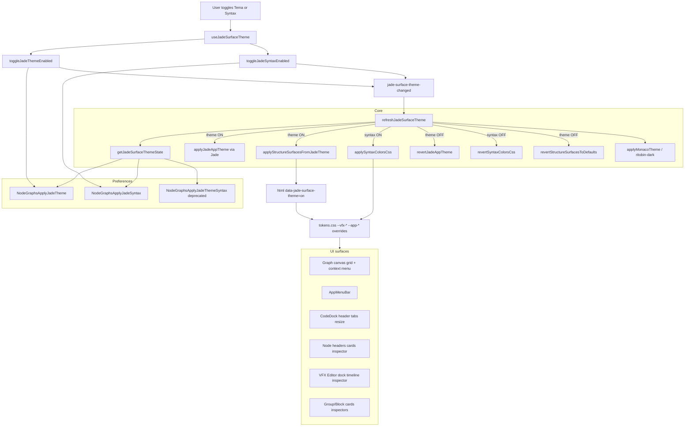
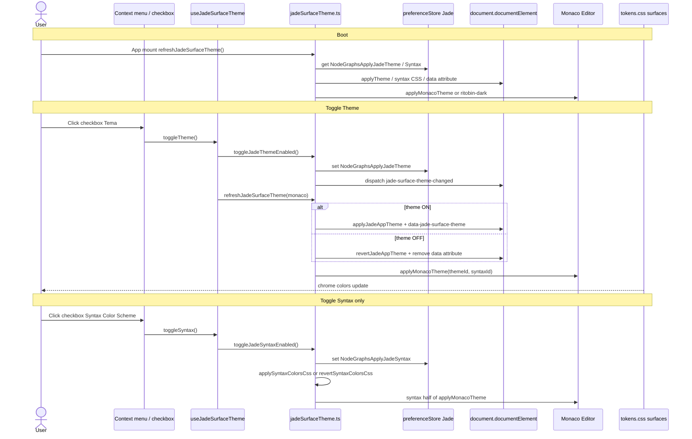

# Implementation Documentation — Jade Surface Theme & Syntax Color Scheme

Saved at: `feature_md/feature/feature-jade-surface-theme.md`

## 1. Header

| Field | Value |
| --- | --- |
| Branch Name | `feature-jade-surface-theme` |
| Feature Name(s) | Jade Surface Theme (independent toggles); Syntax Color Scheme; context-menu checkboxes; app/VFX chrome theming |
| Current Version | `1.5.3` |
| Commit Hash | `af4d870` |

---

## 2. Tag Definition and Summary

| Tag | Definition |
| --- | --- |
| `[NOVO]` | New module, hook, preference key, CSS token family, or UI entry point created in this branch. |
| `[ATUALIZADO]` | Existing component, menu, or stylesheet wired to Jade theme/syntax preferences. |
| `[REMOVIDO]` | Legacy single-toggle preference or submenu-only theme UX replaced by flat checkboxes. |

Tags present in this implementation:

- `[NOVO]`
- `[ATUALIZADO]`
- `[REMOVIDO]`

---

## 3. Operation Flowchart

---

## 4. Function Activation Sequence Diagram

---

## 5. Functions and Components Table

| Status | Name | Feature | Technical Description | Parameters / Return |
| --- | --- | --- | --- | --- |
| `[NOVO]` | `jadeSurfaceTheme.ts` | Core theme engine | Orchestrates Jade theme, syntax CSS, structure surfaces, app chrome revert, Monaco theme id. | `refreshJadeSurfaceTheme(monaco?)` → `Promise<string \| null>` |
| `[NOVO]` | `useJadeSurfaceTheme.ts` | React hook | Subscribes to `jade-surface-theme-changed`; exposes `themeEnabled`, `syntaxEnabled`, toggles. | optional `monacoRef` → hook API |
| `[NOVO]` | `surfaceThemeContextMenu.ts` | Menu builder | `buildSurfaceThemeMenuItems` — two flat checkbox items (not submenu). | `JadeSurfaceThemeState`, `tr` → `ContextMenuItem[]` |
| `[NOVO]` | `SurfaceThemeContextMenu.tsx` | Standalone menu | Canvas-style menu with Tema + Syntax checkboxes. | `anchor`, `onClose` |
| `[NOVO]` | `useSurfaceThemeContextMenu.ts` | Hook | Opens anchor for inspector/menu-bar right-click theme menu. | → `{ surfaceThemeMenuAnchor, open…, close… }` |
| `[NOVO]` | `JADE_THEME_PREF` / `JADE_SYNTAX_PREF` | Persistence | Independent prefs `NodeGraphsApplyJadeTheme` and `NodeGraphsApplyJadeSyntax`. | string keys |
| `[NOVO]` | `--vfx-*` token family | VFX theming | 40+ CSS variables; default VFX blue chrome; Jade overrides when theme ON. | CSS custom properties |
| `[ATUALIZADO]` | `GraphCanvas.tsx` | Canvas menu | Passes `jadeThemeEnabled` / `jadeSyntaxEnabled`; handles `surface.toggleJadeTheme/Syntax`. | context menu handlers |
| `[ATUALIZADO]` | `canvasContextMenuItems.ts` | Canvas menu | Appends theme checkboxes to empty canvas, node, and structure card menus. | build context |
| `[ATUALIZADO]` | `CodeDockEditorContextMenu.tsx` | Editor menu | Flat Tema + Syntax checkboxes (no nested submenu). | editor context |
| `[ATUALIZADO]` | `AppMenuBar.tsx` | Top menu | Right-click opens theme menu; `--app-menu-*` tokens. | — |
| `[ATUALIZADO]` | `App.tsx` | Boot | Calls `refreshJadeSurfaceTheme()` on mount. | — |
| `[ATUALIZADO]` | `tokens.css` | Design tokens | `html[data-jade-surface-theme='on']` maps Jade vars to app/node/VFX chrome. | — |
| `[ATUALIZADO]` | `CodeDock.module.css` | Code dock | Header, shell, resize grip use theme tokens. | — |
| `[ATUALIZADO]` | `NodeHeader.module.css` | Node cards | `--color-node-header` from Jade tab bg when theme ON. | — |
| `[ATUALIZADO]` | `NodeInspector.module.css` | Inspector | `--app-panel-*` surfaces. | — |
| `[ATUALIZADO]` | `SceneNodesPanel.module.css` | Nodes in scene | Panel chrome via app tokens. | — |
| `[ATUALIZADO]` | `AddNodePalette.module.css` | Add node | Dialog/overlay gradient tokens. | — |
| `[ATUALIZADO]` | `GraphCanvas.module.css` | Grid | `--canvas-grid-*` from editor bg/text. | — |
| `[ATUALIZADO]` | `GroupInspector.tsx` / `BlockInspector.tsx` | Structure inspectors | Theme context menu + group surface vars. | — |
| `[ATUALIZADO]` | `useCodeDockJadeEditor.ts` | Monaco | Listens `JADE_SURFACE_THEME_CHANGED`; reapplies theme. | — |
| `[ATUALIZADO]` | 20× `*Vfx*.module.css` | VFX Editor | Hardcoded blues → `--vfx-*` variables. | — |
| `[ATUALIZADO]` | `languageIds.ts` + `pt-br.json` / `en.json` | i18n | `CtxApplyJadeTheme` (484), `CtxApplyJadeSyntax` (485). | LangId |
| `[REMOVIDO]` | `NodeGraphsApplyJadeThemeSyntax` (single) | Legacy | Replaced by split prefs; still read for migration. | deprecated |
| `[REMOVIDO]` | `surface.tema` submenu item | UX | Replaced by two top-level checkbox rows. | — |
| `[REMOVIDO]` | `buildSurfaceThemeMenuItem` nested children | UX | Replaced by `buildSurfaceThemeMenuItems`. | — |

---

## 6. Detailed Description

### Architecture (English)

The feature separates **Jade Theme** (window/editor/tab colors and structural chrome) from **Syntax Color Scheme** (keyword/string/slot colors and Monaco syntax). Each preference persists independently via Jade `preferenceStore`. `refreshJadeSurfaceTheme` is the single entry point: it reads both flags, applies or reverts Jade CSS variables on `:root`, sets `html[data-jade-surface-theme="on"]` only when theme is enabled, applies syntax CSS variables when syntax is enabled, updates group/block structure surfaces, and configures Monaco via `applyMonacoTheme` or falls back to `ritobin-dark` when both are off.

UI exposure uses **flat checkbox menu items** (not a nested “Tema” submenu): labels **Tema** and **Syntax Color Scheme** with ✓ when active. Menus: empty canvas, nodes, structure cards, CodeDock editor, AppMenuBar right-click, Group/Block inspector right-click.

When theme is disabled, `revertJadeAppTheme` removes inline Jade variables so defaults from `tokens.css` return. Syntax revert clears `--syntax-*-color`, `--port-child`, etc.

Error handling: `refreshJadeSurfaceTheme` wraps apply in try/catch, logs a warning, and reverts all surfaces on failure.

### Architecture (Português)

A feature separa **Tema Jade** (cores de janela/editor/abas e chrome estrutural) do **Syntax Color Scheme** (cores de keywords/strings/slots e syntax no Monaco). Cada preferência persiste de forma independente. `refreshJadeSurfaceTheme` centraliza: lê os dois flags, aplica ou reverte variáveis CSS, define `data-jade-surface-theme` só com tema activo, aplica syntax quando activa, actualiza superfícies grupo/bloco e configura o Monaco.

A UI usa **checkboxes directos** (**Tema** e **Syntax Color Scheme**) nos menus de contexto: grade, nós, cards estrutura, editor CodeDock, barra de menu e inspetores Grupo/Bloco.

Com tema desligado, o visual padrão do Node Graphs regressa. Com syntax desligada, cores de syntax e slots voltam ao default; tema pode continuar activo isoladamente.

### How to use / Como utilizar

| Step (EN) | Passo (PT) |
| --- | --- |
| Right-click canvas, top menu bar, CodeDock editor, or Group/Block inspector | Clique direito na grade, barra de menu, editor ou inspetor Grupo/Bloco |
| Toggle **Theme** ✓ to apply Jade window/editor colors across app, nodes, VFX dock | Active **Tema** ✓ para cores Jade em app, nodes e Editor VFX |
| Toggle **Syntax Color Scheme** ✓ for keyword/string colors in editor, slots, boolean inputs | Active **Syntax Color Scheme** ✓ para cores de syntax no editor e slots |
| Turn either off to restore defaults for that layer | Desligue qualquer opção para voltar ao padrão dessa camada |
| Combinations: theme only, syntax only, both, or neither | Combinações: só tema, só syntax, ambos, ou nenhum |

---

# Documentação de Implementação — Tema Superfície Jade e Syntax Color Scheme

Arquivo salvo em: `feature_md/feature/feature-jade-surface-theme.md`

## 1. Cabeçalho

| Campo | Valor |
| --- | --- |
| Nome da Branch | `feature-jade-surface-theme` |
| Nome da(s) Feature(s) | Tema Superfície Jade; Syntax Color Scheme; checkboxes nos menus; theming app/VFX |
| Versão atual | `1.5.3` |
| Hash do Commit | `af4d870` |

## 2–6. (Mesma estrutura acima — ver secções em inglês para diagramas e tabela.)

### Utilização simples (Português)

1. Abra o menu de contexto (grade, menu superior, editor ou inspetor).
2. Marque ou desmarque **Tema** para ligar/desligar cores Jade (fundo, abas, cabeçalhos, Editor VFX).
3. Marque ou desmarque **Syntax Color Scheme** para ligar/desligar cores de syntax (editor Monaco, slots, inputs).
4. As escolhas são guardadas automaticamente e reaplicadas ao reiniciar a app.

---

## Acknowledgements

Special thanks to **Bud**, creator of the Jade tool that powers the BIN conversion system used in this project.  
GitHub: https://github.com/budlibu500

Key contributions include:

* BIN code conversion
* BIN League syntax analysis
* Particle editing systems
* General-purpose editing tools

Their work and support were essential to the development and functionality of this project.
