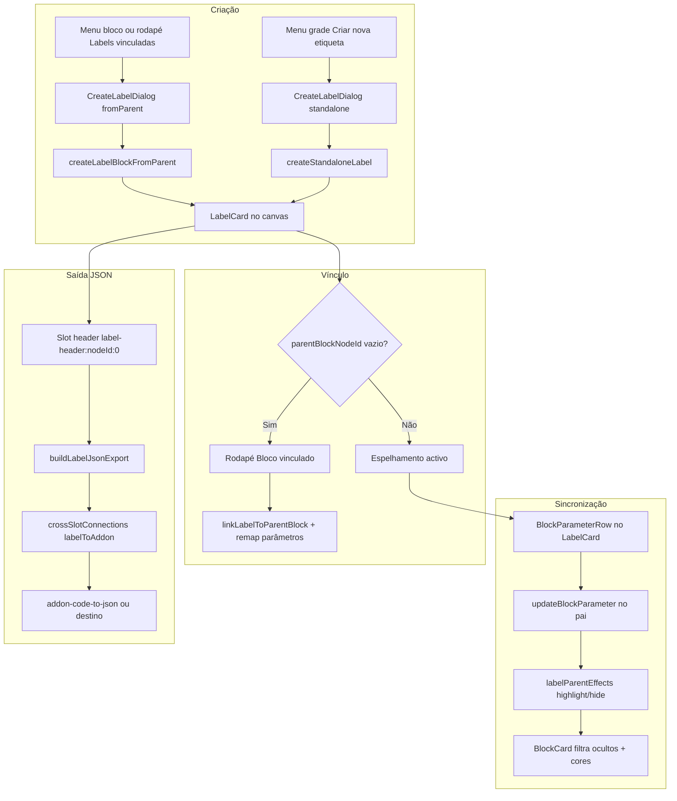
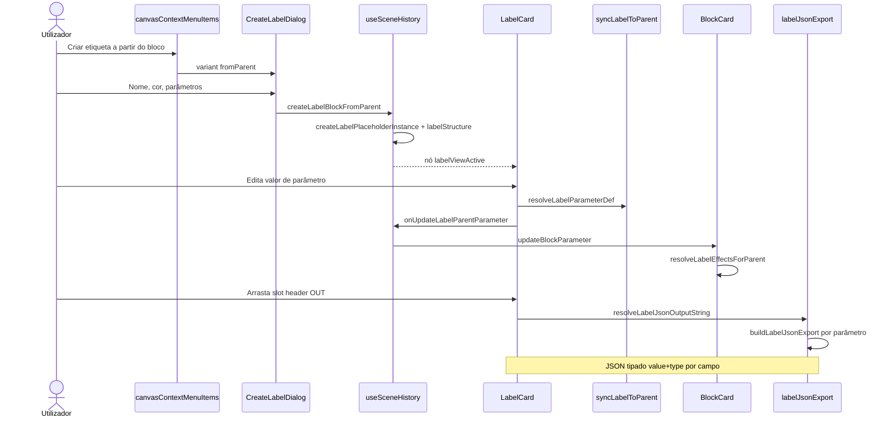

# Documentação de Implementação — Label Block (etiquetas de segmentação visual)

Arquivo salvo em: `feature_md/feature/feature-label-block.md`

## 1. Cabeçalho

| Campo | Valor |
| --- | --- |
| Nome da Branch | `feature/label-block` |
| Nome das Features | **Label Block** — card estrutural no canvas vinculado a um bloco pai; parâmetros espelhados com highlight/ocultação no pai; saída JSON tipada no slot de cabeçalho; criação a partir do bloco ou avulsa na grade; persistência em workspace e export JSON de cena v2 |
| Versão atual | `1.5.0` |
| Hash do Commit | _(preencher com `git rev-parse HEAD` na branch de entrega)_ |

Documentação relacionada: `feature_md/prompet/prompet_sistema_blocos.md`, `feature_md/feature/feature-block-link-palette.md`, `feature_md/prompet/prompt_doc.md`.

---

## 2. Definição e Resumo de Tags

| Tag | Definição |
| --- | --- |
| `[NOVO]` | Novo módulo, componente, tipo de nó, persistência ou fluxo criado nesta entrega. |
| `[ATUALIZADO]` | Componente ou função existente alterada para integrar labels, vínculo bloco↔label ou export JSON. |
| `[REMOVIDO]` | Comportamento ou API removida ou descontinuada. |

Tags presentes nesta implementação:

- `[NOVO]`
- `[ATUALIZADO]`

Não houve itens classificados como `[REMOVIDO]`.

---

## 3. Fluxograma de Funcionamento

---

## 4. Fluxograma de Acionamento de Funções

---

## 5. Tabela de Funções e Componentes

| Status | Nome | Feature | Descrição Técnica | Parâmetros / Retorno |
| --- | --- | --- | --- | --- |
| `[NOVO]` | `labelSchema.ts` | Modelo | Tipos `LabelStructurePayload`, `CreateLabelDraft`, `labelHeaderSlotId`, `LABEL_JSON_OUTPUT_TYPE`. | Constantes + helpers de slot. |
| `[NOVO]` | `labelPlaceholderNode.ts` | Placeholder | Instância schema `__label_placeholder__` para nós label no canvas. | `createLabelPlaceholderInstance`. |
| `[NOVO]` | `labelScenePersistence.ts` | Persistência | Round-trip `labels.json` no workspace; extract/apply labels da cena. | `extractSceneLabelsFromCanvas`, `applySceneLabelsToCanvas`. |
| `[NOVO]` | `labelParentLinking.ts` | Vínculo | Matching parâmetro label↔bloco, remap ao vincular, parâmetros reservados por labels irmãs, lista blocos linkáveis. | `linkLabelToParentBlock`, `listParameterIdsReservedBySiblingLabels`. |
| `[NOVO]` | `syncLabelToParent.ts` | Sync | Leitura/escrita de valores via nó pai; normalização de cor. | `resolveLabelParameterDisplayValue`, `normalizeLabelColor`. |
| `[NOVO]` | `labelParentEffects.ts` | Visual pai | Agrega highlight por cor e ocultação (`hiddenInParent`) de todas as labels do bloco. | `resolveLabelEffectsForParent` → `Map` + `Set`. |
| `[NOVO]` | `labelJsonExport.ts` | Export JSON | Serializa parâmetros espelhados como `{ campo: { value, type } }`. | `buildLabelJsonExport`, `resolveLabelJsonOutputString`. |
| `[NOVO]` | `labelSlotConnections.ts` | Conexões | Geometria e routing do slot header JSON da label. | Integração com `crossSlotConnections`. |
| `[NOVO]` | `LabelCard.tsx` | UI card | Header colorido, body grid 5 colunas (`BlockParameterRow`), slot OUT JSON, rodapé com menus. | Props espelhadas de `BlockCard`. |
| `[NOVO]` | `LabelCardParameterMenu.tsx` | Menu rodapé | Bloco vinculado, slot tools, CRUD parâmetros, toggle global ocultar no pai (`SceneNodeEyeIcon`). | Callbacks para `useSceneHistory`. |
| `[NOVO]` | `CreateLabelDialog.tsx` | Diálogo | Modos `create`/`edit`; variantes `fromParent` e `standalone` com `EmbeddedStructureListPicker`. | `CreateLabelDraft` → histórico. |
| `[NOVO]` | Ícones SVG link | UX vínculo | `link.svg`, `link block.svg`, `link parametro.svg` (+ variantes bw/black). | CSS `iconGlyphLink` em menus. |
| `[ATUALIZADO]` | `canvasScene.ts` | Cena | Campos `labelStructure`, `labelViewActive`; conexões `fromLabelSlotId`. | Tipos `CanvasNode`, `CanvasConnection`. |
| `[ATUALIZADO]` | `useSceneHistory.ts` | Mutações | `createLabelBlockFromParent`, `createStandaloneLabel`, `linkLabelToParentBlock`, `updateLabelStructure`, CRUD parâmetros label, `toggleAllLabelParametersHiddenInParent`. | Retorno `{ ok, nodeId \| error }`. |
| `[ATUALIZADO]` | `BlockCard.tsx` | Pai | Rodapé «Labels vinculadas»; aplica `hidden` e `labelHighlightColor` nos parâmetros. | Lista/focar/adicionar/remover labels. |
| `[ATUALIZADO]` | `BlockParameterRow.tsx` | Linha | `data-label-linked`, fundo highlight quando parâmetro está numa label. | Reutilizado em `LabelCard`. |
| `[ATUALIZADO]` | `GraphCanvasSceneNode.tsx` | Render | Branch `labelViewActive && labelStructure` → `LabelCard`. | Host de eventos de slot. |
| `[ATUALIZADO]` | `GraphCanvas.tsx` | Canvas | Handlers label, hover candidato vínculo (`linkCandidateHighlight`), rascunho conexão JSON. | Integração com paleta/addons. |
| `[ATUALIZADO]` | `canvasContextMenuItems.ts` | Menus | «Criar etiqueta» no bloco; «Criar nova etiqueta» na grade; «Editar etiqueta» no nó label. | `onRequestCreateLabel`, `canCreateStandaloneLabel`. |
| `[ATUALIZADO]` | `workspacePersistence.ts` | Workspace | Bundle `labels` → `labels.json` via `vite.plugin.workspaceSync`. | Serialização dev. |
| `[ATUALIZADO]` | `leagueBinScene.ts` | Export cena | Array `labels[]` no JSON v2 (`serializeScene` / `parseV2Document`). | Round-trip com testes. |
| `[ATUALIZADO]` | `crossSlotConnections.ts` | Slots cruzados | Ligações label header → addon IN (`labelToAddon`). | `instanceEvaluator` actualizado. |
| `[ATUALIZADO]` | `structureCardLayout.ts` | Layout | `resolveLabelCardWidth`, largura fixa `LABEL_CARD_WIDTH` (360px). | Resize handles partilhados. |

---

## 6. Descrição Detalhada de Funcionamento

### Modelo Label Block

[NOVO] Uma **Label Block** (etiqueta) é um nó visual no canvas que expõe um subconjunto de parâmetros de um **bloco pai** (`BlockCard`), sem duplicar dados: valores são lidos e escritos no `blockStructure` do pai via matching de `parameterId`.

[NOVO] `LabelStructurePayload` guarda `labelName`, `color`, `parentBlockNodeId` (vazio = avulsa até vincular), `catalogBlockType` (tipo de catálogo para picker standalone) e lista `parameters` com flag opcional `hiddenInParent`.

### Criação fromParent vs standalone

[NOVO] **FromParent:** menu de contexto do bloco ou botão «+» em «Labels vinculadas» no rodapé. `CreateLabelDialog` lista parâmetros do pai excluindo os já reservados por outras labels (`listParameterIdsReservedBySiblingLabels`). Spawn ~+400px em X.

[NOVO] **Standalone:** menu da grade «Criar nova etiqueta». Escolha do tipo de bloco via `EmbeddedStructureListPicker`; parâmetros vêm do catálogo. Vínculo posterior pelo rodapé «Bloco vinculado» com hover amarelo no candidato.

[ATUALIZADO] **Edição:** menu de contexto da label → `CreateLabelDialog` modo `edit` com `initialDraft`.

### LabelCard e espelhamento

[NOVO] `LabelCard` reutiliza `BlockParameterRow` em grid de **5 colunas** (slot IN → ícone → nome → valor → slot OUT). Eventos de slot e commit de valor actuam no **nó pai** (`canvasNodeId` do bloco resolvido).

[ATUALIZADO] Sem pai vinculado: aviso visual; com pai removido da cena: mensagem «bloco pai removido».

### Efeitos no bloco pai

[NOVO] `resolveLabelEffectsForParent` agrega, para cada parâmetro do pai, cores de highlight (de labels que o incluem) e ocultação se **qualquer** label marcar `hiddenInParent`.

[ATUALIZADO] `BlockCard` filtra parâmetros ocultos e passa `labelHighlightColor` às linhas. Toggle global no `LabelCardParameterMenu` via ícone olho (`toggleAllLabelParametersHiddenInParent`).

### Saída JSON no cabeçalho

[NOVO] Slot `label-header:{nodeId}:0` expõe tipo `json`. `buildLabelJsonExport` produz objecto `{ nomeCampo: { value, type } }` com tipos ritual do parâmetro espelhado.

[ATUALIZADO] Conexões para addons (ex.: `addon-code-to-json`) via `crossSlotConnections` e `labelSlotConnections`; avaliação em `instanceEvaluator`.

### Persistência

[NOVO] Dev workspace: ficheiro `labels.json` no bundle (`labelScenePersistence`).

[ATUALIZADO] Export/import JSON de cena v2: campo `labels[]` em `leagueBinScene`. Snapshots de abas incluem `labelStructure` nos nós.

### Vínculo bloco ↔ label

[NOVO] `linkLabelToParentBlock` alinha IDs com `remapLabelParametersForBlockStructure`; reutiliza parâmetro existente ou adiciona ao bloco quando necessário.

[ATUALIZADO] UI: rodapé `BlockCard` (labels vinculadas — ícone `link parametro.svg`); rodapé `LabelCard` (bloco vinculado — ícone `link block.svg`).

### Tratamento de erros e confirmações

- Nome vazio ao criar: erro inline no diálogo (sem `window.alert`).
- Bloco inválido como pai: `{ ok: false, error: '...' }` de `createLabelBlockFromParent`.
- Export JSON sem pai: objecto vazio `{}`.
- Fluxos de confirmação destrutiva seguem **Messenger Popup** quando aplicável em menus partilhados; labels não introduzem novos `window.confirm`.

---

## 7. Como utilizar (didático)

### Português

1. Seleccione um **bloco** no canvas (vista de bloco activa).
2. **Clique direito** no cabeçalho/rodapé → **Criar etiqueta**, ou use **+** em «Labels vinculadas» no rodapé do bloco.
3. Defina **nome**, **cor** e **parâmetros** a expor (parâmetros já usados noutras labels do mesmo bloco não aparecem).
4. Confirme → aparece um **LabelCard** ao lado, com os valores espelhados do pai.
5. Edite valores no LabelCard — alterações reflectem-se no **bloco pai**.
6. Use o **ícone olho** no rodapé da label para **ocultar/mostrar** todos os parâmetros da label no bloco pai.
7. Arraste o **slot de saída JSON** do cabeçalho da label para um addon (ex.: code-to-json) para consumir o objecto tipado.
8. Para **etiqueta avulsa**: clique direito na **grade vazia** → **Criar nova etiqueta** → escolha tipo de bloco e parâmetros → vincule depois via **Bloco vinculado** no rodapé.
9. **Editar** nome/cor/parâmetros: clique direito na label → **Editar etiqueta**.

### English

1. Select a **block** on the canvas (block view active).
2. **Right-click** header/footer → **Create label**, or use **+** under **Linked labels** on the block footer.
3. Set **name**, **color**, and **parameters** to expose (parameters already used by sibling labels are excluded).
4. Confirm → a **LabelCard** spawns beside the parent with mirrored values.
5. Edit values on the LabelCard — changes apply to the **parent block**.
6. Use the **eye icon** on the label footer to **hide/show** all label parameters on the parent block.
7. Drag the header **JSON output slot** to an addon (e.g. code-to-json) to consume the typed object.
8. For a **standalone label**: right-click **empty canvas** → **Create new label** → pick block type and parameters → link later via **Linked block** in the footer.
9. **Edit** name/color/parameters: right-click the label → **Edit label**.
