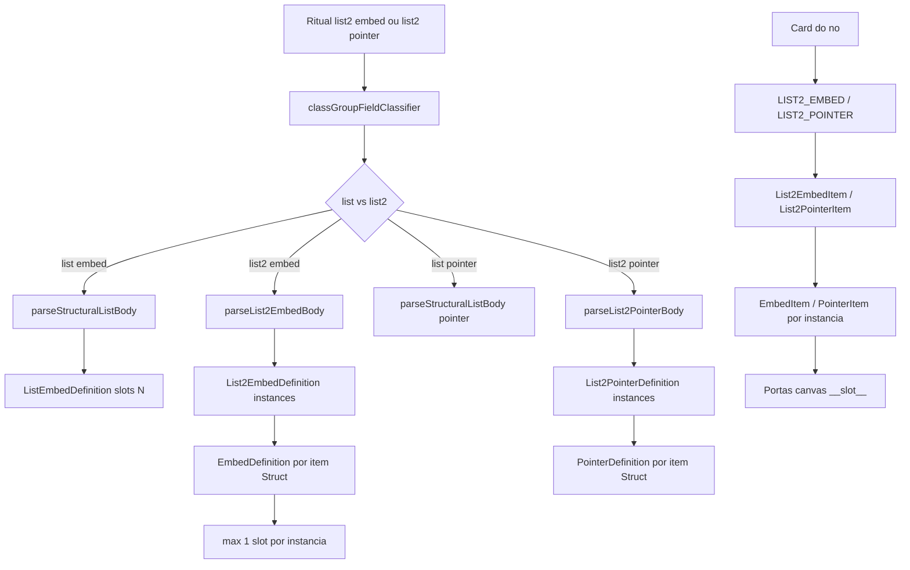
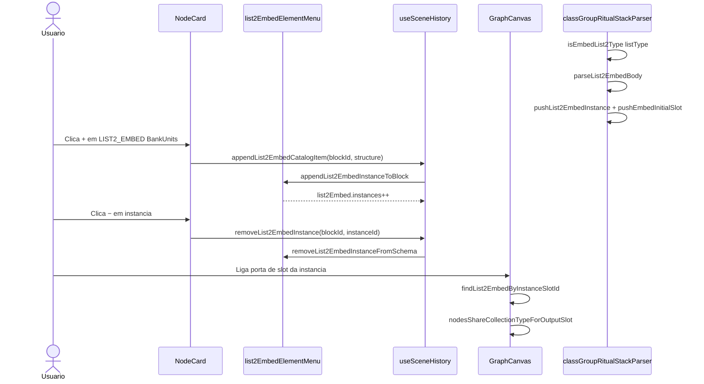

# Documentação de Implementação — LIST2_EMBED e LIST2_POINTER (Class Group)

Arquivo salvo em: `feature_md/feature/feature-list2-embed-pointer-class-group.md`

## 1. Cabeçalho

| Campo | Valor |
| --- | --- |
| Nome da Branch | `feature/list2-embed-pointer-class-group` |
| Nome das Features | LIST2_EMBED e LIST2_POINTER no schema e conversor Class Group; secções no card; slots por instância; menus e histórico de cena |
| Versão atual | `1.4.0` |
| Hash do Commit | `PENDING` |

Base: `feature/pointer-class-group` (POINTER + LIST_POINTER).

## 2. Definição e Resumo de Tags

| Tag | Definição |
| --- | --- |
| `[NOVO]` | Novo componente, arquivo, função ou tipo criado nesta branch. |
| `[ATUALIZADO]` | Componente ou fluxo existente alterado para suportar a feature. |
| `[REMOVIDO]` | Código ou comportamento removido ou descontinuado. |

Tags presentes nesta implementação:

- `[NOVO]`
- `[ATUALIZADO]`

## 3. Fluxograma de Funcionamento

## 4. Fluxograma de Acionamento de Funções

## 5. Tabela de Funções e Componentes

| Status | Nome | Feature | Descrição Técnica | Parâmetros / Retorno |
| --- | --- | --- | --- | --- |
| [NOVO] | `List2EmbedDefinition` / `list2Embed?` | Schema | Bloco `list2[embed]`; catálogo + `instances: EmbedDefinition[]`. | `nodeSchema.ts` |
| [NOVO] | `List2PointerDefinition` / `list2Pointer?` | Schema | Bloco `list2[pointer]`; catálogo + `instances: PointerDefinition[]`. | `nodeSchema.ts` |
| [NOVO] | `isEmbedList2Type` / `isPointerList2Type` | Classificador | Separa `list2[…]` de `list[…]` (regex estrita). | `listTypeBracket: string` → `boolean` |
| [NOVO] | `parseList2EmbedBody` / `parseList2PointerBody` | Parser | Uma instância embed/pointer por `Struct { }` na lista. | `ParseCtx`, `fieldName`, `listInner` |
| [NOVO] | `list2EmbedSlots.ts` | Core slots | Hidrata slots das instâncias; resolve slot por `instanceId`. | `applyList2EmbedInstancesToSchema` |
| [NOVO] | `list2PointerSlots.ts` | Core slots | Idem para pointer. | `findList2PointerByInstanceSlotId` |
| [NOVO] | `list2EmbedElementMenu.ts` | Menus | Append/remove instância; ids de slots do bloco. | `appendList2EmbedCatalogItemToSchema` |
| [NOVO] | `list2PointerElementMenu.ts` | Menus | Idem pointer. | `appendList2PointerCatalogItemToSchema` |
| [NOVO] | `List2EmbedItem.tsx` | UI card | Título do campo + lista de `EmbedItem` (instâncias). | `list2Embed`, handlers |
| [NOVO] | `List2PointerItem.tsx` | UI card | Título do campo + lista de `PointerItem`. | `list2Pointer`, handlers |
| [ATUALIZADO] | `isEmbedListType` / `isPointerListType` | Classificador | Apenas `list[…]`, sem `list2?`. | — |
| [ATUALIZADO] | `classGroupRitualStackParser.ts` | Parser | Ramo list2; `collectReachableSchemaIds` percorre instâncias. | `list2Embed[]`, `list2Pointer[]` |
| [ATUALIZADO] | `extractNodeBaseParameters.ts` | Node base | IDs `_list2Embed_`, `_list2Pointer_`; stubs e corpo JSON. | `nodeBaseList2EmbedId` |
| [ATUALIZADO] | `nodeStructureJson.ts` | JSON | Parse e stub shapes estritos list2. | `list2EmbedDefinitionFromJsonStub` |
| [ATUALIZADO] | `nodeStructureRegistry.ts` | Registry | Merge stubs list2; catálogos exportados. | `schemaBaseList2EmbedCatalogBySchemaId` |
| [ATUALIZADO] | `canvasScene.ts` | Hidratação | `applyList2EmbedInstancesToSchema` na cena. | `hydrateScene` |
| [ATUALIZADO] | `collectionTypeLinking.ts` | Ligações | Validação de tipo em slots de instâncias list2. | `findList2EmbedByInstanceSlotId` |
| [ATUALIZADO] | `listEmbedSlots.ts` | Slots | `findOutputSlotInNode` inclui instâncias list2. | `slotId` |
| [ATUALIZADO] | `NodeCard.tsx` | UI | Secções LIST2_EMBED / LIST2_POINTER antes de IS. | `onAppendList2EmbedCatalogItem` |
| [ATUALIZADO] | `GraphCanvas.tsx` | Canvas | Altura das secções list2. | `getList2EmbedSectionHeight` |
| [ATUALIZADO] | `useSceneHistory.ts` | Histórico | Append/remove instâncias list2. | `appendList2EmbedCatalogItem` |
| [ATUALIZADO] | `vite.plugin.nodeStructuresWrite.ts` | API dev | Escrita stubs `*_list2Embed_*`, `*_list2Pointer_*`. | plugin Vite |
| [ATUALIZADO] | `prompet_elements.md` | Docs | Nove famílias; ordem do card; stubs list2. | — |

## 6. Descrição Detalhada de Funcionamento

Esta branch separa semanticamente **`list2[embed]`** e **`list2[pointer]`** de **`list[embed]`** e **`list[pointer]`**, que antes eram tratados pelo mesmo classificador (`list2?` opcional) e convertidos para LIST_EMBED / LIST_POINTER com vários slots num único bloco.

### Distinção ritual → schema

| Sintaxe ritual | Secção no card | Modelo |
| --- | --- | --- |
| `list[embed]` | LIST_EMBED | 1 bloco, catálogo + N slots |
| `list2[embed]` | LIST2_EMBED | 1 bloco, catálogo + N **instâncias** (cada uma estilo EMBED, máx. 1 slot) |
| `list[pointer]` | LIST_POINTER | 1 bloco, catálogo + N slots |
| `list2[pointer]` | LIST2_POINTER | 1 bloco, catálogo + N instâncias estilo POINTER |

Exemplo: `BankUnits: list2[embed] = { BankUnit {…} BankUnit {…} }` produz `list2Embed[]` com duas instâncias `EmbedDefinition`, **não** `listEmbed[]` com dois slots no mesmo bloco.

### Ordem no card

Parameters → EMBED → POINTER → LIST_EMBED → LIST_POINTER → **LIST2_EMBED** → **LIST2_POINTER** → Internal_Structures.

### Parser

`parseList2EmbedBody` e `parseList2PointerBody` iteram itens `Struct { }` na lista, acrescentam tipos ao catálogo (`internalStructures`) e criam `instances[]` com `pushEmbedInitialSlot` / `pushPointerInitialSlot`. `collectReachableSchemaIds` percorre catálogo e slots das instâncias para incluir schemas filhos (ex.: `BankUnit`) no output convertido.

### UI e runtime

`List2EmbedItem` mostra o título do campo e renderiza cada instância como `EmbedItem`. Botões **+** / **−** no bloco acrescentam ou removem a última instância (via catálogo); **−** por instância remove essa entrada. Slots usam o mesmo prefixo `__slot__` que EMBED (`embedSlotId` por `instanceId`).

### Stubs e migração

Stubs no disco: `{collectionType}_list2Embed_{title}.json` e `{collectionType}_list2Pointer_{title}.json`, com `instances: []` no template. Packs já convertidos com `list2` dentro de LIST_EMBED (ex.: romel `BankUnits`) devem ser **reconvertidos** a partir do ritual; não há migração automática fiável por título.

### Testes

214 testes Vitest, incluindo classifier (`list2[embed]` vs `list[embed]`), parser (`BankUnits` → `list2Embed`), conversão ritobin e `buildNodeBaseSchemaBody` com `list2Embed` / `list2Pointer` vazios.
