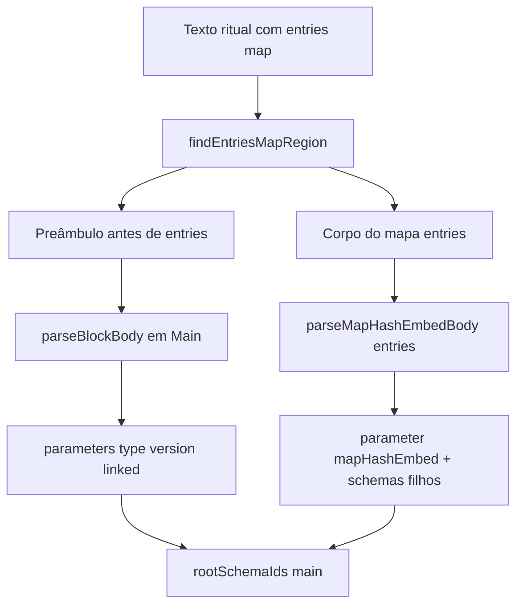

# Documentação de Implementação — Nó Main (Class Group)

Arquivo salvo em: `feature_md/feature/feature-main-class-group.md`

## 1. Cabeçalho

| Campo | Valor |
| --- | --- |
| Nome da Feature | Nó **Main** no conversor Class Group (`estrutura_bin.py` / `#PROP_text`) |
| Versão atual | `1.0.0` |

## 2. Resumo

Ficheiros ritual com `entries: map[hash,embed]` (ex.: `estrutura_bin.py`) passam a gerar um schema **Main** (`id`: `main`, `title`: `Main`) que absorve:

| Linha ritual | Destino |
| --- | --- |
| `type`, `version` | `parameters[]` de Main |
| `linked: list[string]` | `parameters[]` de Main |
| `entries: map[hash,embed]` | parâmetro `entries` (`type`: `mapHashEmbed`) |
| `"path" = Tipo { … }` dentro do mapa | schemas filhos referenciados no valor serializado |

**Raiz única:** `rootSchemaIds = ['main']`. Entidades do mapa permanecem no pack e na paleta via `collectReachableSchemaIds` (BFS a partir de `mapHashEmbed`).

## 3. Fluxograma

## 4. Arquivos principais

| Arquivo | Papel |
| --- | --- |
| `src/core/classGroupRitualStackParser.ts` | `ensureMainSchema`, `findEntriesMapRegion`, ramo Main em `parseClassGroupRitualWithStack` |
| `src/core/classGroupFieldClassifier.ts` | `METADATA_LINE_REGEX` só `type`/`version`; `linked` como lista primitiva |
| `src/core/convertRitobinTextToNodeStructures.ts` | Expõe `rootSchemaIds` com `main` |
| `src/nodeStructures/default/main.json` | Modelo de referência UI/nomenclatura |

## 5. Nomenclatura

- **Main:** `#0 Root main`, `collectionType`: `main`
- **Entidade do mapa:** path `main > entries:{chave} > …`

## 6. Testes

- `classGroupRitualStackParser.test.ts` — caso preâmbulo PROP + `entries`
- `convertRitobinTextToNodeStructures.test.ts` — paths e `rootSchemaIds`

Comando: `npx vitest run src/core/classGroupRitualStackParser.test.ts src/core/convertRitobinTextToNodeStructures.test.ts`

Reconversão de exemplo: `npx vite-node scripts/reconvert-class-pack.ts class` (a partir de `estrutura_bin.py`).
