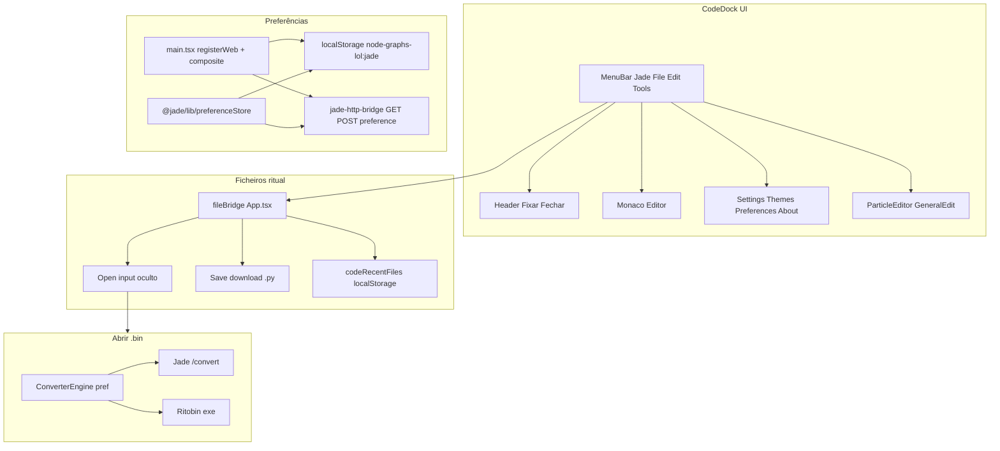
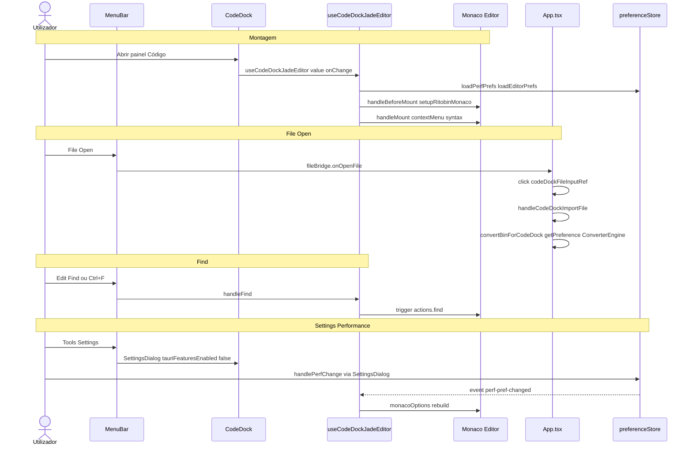

# Documentação de Implementação — Menu e configurações Jade no editor de código

Arquivo salvo em: `feature_md/feature/feature-menu-jade-codedock.md`

## 1. Cabeçalho

| Campo | Valor |
| --- | --- |
| Nome da Branch | `feature/menu-jade-codedock` |
| Nome das Features | Menu Jade no CodeDock; preferências web; painéis Particle/General Edit; Settings/Themes/Preferences; ponte HTTP `/preference` (Fase 2) |
| Versão atual | `1.5.0` |
| Hash do Commit | `a35062a` |

## 2. Definição e Resumo de Tags

| Tag | Definição |
| --- | --- |
| `[NOVO]` | Novo componente, arquivo, hook, backend de preferências ou endpoint criado nesta branch. |
| `[ATUALIZADO]` | Componente ou fluxo existente alterado para integrar a chrome do Jade-League-Bin-Editor. |
| `[REMOVIDO]` | UI ou comportamento substituído pela barra de menus Jade. |

Tags presentes nesta implementação:

- `[NOVO]`
- `[ATUALIZADO]`
- `[REMOVIDO]`

## 3. Fluxograma de Funcionamento

## 4. Fluxograma de Acionamento de Funções

## 5. Tabela de Funções e Componentes

| Status | Nome | Feature Correspondente | Descrição Técnica | Parâmetros Recebidos / Retorno |
| --- | --- | --- | --- | --- |
| `[NOVO]` | `preferenceStore.ts` (Jade) | Preferências partilhadas | API `getPreference` / `setPreference` / `setPreferenceBackend`; default Tauri invoke. | `(key, defaultValue)` → `Promise<string>` |
| `[NOVO]` | `webPreferenceBackend.ts` | Preferências web | Backend `localStorage` prefixo `node-graphs-lol:jade:`. | `PreferenceBackend` |
| `[NOVO]` | `compositePreferenceBackend.ts` | Fase 2 ponte | Lê/escreve localStorage e sincroniza com `GET/POST /preference` do bridge quando disponível. | `PreferenceBackend` |
| `[NOVO]` | `codeRecentFiles.ts` | File recentes | FIFO 10 nomes de ficheiro ritual em `localStorage`. | `readCodeRecentFiles`, `pushCodeRecentFile` |
| `[NOVO]` | `useCodeDockJadeEditor.ts` | Editor Jade | Find/Replace, context menu, fold emitters, emitter hints, syntax toggle, perfPrefs, atalhos, temas Monaco. | `value`, `onContentChange` → API do hook |
| `[NOVO]` | `buildMonacoOptions.ts` | Performance Monaco | Opções alinhadas ao shell VSCode do Jade; modo `auto` desliga features em ficheiros >75k linhas. | `(perfPrefs, lineCount, font?)` → `IStandaloneEditorConstructionOptions` |
| `[NOVO]` | `CodeDockJadeDialogs.tsx` | Diálogos | Monta EditorContextMenu, Particle/General panels, Settings, Preferences, Themes, About. | `editor`, `value` |
| `[NOVO]` | `codeDockJade.css` | Estilos Jade | Importa CSS dos componentes Jade; escopo `.codeDockJadeScope`. | — |
| `[NOVO]` | `jade-http-bridge` `/preference` | Fase 2 | `GET ?key=&default=` e `POST {key,value}` em memória no bridge Rust. | JSON `{ok, value}` |
| `[ATUALIZADO]` | `CodeDock.tsx` | Chrome completa | MenuBar + hook Jade; `fileBridge`; Node Graph em Tools; Monaco dinâmico. | Props `fileBridge`, `nodeActions` |
| `[ATUALIZADO]` | `App.tsx` | Orquestração | `codeDockFileBridge`, `convertBinForCodeDock`, input ficheiro, save blob `.py`. | — |
| `[ATUALIZADO]` | `main.tsx` | Bootstrap prefs | `registerWebPreferenceBackend` + `registerCompositePreferenceBackend`. | — |
| `[ATUALIZADO]` | `MenuBar.tsx` (Jade) | Tools extra | `toolsExtraContent`, `onPreferences` opcional. | Props novas |
| `[ATUALIZADO]` | `SettingsDialog.tsx` (Jade) | Web mode | `tauriFeaturesEnabled`; secções Hash/Library/Updates com badge Fase 2. | `tauriFeaturesEnabled?: boolean` |
| `[ATUALIZADO]` | `ThemesDialog.tsx` (Jade) | CodeDock | `hideWorkspaceSection`; usa `preferenceStore`. | `hideWorkspaceSection?: boolean` |
| `[ATUALIZADO]` | `PreferencesDialog.tsx` (Jade) | Editor prefs | Syntax checking e emitter hints via `preferenceStore`. | callbacks `onSyntaxCheckingChange` |
| `[REMOVIDO]` | Dropdown «Converter ▾» no header CodeDock | Node Graph | Substituído por secção **Tools → Node Graph** no MenuBar. | — |
| `[REMOVIDO]` | Opções Monaco fixas no CodeDock | Performance | Substituídas por `buildMonacoOptions` + prefs Performance. | — |
| `[REMOVIDO]` | `contextmenu: true` nativo | Context menu Jade | `contextmenu: false` + `EditorContextMenu` custom. | — |

## 6. Descrição Detalhada de Funcionamento

### Arquitetura

O painel **Código** (`CodeDock`) passa a embutir a chrome do **Jade-League-Bin-Editor** via alias Vite `@jade`, sem duplicar diálogos. A camada `preferenceStore` no repositório Jade permite que os mesmos componentes (`SettingsDialog`, `ThemesDialog`, `PreferencesDialog`) funcionem no desktop (Tauri) e no browser (localStorage), com sincronização opcional para o `jade-http-bridge` na Fase 2.

O hook `useCodeDockJadeEditor` concentra a lógica que antes vivia em `Jade App.tsx` / `EditorPane.tsx`: acções de edição Monaco, estado Find/Replace, decorações de syntax/emitter, e opções de performance derivadas de `perfPrefs`.

### Menu e ferramentas

- **File / Edit / Tools** replicam o Jade; **Exit** fecha o painel.
- **Tools → Node Graph** preserva conversores LOL (Jade fx_editor, Class Group, Extrair Node Base, Nomeclatura, Deletar pack).
- Ícones da barra: Find, Replace, General Edit, Particle (atalhos Ctrl+F/H/O/P com foco no editor).

### Preferências

| Secção | Browser (Fase 1) | Fase 2 |
| --- | --- | --- |
| Performance Monaco | Funcional | Igual |
| Converter engine (jade/ltk) | Funcional; ordem em `convertBinForCodeDock` | Igual |
| Preferences (syntax, emitter) | Funcional | Igual |
| Themes (sem Workspace) | Funcional; aplica tema ao Monaco | Igual |
| Hash / Library / Updates / tray | UI visível, desactivada + badge | Ponte Tauri / bridge |

### Tratamento de erros

- Abrir `.bin` sem bridge nem Ritobin: `window.alert` com mensagem de configuração (`VITE_JADE_BIN_BRIDGE`, proxy, executável Ritobin).
- Material Library, Open Log, acções Tauri no General Edit: `showTauriToast` / alerta «Fase 2».
- Preferências no bridge: falha silenciosa → fallback `localStorage`.
- Secções Settings desactivadas não navegam para conteúdo Tauri no browser.

### Repositório Jade (irmão)

Alterações em `Jade-League-Bin-Editor` (`preferenceStore`, `MenuBar`, diálogos, `jade-http-bridge`) devem ser commitadas no repositório Jade separadamente para manter paridade com o app desktop.

### Testes automatizados

- `webPreferenceBackend.test.ts` — round-trip get/set.
- `buildMonacoOptions.test.ts` — minimap `auto` vs ficheiro grande.
