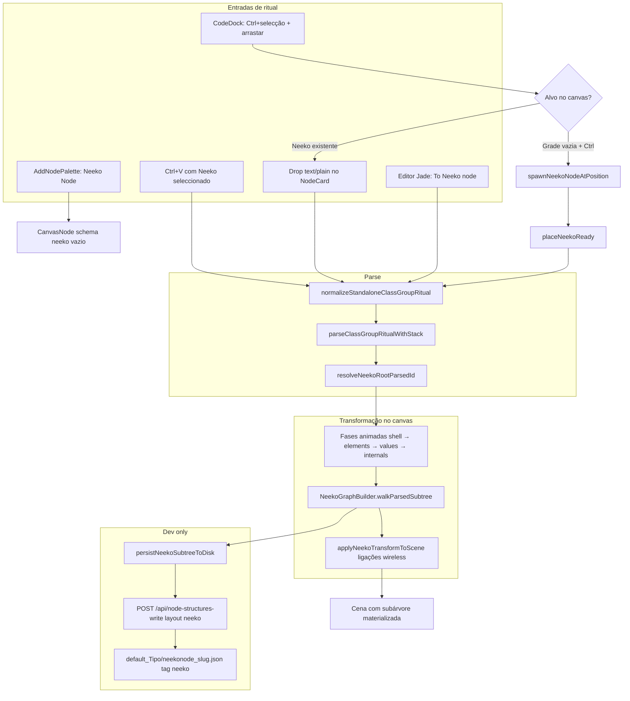
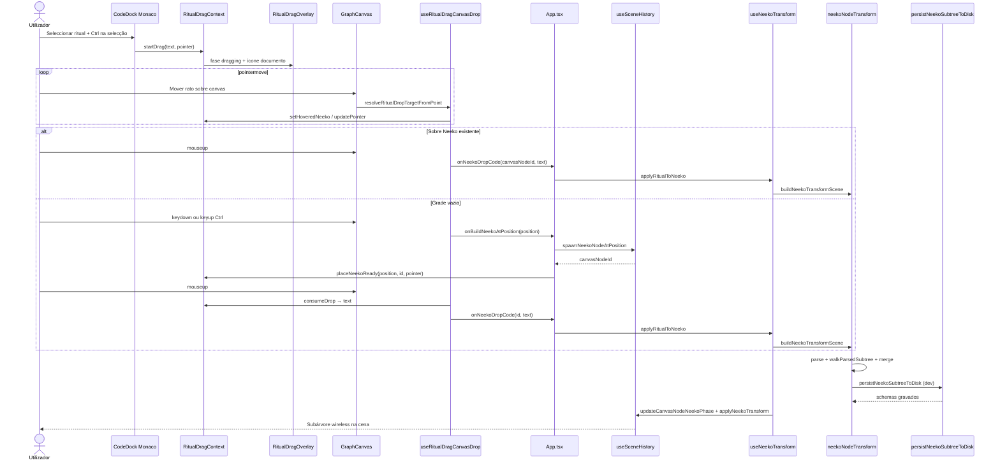

# Documentação de Implementação — Neeko Node (Ditto Node)

Arquivo salvo em: `feature_md/feature/feature-neeko-ditto-node.md`

## 1. Cabeçalho

| Campo | Valor |
| --- | --- |
| Nome da Branch | `feature/neeko-ditto-node` |
| Nome das Features | Neeko Node / Ditto Node; Ritual Drag (CodeDock → canvas) |
| Versão atual | `1.0.0` |
| Hash do Commit | _(preencher após commit)_ |

## 2. Definição e Resumo de Tags

| Tag | Definição |
| --- | --- |
| `[NOVO]` | Schema, núcleo de transformação, persistência em disco (dev), ritual drag, overlay e testes criados nesta branch. |
| `[ATUALIZADO]` | `CanvasNode`, histórico de cena, `NodeCard`, `GraphCanvas`, `App`, `CodeDock`, plugin Vite de escrita e catálogo de toasts. |
| `[REMOVIDO]` | Espera fixa de 1,5 s na grade vazia antes de criar Neeko; gravação do card `neeko` em `default_neeko/`. |

Tags presentes nesta implementação:

- `[NOVO]`
- `[ATUALIZADO]`
- `[REMOVIDO]`

## 3. Fluxograma de Funcionamento

## 4. Fluxograma de Acionamento de Funções

## 5. Tabela de Funções e Componentes

| Status | Nome | Feature | Descrição Técnica | Parâmetros Recebidos / Retorno |
| --- | --- | --- | --- | --- |
| `[NOVO]` | `neeko.json` | Neeko Node | Schema vazio (`id: neeko`) no pack `default` para a paleta | — |
| `[NOVO]` | `neekoNodeTransform.ts` | Neeko Node | Normalização ritual, parse, builder, merge na cena, persistência | `buildNeekoTransformScene(...)`, `applyNeekoTransformToScene(...)` → `NeekoTransformResult` |
| `[NOVO]` | `neekoNodeDiskLayout.ts` | Neeko Node | Caminhos `default_{Title}/neekonode_{slug}.json`; exclui `id === 'neeko'` | `resolveNeekoDiskPaths(schema)` → paths |
| `[NOVO]` | `persistNeekoSubtreeToDisk` | Neeko Node | Serializa subárvore com `tag: neeko` via API dev | `builtNodes[]` → `Promise<void>` |
| `[NOVO]` | `useNeekoTransform.ts` | Neeko Node | Animação de fases (~200 ms) e commit na cena | `applyRitualToNeeko(canvasNodeId, text)` |
| `[NOVO]` | `RitualDragContext` | Ritual Drag | Máquina de estados: hint → dragging → readyNeeko | `startDrag`, `placeNeekoReady`, `consumeDrop`, … |
| `[NOVO]` | `useCodeDockRitualDrag.ts` | Ritual Drag | Ctrl na selecção Monaco inicia drag ritual | `editor`, `ritualDrag` |
| `[NOVO]` | `useRitualDragCanvasDrop.ts` | Ritual Drag | Hit-test Neeko/grade; Ctrl spawn; mouseup aplica ritual | callbacks `onNeekoDropCode`, `onBuildNeekoAtPosition` |
| `[NOVO]` | `resolveRitualDropTarget.ts` | Ritual Drag | `elementFromPoint` + `data-neeko-drop-zone` | `clientX/Y`, ids Neeko → `RitualDropTarget` |
| `[NOVO]` | `RitualDragOverlay` | Ritual Drag | Balão Neeko (`neeko_emoji.png`) + hints Ctrl/drop | `RitualDragSession` |
| `[NOVO]` | `RitualNeekoStagingPreview` | Ritual Drag | Pré-visualização na grade (fase `readyNeeko`) | posição, progresso |
| `[NOVO]` | `spawnNeekoNodeAtPosition` | Neeko Node | Instancia Neeko seleccionado na posição do rato | `CanvasPosition` → `string` (canvas node id) |
| `[ATUALIZADO]` | `useSceneHistory` | Neeko Node | `updateCanvasNodeNeekoPhase`, `applyNeekoTransform`, spawn Neeko | fase / cena parcial |
| `[ATUALIZADO]` | `NodeCard` | Neeko Node | `data-neeko-drop-zone`, hover `ritualDropHover`, bloqueio se locked | `onDrop` text/plain |
| `[ATUALIZADO]` | `GraphCanvas` | Neeko Node | Integra hooks ritual drag + preview staging | props de callbacks Neeko |
| `[ATUALIZADO]` | `App.tsx` | Neeko Node | `RitualDragOverlay`, handlers drop/colagem, toasts messenger | `handleNeekoDropCode`, spawn |
| `[ATUALIZADO]` | `vite.plugin.nodeStructuresWrite.ts` | Neeko Node | `layout: 'neeko'` no POST de escrita | body JSON → ficheiro em disco |
| `[ATUALIZADO]` | `classGroupRitualStackParser` | Neeko Node | `normalizeStandaloneClassGroupRitual`, raiz VFX Jade | ritual text → parse tree |
| `[ATUALIZADO]` | `messenger_popup_catalog` | Neeko Node | `toast_neeko_build_failed`, `toast_neeko_transform_error/warnings` | chaves i18n |
| `[ATUALIZADO]` | Editor Jade `To Neeko node` | Neeko Node | Item de menu (repo `Jade-League-Bin-Editor`) | seleção + Neeko no canvas |
| `[REMOVIDO]` | Timer 1,5 s grade vazia | Ritual Drag | Substituído por spawn imediato ao pressionar/soltar Ctrl | — |
| `[REMOVIDO]` | `default_neeko/neeko.json` vazio | Persistência | Causava 500 no Vite; pasta removida | — |

## 6. Descrição Detalhada de Funcionamento

### Arquitectura

O **Neeko Node** é um card especial no canvas (`schema.id === 'neeko'`) que aceita um fragmento **Class Group** (ritual) e materializa uma **subárvore completa** de nós instanciados só a partir do parse — sem resolver tipos via pack existente na v1. Todas as ligações geradas usam `routing: 'wireless'`. O card passa por fases visuais (`shell` → `elements` → `values` → `internals`) antes do merge final na cena.

O núcleo vive em [`neekoNodeTransform.ts`](../../src/core/neekoNodeTransform.ts): normaliza rituais soltos (incluindo sintaxe **VFX Jade** `"path" = VfxSystemDefinitionData { … }` para `entries: map[hash,embed]`), faz parse com `parseClassGroupRitualWithStack`, escolhe a raiz com `resolveNeekoRootParsedId` (map `main` usa o **primeiro filho**, não o container; VFX Jade torna o card `VfxSystemDefinitionData`, não o primeiro emitter da lista), percorre a árvore com `NeekoGraphBuilder` e aplica `applyNeekoTransformToScene`.

### Persistência em desenvolvimento

Com `npm run dev`, após transformação bem-sucedida, `persistNeekoSubtreeToDisk` envia cada schema materializado para `POST /api/node-structures-write` com `layout: "neeko"`. Os ficheiros ficam em `src/nodeStructures/default/default_{Tipo}/neekonode_{slug}.json` com `"tag":"neeko"`. O card base `neeko` **nunca** é gravado. A paleta é refrescada; F5 garante reload do registry. Ficheiros `neekonode_*` gerados em testes manuais (ex. ritual Zac) são artefactos locais — não são obrigatórios no repositório.

### Ritual drag (CodeDock → canvas)

[`RitualDragContext`](../../src/ritualDrag/RitualDragContext.tsx) gere a sessão: no Monaco, com texto seleccionado, **Ctrl** (ou Meta) na selecção inicia `dragging` e cursor grab (`.codeDockRitualGrab`). [`useRitualDragCanvasDrop`](../../src/hooks/useRitualDragCanvasDrop.ts) resolve o alvo:

- **Neeko existente** sob o ponteiro → ao **soltar o rato**, chama `onNeekoDropCode`.
- **Grade vazia** → ao **pressionar ou soltar Ctrl** sobre a grade, `onBuildNeekoAtPosition` cria Neeko via `spawnNeekoNodeAtPosition` e `placeNeekoReady` (sem animação de build de 1,5 s); ao **soltar o rato**, aplica o ritual no Neeko criado.

[`RitualDragOverlay`](../../src/components/molecules/RitualDragOverlay.tsx) mostra o balão com `src/assets/neeko_emoji.png` alinhado ao topo da mensagem «Na grade: pressione…».

### Outras entradas

- Paleta **Add Node** (`Ctrl+K`, pack `default`) → Neeko vazio.
- **Ctrl+V** com Neeko seleccionado e ritual no clipboard.
- **Drop** `text/plain` no corpo do `NodeCard` (`data-neeko-drop-zone`).
- **CodeDock / Jade**: menu contextual **To Neeko node** (requer Neeko seleccionado no canvas; implementação no repo `Jade-League-Bin-Editor`).

### Tratamento de erros

- Parse ou build falham → toast `toast_neeko_transform_error` / avisos `toast_neeko_transform_warnings` (sem `alert`).
- Drop durante build anterior ou spawn falhado → `toast_neeko_build_failed` e `failBuildAndConsumeText`.
- Nó locked ou em transformação → drop ignorado.
- JSON vazio em `default_neeko/neeko.json` causava 500 no Vite — pasta removida; apenas `default/neeko.json` válido.

### Testes (Vitest)

- [`neekoNodeTransform.test.ts`](../../src/core/neekoNodeTransform.test.ts) — snippet, embed, VFX Jade, merge, strip transitório.
- [`neekoNodeDiskLayout.test.ts`](../../src/core/neekoNodeDiskLayout.test.ts) — naming e colisão de emitters.
- [`resolveRitualDropTarget.test.ts`](../../src/ritualDrag/resolveRitualDropTarget.test.ts) — hit-test Neeko / grade vazia.
- [`classGroupRitualStackParser.test.ts`](../../src/core/classGroupRitualStackParser.test.ts) — normalização e raiz sem emitters órfãos.

### Fora de âmbito (v1)

- Resolver tipo de nó via schema já existente no pack.
- Drag nativo completo desde o Monaco sem o fluxo Ctrl+selecção.

---

## 7. User Guide (English)

### What is Neeko Node?

Neeko (Ditto) Node turns a **Class Group ritual** pasted or dropped onto an empty Neeko card into a full **wireless subgraph** on the canvas. In dev mode, generated type schemas are saved under `default_{Type}/neekonode_*.json`.

### How to use

1. **Add a Neeko card** — Open the node palette (`Ctrl+K`), pack `default`, choose **Neeko Node**, place it on the canvas.
2. **Apply ritual by paste or drop** — Select the Neeko card, paste (`Ctrl+V`) with ritual text on the clipboard, or drag plain text from another app onto the card body.
3. **From CodeDock (ritual drag)** — Select ritual code in the editor, hold **Ctrl** on the selection, then drag. Release the mouse:
   - Over an **existing Neeko** → ritual applies immediately.
   - Over **empty grid** → press or release **Ctrl** while hovering → a new Neeko appears at the cursor and is selected → release the mouse to apply the ritual.
4. **Jade editor menu** — With a Neeko selected on the canvas, right-click inside a ritual selection in the Jade bin editor and choose **To Neeko node**.
5. **Watch phases** — The card animates `shell` → `elements` → `values` → `internals`, then the subtree appears with wireless links.
6. **Dev persistence** — After a successful transform in `npm run dev`, new `neekonode_*.json` files appear; refresh the palette or reload the page to pick them up in **Add Node**.

### Tips

- Do not drop on a **locked** Neeko or while another transform is running.
- For VFX Jade one-liners, the Neeko card becomes the **system** node, not a random emitter child.
- If transform fails, read the toast message instead of expecting a partial graph.

---

## 8. Guia de Utilização (Português)

### O que é o Neeko Node?

O **Neeko Node** (Ditto Node) transforma um **ritual Class Group** colado ou largado num card Neeko vazio numa **subárvore completa** no canvas, com ligações sem fio. Em modo dev, os schemas gerados são guardados em `default_{Tipo}/neekonode_*.json`.

### Como utilizar

1. **Adicionar um card Neeko** — Abra a paleta de nós (`Ctrl+K`), pack `default`, escolha **Neeko Node** e coloque no canvas.
2. **Aplicar ritual por colar ou drop** — Seleccione o card Neeko, use `Ctrl+V` com o ritual no clipboard, ou arraste texto `text/plain` para o corpo do card.
3. **Desde o CodeDock (ritual drag)** — Seleccione o ritual no editor, mantenha **Ctrl** na selecção e arraste. Ao soltar o rato:
   - Sobre um **Neeko existente** → o ritual aplica-se de imediato.
   - Sobre **grade vazia** → com o rato sobre a grade, **pressione ou solte Ctrl** → surge um Neeko na posição do rato, já seleccionado → solte o rato para aplicar o ritual.
4. **Menu do editor Jade** — Com um Neeko seleccionado no canvas, clique com o botão direito dentro da selecção no editor Jade e escolha **To Neeko node**.
5. **Fases visuais** — O card anima `shell` → `elements` → `values` → `internals`; depois aparece a subárvore com ligações wireless.
6. **Persistência em dev** — Após transformação com `npm run dev`, surgem ficheiros `neekonode_*.json`; refresque a paleta ou recarregue a página para os ver em **Adicionar nó**.

### Dicas

- Não largue ritual em Neeko **bloqueado** nem durante outra transformação.
- Rituais **VFX Jade** em uma linha fazem o card Neeko tornar-se o nó de **sistema**, não o primeiro emitter da lista.
- Se falhar, consulte o toast — não espere um grafo parcial silencioso.
