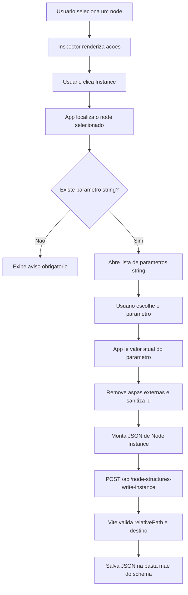
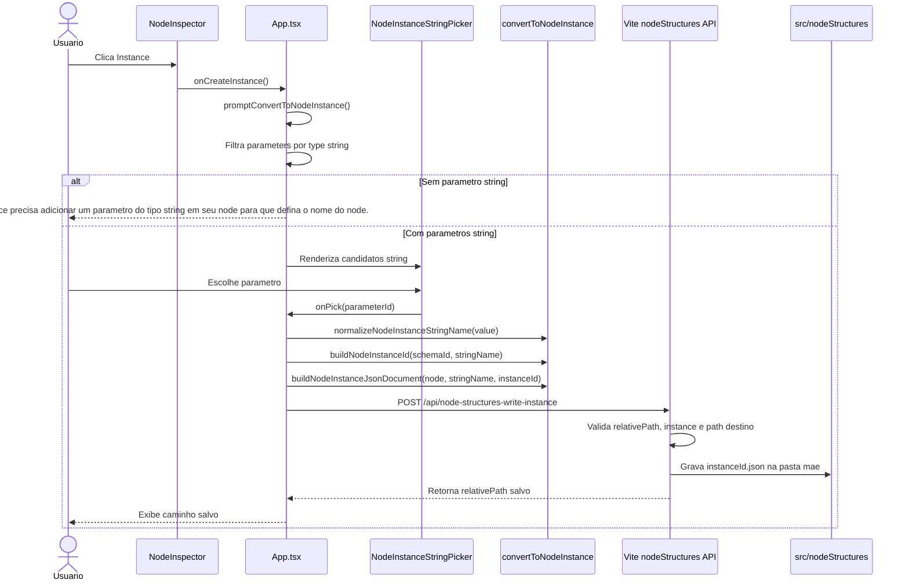

# Documentacao de Implementacao - node-instance-feature

Arquivo salvo em: `feature_md/node-instance-feature.md`

## 1. Cabecalho

| Campo | Valor |
| --- | --- |
| Nome da Branch | `node-instance-feature` |
| Nome das Features | Node Instance |
| Versao atual | `1.4.0` |
| Hash do Commit | `eb5e4b1b6e11ac977c4f0a61fea788df3b90b37b` |

## 2. Definicao e Resumo de Tags

| Tag | Definicao |
| --- | --- |
| `[NOVO]` | Novo componente, arquivo, endpoint, funcao ou estrutura de dados criado nesta branch. |
| `[ATUALIZADO]` | Componente, funcao, schema ou fluxo existente alterado para suportar a feature. |
| `[REMOVIDO]` | Codigo, comportamento ou componente removido da aplicacao. |

Tags presentes nesta implementacao:

- `[NOVO]`
- `[ATUALIZADO]`

Nao houve itens classificados como `[REMOVIDO]` nesta branch.

## 3. Fluxograma de Funcionamento

## 4. Fluxograma de Acionamento de Funcoes

## 5. Tabela de Funcoes e Componentes

| Status | Nome | Feature Correspondente | Descricao Tecnica | Parametros Recebidos / Retorno |
| --- | --- | --- | --- | --- |
| `[NOVO]` | `NodeInstanceStringPicker` | Node Instance | Modal via portal que lista parametros `string` disponiveis e permite escolher qual valor sera usado como nome da instancia. | Recebe `candidates`, `nodeTitle`, `open`, `onPick`, `onClose`; retorna JSX ou `null`. |
| `[NOVO]` | `NodeInstanceStringPicker.module.css` | Node Instance | Estilos do modal de escolha, seguindo o padrao visual dos dialogs existentes. | Classes CSS; sem retorno. |
| `[NOVO]` | `convertToNodeInstance.ts` | Node Instance | Centraliza leitura de valores atuais, normalizacao do nome, sanitizacao do id e montagem do JSON exportavel. | Recebe `CanvasNode`, `parameterId`, `stringName` e `instanceId`; retorna valor, id ou `NodeInstanceJsonDocument`. |
| `[NOVO]` | `/api/node-structures-write-instance` | Node Instance | Endpoint Vite dev que salva a instancia JSON na pasta mae do schema de origem. | Recebe `{ relativePath, instance }`; retorna `{ ok, relativePath }` ou erro JSON. |
| `[ATUALIZADO]` | `NodeInspector.tsx` | Node Instance | Adiciona callback opcional `onCreateInstance` e renderiza o botao `Instance` imediatamente acima de `Delete node`. | Recebe `onCreateInstance?: () => void`; chama callback ao clicar. |
| `[ATUALIZADO]` | `NodeInspector.module.css` | Node Instance | Separa estilo de acao normal (`Instance`) e acao destrutiva (`Delete node`). | Classes CSS; sem retorno. |
| `[ATUALIZADO]` | `App.tsx` | Node Instance | Orquestra validacao de parametros string, abertura do picker, montagem do JSON e chamada do endpoint de persistencia. | Usa estados React e callbacks; chama `fetch` e mostra mensagens ao usuario. |
| `[ATUALIZADO]` | `vite.plugin.nodeStructuresWrite.ts` | Node Instance | Acrescenta documentacao do endpoint e logica de gravacao segura baseada no `relativePath` do schema. | Recebe request HTTP; grava arquivo com `fs.writeFile`. |

## 6. Descricao Detalhada de Funcionamento

[ATUALIZADO] A feature adiciona o fluxo de conversao de um node selecionado em uma Node Instance persistida em JSON. O ponto de entrada fica no `NodeInspector`: quando existe um node selecionado, o painel mostra o botao `Instance` acima de `Delete node`. O botao chama `onCreateInstance`, callback fornecido por `App.tsx`.

[ATUALIZADO] Em `App.tsx`, o fluxo localiza o `inspectorTarget` e filtra os parametros do schema por `type === 'string'`. Se nao houver nenhum parametro string, a execucao e interrompida e o usuario recebe exatamente a mensagem: "Você precisa adicionar um parâmetro do tipo string em seu node para que defina o nome do node.". Quando ha candidatos, [NOVO] `NodeInstanceStringPicker` abre uma lista modal com o nome do parametro, o valor atual e o nome normalizado que sera usado na instancia.

[NOVO] O helper `convertToNodeInstance.ts` concentra as regras de montagem. `getNodeParameterRuntimeValue` resolve o valor editado no runtime ou cai para o `defaultValue` do schema. `normalizeNodeInstanceStringName` remove aspas externas, por exemplo `"Mouth"` vira `Mouth`. `buildNodeInstanceId` cria um id seguro usando o id do schema e o nome escolhido, mantendo o arquivo compativel com a validacao do servidor. `buildNodeInstanceJsonDocument` gera o documento final com `id`, `title`, `parameters`, `internalStructures`, `nomenclature`, `required_parameter` e `linked_parameter_values` quando existirem.

[NOVO] A persistencia usa o endpoint `/api/node-structures-write-instance`. O cliente envia `{ relativePath, instance }`; o servidor valida o caminho do schema, confirma que o arquivo de origem existe, deriva a pasta mae do schema e grava o JSON com o nome seguro da instancia. Exemplo: um schema em `importado/importado_VFX/VFX.json` gera a instancia em `importado/<id>.json`, preservando a regra de salvar fora da subpasta do node base.

As principais salvaguardas sao: bloqueio quando nao ha parametro string, bloqueio de nome vazio ou id invalido, uso de `relativePath` derivado no servidor, protecao contra caminhos fora de `src/nodeStructures` e mensagens de erro quando o servidor dev nao esta disponivel. Nao houve [REMOVIDO] nesta branch.
