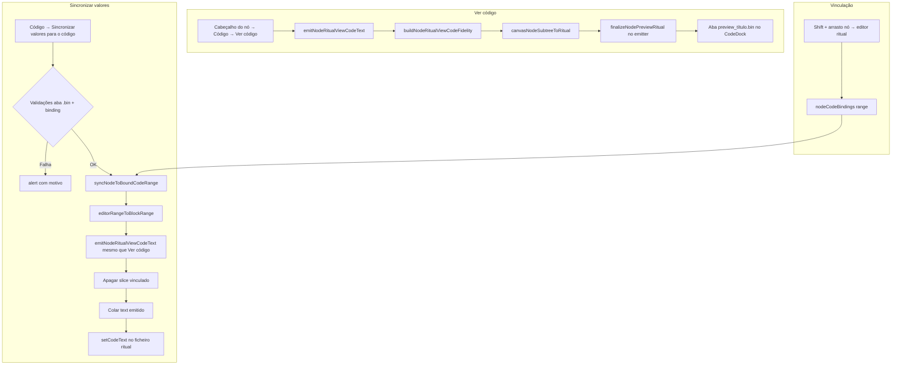
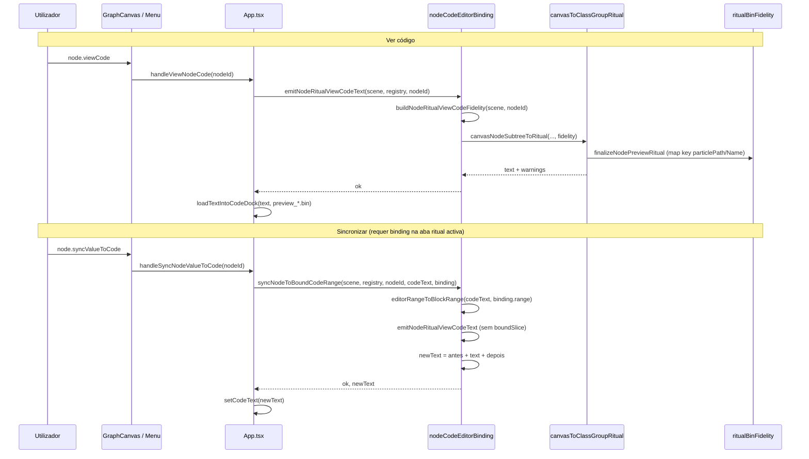

# Documentação de Implementação — Node Ritual Sync & View Code

Arquivo salvo em: `feature_md/feature/feature-node-ritual-sync-view-code.md`

## 1. Cabeçalho

| Campo | Valor |
| --- | --- |
| Nome da Branch | `feature/node-ritual-sync-view-code` |
| Nome das Features | Node Ritual View Code & Sync to Bound Range |
| Versão atual | `1.5.0` |
| Hash do Commit | _(preencher após commit na branch)_ |

## 2. Definição e Resumo de Tags

| Tag | Definição |
| --- | --- |
| `[NOVO]` | Novo componente, arquivo, endpoint, função ou estrutura de dados criado nesta branch. |
| `[ATUALIZADO]` | Componente, função, schema ou fluxo existente alterado para suportar a feature. |
| `[REMOVIDO]` | Código, comportamento ou componente removido da aplicação. |

Tags presentes nesta implementação:

- `[NOVO]`
- `[ATUALIZADO]`
- `[REMOVIDO]`

## 3. Fluxograma de Funcionamento

## 4. Fluxograma de Acionamento de Funções

## 5. Tabela de Funções e Componentes

| Status | Nome | Feature | Descrição técnica | Parâmetros / Retorno |
| --- | --- | --- | --- | --- |
| `[NOVO]` | `buildNodeRitualViewCodeFidelity` | View Code / Sync | Fidelidade só a partir do **grafo**: `mapEntryKey` via `particlePath` / `particleName` no nó; **sem** `boundSlice` (evita reordenar pelo código antigo). | `(scene, nodeId)` → `RitualExportFidelity` |
| `[NOVO]` | `emitNodeRitualViewCodeText` | View Code / Sync | Export unificado usado por «Ver código» e pelo sync. | `(scene, registry, nodeId)` → `{ ok, text, warnings }` |
| `[ATUALIZADO]` | `syncNodeToBoundCodeRange` | Sync to code | Substitui o intervalo vinculado por **delete + paste** do texto de `emitNodeRitualViewCodeText` (não compõe prefixos nem reindenta pelo trecho antigo). | `(scene, registry, nodeId, editorText, binding)` → `{ ok, newText, startLine, warnings }` |
| `[ATUALIZADO]` | `handleViewNodeCode` | View Code | Chama `emitNodeRitualViewCodeText` sem ler `boundSlice` do editor ritual. | Callback em `App.tsx` |
| `[ATUALIZADO]` | `handleSyncNodeValueToCode` | Sync to code | Mantém validações (aba ritual, binding, selecção); delega a `syncNodeToBoundCodeRange`. | Callback em `App.tsx` |
| `[ATUALIZADO]` | `editorRangeToBlockRange` | Binding | Converte intervalo Monaco em offsets para apagar/colar no sync. | `(text, CodeEditorTextRange)` → `RitualBlockRange \| null` |
| `[ATUALIZADO]` | Menu `node.syncValueToCode` | Sync to code | Item **Sincronizar valores para o código** (cabeçalho do nó → Código); activo quando há binding na aba ritual activa. | `canvasContextMenuItems.ts` |
| `[ATUALIZADO]` | `canvasNodeSubtreeToRitual` | View Code | Emite subárvore + `finalizeNodePreviewRitual` (chave mapa, casing schema, slots `{}` vs bloco cheio). | Já existente; consumido pelo export unificado |
| `[REMOVIDO]` | `composeBoundSyncReplacement` | Sync to code | Merge prefixo mapa + corpo do preview; causava `"path" = "path" =` e ordem herdada do trecho vinculado. | — |
| `[REMOVIDO]` | `applyBoundIndentToPreview` / `inferRitualIndentsFromBoundSlice` | Sync to code | Reindentação do preview conforme o trecho vinculado (substituído por colar texto integral). | — |
| `[REMOVIDO]` | `buildNodeRitualExportFidelity(boundSlice)` no sync | Sync to code | Fidelidade ao `boundSlice` aplicava `reorderRitualExportToBoundFieldOrder` e `mergeProbabilityTableListsFromBound` sobre código desactualizado. | Substituído por `buildNodeRitualViewCodeFidelity` |
| `[NOVO]` | `nodeCodeEditorBinding.test.ts` | Testes | Cobre export unificado e sync delete+paste. | Vitest |

## 6. Descrição Detalhada de Funcionamento

### Arquitectura

A exportação ritual de um nó (subárvore ligada no canvas) passa por um **único caminho** (`emitNodeRitualViewCodeText` → `canvasNodeSubtreeToRitual` com `buildNodeRitualViewCodeFidelity`). Tanto **Ver código** (aba `preview_{title}.bin`) como **Sincronizar valores para o código** usam o mesmo `text`, garantindo paridade com o preview correcto (`_preview.md`).

O sync **não** altera o ritual com base no conteúdo antigo da área vinculada. Antes, passar `boundSlice` à fidelidade reordenava campos e fundia listas de `probabilityTables` conforme o trecho no editor (`_treicho.md`), divergindo do preview quando «Ver código» era aberto na aba preview (sem `boundSlice`).

### Regras de negócio

1. **Vinculação:** Shift + arrasto do nó até ao editor ritual grava `nodeCodeBindings[nodeId]` com `codeDockTabId` e intervalo Monaco.
2. **Ver código:** exporta o grafo actual; chave de mapa `"Characters/.../tar" =` quando o nó tem `particlePath` ou `particleName` (`finalizeNodePreviewRitual`).
3. **Sincronizar:** exige aba ritual `.bin`/`.py` activa, texto não vazio, binding do nó na mesma aba, nó seleccionado (primário em multi-selecção).
4. **Substituição:** `newText = editorText[0:start] + emitted.text + editorText[end:]` — equivalente a apagar a selecção e colar o export.
5. **Slots struct-only:** listas/embed/pointer sem filho ligado exportam `Type {}`; com filho, bloco completo (ver `feature-code-to-node-graph.md`).

### Tratamento de erros

| Situação | Comportamento |
| --- | --- |
| Sem cena aberta | `alert` — abrir cena |
| Sync sem binding | `alert` — vincular com Shift+arrasto |
| Binding noutra aba | `alert` — activar aba correcta |
| Intervalo inválido | `{ ok: false, error: 'área vinculada já não é válida' }` |
| Export falha (nó ausente, etc.) | `alert` com `result.error` |
| Avisos de emissão | `alert` truncado (até 30 linhas) após sucesso |

### Tecnologias

TypeScript, Vitest, Monaco range (`CodeEditorTextRange`), `canvasToClassGroupRitual`, `ritualBinFidelity`.

---

## 7. How to use (EN)

1. **Link a code block:** Open the ritual `.bin` in CodeDock. Select the `VfxSystemDefinitionData` entry (or block) in the editor. **Shift-drag** from the node header to the editor to bind the range to that node.
2. **Preview:** Right-click the node header → **Code** → **View code**. A `preview_*.bin` tab opens with the graph export (same content you should get after sync).
3. **Sync:** With the ritual tab active and the node selected, right-click the header → **Code** → **Sync values to code**. The bound range is **replaced entirely** by the view-code export.
4. **Empty structural slots:** Unlinked list/embed slots export as `Type {}`; connect a child node before sync if you need the full block in the file.

## 8. Como usar (PT)

1. **Vincular trecho:** Abre o `.bin` ritual no CodeDock. Selecciona a entrada `VfxSystemDefinitionData` (ou o bloco) no editor. **Shift + arrasto** do cabeçalho do nó até ao editor para vincular o intervalo ao nó.
2. **Pré-visualizar:** Botão direito no cabeçalho → **Código** → **Ver código**. Abre a aba `preview_*.bin` com o export do grafo (o mesmo texto que o sync deve colar).
3. **Sincronizar:** Com a aba ritual activa e o nó seleccionado, botão direito → **Código** → **Sincronizar valores para o código**. A área vinculada é **apagada e substituída** pelo export de «Ver código».
4. **Slots vazios:** Slots sem filho ligado exportam `Type {}`; liga um nó filho antes do sync se precisares do bloco completo no ficheiro.

## 9. Testes

Vitest em [`nodeCodeEditorBinding.test.ts`](../../src/core/nodeCodeEditorBinding.test.ts):

- Paridade `emitNodeRitualViewCodeText` ↔ `canvasNodeSubtreeToRitual` com a mesma fidelidade.
- `syncNodeToBoundCodeRange` apaga o intervalo e cola o texto emitido.

Relacionado: [`structOnlyEmpty.test.ts`](../../src/core/structOnlyEmpty.test.ts), [`ritualBinFidelity.test.ts`](../../src/core/ritualBinFidelity.test.ts).
